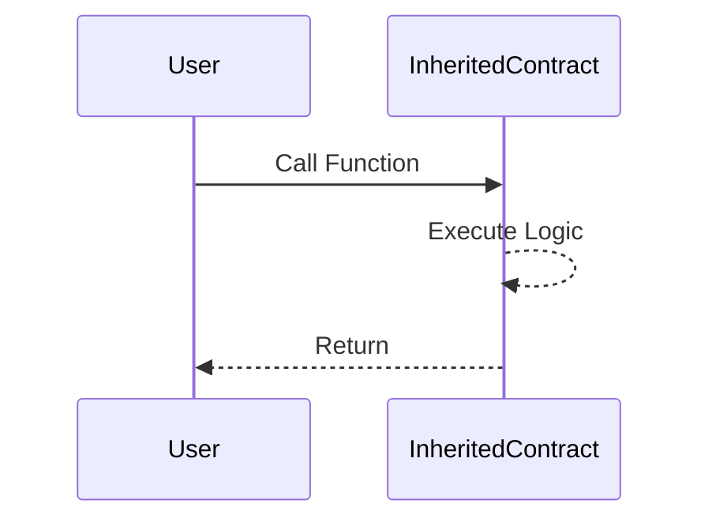
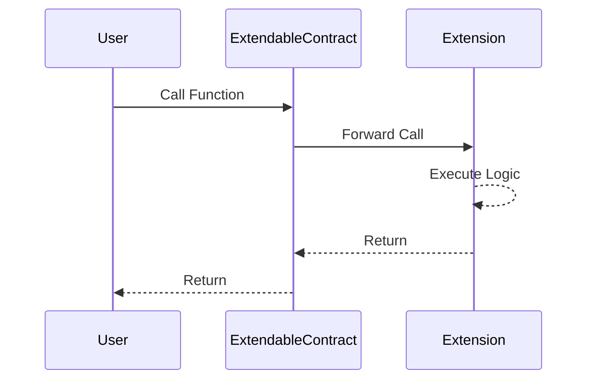

import Tabs from '@theme/Tabs';
import TabItem from '@theme/TabItem';

# Extendable & Extension Contracts

Contracts that use the LSP17 standard are called **Extendable Contracts**. Meaning they can extend their functionalities by linking **Extension Contracts** to them for specific functionalities that they do not support natively.

## Extendable Contracts

The list of extensions for specific functions are stored under the specific data keys under their ERC725Y storage. You can think of them as **Extension Hosts**.

You can inherit the [`LSP17Extendable.sol`](../contracts/LSP17ContractExtension/LSP17Extendable.md) contract to create an extendable contract.

To add an extension handler for a specific function selector, you can set the address of the extension contract under the `LSP17Extension:<bytes4-function-selector>` data key as follow:

- 10 bytes (= 20 hexadecimal characters): `LSP17Extension` Mapping data key prefix
- 20 bytes (= 40 hexadecimal characters): the `bytes4` function selector right padded with 16 zero bytes.

Now whenever a call is made to this function selector on the extendable contract, it will land in its `fallback` function. From there, the calldata will be forwarded to the retrieved extension contract address set above.

<Tabs>
  
  <TabItem value="solidity" label="solidity">

```solidity
// SPDX-License-Identifier: MIT
pragma solidity ~0.8.4;

// libraries
import {
    LSP2Utils
} from "@lukso/lsp-smart-contracts/contracts/LSP2ERC725YJSONSchema/LSP2Utils.sol";

// constants
import {
    _LSP17_EXTENSION_PREFIX
} from "@lukso/lsp-smart-contracts/contracts/LSP17ContractExtension/LSP17Constants.sol";

function generateLSP17ExtensionDataKey(bytes4 extensionSelector) pure returns (bytes32) {
    return
        LSP2Utils.generateMappingKey(
            _LSP17_EXTENSION_PREFIX,
            bytes20(extensionSelector)
        );
}
```

  </TabItem>

  <TabItem value="ethers-v6" label="ethers v6">

```js
import { ERC725YDataKeys } from '@lukso/lsp-smart-contracts';
import { concat, zeroPadBytes } from 'ethers';

const extensionSelector = zeroPadBytes('0xcafecafe', 20);

const dataKey = concat([
  ERC725YDataKeys.LSP17.LSP17ExtensionPrefix,
  extensionSelector,
]);
```

  </TabItem>

</Tabs>

:::warning

Be aware that adding an extension that can `selfdestruct` itself can be dangerous. This can make the [`LSP17Extendable`](../contracts/LSP17ContractExtension/LSP17Extendable.md) contract vulnerable to [metamorphic contracts](https://twitter.com/samczsun/status/1660012956632104960).

If this extension contract has been deployed at a pre-determined address with `CREATE2`, an attacker could `selfdestruct` it and deploy a new one with different runtime bytecode using `CREATE2` and the same salt and initialization code as on the first deployment.

This can result in the new contract to have the same address but different functionality. An attacker can now use these new functionalities to perform malicious actions.

:::

### Forwarding native tokens received to extensions

The [`LSP17Extendable`](../contracts/LSP17ContractExtension/LSP17Extendable.md) contract implementation does not forward by default the native tokens received by the contract to the extension contract.

If you want your extension to receive native tokens, by forwarding them to the extension contract (for instance, for extensions that require native tokens as part of their logic, or to make the extendable contract to fully work as a _"proxy forwarder contract"_), you can override the [`_fallbackLSP17Extendable`](../contracts/LSP17ContractExtension/LSP17Extendable.md#_fallbacklsp17extendable) function.

## Extensions Contracts

Extension contracts are contracts deployed on the network that aim to be used for extending functionalities that use the LSP17 standard.

You can inherit the [`LSP17Extendable.sol`](../contracts/LSP17ContractExtension/LSP17Extendable.md) contract to create a contract extension.

:::warning

The extendable contract might forward the value that it received on extension call.

If the extension you are creating is not intended to receive value, make sure to revert by adding a simple check:

```solidity
if (msg.value == 0) revert(...)
```

**If your extension does not have a way to withdraw the native tokens, they will be stuck in the contract**.

:::

### Checking the amount of native tokens received by the extended contract

You can use the function [`_extendableMsgValue()`](../contracts/LSP17ContractExtension/LSP17Extension.md#_extendablemsgvalue) function to check the amount of native tokens received by the extended contract in the first place.

This function can be useful if you want to create a behaviour in your extension contract that takes into account that the `msg.value` received. For instance:

- your extended contract received a specific amount of native tokens (_e.g: `_extendableMsgValue() == 1 ether`_).
- your extended contract did not receive any native tokens at all (_e.g: `_extendableMsgValue() == 0`_).

## Difference between Inheriting and Extending

The code of a smart contract can be either inherited or extended by an extendable smart contract.

The idea of inheriting a Solidity contract is that the code or the function inherited will be included natively in the contract, so whenever someone calls the logic, it will be executed directly.



Extending means the logic is borrowed from somewhere else. Whenever someone calls the extended smart contract, this contract calls the extension, and lets the logic execute from the extension.



### Differences

1. **Flexibility:** Extensions are useful when a functionality is needed but the behavior is not certain. The extension can be changed later to a newer version that modifies the logic. With inheriting, the implementation logic is fixed permanently.

2. **Event Emission:** If event emission on the core contract is important, inheriting is the better choice. When extending functionality, the logic is triggered from the extension, and all events are emitted there. This could be problematic for dApps that require events to be on the same smart contract, not on a potentially changeable extension.

3. **Contract Size Limit:** Extensions are useful when a smart contract is expected to have many functionalities, but the smart contract cannot include all the logic due to a contract size limit. It works as a router; when called with a function, it checks its extension and calls it.

4. **Context Changing:** When the logic is implemented by inheriting, `msg.sender` will be the caller and `msg.value` will be the value sent. In the case of extending, the `msg.sender` in the function in the extension will be the extended contract. The function can still have access to the original initiator caller by using it from the extra appended calldata. But in case of the function being executed is calling another function, when inherited the caller will be the original contract, but in the case of extension, the caller will be the extension. This could be problematic or require different structural adjustments.
