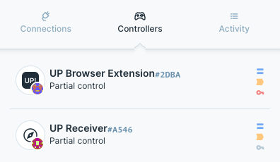
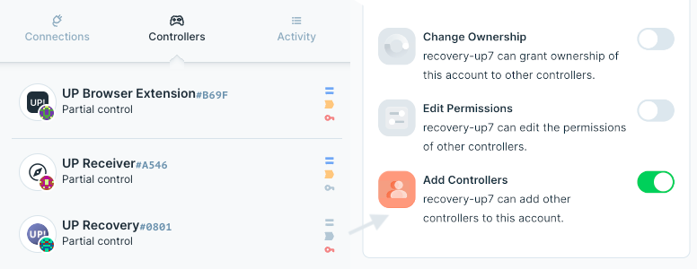
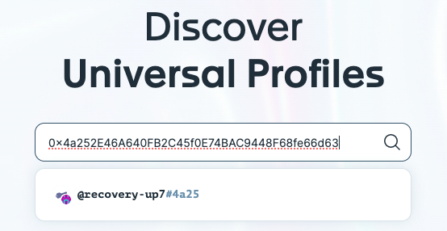
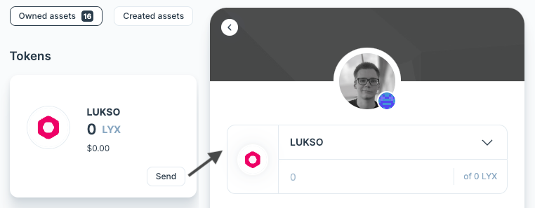
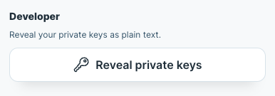

# Universal Profile Extension

## Why should I use Universal Profile Extension over other wallets?

The Universal Profile Extension offers several advantages over traditional wallet services like MetaMask or Rainbow. Regular wallets only manage the cryptographic key-pair, the blockchain account. The account is only secured by a static private seed phrase that can't **be changed or exposed**. If the phrase is leaked or lost, all your digital assets and reputation associated with the account **would be lost with it**.

In addition, regular accounts lack some of the the functionality of UPs such as the ability to attach additional information to your profile, react on transfers, social recovery and transaction relay services.

Universal Profiles help bring **convenience** and **user-friendliness** into the blockchain space. They are **robust and flexible** smart contract-based accounts that support features like social recovery, relay transactions, rights management, upgradeable security, and attachable data right out of the box. Since they consist of programmable and modular smart contracts, they even allow upgrading these accounts with enhanced functionalities.

In essence, using UniversalProfile provides a **safer environment for managing your digital assets** and offers an array of features that make your day-to-day interactions with blockchains easier.

## Where can I download the Universal Profile Extension?

You can download the Universal Profile Extension from the [Extension Guide](/install-up-browser-extension) section of our technical documentation. There is an official release in the Chrome Store and other platforms coming during the mainnet launch process.

## What are the controllers of the Universal Profile?

Each Universal Profile within an extension holds a separate private key to send transactions on behalf of the user, e.g., controlling it. Such controllers can be exported, added, or removed. The controllers can be found within the **Controllers** window of the extension:

## How do I create a backup of my Universal Profile?

If you lost access to the Universal Profile Browser Extension, there are multiple ways to secure your Universal Profile :

- **2FA**: You can set up 2FA while creating the Universal Profile on [UniversalProfile.cloud](https://universalprofile.cloud/). 2FA is the recommended way of backing up a Universal Profile and will add a new recovery controller to the profile, secured on LUKSO's end. This controller has permission to add new controllers if access to an old extension is lost. For security reasons, users must provide an authentication code from a mobile device and approve via email before a new controller can be added using LUKSO's recovery service.
- **QR Import**: You can import any Universal Profile address into your extension. The import process will create a new local controller. Before it can can be used, the new controller needs to added to the Universal Profile by one of your existing controllers with sufficient permissions. Within the new extension, you will receive a QR code of a transaction that can be scanned or copied. When this QR code is received and the related transaction executed by an existing extension, this new controller will gain permissions on the Universal Profile.
- **File Export**: You can export the Universal Profile directly as a text file, including the private key of the extension's controller. Make sure to store it somewhere safe. This private key will allow you to regain access to the profiles and their current controllers within the Universal Profiles.

:::caution

The Universal Profile Browser Extension currently does not feature a way to import profiles using the plain private key described in _File Export_. Therefore, we recommend setting up 2FA during creation or importing the profile into another browser extension via a QR code. Optionally, the private key of a controller (EOA) could be imported into a regular wallet to send transactions manually.

:::

## Can I add 2FA recovery to an existing Universal Profile?

At the current state (11th January 2024), the 2FA recovery method from LUKSO can only be added during the creation of a Universal Profile on [UniversalProfile.cloud](https://universalprofile.cloud/).

## How to check if 2FA recovery is set up correctly?

If you ever want to recover your profile, a new controller will be added to this Universal Profile from a new extension setup. You must verify multiple steps to check if this new controller can be added to your Universal Profile by the recovery service:

### 1. Verify the recovery controller in your extension

If you visit the controller menu in the Universal Profile Browser Extension, there need to be at least three controllers:

- The Universal Profile Browser Extension (used for profile interactions)
- The Universal Receiver (used to write asset updates on the profile)
- The Universal Profile Recovery (used as a backup for the profile)

To confirm that the permissions of the recovery controller were adequately set up, click on the controller of the Universal Profile Recovery and verify that the **Add Controller** permission is enabled.

:::info Controller Names

The names of the controllers can vary, depending on the time of your Universal Profile setup.

:::

### 2. Verify the recovery controller on the profile explorer

Next, we must check if the recovery was successfully added via the LUKSO Relay Service.

1. **Copy the address of your Universal Profile Recovery** from the controller menu of the Universal Profile Extension
2. Open the profile explorer on [UniversalProfile.cloud](https://universalprofile.cloud/?network=mainnet).
3. **Input the address** of the Universal Profile Recovery **into the search bar**.

If it was successfully added, it will show a recovery profile.

:::info Recovery Name

The name of the Universal Recovery controller can vary, depending on the time of your Universal Profile creation.

:::

:::caution

If your Universal Profile Recovery controller is not showing up on [UniversalProfile.cloud](https://universalprofile.cloud/?network=mainnet), please check if you selected the correct network in the bottom left corner of the page.

:::

### 3. Verify the authentication code and email

During the 2FA setup, you will be asked to provide an **email or web account** associated with the recovery process. Verify if you **received the recovery email** and **set up an authenticator code** using one of the supported apps. Additionally, ensure that the 2FA code for the Universal Profile Recovery **can be accessed** on your authenticator app of choice.

:::danger

If you've set up 2FA but one of the verification steps cannot be fulfilled, please reach out within the **SUPPORT & BUGS** category on our Discord server or contact our support at [support@lukso.network](mailto:support@lukso.network) directly.

:::

## How to see and send assets from the Universal Profile?

The Universal Profile Extension **does not directly manage token information**. Instead, it is designed to work with various decentralized applications (dApps) that can seamlessly integrate with your Universal Profile and interact with its information and controllers. To see all your tokens, you can visit your profile on [UniversalProfile.cloud](https://universalprofile.cloud/). If you are logged in, you will also be able to transfer assets.

## How to get back funds from the extension's controller?

There is currently no way to get back funds from the controller directly within the extension. If you want to pay for your transactions instead of using any Relay Service, we recommend only sending minimal LYX, e.g., `0.1 LYX`.

However, as the controllers of your Universal Profile are regular wallet accounts, these can be imported into any other Ethereum wallet with custom network support. To get back funds from a controller, please open the Settings and reveal your private key of the related Extension controller.

:::caution Controller Export

Every profile within the Universal Profile Extension has separate controllers. If you manage multiple Universal Profiles within the extension, make sure to select the correct controller's private key. **Never share the revealed private keys with anyone**.

:::

After you receive your private key, import this account to an Ethereum wallet with custom network support (e.g., MetaMask). Within the wallet, [add the LUKSO network](https://docs.lukso.tech/networks/mainnet/parameters#add-lukso-to-wallets) using the official network parameters. You will see the controller's funds after the network is added and selected. You can continue copying your Universal Profile's address and sending the LYX back. The imported account can be removed from the wallet after completing this process.

## How to use own LYX for Universal Profile transactions?

To use your funds to send transactions from your Universal Profile, you must send LYX or LYXt to the extension's controller. Sending it to the controller will ensure the transaction's Gas costs are funded. You can find the address of the extension's controller within the permission section.

## How to access my Universal Profile on L14?

If you created a Universal Profile using the [Universal Profile Explorer](https://universalprofile.cloud/) or [The Dematerialised Marketplace](https://thedematerialised.com/) on the L14 Testnet, the wallet is stored within your browser's local storage. You will receive a login link containing an encrypted private key via mail.

## Why can’t I use the private key yet to recover my Universal Profile?

At the moment, the option to recover an existing profile from a backup file is not available. The team is working on this feature and it will be made available soon.

Currently, the private key of the main controller can be displayed in the LUKSO Browser Extension. However, it cannot be used as a recovery mechanism, but rather for developers who need it for development purpose.

## “Universal Profile is not allowed by this Transaction Relay Service” Error

This error occurs if a user deployed his Universal Profile through a 3rd party platform that has its own Transaction Relay Service (like [_Universal.Page_](https://universal.page)). If the externally created profile gets imported into the Universal Profile Browser Extension, it is not compatible with LUKSO's own Transaction Relay Service.

To **solve this issue**, users have to add a new controller to their Universal Profile. This controller must then be funded with LYX to execute transactions without any Transaction Relay Service. Within the transaction screen of the Universal Profile Extension, users can then define the controller they want to use.
