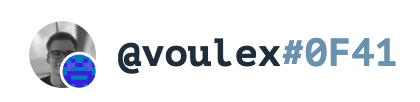

# Universal Profiles

## Is there a Universal Profile Explorer?

Yes, you can find the Universal Profile Explorer at [UniversalProfile.cloud](https://universalprofile.cloud/).

## Is the Universal Profile's name unique?

The profile name displayed on platforms and services is retrieved from the metadata linked to the smart contract. Such metadata, images, or descriptions can be individually set when creating or updating the Universal Profile. Therefore, multiple users can choose similar names or pictures.

What is unique about a Universal Profile are its address and the identicon. The address is indicated with the first four characters behind the profile name. In case the first characters of the address should be similar or identical, the identicon further helps to distinguish them. The combination of attributes was done to allow complete customization without lacking authentication.

## Why did LUKSO not launch Universal Profiles on Ethereum?

On LUKSO, users are onboarded directly with Universal Profiles to offer a more **efficient and user-friendly experience**. This is not feasible on Ethereum currently due to high deployment costs on the occupied chain.

As many users are already onboarded with regular EOAs on Ethereum, creating new applications, or tokens demands backward compatibility with existing applications. This requirement can potentially **limit innovation** and introduce complexity.

The full potential of new accounts like Universal Profiles can't be realized if **only a fraction of the network is onboarded** through it or if new account schemes aren't implemented within the protocol directly.

## How safe are assets stored within a Universal Profile?

The safety of a Universal Profile **depends on the security steps taken by its owner**. If only one EOA controller owns the profile, the security level is equivalent to regular EOA wallets. If a more secure access control system is built and multiple controllers are added with different permissions, the security level of the Universal Profile would be **as robust as a multi-signature wallet**. Also, custom ownership contracts can be added as controllers. In essence, the security of a UP directly corresponds to the security measures put in place by the owner.
