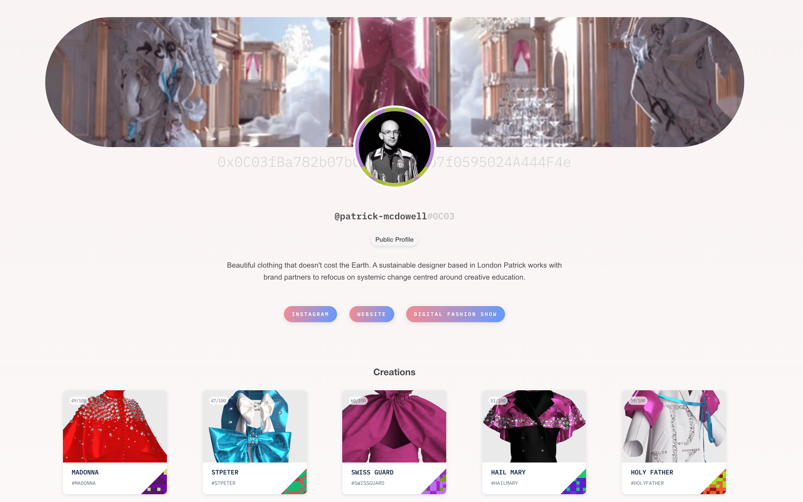

# Read Universal Profile Data

In this guide, we will learn how to:

- call a Universal Provile address
- read data from a Universal Profile



We will use:

- [web3.js](https://web3js.readthedocs.io/en/v1.7.0/) for utility as well as connecting with the LUKSO network
- [erc725.js](https://docs.lukso.tech/tools/erc725js/getting-started/) library to check the interface of an profile.
- [isomorphic-fetch](https://github.com/matthew-andrews/isomorphic-fetch) to enable you to use fetch in plain Node code

## Table of Contents

1. Check for valid Blockchain Address
2. Call the Universal Profile
3. Read the Dataset
   1. Fetch the profile's metadata
   2. Fetch the profile's picture properties
   3. Fetch the profile's universal receiver

## Step 1 - Check for valid Blockchain Address

When receiving data from a Universal Profile within an application, it is commonly used as input. You want to make sure that the address is valid in the first place. You can do a checkup by converting the value into a checksum address from the `web3.js` library. We need to install the library first. You can do this by opening up the terminal in the project's folder of your choice.

```shell
npm install web3
```

After installation, we can move on with the JavaScript file. During the process, we will always use the same file. To make the guide more understandable, we use a sample profile address. You will most likely exchange this static variable with a dynamic value from an input field or fetching process within your app.

```javascript title="read_profile.js"
// Import and Network Setup
const Web3 = require('web3');
const web3 = new Web3('https://rpc.l14.lukso.network');

// Our static Universal Profile address
const sampleProfileAddress = '0x0C03fBa782b07bCf810DEb3b7f0595024A444F4e';

/*
 * Check if @param is a valid blockchain address
 * @returns: boolean
 */
function isAddrValid(address) {
  let formattedAddress = web3.utils.toChecksumAddress(address);
  return web3.utils.checkAddressChecksum(formattedAddress);
}

// Debug
console.log(isAddrValid(sampleProfileAddress));
```

If the function `isAddrValid` gives us back `true`, the address is valid and can be checked for contact data.

## Step 2 - Call the Universal Profile

To inspect the address and check if it has an ERC725 contract, we can call its interface through the `erc725.js` library. The instance of the contract will need the following information:

- Schema which describes contract functions
  - SupportedStandards will fetch the interface
  - LSP3Profile fetches the data of the profile
  - LSP1UniversalReceiverDelegate will fetch received assets
- Provider has the RPC address of the called network
- Address has the related blockchain address of the contract
- Config has the base URL of the IPFS server

Besides the schema, we also use `isomorphic-fetch` to fetch the HTTP response from the profile while using `node` for execution. You may not need this library if you use extended environments like `ReactJS` or `VueJS`. First, we have to install the libraries.

```shell
npm install @erc725/erc725.js
npm install isomorphic-fetch
```

Within the JaveScript file, we can add this code snippet right underneath. After we embed the ERC725 object and the fetch functionality, we can declare all data needed to instantiate the ERC725 contract instance. As discussed above, our schema, provider, and network configuration need to be declared. While fetching, we can use the function from the previous step to handle errors that might occur.

```javascript title="read_profile.js"
...
// Import and Setup
const { ERC725 } = require('@erc725/erc725.js');
require('isomorphic-fetch');

// Parameters for ERC725 Instance
const erc725schema = [
  {
    name: 'SupportedStandards:ERC725Account',
    key: '0xeafec4d89fa9619884b6b89135626455000000000000000000000000afdeb5d6',
    keyType: 'Mapping',
    valueContent: '0xafdeb5d6',
    valueType: 'bytes',
  },
  {
    name: 'LSP3Profile',
    key: '0x5ef83ad9559033e6e941db7d7c495acdce616347d28e90c7ce47cbfcfcad3bc5',
    keyType: 'Singleton',
    valueContent: 'JSONURL',
    valueType: 'bytes',
  },
  {
    name: 'LSP1UniversalReceiverDelegate',
    key: '0x0cfc51aec37c55a4d0b1a65c6255c4bf2fbdf6277f3cc0730c45b828b6db8b47',
    keyType: 'Singleton',
    valueContent: 'Address',
    valueType: 'address',
  },
];

const provider = new Web3.providers.HttpProvider(
  'https://rpc.l14.lukso.network',
);

const config = {
  ipfsGateway: 'https://ipfs.lukso.network/ipfs/',
};

/*
 * Try fetching the @param's Universal Provile data
 * @returns: string JSON or custom error
 */
async function getProfile(address) {
  if (isAddrValid(address)) {
    try {
      const erc725 = new ERC725(erc725schema, address, provider, config);
      return await erc725.fetchData();
    } catch (err) {
      return console.log('This is not an ERC725 Contract');
    }
  } else {
    return console.log('This is not an blockchain address');
  }
}

// Debug
getProfile(sampleProfileAddress).then((profileData) =>
  console.log(JSON.stringify(profileData, undefined, 2)),
);
```

If everything went fine, we now have the profile's dataset as a universal JSON structure that looks like this:

<details>
    <summary>Show JSON responce</summary>

```json
{
  "SupportedStandards:ERC725Account": "0xafdeb5d6",
  "LSP3Profile": {
    "LSP3Profile": {
      "name": "...",
      "links": [
        {
          "title": "... ",
          "url": "..."
        },
        ...
      ],
      "description": "...",
      "profileImage": [
        {
          "width": 1512,
          "height": 1998,
          "hashFunction": "keccak256(bytes)",
          "hash": "0x...",
          "url": "..."
        },
        ...
      ],
      "backgroundImage": [
        {
          "width": 1512,
          "height": 1998,
          "hashFunction": "keccak256(bytes)",
          "hash": "0x...",
          "url": "..."
        },
        ...
      ],
      "tags": ["sample profile"]
    }
  },
  "LSP1UniversalReceiverDelegate": "0x..."
}
```

</details>

## Step 3 - Read the Dataset

With the JSON response, we can fetch all sorts of data:

- Profile metadata
- Pictures and their properties
- Receiver address containing asset data

Just instantiate variables for the information you would like to process. All demo fetch functions provided with this guide will come with a debug parameter. You can set it to `1` to see results directly in your terminal.

<details>
    <summary>Fetch the profile's metadata</summary>

```javascript title="read_profile.js"
...
// Fetchable metadata information
let name;
let description;

let links = [];
let firstLinkTitle;
let firstLinkURL;

let tags = [];
let firstTag;

/*
 * Fetch metadata information from the JSON dataset of
 * an Universal Profile
 */
async function fetchProfileData(enableDebug) {
  profileData = await getProfile(sampleProfileAddress);
  name = profileData.LSP3Profile.LSP3Profile.name;
  description = profileData.LSP3Profile.LSP3Profile.description;

  links = profileData.LSP3Profile.LSP3Profile.links;
  firstLinkTitle = links[0].title;
  firstLinkURL = links[0].url;

  tags = profileData.LSP3Profile.LSP3Profile.tags;
  firstTag = tags[0];

  if (enableDebug === 1) {
    console.log('Name ' + name);
    console.log('Description: ' + description + '\n');
    console.log('Links: ' + JSON.stringify(links, undefined, 2) + '\n');
    console.log('Title of first Link: ' + firstLinkTitle);
    console.log('URL of first Link: ' + firstLinkURL + '\n');
    console.log('Tags: ' + JSON.stringify(tags, undefined, 2) + '\n');
    console.log('First tag: ' + firstTag + '\n');
  }
}

// Debug
fetchProfileData(1);
```

</details>

<details>
    <summary>Fetch the profile's picture properties</summary>

```javascript title="read_profile.js"
...
// Fetchable picture information
let baseURL = 'https://ipfs.lukso.network/ipfs/';

let backgroundImageLinks = [];
let fullSizeBackgroundImg;

let profileImageLinks = [];
let fullSizeProfileImg;

/*
 * Fetch picture information from the JSON dataset of
 * an Universal Profile
 */
async function fetchPictureData(enableDebug) {
  pictureData = await getProfile(sampleProfileAddress);
  let backgroundImagesIPFS =
    pictureData.LSP3Profile.LSP3Profile.backgroundImage;
  let profileImagesIPFS = pictureData.LSP3Profile.LSP3Profile.profileImage;

  for (let i in backgroundImagesIPFS) {
    backgroundImageLinks.push([
      i,
      baseURL + backgroundImagesIPFS[i].url.substring(7),
    ]);
  }

  for (let i in profileImagesIPFS) {
    profileImageLinks.push([
      i,
      baseURL + profileImagesIPFS[i].url.substring(7),
    ]);
  }

  fullSizeBackgroundImg = backgroundImageLinks[0][1];
  fullSizeProfileImg = profileImageLinks[0][1];

  if (enableDebug === 1) {
    console.log(
      'Background Image Links: ' +
        JSON.stringify(backgroundImageLinks, undefined, 2) +
        '\n',
    );
    console.log('Fullsize Background Image: ' + fullSizeBackgroundImg + '\n');

    console.log(
      'Background Image Links: ' +
        JSON.stringify(profileImageLinks, undefined, 2) +
        '\n',
    );
    console.log('Fullsize Background Image: ' + fullSizeProfileImg + '\n');
  }
}

// Debug
fetchPictureData(1);
```

</details>

<details>
    <summary>Fetch the profile's universal receiver</summary>

```javascript title="read_profile.js"
...
/*
 * Fetch the address of the Universal Receiver from
 * the JSON dataset of an Universal Profile
 */
async function fetchReceiverData() {
  receiverData = await getProfile(sampleProfileAddress);
  return receiverData.LSP1UniversalReceiverDelegate;
}

// Debug
fetchReceiverData().then((receiverAddress) => console.log(receiverAddress));
```

</details>

## Final Code

Below is the complete code snippet of this guide, with all the steps compiled together.

```javascript title="read_profile.js"
// Import and Setup
const Web3 = require('web3');
const web3 = new Web3('https://rpc.l14.lukso.network');
const { ERC725 } = require('@erc725/erc725.js');
require('isomorphic-fetch');

// Our static Universal Profile address
const sampleProfileAddress = '0x0C03fBa782b07bCf810DEb3b7f0595024A444F4e';

// Parameters for ERC725 Instance
const erc725schema = [
  {
    name: 'SupportedStandards:ERC725Account',
    key: '0xeafec4d89fa9619884b6b89135626455000000000000000000000000afdeb5d6',
    keyType: 'Mapping',
    valueContent: '0xafdeb5d6',
    valueType: 'bytes',
  },
  {
    name: 'LSP3Profile',
    key: '0x5ef83ad9559033e6e941db7d7c495acdce616347d28e90c7ce47cbfcfcad3bc5',
    keyType: 'Singleton',
    valueContent: 'JSONURL',
    valueType: 'bytes',
  },
  {
    name: 'LSP1UniversalReceiverDelegate',
    key: '0x0cfc51aec37c55a4d0b1a65c6255c4bf2fbdf6277f3cc0730c45b828b6db8b47',
    keyType: 'Singleton',
    valueContent: 'Address',
    valueType: 'address',
  },
];

const provider = new Web3.providers.HttpProvider(
  'https://rpc.l14.lukso.network',
);

const config = {
  ipfsGateway: 'https://ipfs.lukso.network/ipfs/',
};

// Fetchable metadata information
let name;
let description;

let links = [];
let firstLinkTitle;
let firstLinkURL;

let tags = [];
let firstTag;

// Fetchable picture information
let baseURL = 'https://ipfs.lukso.network/ipfs/';

let backgroundImageLinks = [];
let fullSizeBackgroundImg;

let profileImageLinks = [];
let fullSizeProfileImg;

/*
 * Check if @param is a valid blockchain address
 * @returns: boolean
 */
function isAddrValid(address) {
  let formattedAddress = web3.utils.toChecksumAddress(address);
  return web3.utils.checkAddressChecksum(formattedAddress);
}

/*
 * Try fetching the @param's Universal Provile data
 * @returns: string JSON or custom error
 */
async function getProfile(address) {
  if (isAddrValid(address)) {
    try {
      const erc725 = new ERC725(erc725schema, address, provider, config);
      return await erc725.fetchData();
    } catch (err) {
      return console.log('This is not an ERC725 Contract');
    }
  } else {
    return console.log('This is not an blockchain address');
  }
}

/*
 * Fetch metadata information from the JSON dataset of
 * an Universal Profile
 */
async function fetchProfileData(enableDebug) {
  profileData = await getProfile(sampleProfileAddress);
  name = profileData.LSP3Profile.LSP3Profile.name;
  description = profileData.LSP3Profile.LSP3Profile.description;

  links = profileData.LSP3Profile.LSP3Profile.links;
  firstLinkTitle = links[0].title;
  firstLinkURL = links[0].url;

  tags = profileData.LSP3Profile.LSP3Profile.tags;
  firstTag = tags[0];

  if (enableDebug === 1) {
    console.log('Name ' + name);
    console.log('Description: ' + description + '\n');
    console.log('Links: ' + JSON.stringify(links, undefined, 2) + '\n');
    console.log('Title of first Link: ' + firstLinkTitle);
    console.log('URL of first Link: ' + firstLinkURL + '\n');
    console.log('Tags: ' + JSON.stringify(tags, undefined, 2) + '\n');
    console.log('First tag: ' + firstTag + '\n');
  }
}

/*
 * Fetch picture information from the JSON dataset of
 * an Universal Profile
 */
async function fetchPictureData(enableDebug) {
  pictureData = await getProfile(sampleProfileAddress);
  let backgroundImagesIPFS =
    pictureData.LSP3Profile.LSP3Profile.backgroundImage;
  let profileImagesIPFS = pictureData.LSP3Profile.LSP3Profile.profileImage;

  for (let i in backgroundImagesIPFS) {
    backgroundImageLinks.push([
      i,
      baseURL + backgroundImagesIPFS[i].url.substring(7),
    ]);
  }

  for (let i in profileImagesIPFS) {
    profileImageLinks.push([
      i,
      baseURL + profileImagesIPFS[i].url.substring(7),
    ]);
  }

  fullSizeBackgroundImg = backgroundImageLinks[0][1];
  fullSizeProfileImg = profileImageLinks[0][1];

  if (enableDebug === 1) {
    console.log(
      'Background Image Links: ' +
        JSON.stringify(backgroundImageLinks, undefined, 2) +
        '\n',
    );
    console.log('Fullsize Background Image: ' + fullSizeBackgroundImg + '\n');

    console.log(
      'Background Image Links: ' +
        JSON.stringify(profileImageLinks, undefined, 2) +
        '\n',
    );
    console.log('Fullsize Background Image: ' + fullSizeProfileImg + '\n');
  }
}

/*
 * Fetch the address of the Universal Receiver from
 * the JSON dataset of an Universal Profile
 */
async function fetchReceiverData() {
  receiverData = await getProfile(sampleProfileAddress);
  return receiverData.LSP1UniversalReceiverDelegate;
}

// Debug Step 1
console.log(isAddrValid(sampleProfileAddress));

// Debug Step 2
getProfile(sampleProfileAddress).then((profileData) =>
  console.log(JSON.stringify(profileData, undefined, 2)),
);

// Debug Step 3
fetchProfileData(1);
fetchPictureData(1);
fetchReceiverData().then((receiverAddress) => console.log(receiverAddress));
```
