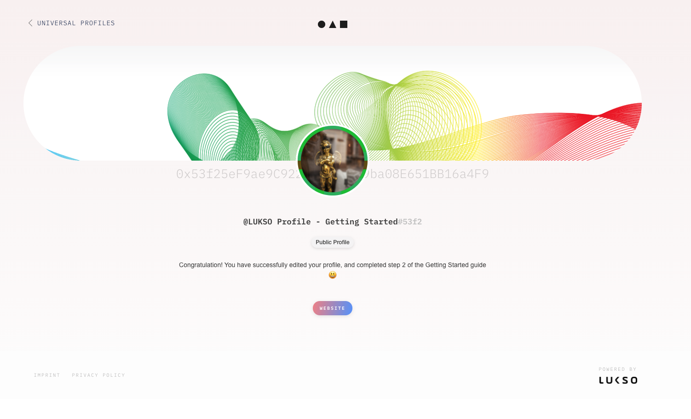
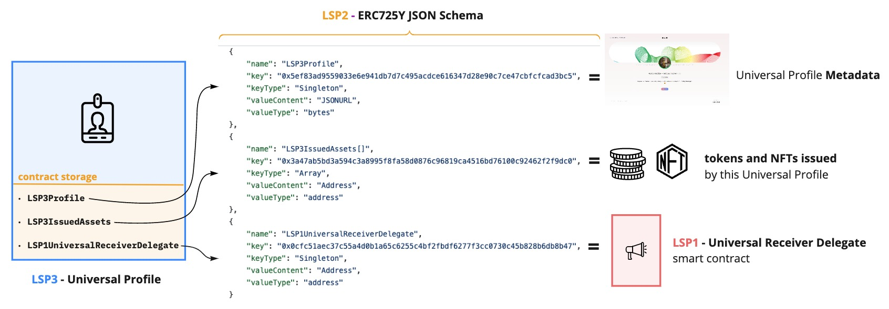
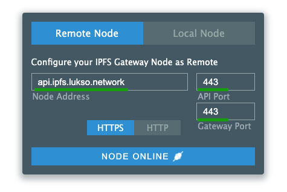
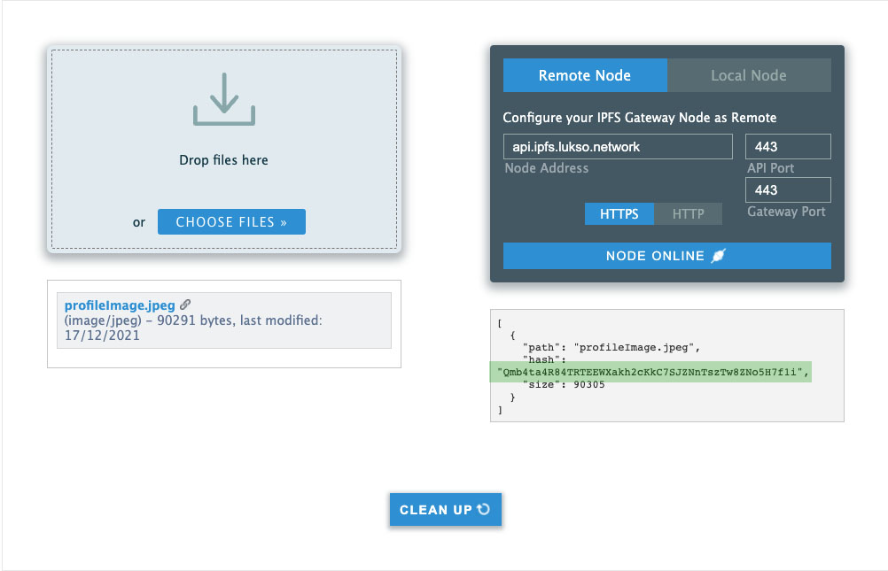

# Edit a Universal Profile

:::success Requirements
You will need a Universal Profile that you control to follow this guide. <br/>
:arrow_left: If you haven't created a Universal Profile yet, you can follow our previous guide: [**Create a Universal Profile**](./01-create-profile.md).
:::

In this guide, we will learn how to **customize our Universal Profile** programmatically in JavaScript. This will include:

- add a profile + cover picture to our Universal Profile.
- edit our Universal Profile infos (description, badges, links, etc...).
- see the updated profile details and images of our Universal Profile on the [universalprofile.cloud](https://universalprofile.cloud) website.

To achieve this goal, we will perform the following steps:

1. create a JSON file that contains our profile details (`LSP3Profile` metadata).
2. upload this JSON file to [IPFS], using our [lsp-factory.js] tool.
3. encode + set our new [LSP3Profile](https://github.com/lukso-network/LIPs/blob/main/LSPs/LSP-3-UniversalProfile-Metadata.md#lsp3profile) metadata key in our profile with our [erc725.js] library and web3.js.



## Introduction

A Universal Profile is a smart contract that uses a generic key-value store (ERC725Y) as a storage design. This makes it possible to attach any informations to our Universal Profile, by setting any specific **value** to any specific **key**.

A set of ERC725Y keys is defined as an **ERC725Y schema**. The schema is an array of keys, where each key is represented by an object. Each key object describes the key `name`, the `keyType` (_e.g.: singleton, array, mapping..._), and the type of the data it contains (`valueType`).

A schema enables us to know which ERC725Y keys we can set, and therefore **which information we can retrieve + edit from our Universal Profile**.



> For more details, see: [LSP2 - ERC725Y JSON Schema](https://github.com/lukso-network/LIPs/blob/main/LSPs/LSP-2-ERC725YJSONSchema.md#specification)

One of main ERC725Y key of the Universal Profile is the [`LSP3Profile`](https://github.com/lukso-network/LIPs/blob/main/LSPs/LSP-3-UniversalProfile-Metadata.md#lsp3profile) key. It is a standardised key that refers to the **metadata of the Universal Profile**. This metadata takes the form of a reference to a JSON file.

In this guide, we will store our Universal Profile metadata on [IPFS], a distributed file storage.

We can add (or edit) any informations related to our UP by:

1. creating a new JSON file, with new / updated infos.
2. uploading this file to IPFS.
3. changing the reference of our [LSP3Profile](https://github.com/lukso-network/LIPs/blob/main/LSPs/LSP-3-UniversalProfile-Metadata.md#lsp3profile) key to point to our newly uploaded JSON file.


:::info Learn More
**IPFS is just one place among many** where you can store your Universal Profile metadata.<br/>
You can use other file storage options to store your JSON file (_e.g.: [Swarm](https://www.ethswarm.org/), [Storj](https://www.storj.io/index.html), Google Drive, private FTP server, etc... _).
:::

## Setup

We will use a new tool in this guide: [erc725.js].

```shell
npm install web3 @lukso/lsp-factory.js @lukso/lsp-smart-contracts @erc725/erc725.js --save
```

## Step 1 - Create a new LSP3Profile JSON file

:::success Recommendation
A complete "ready to use" JSON file is available at the end in the [**Final Code**](#final-code) section.
:::

We will start by creating a **new JSON file** that will contain our `LSP3Profile` metadata.

Use the JSON template file below, and follow the **Steps 1.1 and 1.2** to fill the blank fields marked with `"..."`.

```json title="UniversalProfileMetadata.json"
{
  "LSP3Profile": {
    "name": "...", // a self chosen username
    "description": "...", // A description, describing the person, company, organisation or creator of the profile.
    "links": [
      // links related to the profile
      {
        "title": "...", // a title for the link.
        "url": "..." // the link itself
      }
      // add more links...
    ],
    "tags": ["...", "..."], // tags related to the profile
    "profileImage": [
      {
        "width": 640, // in pixels
        "height": 609, // in pixels
        "hashFunction": "keccak256(bytes)", // do not change!
        "hash": "0x...", // add the keccak256 hash of the image here
        "url": "ipfs://..." // IPFS image identifier (CID)
      }
    ],
    "backgroundImage": [
      {
        "width": 1024, // in pixels
        "height": 576, // in pixels
        "hashFunction": "keccak256(bytes)", // do not change!
        "hash": "0x...", // add the keccak256 hash of the image here
        "url": "ipfs://..." // IPFS image identifier (CID)
      }
    ]
  }
}
```

### 1.1 - Add profile details (links, tags...)

Add more details about the Universal Profile for the entries `name`, `description`, `links` and `tags`.

Be as creative as you want here, to make your Universal Profile as unique as possible! :art:

:::info Learn More
`links` and `tags` accept an array of objects / strings. So you can add as many as you want!

For `profileImage` and `backgroundImage`, see **Step 1.2** below :arrow_down:
:::

### 1.2 - Add a profile + background image

:::caution
Image sizes should be written as numbers, not as strings.

The **max image width** allowed on [universalprofile.cloud](https://universalprofile.cloud) is: `profileImage` <= 800px, `backgroundImage` <= 1800px
:::

:::info
The JSON file for LSP3Profile accepts an array of images, so that you images of different sizes / dimensions.
This way, client interfaces can know which images to pick, based on the container size in their interface.
:::

For our `profileImage` and `backgroundImage`, we will need to add the following information:

- **`hash`**: use this **[keccak256 image hash generator](https://emn178.github.io/online-tools/keccak_256_checksum.html)**.
- **`url`**: upload your images to the LUKSO IPFS Gateway.

Use this [IPFS file uploader tool](https://anarkrypto.github.io/upload-files-to-ipfs-from-browser-panel/public/#) with the settings shown below in green.

- **Node Address:** `api.ipfs.lukso.network`
- **API Port / Gateway Port:** `443`



Drag & Drop your images (you can upload multiple images at once) and click on the **"Upload"** button. Once done:

1. copy the ipfs file identifier (cid) shown in green below.
2. paste it in the `url` field in our JSON file, after `ipfs://`.



Save your JSON file after you have added all your details and images.

> **NB:** don't forget to delete the comments in the JSON file!

We are now ready to apply these changes on our Universal Profile. We will see how in the next section :arrow_down:

## Step 2 - Upload our JSON file to IPFS

:::note Notice
The rest of this tutorial should be done in a **new file (`main.js`)**.
:::

We will now start writing the main code of the tutorial.
Create a new file `main.js`.

Our [lsp-factory.js] tool provides convenience to upload our profile Metadata to IPFS.

```javascript title="main.js"
const { LSP3UniversalProfile } = require('@lukso/lsp-factory.js');
// reference to the previously created JSON file (LSP3Profile metadata)
const jsonFile = require('./UniversalProfileMetadata.json');

async function uploadMetadataToIPFS() {
  const uploadResult = await LSP3UniversalProfile.uploadProfileData(jsonFile.LSP3Profile);

    /*
    uploadResult = {
        profile: {
            LSP3Profile: {
                name: '...',
                description: '...',
                links: [Array],
                tags: [Array],
                profileImage: [Array],
                backgroundImage: [Array]
            }
        },
        url: 'ipfs://Q...'
    }
    */

  const profileMetadataIPFSUrl = uploadResult.url;
  return profileMetadataIPFSUrl;
}
uploadMetadataToIPFS();
```

## Step 3 - Encode data with erc725.js

The next step is to **prepare the data** that will be used to edit our Universal Profile. "Prepare the data" means **encoding it**, so that it can be written on our Universal Profile.

To do so, we will use our [erc725.js] library. It will help us encode the data easily.

### 3.1 - Setup erc725.js

In order to setup the erc725.js library, we will need the following:

- address of our Universal Profile contract: this is the address of our profile mentioned on the url after `/` on [universalprofile.cloud](https://universalprofile.cloud).
- an ERC725Y JSON Schema: this is a set of ERC725Y key-value definitions (see [LSP2 - ERC725Y JSON Schema](https://github.com/lukso-network/LIPs/blob/main/LSPs/LSP-2-ERC725YJSONSchema.md))
- a provider: it will our LUKSO L14 endpoint: *https://rpc.l14.lukso.network'*

**In the same file** `main.js`, setup the erc725.js library.

```javascript title="main.js"
const Web3 = require('web3');
const { ERC725 } = require('@erc725/erc725.js');

const web3 = new Web3('https://rpc.l14.lukso.network');

// constants
const jsonFile = require('./UniversalProfileMetadata.json');
const profileAddress = '0x...';

// Step 3.1 - Setup erc725.js
const schema = [
  {
    name: 'LSP3Profile',
    key: '0x5ef83ad9559033e6e941db7d7c495acdce616347d28e90c7ce47cbfcfcad3bc5',
    keyType: 'Singleton',
    valueContent: 'JSONURL',
    valueType: 'bytes',
  },
];

const erc725 = new ERC725(schema, profileAddress, web3.currentProvider, {
  ipfsGateway: 'https://ipfs.lukso.network/ipfs/',
});

> ERC725 {
    options: {
        schema: [ [Object] ],
        address: '0x...',
        provider: Web3ProviderWrapper { type: 'WEB3', provider: [HttpProvider] },
        config: { ipfsGateway: 'https://ipfs.lukso.network/ipfs/' }
    }
}
```

### 3.2 - Encode the LSP3Profile data

Once our erc725.js initialised, we can now encode our `LSP3Profile` data.

To do so, we use the `encodeData(...)` function, passing a `LSP3Profile: { ... } ` object with the following properties:

- `hashFunction`: we use `keccak256` (standard hash function). Since we are hashing a JSON file that contains strings, we also specify the data type as `utf8`.
- `hash` digest of the file: obtianed after hashing the JSON file with `keccak256`.
- `url` of the file: this is the IPFS url of the file, obtained in **Step 2.**

```javascript title="main.js"
const Web3 = require('web3');
const { ERC725 } = require('@erc725/erc725.js');

const web3 = new Web3('https://rpc.l14.lukso.network');

// constants
const jsonFile = require('./UniversalProfileMetadata.json');
const profileAddress = '0x...';

// Step 3.1 - Setup erc725.js
// ...

// Step 3.2 - Encode the LSP3Profile data (to be written on our UP)
const encodedData = erc725.encodeData({
  LSP3Profile: {
    hashFunction: 'keccak256(utf8)',
    // hash the JSON file (LSP3Profile metadata)
    hash: web3.utils.keccak256(JSON.stringify(jsonFile)),
    url: profileMetadataIPFSUrl, // obtained in Step 2
  },
});

> {
  LSP3Profile: {
    key: '0x5ef83ad9559033e6e941db7d7c495acdce616347d28e90c7ce47cbfcfcad3bc5'
    value: '0x...',
  }
}
```

## Step 4 - Edit our Universal Profile

Now that our updated data is encoded, we are ready to set it in our Universal Profile. To do so, we will interact with our Universal Profile smart contract via web3.js.

### 4.1 - Load our EOA

We will need to interact with the smart contracts from an EOA.

The first step is to load our EOA using our private key.

```javascript title="main.js"
const Web3 = require('web3');
const web3 = new Web3('https://rpc.l14.lukso.network');

const PRIVATE_KEY = '0x...'; // your EOA private key (previously created)
const myEOA = web3.eth.accounts.privateKeyToAccount(PRIVATE_KEY);

> {
    address: "0x...",
    privateKey: "0x...",
    signTransaction: function(tx){...},
    sign: function(data){...},
    encrypt: function(password){...}
}
```

### 4.2 - Create instances of our Contracts

The first step is to create new instances of the Universal Profile and the Key Manager. We will need:

- the contracts ABIs (from our npm package [`@lukso/lsp-smart-contracts`](https://www.npmjs.com/package/@lukso/lsp-smart-contracts)).
- the contracts addresses.

If you haven't done it in the **Setup** section, install our npm package to obtain the smart contracts ABIs.

```shell
npm install @lukso/lsp-smart-contracts --save
```

If you have deployed your UP with our [lsp-factory.js](./01-create-profile.md) tool (like in our previous guide), the owner of the UP will point to the Key Manager's address.

Therefore, you can easily obtain the address of your Key Manager by calling the `owner()` function on your Universal Profile.

```javascript title="main.js"
const Web3 = require('web3');
const UniversalProfile = require('@lukso/lsp-smart-contracts/artifacts/UniversalProfile.json');
const KeyManager = require('@lukso/lsp-smart-contracts/artifacts/LSP6KeyManager.json');

const web3 = new Web3('https://rpc.l14.lukso.network');

// create an instance of your Universal Profile
const myUP = new web3.eth.Contract(UniversalProfile.abi, profileAddress);

// if deployed with lsp-factory.js,
// the Key Manager is the owner of the UP,
// so retrieve your Key Manager address via `owner()` (= getter function)
const keyManagerAddress = await myUP.methods.owner().call();
const myKM = new web3.eth.Contract(KeyManager.abi, keyManagerAddress);
```

### 4.3 - Set data on our Universal Profile

The final step is to edit our `LSP3Profile` key on our Universal Profile with the new value obtained in **Step 3.2**. We can easily access both the key and value from the encoded data obtained with erc725.js.

Since our Universal Profile is owned by a Key Manager, the call will have to go through the Key Manager first. We then need to **encoded the setData payload** and pass it to our Universal Profile to perform this last step.

```javascript title="main.js"
// encode the setData payload
// (`encodedData` is the value obtain from Step 3.2)
const abiPayload = await myUP.methods
  .setData([encodedData.LSP3Profile.key], [encodedData.LSP3Profile.value])
  .encodeABI();

// execute via the KeyManager, passing the UP payload
await myKM.methods
  .execute(abiPayload)
  .send({ from: myEOA.address, gasLimit: 300_000 });
```

## Visualize our updated Universal Profile

You can now visualize your UP on the universalprofile.cloud website, by pasting the returned address after the / (slash) as follow:

*https://universalprofile.cloud/your-up-address*


## Final Code

Below is the complete code snippet of this guide, with all the steps compiled together.

<details>
    <summary><code>UniversalProfileMetadata.json</code> (example) - click to expand</summary>

```json
{
  "LSP3Profile": {
    "name": "LUKSO Profile - Getting Started",
    "description": "Congratulation! You have successfully edited your profile, and completed step 2 of the Getting Started guide 😃",
    "links": [
      {
        "title": "Website",
        "url": "https://mywebsite.me"
      }
    ],
    "tags": ["Public Profile"],
    "profileImage": [
      {
        "width": 640,
        "height": 609,
        "hashFunction": "keccak256(bytes)",
        "hash": "0xe459e5769af85b09fb43bb8eaac561e196d58c0f5da3c5e150b6695898089402",
        "url": "ipfs://QmPCz896rcZmq8F3FuUkJinRUmPgnZGjPvZL71nAaL7Fsx"
      }
    ],
    "backgroundImage": [
      {
        "width": 1024,
        "height": 576,
        "hashFunction": "keccak256(bytes)",
        "hash": "0x1c19780d377a7b01f7dcf16e0ebffd225e29d2235625009f67cf9d86a32a79e1",
        "url": "ipfs://QmPMmEpKnmgACsWjhDUheF8TEKpspzQhAkjbY4EBbR4jgP"
      }
    ]
  }
}
```

</details>

```javascript title="main.js"
const Web3 = require('web3');
const { ERC725 } = require('@erc725/erc725.js');
const { LSP3UniversalProfile } = require('@lukso/lsp-factory.js');

const UniversalProfile = require('@lukso/lsp-smart-contracts/artifacts/UniversalProfile.json');
const KeyManager = require('@lukso/lsp-smart-contracts/artifacts/LSP6KeyManager.json');

const web3 = new Web3('https://rpc.l14.lukso.network');

// constants
const PRIVATE_KEY = '0x...';
const profileAddress = '0x...';

// Step 1 - Create a new LSP3Profile JSON file
const jsonFile = require('./UniversalProfileMetadata.json');

async function editProfileInfos() {
  // Step 2 - Upload our JSON file to IPFS
  const uploadResult = await LSP3UniversalProfile.uploadProfileData(jsonFile.LSP3Profile);
  const lsp3ProfileIPFSUrl = uploadResult.url;

  // Step 3.1 - Setup erc725.js
  const schema = [
    {
      name: 'LSP3Profile',
      key: '0x5ef83ad9559033e6e941db7d7c495acdce616347d28e90c7ce47cbfcfcad3bc5',
      keyType: 'Singleton',
      valueContent: 'JSONURL',
      valueType: 'bytes',
    },
  ];

  const erc725 = new ERC725(schema, profileAddress, web3.currentProvider, {
    ipfsGateway: 'https://ipfs.lukso.network/ipfs/',
  });

  // Step 3.2 - Encode the LSP3Profile data (to be written on our UP)
  const encodedData = erc725.encodeData({
    LSP3Profile: {
      hashFunction: 'keccak256(utf8)',
      // hash our LSP3 metadata JSON file
      hash: web3.utils.keccak256(JSON.stringify(jsonFile)),
      url: lsp3ProfileIPFSUrl,
    },
  });

  // Step 4.1 - Load our EOA
  const myEOA = web3.eth.accounts.privateKeyToAccount(PRIVATE_KEY);

  // Step 4.2 - Create instances of our Contracts
  const myUP = new web3.eth.Contract(UniversalProfile.abi, profileAddress);

  const keyManagerAddress = await myUP.methods.owner().call();
  const myKM = new web3.eth.Contract(KeyManager.abi, keyManagerAddress);

  // Step 4.3 - Set data (updated LSP3Profile metadata) on our Universal Profile

  // encode the setData payload
  const abiPayload = await myUP.methods
    .setData([encodedData.LSP3Profile.key], [encodedData.LSP3Profile.value])
    .encodeABI();

  // execute via the KeyManager, passing the UP payload
  await myKM.methods
    .execute(abiPayload)
    .send({ from: myEOA.address, gasLimit: 300_000 });
}
editProfileInfos();
```

[lsp-factory.js]: (../../tools/lsp-factoryjs/deployment/universal-profile.md#uploading-lsp3-metadata-to-ipfs)
[erc725.js]: (../../tools/erc725js/writing-data.md#example)
[ipfs]: https://ipfs.io/
