import Tabs from '@theme/Tabs';
import TabItem from '@theme/TabItem';

# Install the UP Browser Extension

:::danger
The UP Browser Extenstion is currently in the **development alpha** version. DO NOT use this in production!
:::

This guide will teach you how to download and install the Universal Profile browser extension on Chrome, Edge, Opera, or Brave.

## Download and Unpack the Extension

Click on link below to download the extension, based on the browser to which you want to install it.

### :inbox_tray: **[Download link](https://storage.googleapis.com/up-browser-extension/universalprofile-extension-v1.0.0-develop.143.zip)**

Open your download folder and unpack the ZIP archive.

## Install the Extension

<Tabs>
  <TabItem value="chrome" label="Chrome">

#### 1. Open the extension page in your browser.

<Tabs>
  <TabItem value="chrome-settings" label="Using Settings">

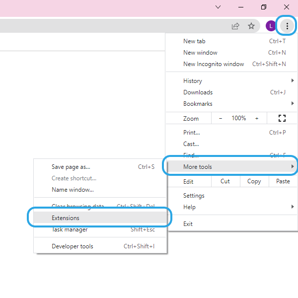

  </TabItem>
  <TabItem value="chrome-menu" label="Using Menu Bar">

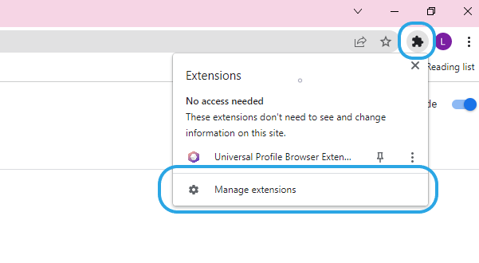

  </TabItem>
  <TabItem value="chrome-url" label="Using URL">

Type `chrome://extensions` into the searchbar to open the extension page.

  </TabItem>
</Tabs>

#### 2. Enable the browser's developer mode.

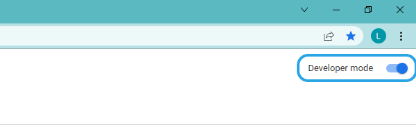

#### 3. Load the extension from the folder.

Click _Load unpacked_ pointing to the extracted ZIP archive of the extension. 
Alternatively, drag and drop the zip file onto the extensions page.

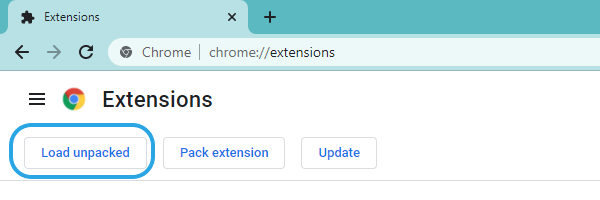

#### 4. Pin the extension.

Pin the extension to the extension bar and click on the icon to open it up.

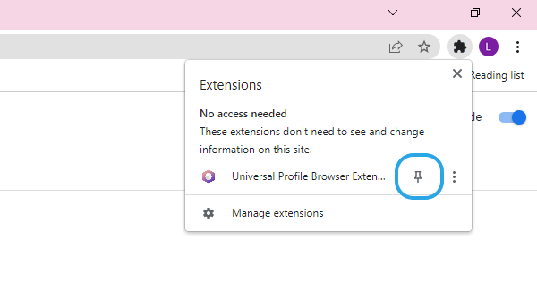

#### 5. Launch the extension.

Open the extension by clicking its icon from the menu bar.

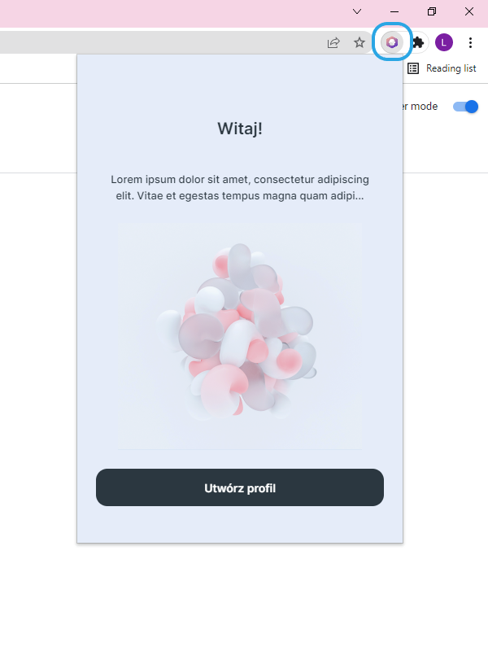

  </TabItem>
  <TabItem value="edge" label="Edge">

#### 1. Open the extension page in your browser.

<Tabs>
  <TabItem value="edge-settings" label="Using Settings">

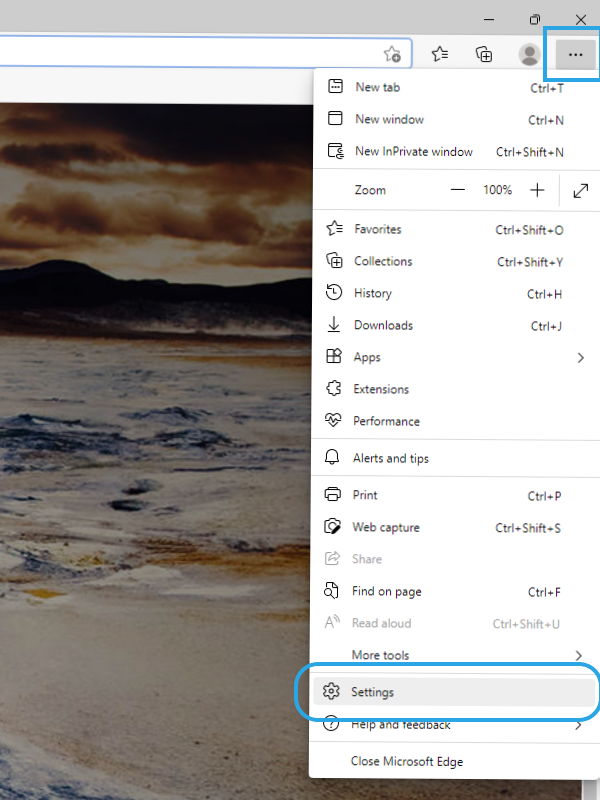

  </TabItem>
  <TabItem value="edge-menu" label="Using Menu Bar">

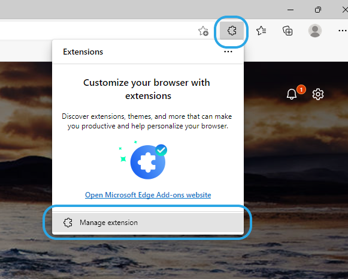

  </TabItem>
  <TabItem value="edge-url" label="Using URL">

Type `edge://extensions` into the searchbar to open the extension page.

  </TabItem>
</Tabs>`

#### 2. Enable the browser's developer mode.

On the left side, turn the _Developer mode_ slider to the right side.

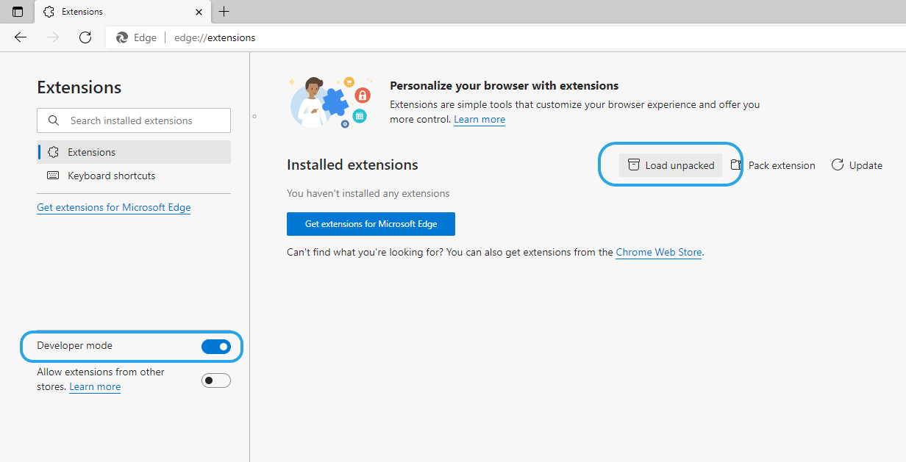

#### 3. Load the extension from the folder.

Click _Load unpacked_ pointing to the extracted ZIP archive of the extension. 
Alternatively, drag and drop the zip file onto the extensions page.

#### 4. Launch the extension.

Click on the extension icon.

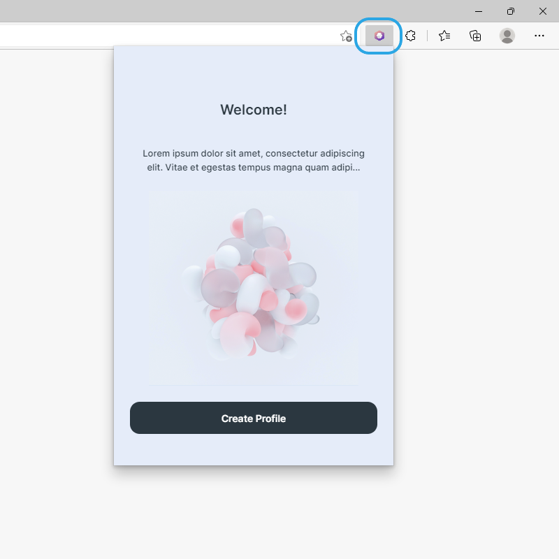

  </TabItem>
  <TabItem value="opera" label="Opera">

#### 1. Open the extension page in your browser.

<Tabs>
  <TabItem value="opera-shortcut" label="Using Shortcut">

Press and hold `cmd+shift+e` or `ctrl+shift+e` on your keyboard.

  </TabItem>
  <TabItem value="opera-menu" label="Using Menu Bar">

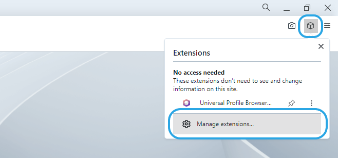

  </TabItem>
  <TabItem value="opera-url" label="Using URL">

Type `opera://extensions` into the searchbar to open the extension page.

  </TabItem>
</Tabs>`

#### 2. Enable the browser's developer mode.

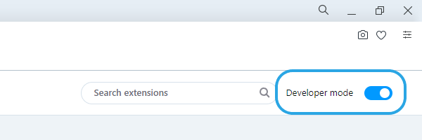

#### 3. Load the extension from the folder.

Click _Load unpacked_ pointing to the extracted ZIP archive of the extension. 
Alternatively, drag and drop the zip file onto the extensions page.

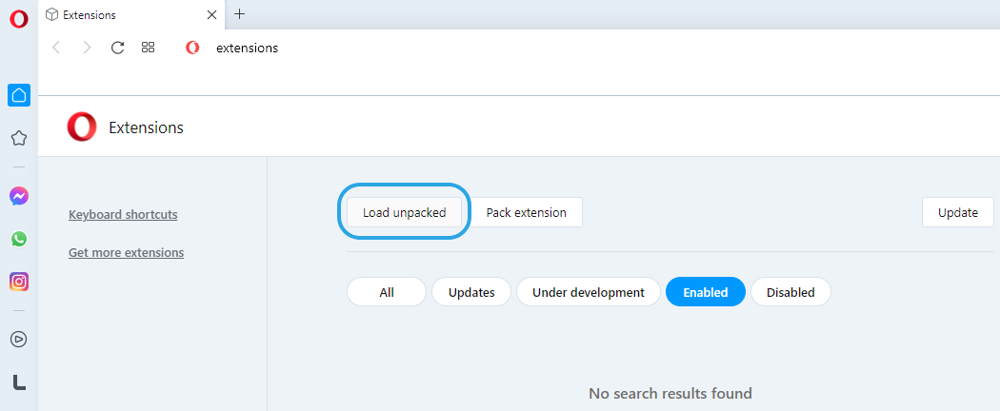

#### 4. Pin the extension.

Pin the extension through the extension icon.

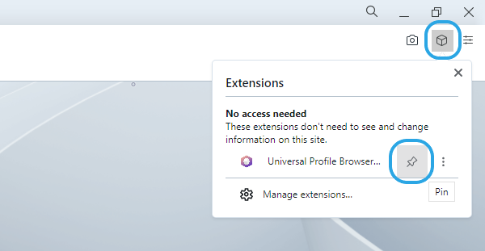

#### 5. Launch the extension.

Open the extension by clicking its icon from the menu bar.

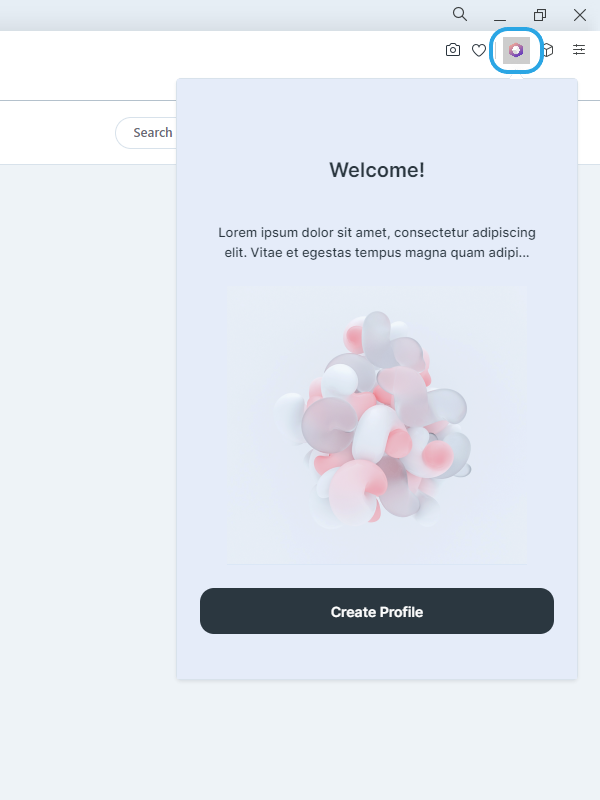

  </TabItem>
  <TabItem value="brave" label="Brave">

#### 1. Open the extension page in your browser.

<Tabs>
  <TabItem value="brave-settings" label="Using Settings">

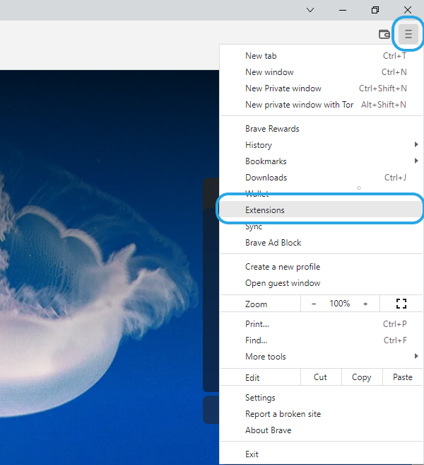

  </TabItem>
  <TabItem value="brave-menu" label="Using Menu Bar">

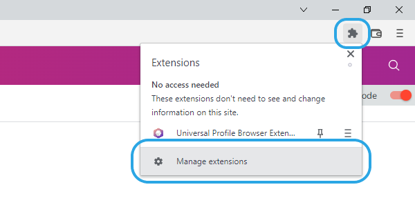

  </TabItem>
  <TabItem value="brave-url" label="Using URL">

Type `brave://extensions` into the searchbar to open the extension page.

  </TabItem>
</Tabs>`

#### 2. Enable the browser's developer mode.

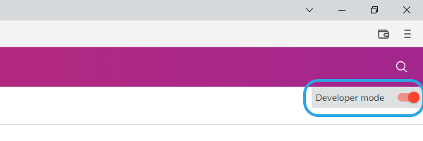

#### 3. Load the extension from the folder.

Click _Load unpacked_ pointing to the extracted ZIP archive of the extension. 
Alternatively, drag and drop the zip file onto the extensions page.

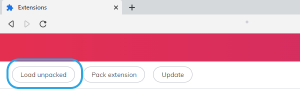

#### 4. Pin the extension.

Pin the extension through the extension icon.

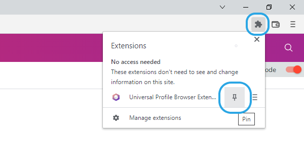

#### 5. Launch the extension.

Open the extension by clicking its icon from the menu bar.

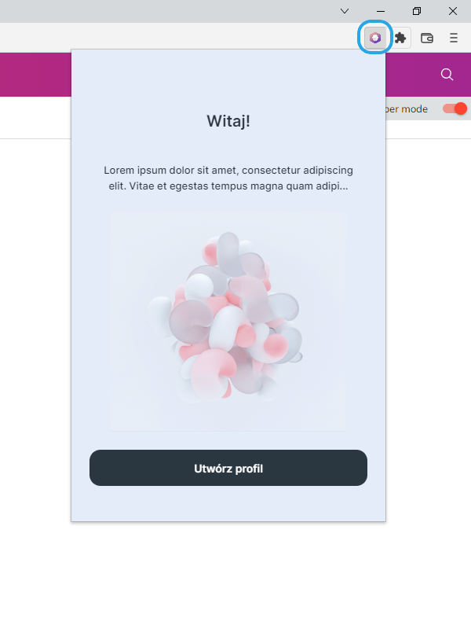

  </TabItem>
</Tabs>
