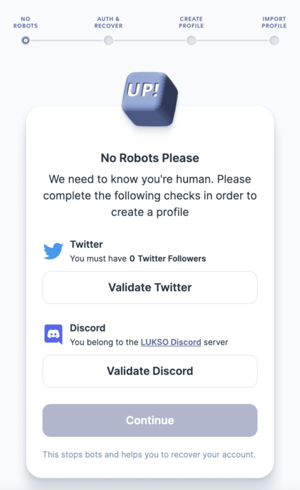
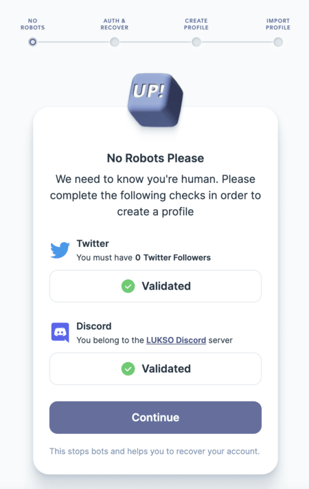
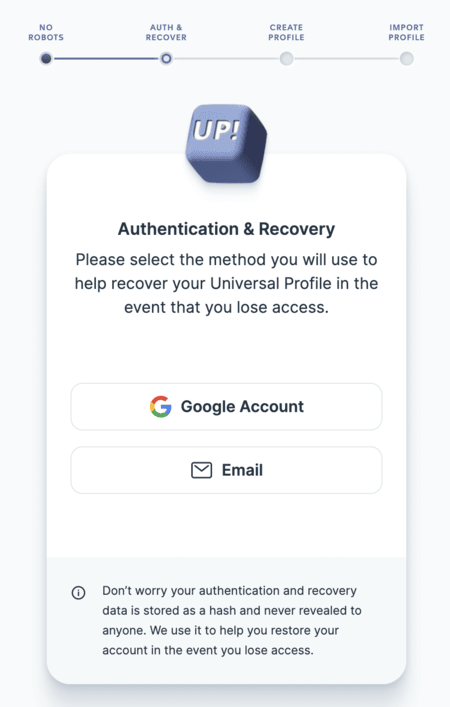
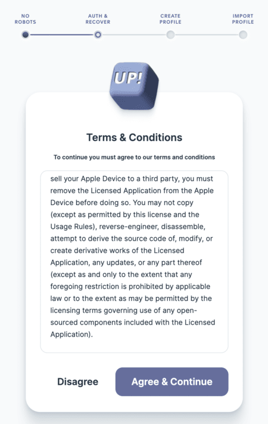

# Create a Universal Profile

:::danger
The UP Browser Extenstion is currently in the **development alpha** version. DO NOT use this in production!
:::

**step 1:** Launch the extension and click **Create Profile**

**step 2:** Select your identicon, password, and optionally an email (for recovering your account)

**step 3:** Choose an anonymous profile (skip navigating to the edit profile screen)

:::note
It may take a while until your profile is created. You don't need to keep the popup open.
:::

:::success 
Your Universal Profile has been created!
:::

