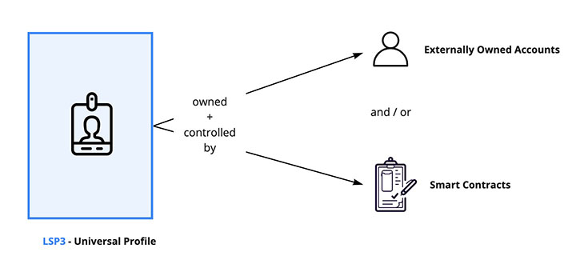

# Create a Universal Profile

:::tip
A complete _"ready to use"_ JS file is available at the end in the [**Final Code**](#final-code) section. If you want to run the code as standalone JavaScript files within the terminal or the browser, you can open the [`lukso-playground`](https://github.com/lukso-network/lukso-playground) repository or use the correlated [StackBlitz](https://stackblitz.com/github/lukso-network/lukso-playground) page.
:::

In this guide, we will learn how to:

- create a Universal Profile.
- see our new Universal Profile on [l16.universalprofile.cloud](https://l16.universalprofile.cloud).


We will use the [lsp-factory.js](../../tools/lsp-factoryjs/deployment/universal-profile.md) library to create a Universal Profile in **fewer than 50 lines of code!**

## Introduction

### Owned Contracts

A Universal Profile is an **owned** smart contract. Ownership means that such a contract has a separate **owner**.

The Contract's owner is a blockchain `address` that can represent anything, such as:

- one or multiple Externally Owned Accounts (EOAs),
- a multi-sig wallet, or
- another smart contract that can represent anything (a DAO, a DEX, etc...).



> For more details, see [EIP-173: Contract Ownership Standard](https://eips.ethereum.org/EIPS/eip-173)

With the **Ownable** design pattern, a contract can be designed with _functionalities that only the owner can perform_. The design pattern gives the contract owner more control and privileges.

In the context of Universal Profile, _reading data from the contract storage can be done by anyone_, but **only the owner can**:

- `setData(...)` = add, edit or remove data from the [ERC725Y](../../standards/universal-profile/lsp0-erc725account#erc725y---generic-key-value-store) storage.
- `execute(...)` = transfer LYX to addresses, call other contracts, or create and deploy new contracts (see [ERC725X](../../standards/universal-profile/lsp0-erc725account#erc725x---generic-executor) executor)
- `transferOwnership(...)` = make an address be the new owner of the Universal Profile.

In this guide, our Universal Profile's owner will be a contract called a **Key Manager**. The [Key Manager](../../contracts/contracts/LSP6KeyManager/LSP6KeyManager.md) is a smart contract that enables granting specific permissions to `addresses`, so that they can interact with the Universal Profile. For example, transferring LYX on behalf of the Universal Profile.

:::info Learn More
You can implement any complex ownership structure (and fine-grained control) on top of Universal Profiles. The structure includes having a UP owned and controlled by:

- one or multiple EOAs,
- one or multiple other smart contracts, or
- a mixture of both.

For more details, see [LSP6 - Key Manager Standard](../../standards/universal-profile/lsp6-key-manager.md).
:::

### Contracts Overview


The [lsp-factory.js](../../tools/lsp-factoryjs/getting-started.md) library will help us quickly deploy and set up a Universal Profile with just a few lines of code.

Under the hood, lsp-factory.js performs the following:

1. Deploy the Universal Profile contracts:
   - [Universal Profile](../../standards/universal-profile/lsp0-erc725account.md) (UP) is the core smart contract representing a Universal Profile.
   - [Key Manager](../../standards/universal-profile/lsp6-key-manager.md) (KM) is the contract that acts as the **owner of a Universal Profile** <br/> to enable other addresses to interact with the UP.
2. Link a previously deployed [Universal Receiver Delegate](../../standards/generic-standards/lsp1-universal-receiver-delegate.md) (URD) smart contract with the deployed UP. The URD reacts to events, such as tokens received or transferred.
3. Set all the permissions for provided EOA addresses so that they can act on the UP.

> :arrow_right: &nbsp; [See our lsp-factory.js docs for more details](../../tools/lsp-factoryjs/getting-started)

:::info Learn More
The figure above is our default setup for Universal Profile. However, _using a Key Manager as an owner is optional_.<br/>
You can create a Universal Profile without a Key Manager (or a Universal Receiver Delegate linked to it).
:::

## Setup

Before getting started, we will create a new project folder to write all the JavaScript code for this tutorial. <br/>
Open a terminal, then create and open a new project folder.

```shell
mkdir myUP
cd myUP
```

Afterward, we have to install all the tools and libraries we need for this tutorial. <br/>
Copy and paste the command below in your terminal to install these as npm dependencies.

```shell
npm install web3 @lukso/lsp-factory.js --save
```

## Step 1 - Create an EOA

:::note Notice
You should do this step in a **temporary file**.
:::

As described in the introduction, our first step is to create an EOA that will be used to control our Universal Profile.

We can easily create an EOA using the [`web3.eth.accounts.create()`](https://web3js.readthedocs.io/en/v1.5.2/web3-eth-accounts.html#create) method from web3.js.

**Instructions:** **create a temporary file** and add the code snippet below. It will generate an object that contains:

- a private key (32 bytes / 64 characters long),
- an address (20 bytes / 40 characters long), and
- some signing methods like `sign`

```javascript title="create-eoa.js (temporary file)"
import Web3 from 'web3';
const web3 = new Web3();

const myEOA = web3.eth.accounts.create();
console.log(myEOA);

/**
{
  address: "0x...",
  privateKey: "0x...",
  signTransaction: function(tx){...},
  sign: function(data){...},
  encrypt: function(password){...}
}
*/
```

Run the script above with Node.js to generate and display your EOA private key and address.

```bash
node create-eoa.js
```

> See the [Web3.js docs](https://web3js.readthedocs.io/en/v1.5.2/web3-eth-accounts.html#) for more infos on creating an EOA

## Step 2 - Get some LYX

After creating an EOA that will control our Universal Profile in **Step 1**, we will need to fund our address with some test LYX (the native cryptocurrency of the LUKSO blockchain). You can obtain some free test LYX via the **[L16 Faucet](http://faucet.l16.lukso.network/)**.

**Instructions:** visit the faucet website, and follow the instructions to _request LYX_.

:arrow_right: **[LUKSO L16 Faucet Website](http://faucet.l16.lukso.network/)**


We will look up our address balance in the **[LUKSO L16 Block Explorer](https://explorer.execution.l16.lukso.network/)** to ensure we have received our test LYX.

**Instructions:** go to the LUKSO L16 Block Explorer, and search your pasted address at the top right corner.<br/> You should see the requested LYX amount next to the _Balance_ field.


## Step 3 - Create our Universal Profile

:::note Notice
You should do the rest of this tutorial in a **new file (`main.js`)**.
:::

Now that we have created our EOA, we are ready to create our first Universal Profile.

**Instructions:** create a **new file**: `main.js` (it will contain the main runtime script to create our Universal Profile).

### 3.1 - Load our EOA

We will start by loading our EOA in our main JS file so that we can use it to deploy our Universal Profile.

**Instructions:** import the private key that you created in **step 1**.

```javascript title="main.js"
import Web3 from 'web3';
const web3 = new Web3();

const PRIVATE_KEY = '0x...'; // your EOA private key (created in step 1)
const myEOA = web3.eth.accounts.privateKeyToAccount(PRIVATE_KEY);

/**
{
  address: "0x...",
  privateKey: "0x...",
  signTransaction: function(tx){...},
  sign: function(data){...},
  encrypt: function(password){...}
}
*/
```

:::danger Never expose your private key!

Your private key is what enables you to control your EOA. Therefore, it should **NEVER** be exposed.

For simplicity in this tutorial, we load the EOA using a hardcoded private key (as a literal string).<br/>
However, your private key should never be hardcoded in your code.

:warning: **ALWAYS ensure that your private key is stored securely** and never exposed.

:::

### 3.2 - Setup the lsp-factory.js

The next step is to import and set up our lsp-factory.js tool. It will give us access to a `.deploy(...)` method that we will use to create our Universal Profile.

**Instructions:** use the code snippet below to set up the lsp-factory.js.

```javascript title="main.js"
import { LSPFactory } from '@lukso/lsp-factory.js';

// Step 3.1 - Load our EOA
const PRIVATE_KEY = '0x...'; // add the private key of your EOA here (created in Step 1)
const myEOA = web3.eth.accounts.privateKeyToAccount(PRIVATE_KEY);

// initialize the LSPFactory with the L16 chain RPC endpoint, chainId and your EOA's private key which will deploy the UP smart contracts
const lspFactory = new LSPFactory('https://rpc.l16.lukso.network', {
  deployKey: PRIVATE_KEY,
  chainId: 2828,
});
```

### 3.3 - Deploy our Universal Profile

The final step is to deploy our UP by calling `lspFactory.UniversalProfile.deploy(...)`. This method will deploy and set up the three main contracts shown in the [architecture diagram above](#contracts-overview).

The `deploy` function takes an object as an argument that contains two elements:

- `controllerAddresses`: the EOA address(es) that we will use to control our UP.
- `lsp3Profile`: an object that represents your [`LSP3Profile` Metadata](../../standards/universal-profile/lsp3-universal-profile-metadata).

> We keep our `LSP3Profile` metadata simple in this tutorial. But you can easily add more details about your UP in this object such as `profileImage`, `backgroundImage` and `avatar`. Read how to do this with lsp-factory [here](../../tools/lsp-factoryjs/deployment/universal-profile.md#setting-images-in-lsp3metadata)

```javascript title="main.js"
import { LSPFactory } from '@lukso/lsp-factory.js';

// Step 3.1 - Load our EOA
// ...

// Step 3.2 - Setup the lsp-factory
// ...

// Step 3.3 - Deploy our Universal Profile
async function createUniversalProfile() {
  const deployedContracts = await lspFactory.UniversalProfile.deploy({
    controllerAddresses: [myEOA.address], // our EOA that will be controlling the UP
    lsp3Profile: {
      name: 'My Universal Profile',
      description: 'My Cool Universal Profile',
      tags: ['Public Profile'],
      links: [
        {
          title: 'My Website',
          url: 'https://my-website.com',
        },
      ],
    },
  });

  return deployedContracts;
}

createUniversalProfile().then((deployedContracts) => {
  console.log(deployedContracts);
});

/**
{
  LSP0ERC725Account: {
    address: '0x...',
    receipt: {
      to: null,
      from: '0x...',
      contractAddress: '0x...',
      blockNumber: ...,
      transactionHash: '0x...',
      gasUsed: [BigNumber],
      blockHash: '0x...',
      ...
    }
  },
  LSP6KeyManager: {
    address: '0x...',
    receipt: {
      ...
    }
  },
}
 */
```

:::info Learn more
**Adding more details** to our Universal Profile (_e.g., links, profile images, background images_) will be **our next tutorial!** :art:
:::

## Visualize our new Universal Profile

If the deployment is successful, we can access the address of our newly created Universal Profile from the returned value.

```javascript title="main.js"
async function createUniversalProfile() {
  const deployedContracts = await lspFactory.UniversalProfile.deploy({
    // deployment details omitted for brevity
    // see Step 3.3 above
  });

  const myUPAddress = deployedContracts.LSP0ERC725Account.address;
  console.log('my Universal Profile address: ', myUPAddress);
  // my Universal Profile address: 0x...

  return deployedContracts;
}

createUniversalProfile();

// my Universal Profile address: 0xEde1198b046d8ED64B71adeA5d3B7370cc84A7FB
```

We can also visualize our UP on the [l16.universalprofile.cloud](https://l16.universalprofile.cloud) website by adding the address of the deployed UP in the URL, after the `/` (slash), as follow:

*https://l16.universalprofile.cloud/{your-up-address}*


You can also see the contracts created by the lsp-factory.js library on the LUKSO L16 Block explorer:

*https://explorer.execution.l16.lukso.network/address/{your-eoa-address}/transactions*

The figure below describes each transaction performed by the lsp-factory.js. It also shows how transactions <br/> are mapped to the **[Contracts Overview](#contracts-overview)** diagram introduced at the beginning of this guide.


## Congratulations 🥳

**You have successfully created your first Universal Profile!**

:arrow_right: Continue with the following tutorial to learn **[How to edit your Universal Profile](./edit-profile.md)**.

:arrow_down: Look a the code snippet below to help you debug.

## Final Code

Below is the complete code snippet of this guide, with all the steps compiled together.

```javascript title="create-eoa.js"
import Web3 from 'web3';
const web3 = new Web3();

const myEOA = web3.eth.accounts.create();
console.log(myEOA);

/**
{
  address: "0x...",
    privateKey: "0x...",
    signTransaction: function(tx){...},
    sign: function(data){...},
    encrypt: function(password){...}
}
*/
```

```javascript title="main.js"
import Web3 from 'web3';
import { LSPFactory } from '@lukso/lsp-factory.js';

const web3 = new Web3();

// Step 3.1 - Load our Externally Owned Account (EOA)
const PRIVATE_KEY = '0x...'; // add the private key of your EOA here (created in Step 1)
const myEOA = web3.eth.accounts.privateKeyToAccount(PRIVATE_KEY);

// Step 3.2
// Initialize the LSPFactory with the L16 RPC endpoint and your EOA's private key, which will deploy the UP smart contracts
const lspFactory = new LSPFactory('https://rpc.l16.lukso.network', {
  deployKey: PRIVATE_KEY,
  chainId: 2828,
});

// Step 3.3 - Deploy our Universal Profile
async function createUniversalProfile() {
  const deployedContracts = await lspFactory.UniversalProfile.deploy({
    controllerAddresses: [myEOA.address], // our EOA that will be controlling the UP
    lsp3Profile: {
      name: 'My Universal Profile',
      description: 'My Cool Universal Profile',
      tags: ['Public Profile'],
      links: [
        {
          title: 'My Website',
          url: 'https://my-website.com',
        },
      ],
    },
  });

  const myUPAddress = deployedContracts.LSP0ERC725Account.address;
  console.log('my Universal Profile address: ', myUPAddress);

  return deployedContracts;
}

createUniversalProfile();

// my Universal Profile address: 0xEde1198b046d8ED64B71adeA5d3B7370cc84A7FB
```
