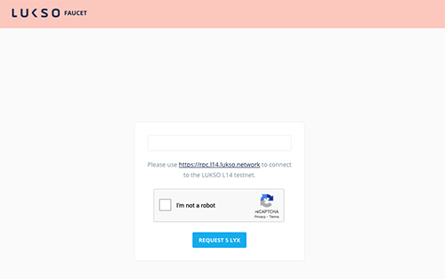

# Create a Universal Profile

In this guide, we will learn how to:

- create a Universal Profile.
- see our new Universal Profile on [universalprofile.cloud](https://universalprofile.cloud).


We will use our tool [lsp-factory.js](../../tools/lsp-factoryjs/deployment/universal-profile.md) to create a Universal Profile in **less than 50 lines of code!**

## Introduction

### Owned Contracts

A Universal Profile is an **owned** smart contract. Ownership means that such a contract has a separate **owner**.

The Contract's owner is a blockchain `address` that can represent anything, such as:

- one or multiple Externally Owned Accounts (EOAs),
- a multi-sig wallet, or
- an other smart contract that can represent anything (a DAO, a DEX, etc...).


> For more details, see [EIP-173: Contract Ownership Standard](https://eips.ethereum.org/EIPS/eip-173)

With the **Ownable** design pattern, a contract can be designed with _functionalities that only the owner can perform_. The design pattern gives the contract owner more control and privileges.

In the context of Universal Profile, _reading data from the contract storage can be done by anyone_. But **only the owner can**:

- `setData` = Add, edit or remove data from the [ERC725Y](../../standards/universal-profile/lsp0-erc725account#erc725y---generic-key-value-store) storage.
- `execute` = Call other contracts, do LYX transfers, or create other contracts (see [ERC725X](../../standards/universal-profile/lsp0-erc725account#erc725x---generic-executor) executor).

In this guide, our Universal Profile's owner will be a contract called a **Key Manager**. The [Key Manager](../../standards/smart-contracts/lsp6-key-manager.md) is a smart contract that enables to give specific permissions (_eg: _ transferring LYX on behalf of the Universal Profile) to `address`es, so that they can interact on the Universal Profile.

:::info Learn More
You can implement any complex ownership structure (and fine-grained control) on top of Universal Profiles. The structure includes having a UP owned and controlled by:

- one or multiple EOAs,
- one or multiple other smart contracts, or
- a mixture of both.

For more details, see [LSP6 - Key Manager Standard](../../standards/universal-profile/04-lsp6-key-manager.md).
:::

### Contracts Overview


Our tool [lsp-factory.js](../../tools/lsp-factoryjs/getting-started.md) will help us quickly deploy and set up a Universal Profile with just a few lines of code.

Under the hood, lsp-factory.js performs the following:

1. Deploying all the necessary contracts:
   - [Universal Profile](../../standards/universal-profile/03-lsp3-universal-profile-metadata.md) (UP) is the core smart contract representing a Universal Profile.
   - [Universal Receiver Delegate](../../standards/universal-profile/02-lsp1-universal-receiver-delegate.md) (URD) is the contract that reacts to events, such as tokens received or transferred.
   - [Key Manager](../../standards/universal-profile/04-lsp6-key-manager.md) (KM) is the contract that acts as the **owner of a Universal Profile** <br/> to enable other addresses to interact with the UP.
2. Linking the URD with the deployed UP account and setting its permissions.
3. Setting all the permissions for an EOA address so that it can act as the UP admin.

> :arrow_right: &nbsp; [See our lsp-factory.js docs for more details](../../tools/lsp-factoryjs/getting-started)

:::info Learn More
The figure above is our default setup for Universal Profile. However, _using a Key Manager as an owner is optional_.<br/>
You can create a Universal Profile without a Key Manager (or a Universal Receiver Delegate linked to it).
:::

## Setup

Before getting started, we will create a new project folder to write all the JavaScript code for this tutorial. <br/>
Open a terminal, then create and open a new project folder.

```shell
mkdir myUP
cd myUP
```

Afterward, we have to install all the tools and libraries we need for this tutorial. <br/>
Copy and paste the command below in your terminal to install these as npm dependencies.

```shell
npm install web3 @lukso/lsp-factory.js --save
```

## Step 1 - Create an EOA

:::note Notice
You should do this step in a **temporary file**.
:::

As described in the introduction, our first step is to create an EOA that will be used to control our Universal Profile.

:::success Recommendation
Complete "ready to use" JS files are available at the end in the [**Final Code**](#final-code) section.
:::

We can easily create an EOA using the [`web3.eth.accounts.create()`](https://web3js.readthedocs.io/en/v1.5.2/web3-eth-accounts.html#create) method from web3.js.

**Instructions:** **create a temporary file** and add the code snippet below. It will generate an object that contains:

- a private key (32 bytes / 64 characters long),
- an address (20 bytes / 40 characters long), and
- some singing methods like `sign`

```javascript title="create-eoa.js (temporary file)"
const Web3 = require('web3');
const web3 = new Web3();

const myEOA = web3.eth.accounts.create();
console.log(myEOA);

> {
    address: "0x...",
    privateKey: "0x...",
    signTransaction: function(tx){...},
    sign: function(data){...},
    encrypt: function(password){...}
}
```

Run the script above with Node.js to generate and display your EOA private key and address.

```bash
node create-eoa.js
```

> See the [Web3.js docs](https://web3js.readthedocs.io/en/v1.5.2/web3-eth-accounts.html#) for more infos on creating an EOA

:::note How to load an EOA?
We can quickly load our EOA with the private key previously displayed via `console.log` (this is what we will do in Step 3).

```javascript
const Web3 = require('web3');
const web3 = new Web3();

const PRIVATE_KEY = '0x...'; // your EOA private key (previously created)
const myEOA = web3.eth.accounts.privateKeyToAccount(PRIVATE_KEY);
```

:::

## Step 2 - Get some LYX

After creating an EOA that will control our Universal Profile in **Step 1**, we will need to fund our address with some test LYX (the native cryptocurrency of the LUKSO blockchain). You can obtain some free test LYX via the **[L14 Faucet](http://faucet.l14.lukso.network/)**.

**Instructions:** visit the faucet website, paste your above-generated address into the input field and _request 5 LYX_.

:arrow_right: **[LUKSO L14 Faucet Website](http://faucet.l14.lukso.network/)**



We will look up our address balance in the **[LUKSO L14 Block Explorer](https://blockscout.com/lukso/l14)** to ensure we have received our test LYX.

**Instructions:** go to the LUKSO L14 Block Explorer, and search your pasted address at the top right corner.<br/> You should see 5 LYX next to the _Balance_ field.


## Step 3 - Create our Universal Profile

:::note Notice
You should do the rest of this tutorial in a **new file (`main.js`)**.
:::

Now that we have created our EOA, we are ready to create our first Universal Profile.

**Instructions:** create a **new file**: `main.js` (it will contain the main runtime script to create our Universal Profile).

### 3.1 - Load our EOA

We will start by loading our EOA in our main JS file so that we can use it to deploy our Universal Profile.

**Instructions:** import the private key that you previously created in **step 1**.

```javascript title="main.js"
const Web3 = require('web3');
const web3 = new Web3();

const PRIVATE_KEY = '0x...'; // your EOA private key (previously created)
const myEOA = web3.eth.accounts.privateKeyToAccount(PRIVATE_KEY);

> {
    address: "0x...",
    privateKey: "0x...",
    signTransaction: function(tx){...},
    sign: function(data){...},
    encrypt: function(password){...}
}
```

:::danger Never expose your private key!
Your private key is what enables you to control your EOA. Therefore, it should **NEVER** be exposed.

For simplicity in this tutorial, we load the EOA using a hardcoded private key (as a literal string).<br/>
However, your private key should never be hardcoded in your code.

:warning: **ALWAYS ensure that your private key is stored securely** and never exposed.
:::

### 3.2 - Setup the lsp-factory.js

The next step is to import and set up our lsp-factory.js tool. It will give us access to a `.deploy(...)` method that we will use to create our Universal Profile.

**Instructions:** use the code snippet below to set up the lsp-factory.js.

```javascript title="main.js"
const { LSPFactory } = require('@lukso/lsp-factory.js');

// Step 3.1 - Load our EOA
const PRIVATE_KEY = '0x...'; // add the private key of your EOA here (created in Step 1)
const myEOA = web3.eth.accounts.privateKeyToAccount(PRIVATE_KEY);

// Create an instance of lsp-factory.js
const lspFactory = new LSPFactory(
  // We initialize the LSPFactory with the L14 chain RPC endpoint
  'https://rpc.l14.lukso.network',
  {
    // L14 chain ID
    chainId: 22,
    // We use your EOA's private key, to specify the EOA address that:
    //   1) will deploy the UP
    //   2) will be the UP owner
    deployKey: PRIVATE_KEY, // or myEOA.privateKey
  },
);

> LSPFactory {
  options: {
    ...
  },
  DigitalAsset: DigitalAsset {
      ...
  },
  LSP3UniversalProfile: LSP3UniversalProfile {
      ...
  },
  ProxyDeployer: ProxyDeployer {
      ...
  }
}
```

### 3.3 - Deploy our Universal Profile

The final step is to deploy our UP via `LSP3UniversalProfile.deploy(...)`. This method from the lsp-factory.js will deploy the three main contracts shown in the [architecture diagram](#contracts-overview) above (see **[Contracts Overview](#contracts-overview)**).

This `.deploy(...)` function takes an object as an argument that must contain two elements:

- `controllingAccounts`: the EOA address(es) that we will use to control our UP.
- `lsp3Profile`: an object that represents your `LSP3Profile` Metadata.

> We keep our `LSP3Profile` metadata simple in this tutorial. But you can easily add more details about your UP in this object, like an original `name`, `description`, or any custom tags in the `tags` array.

```javascript title="main.js"
const { LSPFactory } = require('@lukso/lsp-factory.js');

// Step 3.1 - Load our EOA
// ...

// Step 3.2 - Setup the lsp-factory
// ...

// Step 3.3 - Deploy our Universal Profile
// (put this code inside an `async` function to run the `deploy` method)
async function createUniversalProfile() {
  const deployedContracts = await lspFactory.LSP3UniversalProfile.deploy({
    controllingAccounts: [myEOA.address], // our EOA will be controlling our UP
    lsp3Profile: {
      name: 'My Universal Profile',
      description: 'My Cool Universal Profile',
      tags: ['Public Profile'],
      links: [
        {
          title: 'My Website',
          url: 'http://my-website.com',
        },
      ],
    },
  });

  return deployedContracts;
}

createUniversalProfile();

> {
  ERC725Account: {
    address: '0x...',
    receipt: {
      to: null,
      from: '0x...',
      contractAddress: '0x...',
      transactionIndex: 0,
      gasUsed: [BigNumber],
      logsBloom: '0x...',
      blockHash: '0x...',
      transactionHash: '0x...',
      logs: [],
      blockNumber: ...,
      confirmations: 1,
      cumulativeGasUsed: [BigNumber],
      status: 1,
      type: 0,
      byzantium: true,
      events: []
    }
  },
  KeyManager: {
    address: '0x646e989A0840CE4c3bac39d535Af736db2371107',
    receipt: {
      ...
    }
  },
  UniversalReceiverDelegate: {
    address: '0xc2f51A2891E7c78541a2CADEff9146F1E0E13E2a',
    receipt: {
      ...
    }
  }
}
```

:::info Learn more
**Adding more details** to our Universal Profile (_e.g., links, profile images, background images_) will be **our next tutorial!** :art:
:::

## Visualize our new Universal Profile

If the deployment is successful, we can access the address of our newly created Universal Profile from the returned value.

```javascript title="main.js"
async function createUniversalProfile() {
  const deployedContracts = await lspFactory.LSP3UniversalProfile.deploy({
    // deployment details omitted for brevity
    // see Step 3.3 above
  });

  const myUPAddress = deployedContracts.ERC725Account.address;
  console.log('my Universal Profile address: ', myUPAddress);
  // my Universal Profile address: 0x...

  return deployedContracts;
}

createUniversalProfile();

> my Universal Profile address: 0xFD296cCDB97C605bfdE514e9810eA05f421DEBc2
```

We can now visualize our UP on the [universalprofile.cloud](https://universalprofile.cloud) website by adding the address of the deployed UP in the URL, after the `/` (slash), as follow:

*https://universalprofile.cloud/{your-up-address}*


You can also see the contracts created by the lsp-factory.js library on the LUKSO L14 Block explorer:

*https://blockscout.com/lukso/l14/address/{your-eoa-address}/transactions*

The figure below describes each transaction performed by the lsp-factory.js. It also shows how transactions <br/> are mapped to the **[Contracts Overview](#contracts-overview)** diagram introduced at the beginning of this guide.


## Congratulations 🥳

**You have successfully created your first Universal Profile!**

:arrow_right: Continue with the following tutorial to learn **[How to edit your Universal Profile](./edit-profile.md)**.

:arrow_down: Look a the code snippet below to help you debug.

## Final Code

Below is the complete code snippet of this guide, with all the steps compiled together.

```javascript title="create-eoa.js (temporary file) - run this code once to generate an EOA"
const Web3 = require('web3');
const web3 = new Web3();

const myEOA = web3.eth.accounts.create();
console.log(myEOA);

> {
    address: "0x...",
    privateKey: "0x...",
    signTransaction: function(tx){...},
    sign: function(data){...},
    encrypt: function(password){...}
}
```

```javascript title="main.js"
const Web3 = require('web3');
const { LSPFactory } = require('@lukso/lsp-factory.js');

const web3 = new Web3();

// Step 3.1 - Load our Externally Owned Account (EOA)
const PRIVATE_KEY = '0x...'; // add the private key of your EOA here (created in Step 1)
const myEOA = web3.eth.accounts.privateKeyToAccount(PRIVATE_KEY);

// Step 3.2 - Setup the lsp-factory
const lspFactory = new LSPFactory(
  // L14 chain RPC endpoint
  'https://rpc.l14.lukso.network',
  {
    // L14s chain Id
    chainId: 22,
    // We use our EOA's private key, to specify the EOA address that:
    //   1) will deploy the UP
    //   2) will be the UP owner
    deployKey: PRIVATE_KEY, // or myEOA.privateKey
  },
);

// Step 3.3 - Deploy our Universal Profile
async function createUniversalProfile() {
  const deployedContracts = await lspFactory.LSP3UniversalProfile.deploy({
    controllingAccounts: [myEOA.address], // our EOA will be controlling our UP
    lsp3Profile: {
      name: 'My Universal Profile',
      description: 'My Cool Universal Profile',
      tags: ['Public Profile'],
      links: [
        {
          title: 'My Website',
          url: 'http://my-website.com',
        },
      ],
    },
  });

  const myUPAddress = deployedContracts.ERC725Account.address;
  console.log('my Universal Profile address: ', myUPAddress);

  return deployedContracts;
}

createUniversalProfile();

> my Universal Profile address: 0xFD296cCDB97C605bfdE514e9810eA05f421DEBc2
```
