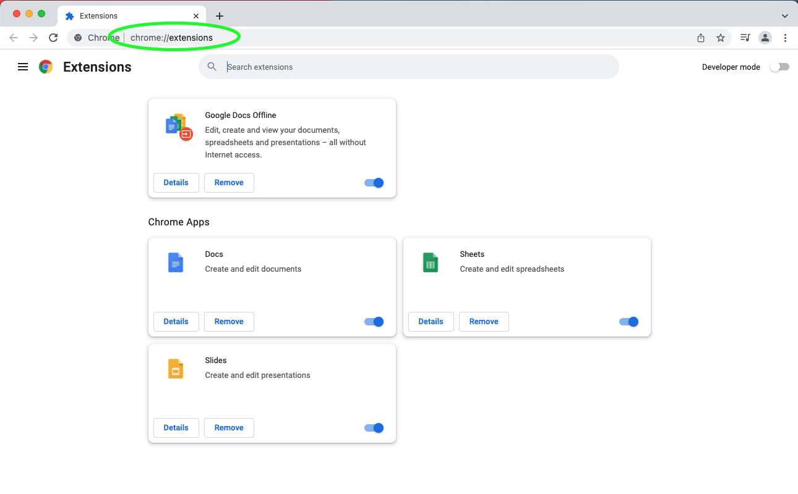
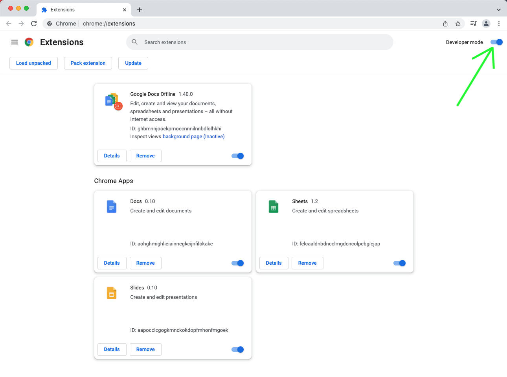
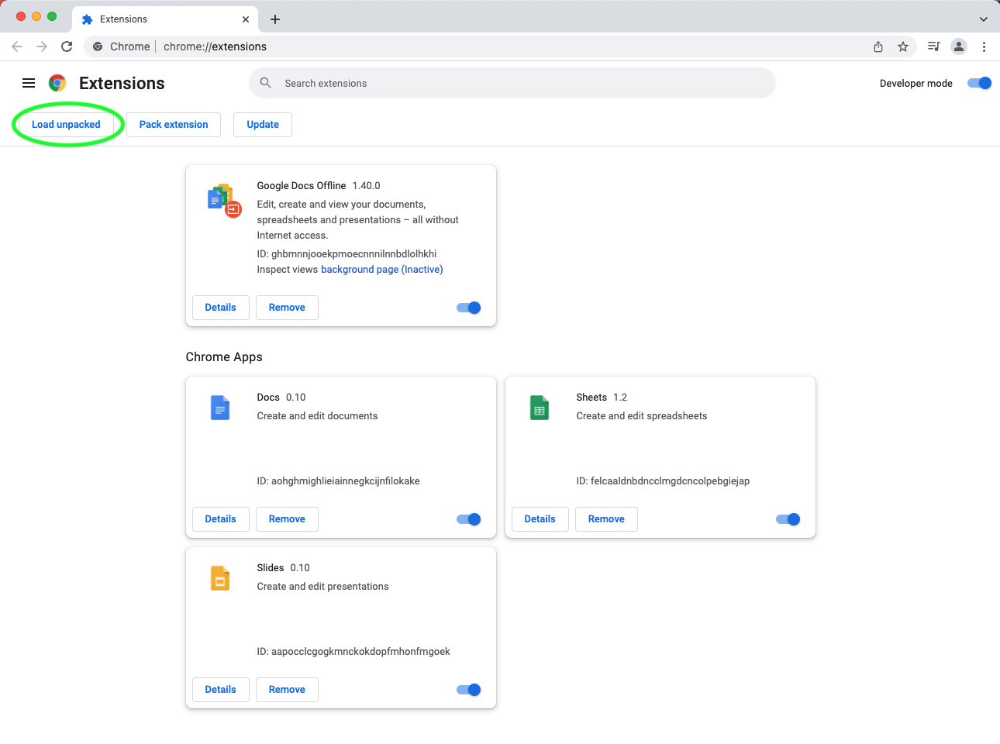
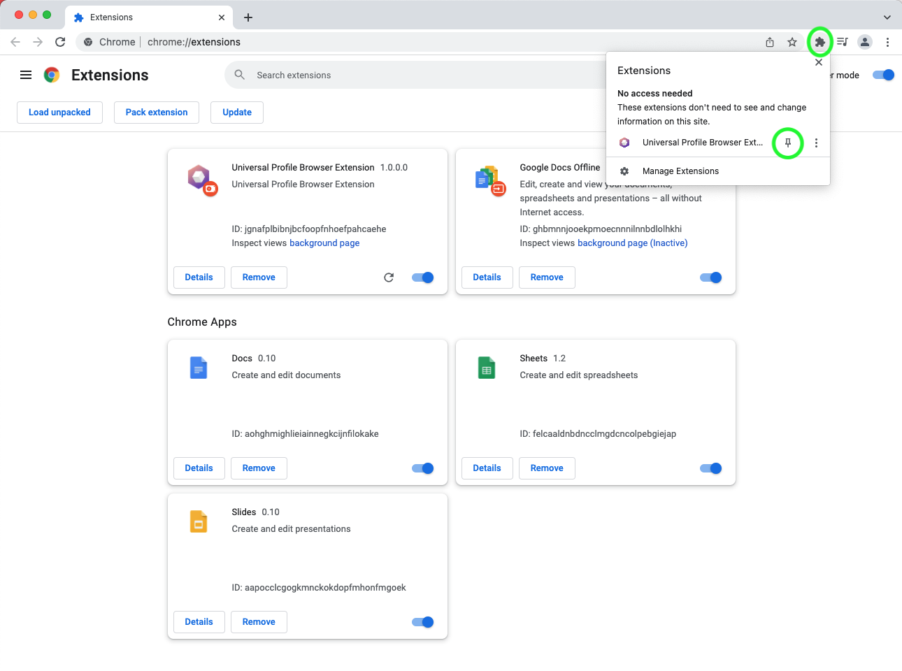
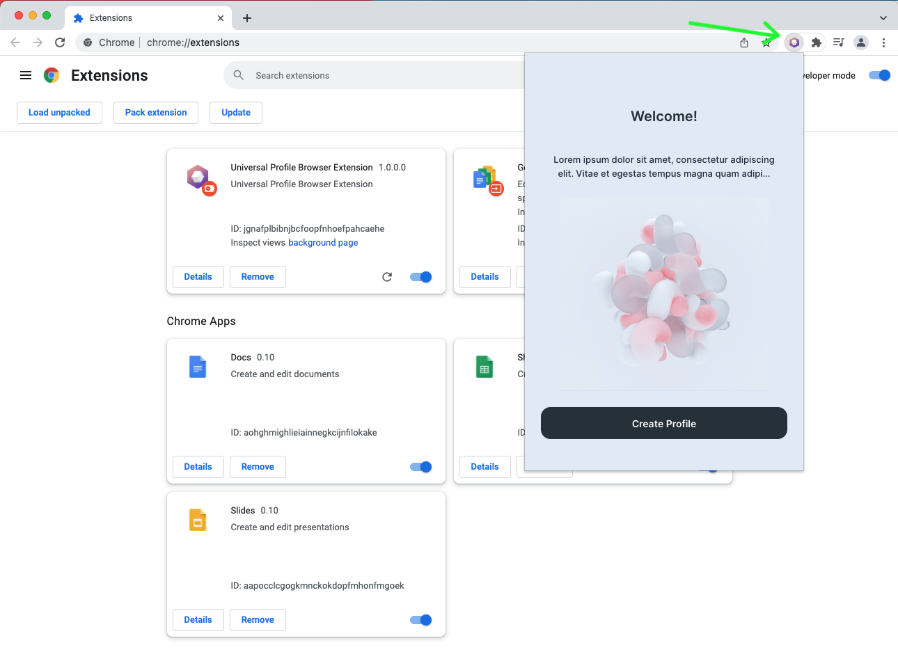
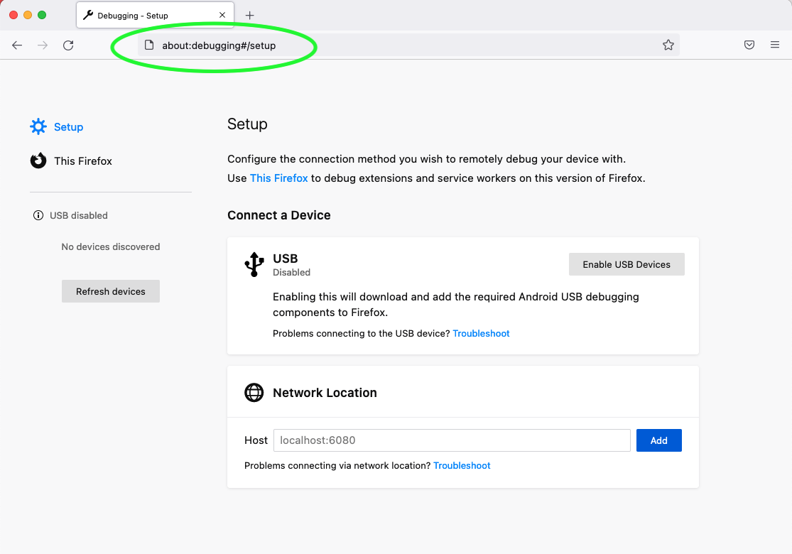
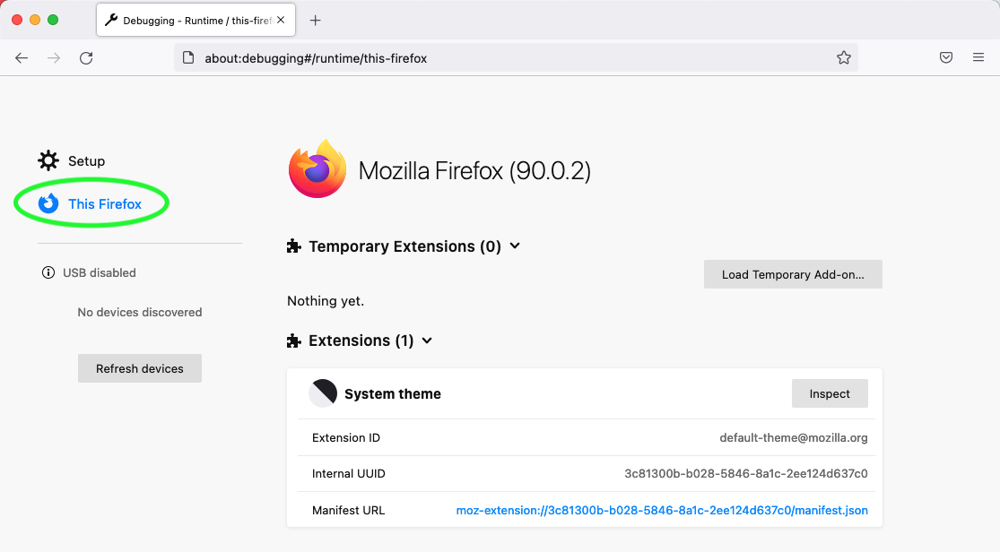
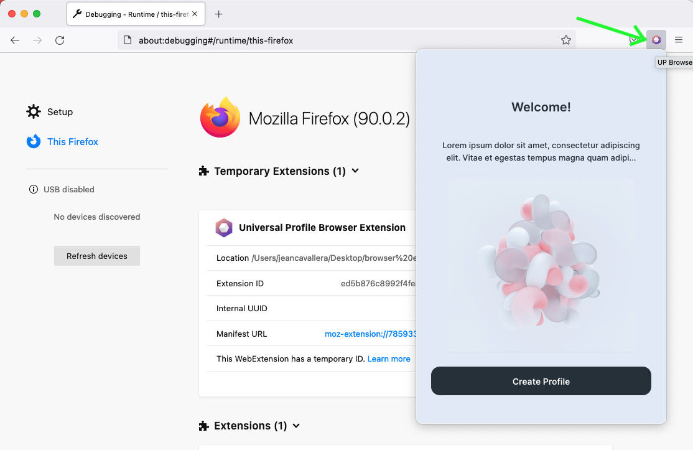

import Tabs from '@theme/Tabs';
import TabItem from '@theme/TabItem';

# Interacting through the browser extension

In this guide, you will learn how to download + install the **Universal Profile browser extension** on Chrome, Brave or Firefox.

## Download + Install the extension

Click on one of the links below to download the extension, based on the browser you want to install it to.

### :inbox_tray: **[Download link](./universalprofile-extension.zip)**

<Tabs>
  
  <TabItem value="Chrome-Brave" label="Installation instructions for Chrome / Brave">

**step 1:** in the URL bar of the browser, type `chrome://extensions` to open the list of extensions.

**step 2:** on the new window, toggle the **"developer mode"** located at the top right.

**step 3:** click on the button **"Load unpacked"** and select the **unpacked `.zip`** file previously downloaded.

**step 4:** open the extensions by clicking on the **puzzle icon** on the top right of the browser window and **pin** the _Universal Profile Browser Extension_

**The Browser extension is now installed + setup** in your Chrome / Brave browser.
You can now get started to create and interact with Universal Profile using the browser extension.

  </TabItem>

  <TabItem value="Firefox" label="Installation instructions for Firefox">

**step 1:** in the browser URL, type `about:debugging` and **press ENTER**

**step 2:** in the window that appears, click on **"This Firefox"**

**step 3:** in the new window, click on **"Temporarily Load The Add-On"**

**The Browser extension is now installed + setup** in your Firefox browser.
You can now get started to create and interact with Universal Profile using the browser extension.

  </TabItem>

</Tabs>
