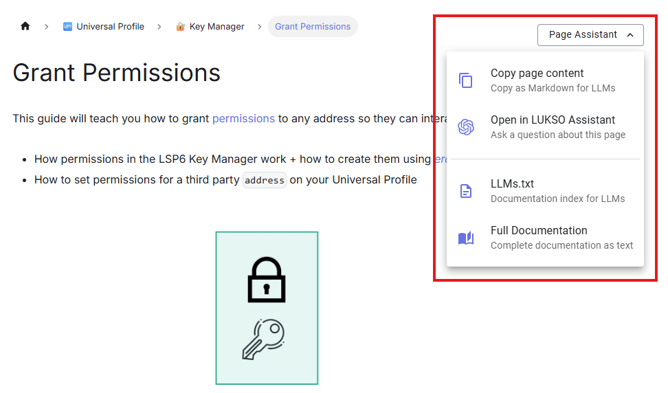

import LinkCards from '@site/src/components/LinkCards';

## Page Assistant

Each page of our documentation contains this dropdown menu for helping you research the topic deeper with AI.
:::info Page Assistant

:::

### LUKSO GPT Assistant

Trained with the official LUKSO documentation data, [LUKSO GPT Assistant is available on ChatGPT](https://chatgpt.com/g/g-681a44ae29108191b12d97296ab25912-lukso-assistant) for any questions related to LUKSO Network, Universal Profiles, and LUKSO Standard Proposals(LSPs).

### `llms.txt` and `/llms-full.txt`

Our documentation follows the [llms.txt standard](https://llmstxt.org/) to provide AI-optimized content for developers. We offer two versions:

- **[`/llms.txt`](https://docs.lukso.tech/llms.txt)** - Provides a high-level LLM-friendly information about our docs with links to detailed markdown files.
- **[`/llms-full.txt`](https://docs.lukso.tech/llms-full.txt)** - Complete documentation content for comprehensive AI assistance

:::tip Using with AI Tools
Reference our `llms.txt` files when working with AI coding assistants like Cursor, Claude, or ChatGPT to give them comprehensive context about LUKSO development.
:::

## Start **_vibe coding_** on LUKSO

Whether you're using AI IDEs like **Cursor** or **Windsurf**, coding agents like **Claude Code** or **GitHub Copilot**, or app builders like **Replit**, **Bolt**, **Lovable**, or **v0**, vibe coding on LUKSO works just like any EVM chain.

### Providing LUKSO Context

Give your AI assistant LUKSO-specific knowledge so it understands Universal Profiles, LSP standards, and the LUKSO ecosystem.

**Ways to provide context:**

- **URL reference**: Many AI tools support fetching documentation directly via `https://docs.lukso.tech/llms.txt`
- **Copy-paste**: Paste the relevant page content from [LUKSO Documentation](https://docs.lukso.tech/) into your conversation.

:::tip Copying page content
You can utilize the [page assistant](#page-assistant) dropdown menu to copy the page content into your conversation.
:::

- **MCP tools**: Use Model Context Protocol tools like Context7 to automatically fetch up-to-date documentation

**Example: General LUKSO development**

```text
I'm building a dApp on LUKSO. Here's the documentation for context:
@https://docs.lukso.tech/llms.txt

Help me [your specific task] using Universal Profiles and LSP standards.
```

**Example: Working with specific LSPs**

When building with specific standards, point to the relevant documentation:

```text
I need to deploy an LSP7 token on LUKSO.

Reference these docs:
- LSP7 Standard: https://docs.lukso.tech/standards/tokens/LSP7-Digital-Asset/
- LSP7 Contract: https://docs.lukso.tech/contracts/contracts/LSP7DigitalAsset/

Create a token with name "MyToken", symbol "MTK", and make it divisible.
The token should be ownable by my Universal Profile.
```

**More tips for working with LUKSO documentation:**

- For **Universal Profiles**: Reference [LSP0 (ERC725 Account)](/standards/accounts/lsp0-erc725account/) and [LSP3 (Profile Metadata)](/standards/metadata/lsp3-profile-metadata/) docs
- For **tokens**: Reference [LSP7 (Digital Asset)](/standards/tokens/LSP7-Digital-Asset/) or [LSP8 (Identifiable Digital Asset)](/standards/tokens/LSP8-Identifiable-Digital-Asset/) standards
- For **permissions**: Reference [LSP6 (Key Manager)](/standards/access-control/lsp6-key-manager/) documentation
- For **tokens owned or created by a profile**: Reference [LSP5 (Received Assets)](/standards/metadata/lsp5-received-assets/) and [LSP12 (Issued Assets)](/standards/metadata/lsp12-issued-assets/)

### Prompting for better results

Getting better results from AI comes down to how you ask:

- **Be specific**: Instead of "fix my code," say "The [`fetchData`](/tools/dapps/erc725js/methods/#fetchdata) function returns undefined when the profile has no LSP3 metadata."
- **Provide structure**: When debugging, include what you expected, what happened, and any error messages.
- **Iterate step-by-step**: Break complex features into smaller tasks rather than asking for everything at once.

Template for structured problem descriptions:

```text
I'm working on [feature/task].

Expected behavior: [what should happen]
Actual behavior: [what's happening]
Error messages: [if any]
Relevant code: [paste the specific code]

Please help me identify the issue and suggest a fix.
```

## Prompts for working with [**LUKSO Standard Proposals**](/standards/introduction/)

#### Start experimenting with the novel features of LSPs with AI using the prompts below ⤵️

<LinkCards
  enableModal={true}
  links={[
    {
      title: 'Update the 🆙 metadata',
      link: '/learn/ai-tools/update-profile-image',
      description:
        'Building with Universal Profiles? Learn how to change profile metadata!',
      showAsCode: false,
    },
    {
      title: 'Automate your 🆙s behaviour',
      link: '/learn/ai-tools/react-to-events',
      description:
        'Did you know your Universal Profile can react to on-chain events?',
      showAsCode: false,
    },
    {
      title: 'Start building mini-apps for your 🆙',
      link: '/learn/ai-tools/grid-miniapp-boilerplate',
      description: 'Scaffold a Grid mini‑app with recommended structure.',
      showAsCode: false,
    },
    {
      title: 'Add/Remove permission of a 🆙 controller',
      link: '/learn/ai-tools/grant-permissions',
      description: 'Guide to grant someone permissions to use your profile.',
      showAsCode: false,
    },
  ]}
/>
