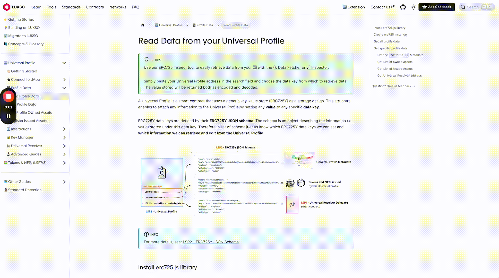

# Glossary

:::info
At LUKSO docs, use [ChefGPT](https://www.cookbook.dev/) for quick term explanations.

Highlight any word and click `Ask Cookbook` in the Navbar for its definition.

:::

## Commonly Searched Terms

| Topic                                                                                              | TL;DR                                                                                                                                                                                                                                                                                                                                                                                                                             |
| -------------------------------------------------------------------------------------------------- | --------------------------------------------------------------------------------------------------------------------------------------------------------------------------------------------------------------------------------------------------------------------------------------------------------------------------------------------------------------------------------------------------------------------------------- |
| Controllers                                                                                        | Controllers are like little programs that are given specific permissions to do things to and with your Universal Profile.                                                                                                                                                                                                                                                                                                         |
| [Key Manager](/standards/access-control/lsp6-key-manager.md)                                       | The Key Manager is essentially a place where you can manage permissions that other _things_ have on your Universal Profile. _Things_ could be other people's profiles, dapps, extensions....anything.                                                                                                                                                                                                                             |
| [ERC725X](/standards/metadata/lsp2-json-schema.md)                                                 | ERC725X is a standard that defines how your Universal Profile works and how it can be used to manage your online identity and assets. It's like a set of rules that everyone agrees on, making it easier for different applications and platforms to understand and interact with your profile.                                                                                                                                   |
| [ERC725Y](/standards/erc725#erc725x)                                                               | ERC725Y is the basic tool that lets you store information, while LSP2 is the set of rules that makes sure everyone stores and retrieves this information in an organized and understandable way.                                                                                                                                                                                                                                  |
| [LYXt](../../docs/faq/lukso/general-information.md#whats-the-difference-between-lyxt-lyxe-and-lyx) | LYXt is the token for developers to use on our testnet. It can always be acquired by anyone for free.                                                                                                                                                                                                                                                                                                                             |
| [LYXe](../../docs/faq/lukso/general-information.md#whats-the-difference-between-lyxt-lyxe-and-lyx) | LYXe is the token that was deployed on Ethereum before LUKSO Mainnet was launched. It allowed people to invest in LUKSO pre-launch.                                                                                                                                                                                                                                                                                               |
| [Metadata](/standards/metadata/lsp3-profile-metadata.md)                                           | This typically refers to the additional data that is stored against a token or NFT. The difference on LUKSO is it can be extended.    For example, imagine you've bought a house and have the deed as an NFT on LUKSO. Well now, as renovations are carried out, they can be continually added to the NFT for history.                                                                                                    |
| Account Abstraction                                                                                | Account abstraction is abstracting away smart contract execution from storing funds. With a smart contract account, you can program it to do all sorts of things. You can set up automatic payments, create multi-signature wallets that require multiple people to approve transactions, or even add security features like daily spending limits. It's like having a customizable, programmable bank account on the blockchain. |
