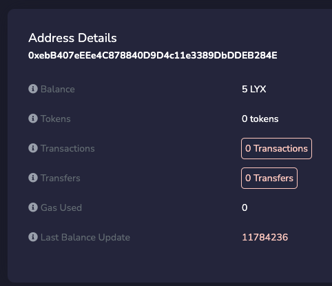

import Tabs from '@theme/Tabs';
import TabItem from '@theme/TabItem';

# Transfer LYX

:::caution

This article is a WIP

:::

- show simple token transfer call
- `sendTransaction({from:, to, vlaue, data: '0x', ....})`

In this guide, we will learn **how to transfer LYX** from our Universal Profile to any `address` (including another :up: ). We will cover:

- the basics of the `execute(...)` function and how it works.
- how to use this function to transfer LYX from our UP.


:::tip
A complete _"ready to use"_ JS file is available at the end in the [**Final Code**](#final-code) section. If you want to run the code as standalone JavaScript files within the terminal or the browser, you can open the [`lukso-playground`](https://github.com/lukso-network/lukso-playground) repository or use the correlated [StackBlitz](https://stackblitz.com/github/lukso-network/lukso-playground) page. Remember that you will have to provide a controller key (EOA) of your Universal Profile in order to transfer funds.
:::

## Introduction

Let's recap what we have learned so far!

- In our [**Create a Universal Profile**](../../guides/universal-profile/create-profile.md) guide, we saw in the [Universal Profile architecture diagram](../../guides/universal-profile/create-profile.md#contracts-overview) that the owner of a Universal Profile (UP) is a Key Manager (KM). This smart contract acts as its controller.

- In our [**Edit a Universal Profile**](../../guides/universal-profile/edit-profile.md) guide, we saw the basics of interacting with our UP to edit our profile info. We did so by interacting via the KM.

We previously saw how to use `setData(...)` to update data in our UP contract's storage. Let's now look at `execute(...)`.

### Basics of the `execute(...)` function

The [`execute(operation,to,value,data)`](../../contracts/contracts/ERC725/ERC725.md#execute) function from [ERC725X](../../standards/lsp-background/erc725.md#erc725x---generic-executor) enable us to use our UP to interact with other addresses, such as transferring LYX or calling other smart contracts. This function takes four arguments (see [ERC725 API docs](../../contracts/contracts/ERC725/ERC725.md#execute)).

We can use this function to transfer LYX from our UP to any address (including another UP). Transferring LYX from our UP is as simple as making a standard [`CALL`](../../standards/universal-profile/lsp6-key-manager.md#permission-values) to any `address`, attaching some **value** to the call.

For a regular LYX transfer, the parameters will be:

- `_operation`: `0` (for `CALL`).
- `_to`: the `address` we want to send LYX to (Externally Owned Account or contract address).
- `_value`: the amount of LYX we want to transfer (in Wei).
- `_data`: empty (`0x` since we are just transferring LYX).

### Permissions required to transfer LYX

The chosen EOA needs to have [**TRANSFERVALUE Permission**](../../standards/universal-profile/lsp6-key-manager.md#permissions) together with [**AllowedCalls**](../../standards/universal-profile/lsp6-key-manager.md#allowed-calls) or [**SUPER_TRANSFERVALUE Permission**](../../standards/universal-profile/lsp6-key-manager.md#super-permissions).

## Setup

To complete this mini-guide, we will need:

- the `UniversalProfile` contracts ABI from the [`@lukso/lsp-smart-contracts`](https://www.npmjs.com/package/@lukso/lsp-smart-contracts) npm package.
- the address of our Universal Profile we want to send LYX from.
- an EOA with some LYX for gas fees and the required [**permissions**](../../standards/universal-profile/lsp6-key-manager.md#permissions) for the interaction.

Make sure you have the following dependencies installed before beginning this tutorial:

- Either [`web3.js`](https://github.com/web3/web3.js) or [`ethers.js`](https://github.com/ethers-io/ethers.js/)
- [`@lukso/lsp-smart-contracts`](https://github.com/lukso-network/lsp-smart-contracts/)

<Tabs>
  
  <TabItem value="web3js" label="web3.js">

```shell title="Install the dependencies"
npm install web3 @lukso/lsp-smart-contracts
```

  </TabItem>

  <TabItem value="ethersjs" label="ethers.js">

```shell title="Install the dependencies"
npm install ethers @lukso/lsp-smart-contracts
```

  </TabItem>

</Tabs>

## Step 1 - Get some LYX

:::caution

You need to have LYX both in your EOA (which will pay for the transaction fees) and in your Universal Profile (where the LYX will be transferred from).

:::

In order to send LYX from our Universal Profile, we will first request some free test LYX for our UP via the **[Testnet Faucet](https://faucet.testnet.lukso.network/)**.

1. Visit the :arrow_right: **[LUKSO Testnet Faucet Website](https://faucet.testnet.lukso.network/)**.
2. Make a **[tweet](https://twitter.com)** with your UP address and paste the tweet's url in the input field and click the _"Give me LYX"_ button.


3. Check the balance of your Universal Profile on the **[LUKSO Testnet Block Explorer](https://explorer.execution.testnet.lukso.network/)** :arrow_down:

Paste the address of the Universal Profile in the address field in the top right corner of the block explorer.

If everything went successfully, you should see that the _"Balance"_ field of your Universal Profile has been updated!



## Step 2 - Create the contracts instances

The first step is to create instances of our Universal Profile and Key Manager contracts.

- 2.1 - First, we will use the Universal Profile to retrieve the address of the KeyManager via the [`owner()`](../../contracts/contracts/LSP0ERC725Account/LSP0ERC725Account.md#owner) function.

- 2.2 - Then, we will use the Key Manager to interact with our Universal Profile and send some LYX.

<Tabs>
  
  <TabItem value="web3js" label="web3.js">

```typescript
import UniversalProfile from '@lukso/lsp-smart-contracts/artifacts/UniversalProfile.json';
import Web3 from 'web3';

const web3 = new Web3('https://rpc.testnet.lukso.network');

const myUPAddress = '0x...';
const myUP = new web3.eth.Contract(UniversalProfile.abi, myUPAddress);
```

  </TabItem>

  <TabItem value="ethersjs" label="ethers.js">

```typescript
import UniversalProfile from '@lukso/lsp-smart-contracts/artifacts/UniversalProfile.json';
import { ethers } from 'ethers';

const provider = new ethers.providers.JsonRpcProvider(
  'https://rpc.testnet.lukso.network',
);

const myUPAddress = '0x...';
const myUP = new ethers.Contract(myUPAddress, UniversalProfile.abi, provider);
```

  </TabItem>

</Tabs>

### Step 3 - Load our EOA

Like in other guides, an important step is to load our EOA that is a controller for our Universal Profile.

<Tabs>

  <TabItem value="web3js" label="web3.js">

```typescript
const PRIVATE_KEY = '0x...'; // your controller address private key

const myEOA = web3.eth.accounts.wallet.add(PRIVATE_KEY);
```

  </TabItem>

  <TabItem value="ethersjs" label="ethers.js">

```typescript
const PRIVATE_KEY = '0x...'; // your controller address private key

const myEOA = new ethers.Wallet(PRIVATE_KEY).connect(provider);
```

  </TabItem>

</Tabs>

## Step 4 - Send the LYX

With our contract instances ready, we now want to transfer some LYX from the UP using the `execute(...)` function. Since we are calling from a UP's controller address (with proper [**permissions**](../../standards/universal-profile/lsp6-key-manager.md#permissions)), the Key Manager will authorize the LYX transfer.

<Tabs>
  
  <TabItem value="web3js" label="web3.js">

```typescript
const OPERATION_CALL = 0;
const recipient = '0x...'; // address the recipient (any address, including an other UP)
const amount = web3.utils.toWei('3'); // amount of LYX we want to transfer
// calldata executed at the target (here nothing, just a plain LYX transfer)
const data = '0x'; // empty data

await myUP.methods.execute(OPERATION_CALL, recipient, amount, data).send({
  from: myEOA.address,
  gasLimit: 300_000,
});
```

  </TabItem>

  <TabItem value="ethersjs" label="ethers.js">

```typescript
const OPERATION_CALL = 0;
const recipient = '0x...'; // address of the recipient (any address, including an other UP)
const amount = ethers.utils.parseEther('3'); // amount of LYX we want to transfer
const data = '0x'; // calldata executed at the target (here nothing, just a plain LYX transfer)

await myUP.connect(myEOA).execute(OPERATION_CALL, recipient, amount, data);
```

  </TabItem>

</Tabs>

## Final Code

<Tabs>
  
  <TabItem value="web3js" label="web3.js">

```javascript
import UniversalProfile from '@lukso/lsp-smart-contracts/artifacts/UniversalProfile.json';
import Web3 from 'web3';

const web3 = new Web3('https://rpc.testnet.lukso.network');

// 1. instantiate your UP contract
const myUPAddress = '0x...';
const myUP = new web3.eth.Contract(UniversalProfile.abi, myUPAddress);

const PRIVATE_KEY = '0x...'; // your controller address private key
const myEOA = web3.eth.accounts.wallet.add(PRIVATE_KEY); // amount of LYX we want to transfer

const OPERATION_CALL = 0;
const recipient = '0x...'; // address the recipient (any address, including an other UP)
const amount = web3.utils.toWei('3');
// calldata executed at the target (here nothing, just a plain LYX transfer)
const data = '0x';

await myUP.methods.execute(OPERATION_CALL, recipient, amount, data).send({
  from: myEOA.address,
  gasLimit: 300_000,
});
```

  </TabItem>

  <TabItem value="ethersjs" label="ethers.js">

```typescript
import UniversalProfile from '@lukso/lsp-smart-contracts/artifacts/UniversalProfile.json';
import { ethers } from 'ethers';

const provider = new ethers.providers.JsonRpcProvider(
  'https://rpc.testnet.lukso.network',
);

const myUPAddress = '0x...';
const myUP = new ethers.Contract(myUPAddress, UniversalProfile.abi, provider);

const PRIVATE_KEY = '0x...'; // your controller address private key
const myEOA = new ethers.Wallet(PRIVATE_KEY).connect(provider);

const OPERATION_CALL = 0;
const recipient = '0x...'; // address the recipient (any address, including an other UP)
const amount = ethers.utils.parseEther('3'); // amount of LYX we want to transfer
// calldata executed at the target (here nothing, just a plain LYX transfer)
const data = '0x';

await myUP.connect(myEOA).execute(OPERATION_CALL, recipient, amount, data);
```

  </TabItem>

</Tabs>
