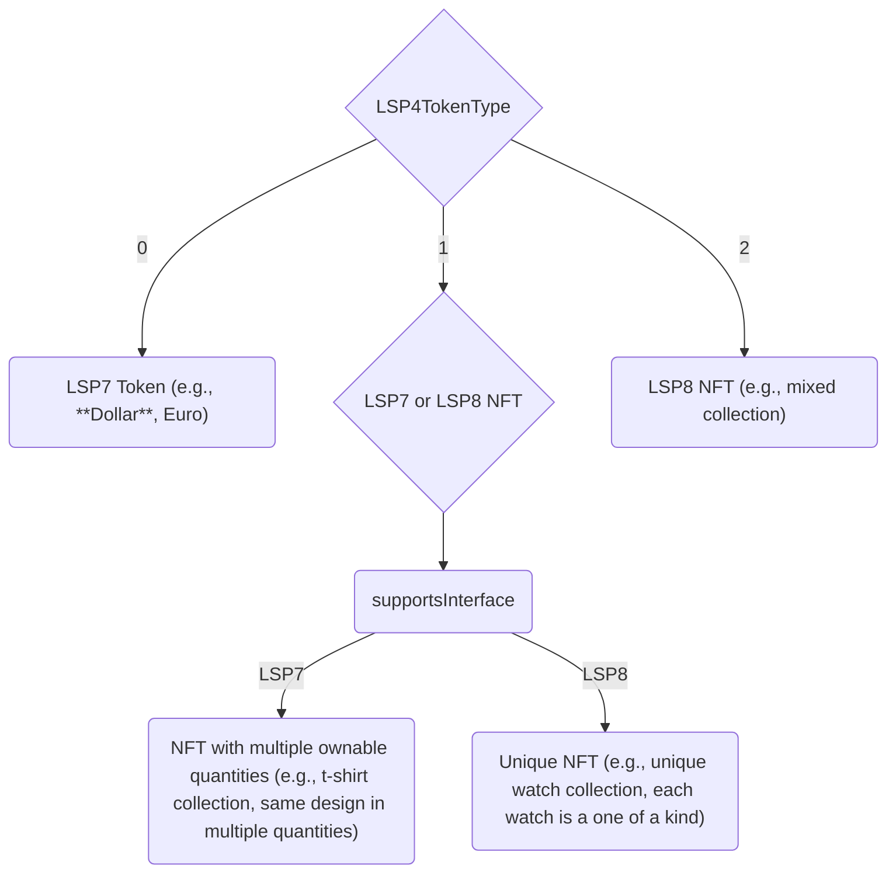

# Choose between LSP7 or LSP8

This page provides guidance on which standard and combination to choose for your project. Both LSP7 and LSP8 coupled with the `LSP4TokenType` data key allow to create NFT collections on LUKSO. From simple to more complex!

## Available Options

There are 4 x main popular combination of LSP7 / LSP8 + the `LSP4TokenType`.

<table id="token-nft-combinations">
    <tr>  
        <th rowspan="2">Description</th>
        <th colspan="2">Standard</th>
        <th colspan="3">LSP4 Token Type</th>
    </tr>
    <tr>
        <th>LSP7</th>
        <th>LSP8</th>
        <th>(0) Token</th>
        <th>(1) NFT</th>
        <th>(2) Collection</th>
    </tr>
    <tr>
        <td>Fungible Token</td>
        <td>✓</td>
        <td></td>
        <td>✓</td>
        <td></td>
        <td></td>
    </tr>
    <tr>
        <td>_"NFT-like"_ digital item with multiple ownable quantities</td>
        <td>✓</td>
        <td></td>
        <td></td>
        <td>✓</td>
        <td></td>
    </tr>
    <tr>
        <td>A collection of unique items</td>
        <td></td>
        <td>✓</td>
        <td></td>
        <td>✓</td>
        <td></td>
    </tr>
    <tr>
        <td>An _"umbrella"_ collection containing multiple sub-collections</td>
        <td></td>
        <td>✓</td>
        <td></td>
        <td></td>
        <td>✓</td>
    </tr>
</table>

## Fungible Token

### Characteristics

- divisible (unless `decimals()` overwritten to `0`).
- 18 decimals by default (unless overwritten to have less decimals, like USDT for example which has 6 decimals).
- The `LSP4Metadata` represents the metadata of the fungible token.

### Example Use Cases

- a digital currency
- a meme coin
- a share in a com
- a voting token.
- a reward token.
- a utility token.

---

## Multiple Ownable Digital Items

### Characteristics

- Non divisible (decimals is `0`).
- Each items can't be uniquely identified by an ID in the collection. They are all the same.
- All items share the same metadata. There is no metadata specific per item.
- The `LSP4Metadata` represents the metadata of each item (they are all the same).

### Example Use Cases

- a contract with 500 x digital t-shirts.
- a contract with 1000 x digital tickets.

---

## Standard NFT Collection

### Characteristics

- The `LSP4Metadata` represents the metadata of the whole NFT Collection.
- All the NFTs live in the same smart contract.
- Each NFT can be uniquely identified by a `tokenId` in the collection.
- Each NFT can have its own custom metadata. This can be set via:
  - `setDataForTokenId(...)` for each NFT.
  - by setting the `LSP8MetadataBaseURI` and appending the `tokenId` to the base URI.

### Example Use Cases

- a collection of unique watches with their serial number.
- a collection of unique digital art pieces.

---

## Collection of Sub-Collections

### Characteristics

- Each tokenId is a of `LSP8TokenIdFormat` of `Address`.
- Each sub-collection is a smart contract that can be either an LSP7 or LSP8
