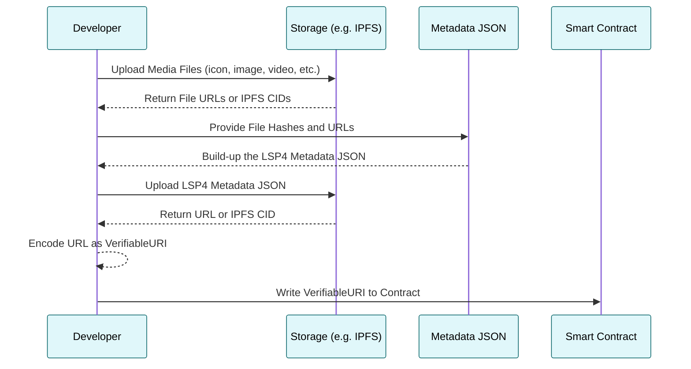

# Metadata Preparation

:::info LSP4 Metadata

When creating or editing Universal Profiles or Digital Assets, you will first need to upload assets such as images, icons, videos, etc. These assets can then be linked within the [Metadata JSON File](/standards/tokens/LSP4-Digital-Asset-Metadata.md) that will be attached to the smart contract.

:::

This guide will walk you through all necessary steps to prepare the asset data.

## Metadata Preparation Flow

To set the metadata of a digital asset, you have to follow these steps:

1. Upload each media file (icon, picture, image, video, etc) and get it's `URLs` or `IPFS CID`.
2. Inside the [LSP4 Metadata JSON file](https://github.com/lukso-network/LIPs/blob/main/LSPs/LSP-4-DigitalAsset-Metadata.md#lsp4metadata) , set the following values under each `"images"`:
   - under `verification.data`, set the hash of the media file.
   - under `url`, set the value `ipfs://<IPFS CID>` (obtained from Step 1)
3. Upload the [LSP4 Metadata JSON file](https://github.com/lukso-network/LIPs/blob/main/LSPs/LSP-4-DigitalAsset-Metadata.md) to get its `URL` or `IPFS CID`.
4. Encode the LSP4 Metadata JSON file URL as a `VerifiableURI`.
5. Write the **reference to the JSON file** to your token contract.



## 1 - File Uploads

:::tip Storage Solution

LSPs do not restrict you to a specific storage solution.

:::

To upload the files (assets and metadata JSON file), you have mainly two options:

| Solution              | Description                                                                                                                                                                                                                                                                 | Examples                                                                                                                                |
| --------------------- | --------------------------------------------------------------------------------------------------------------------------------------------------------------------------------------------------------------------------------------------------------------------------- | --------------------------------------------------------------------------------------------------------------------------------------- |
| Centralized Storage   | Centralized storage solutions are user-friendly and can be a good starting point for those new to the ecosystem or participating in hackathons. However, they rely on a single point of control, which may not align with the decentralized ethos of blockchain technology. | [AWS S3](https://aws.amazon.com/s3/), [Google Cloud](https://cloud.google.com/storage?hl=en), [Dropbox](https://www.dropbox.com/), etc. |
| Decentralized Storage | Decentralized storage solutions align with the decentralized nature of blockchain and offer benefits like _redundancy_, _censorship resistance_, and _permanent storage_. However, they might be more complex to interact with.                                             | [IPFS](https://ipfs.tech/), [Arweave](https://www.arweave.org/), [Filecoin](https://filecoin.io/), etc.                                 |

:::info Uploading files to IPFS

See our guide [**"Use IPFS Storage"**](../../other-guides/utilize-ipfs-storage.md) to learn how to upload your files to IPFS using the LUKSO [`tools-data-providers`](https://github.com/lukso-network/tools-data-providers) library.

<!-- To upload your metadata to IPFS using the Cascade and Sense Protocol, you can visit [Cascade and Sense Support](./cascade-and-sense-support.md) guide. -->

:::

## 2 - Generate the JSON File

The JSON content is used as input for encoding the metadata according to the [LSP4](/standards/tokens/LSP4-Digital-Asset-Metadata.md#lsp4---digital-asset-metadata) standard. After you filled your metadata file with content, upload it to a preferred storage solution.

To ensure the authenticity of the images, please **generate the hash** of the uploaded files and set them within the `"verification"` field of the JSON Metadata:

- Define **the used hash function** within the `"method"` element
- Add the **hash digest** (_e.g: 32 bytes long for keccak256_) within the `"data"` element

After uploading the media files, you can attach their links to a JSON File in the following structure:

<details>
  <summary>LSP4 Example JSON File</summary>

```js
{
    "LSP4Metadata": {
      "name": "My Token Name",
      "description": "Sample Description",
      "links": [{ "title": "My Website", "url": "https://my.website.com" }],
      "icon": [
        {
          "width": 60,
          "height": 60,
          "url": "https://mycentralised-storage.com/filename.png",
          "verification": {
            "method": "keccak256(bytes)",
            "data": "0x<hashOfTheUploadedFile>"
          }
        }
      ],
      "images": [
        [
          {
            "width": 1000,
            "height": 1000,
            "url": "https://centralised-cloud-storage.com/image.jpg",
            "verification": {
              "method": "keccak256(bytes)",
              "data": "0x<hashOfTheUploadedFile>"
            }
        },
        {
            "width": 500,
            "height": 500,
            "url": "ipfs://[IPFS-CID]",
            "verification": {
              "method": "keccak256(bytes)",
              "data": "0x<hashOfTheUploadedFile>"
            }
          }
        ]
      ],
      "assets": [],
      "attributes": [
        {
          "key": "Standard type",
          "value": "LSP",
          "type": "string"
        },
        {
          "key": "Standard number",
          "value": 4,
          "type": "number"
        }
      ]
    }
  }
```

</details>

:::warning Prettified JSON

While the example above is formatted for readability, minifying the JSON file (removing whitespace and formatting) is recommended as it makes hash verification more consistent.

:::

## 3 - Encode the LSP4 Metadata

:::tip Convenience Tool

You can use the 🛠️ [`erc725.js`](../../../tools/dapps/erc725js/getting-started.md) library
to encode the LSP4 Metadata. The tool provides all necessary LSP schemas as well as the `encodeData()` function.

:::

```js
import { ERC725 } from '@erc725/erc725.js';
import LSP4DigitalAssetSchema from '@erc725/erc725.js/schemas/LSP4DigitalAsset.json';

const LSP4JSON = {
  /* Your JSON */
};

const encodedLSP4Metadata = ERC725.encodeData(
  [
    {
      keyName: 'LSP4Metadata',
      value: {
        json: LSP4JSON,
        url: 'https://my-file-provider.com/my-file-link.json', // It can also be: ipfs://[CID]
      },
    },
  ],
  LSP4DigitalAssetSchema,
);
```

The encoded content will then look like the following:

```js title="LSP4 Encoded Contract Metadata" wordWrap=inherit
{
  keys: [
    '0x9afb95cacc9f95858ec44aa8c3b685511002e30ae54415823f406128b85b238e'
  ],
  values: [
    '0x00006f357c6a0020610be5a5ebf25a8323ed5a9d8735f78aaf97c7e3529da7249f17e1b4129636f3697066733a2f2f516d5154716865424c5a466e5155787535524473387441394a746b78665a714d42636d47643973756b587877526d'
  ]
}
```

## 4 - Adding the Metadata

After you retrieved the key and value of your [ERC725Y](/standards/erc725#erc725y-generic-data-keyvalue-store) data key, you can call the [`setData()`](../../../contracts/contracts/ERC725/ERC725.md#setdata) function of the asset to update it's metadata on the contract.

:::tip Sample Implementation

You can follow our [Deploy Token With Metadata](../../universal-profile/interactions/batch-transactions.md#deploy-a-token--set-metadata) and [Set NFT Metadata](../nft/set-nft-metadata.md) Guides to set or update contract metadata.

:::
