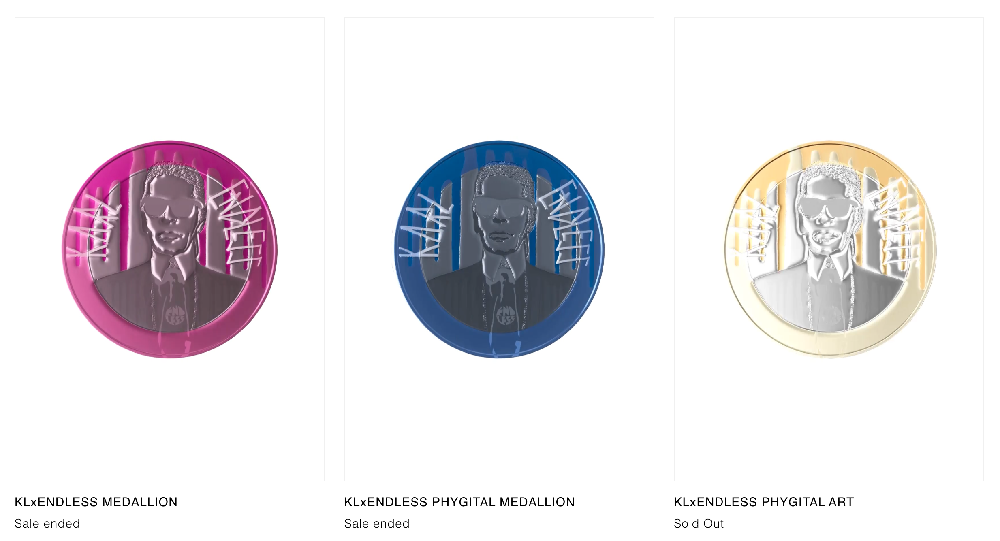
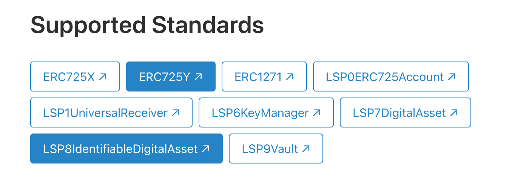

# Create NFT Collection with a contract address as tokenId

:::note

This guide builds on top of a Hardhat project using TypeScript as described in the [Getting Started](../getting-started.md) section.

:::

:::tip

The full code of this example can be found in the smart contract section of the 👾 [`lukso-playground`](https://github.com/lukso-network/lukso-playground) repository.

:::

## Introduction

If you have been looking at the [LSP8 token standard](../../../standards/tokens/LSP8-Identifiable-Digital-Asset.md), you probably noticed that addresses could be used as `tokenIds`. In this guide, we will replicate a real-world example where this could be useful to represent an NFT / `tokenId` as a smart contract with its own metadata.

## Use Case

Let's take the example of [The Dematerialised](https://thedematerialised.com), and more precisely their KLxENDLESS PHYGITAL COLLECTION. As you can see in the picture below, we have three medallions of different colours.



Each medallion has a supply limit and each medallion collection has its own metadata with different attributes. What we will do is create an [LSP8 collection](../../../standards/tokens//LSP8-Identifiable-Digital-Asset.md) that will represent the whole KLxENDLESS PHYSITAL collection and each medallion will be a sub-collection (purple, blue or gold) will with a limited supply of NFTs [(Non-divisible LSP7 token)](../../../standards/tokens//LSP7-Digital-Asset.md).

## Create the LSP7 Sub-Collection

Even though it seems a little bit counter-intuitive, we will start by creating a sub-collection using an LSP7 token. The reason is that the LSP8 collection will be in charge of deploying the LSP7 sub-collection tokens.

### Specify what needs to be set at deployment

To create the LSP7 Sub-Collection contract, we will need to know the parameters to be set at deployment. In our case, we want to set the following:

- the name of the sub-collection
- the symbol of the sub-collection
- the address of the [`owner()`](../../../../docs/contracts/contracts/LSP7DigitalAsset/LSP7DigitalAsset.md) that will control the sub-collection contract (in our case this will the LSP8 collection contract)
- the initial receiver of the tokens that will be minted at deployment (could be the token creator)
- the number of tokens that will be minted at deployment
- whether the token is divisible or not
- the total supply of the token
- the [Token Type](../../../standards/tokens/LSP4-Digital-Asset-Metadata.md#types-of-digital-assets)
- the [LSP4 Metadata](https://github.com/lukso-network/LIPs/blob/main/LSPs/LSP-4-DigitalAsset-Metadata.md#lsp4metadata)

This is just an example. You can adjust these parameters according to your needs or define other deployment parameters such as the [LSP4 Creators array](https://github.com/lukso-network/LIPs/blob/main/LSPs/LSP-4-DigitalAsset-Metadata.md#lsp4creators).

### Imports

Let's start creating an `LSP7SubCollection.sol` file in the `contracts/` folder and import:

- the [`LSP7DigitalAsset.sol`](https://github.com/lukso-network/lsp-smart-contracts/blob/develop/contracts/LSP7DigitalAsset/LSP7DigitalAsset.sol) contract
- the [`LSP4DigitalAssetMetadata.sol`](https://github.com/lukso-network/lsp-smart-contracts/blob/develop/contracts/LSP4DigitalAssetMetadata/LSP4DigitalAssetMetadata.sol) contract
- the [`_LSP4_SUPPORTED_STANDARDS_KEY`](../../../standards//tokens/LSP4-Digital-Asset-Metadata.md#supportedstandardslsp4digitalasset) constant
- the [`_LSP4_SUPPORTED_STANDARDS_VALUE`](../../../standards//tokens/LSP4-Digital-Asset-Metadata.md#supportedstandardslsp4digitalasset) constant
- the [`_LSP4_METADATA_KEY`](../../../standards//tokens/LSP4-Digital-Asset-Metadata.md#lsp4metadata) constant
- the [`_LSP8_REFERENCE_CONTRACT`](https://github.com/lukso-network/LIPs/blob/main/LSPs/LSP-8-IdentifiableDigitalAsset.md#lsp8referencecontract) constant

<!-- prettier-ignore-start -->
```typescript title="contracts/LSP7SubCollection.sol"
import { LSP7DigitalAsset } from '@lukso/lsp-smart-contracts/contracts/LSP7DigitalAsset/LSP7DigitalAsset.sol';
import { LSP4DigitalAssetMetadata } from '@lukso/lsp-smart-contracts/contracts/LSP4DigitalAssetMetadata/LSP4DigitalAssetMetadata.sol';
import {
  _LSP4_SUPPORTED_STANDARDS_KEY,
  _LSP4_SUPPORTED_STANDARDS_VALUE,
  _LSP4_METADATA_KEY
} from '@lukso/lsp-smart-contracts/contracts/LSP4DigitalAssetMetadata/LSP4Constants.sol';
import { _LSP8_REFERENCE_CONTRACT } from '@lukso/lsp-smart-contracts/contracts/LSP8IdentifiableDigitalAsset/LSP8Constants.sol';
```

<!-- prettier-ignore-end -->

### Contract

At deployment, we will need to set the following parameters:

- `name_`: the name of the token
- `symbol_`: the symbol of the token
- `owner_`: the address that will be able to update the contract metadata (except the symbol, name and the LSP4TokenType)
- `receiverOfInitialTokens_`: the address that will receive the minted tokens at deployment
- [`lsp4TokenType_`](../../../standards/tokens/LSP4-Digital-Asset-Metadata.md#lsp4tokentype): the token type of the token
- [`isNonDivisible_`](../../../contracts/contracts/LSP7DigitalAsset/LSP7DigitalAsset.md#decimals): whether the token is divisible or not
- `totalSupply_`: the total supply of the token
- `lsp4MetadataURI_`: the [LSP4 Metadata](../../../standards//tokens/LSP4-Digital-Asset-Metadata.md#lsp4metadata)

```sol title="contracts/LSP7SubCollection.sol"
contract LSP7SubCollection is LSP7DigitalAsset {
    constructor(
        string memory name_,
        string memory symbol_,
        address newOwner_,
        address receiverOfInitialTokens_,
        uint256 lsp4TokenType_,
        bool isNonDivisible_,
        uint256 totalSupply_,
        bytes memory lsp4MetadataURI_
    )
        LSP7DigitalAsset(
            name_,
            symbol_,
            newOwner_,
            lsp4TokenType_,
            isNonDivisible_
        )
    {
        // set LSP8ReferenceContract
        LSP4DigitalAssetMetadata._setData(
            _LSP8_REFERENCE_CONTRACT,
            abi.encodePacked(
                msg.sender,
                bytes32(uint256(uint160(address(this))))
            )
        );

        // set the lsp4MetadataURI
        _setData(_LSP4_METADATA_KEY, lsp4MetadataURI_);

        // mint all tokens to the receiver of the initial tokens
        _mint(receiverOfInitialTokens_, totalSupply_, true, "");
    }

}
```

### Override the `_setData` function

As per the [`LSP8IdentifiableDigitalAsset`](https://github.com/lukso-network/LIPs/blob/main/LSPs/LSP-8-IdentifiableDigitalAsset.md#lsp8referencecontract) standard, the `LSP8ReferenceContract` data key should only be set once and not be modifiable. For this reason, we will need to override the `_setData(...)`function.

```sol title="contracts/LSP7SubCollection.sol"
contract LSP7SubCollection is LSP7DigitalAssetCore, LSP4DigitalAssetMetadata {
    // previous code

    // override the _setData function so that the LSP8ReferenceContract is not editable
    function _setData(
        bytes32 dataKey,
        bytes memory dataValue
    ) internal override {
        require(
            dataKey != _LSP8_REFERENCE_CONTRACT,
            "LSP8ReferenceContractNotEditable"
        );
        LSP4DigitalAssetMetadata._setData(dataKey, dataValue);
    }
}
```

### Final LSP7 Sub-collection contract

<details>
<summary>Click to expand/collapse the script.</summary>

```sol title="contracts/LSP7SubCollection.sol"
// SPDX-License-Identifier: MIT
pragma solidity ^0.8.20;

import {LSP7DigitalAsset} from "@lukso/lsp-smart-contracts/contracts/LSP7DigitalAsset/LSP7DigitalAsset.sol";
import {LSP4DigitalAssetMetadata} from "@lukso/lsp-smart-contracts/contracts/LSP4DigitalAssetMetadata/LSP4DigitalAssetMetadata.sol";
import {_LSP4_SUPPORTED_STANDARDS_KEY, _LSP4_SUPPORTED_STANDARDS_VALUE, _LSP4_METADATA_KEY} from "@lukso/lsp-smart-contracts/contracts/LSP4DigitalAssetMetadata/LSP4Constants.sol";
import {_LSP8_REFERENCE_CONTRACT} from "@lukso/lsp-smart-contracts/contracts/LSP8IdentifiableDigitalAsset/LSP8Constants.sol";

contract LSP7SubCollection is LSP7DigitalAsset {
    constructor(
        string memory name_,
        string memory symbol_,
        address newOwner_,
        address receiverOfInitialTokens_,
        uint256 lsp4TokenType_,
        bool isNonDivisible_,
        uint256 totalSupply_,
        bytes memory lsp4MetadataURI_
    )
        LSP7DigitalAsset(
            name_,
            symbol_,
            newOwner_,
            lsp4TokenType_,
            isNonDivisible_
        )
    {

        // set LSP8ReferenceContract
        LSP4DigitalAssetMetadata._setData(
            _LSP8_REFERENCE_CONTRACT,
            abi.encodePacked(
                msg.sender,
                bytes32(uint256(uint160(address(this))))
            )
        );

        // set the lsp4MetadataURI
        _setData(_LSP4_METADATA_KEY, lsp4MetadataURI_);

        // mint all tokens to the receiver of the initial tokens
        _mint(receiverOfInitialTokens_, totalSupply_, true, "");
    }

    // override the _setData function so that the LSP8ReferenceContract is not editable
    function _setData(
        bytes32 dataKey,
        bytes memory dataValue
    ) internal override {
        require(
            dataKey != _LSP8_REFERENCE_CONTRACT,
            "LSP8ReferenceContractNotEditable"
        );
        LSP4DigitalAssetMetadata._setData(dataKey, dataValue);
    }
}

```

</details>

## Create the LSP8 Collection

Now that we have the LSP7 Sub-Collection, we can create the [LSP8 Collection](../../../standards/tokens/LSP8-Identifiable-Digital-Asset.md#lsp8-collection-vs-tokenid-metadata).

### Specify what the LSP8 Collection will need to do

The LSP8 Collection will be in charge of creating new Sub-Collections. It will do this by deploying a new LSP7 Sub-Collection and mint the initial supply of NFTs for the sub-collection. When minting the NFTs (as LSP7 tokens), the address of the deployed LSP7 sub-collection will be set as a `tokenId` within the LSP8 Collection.

For this reason, when minting a new token on the LSP8 contract (a new LSP7 Sub-collection contract), we will need to set the following:

- the `name` of the LSP7 Sub-Collection
- the `symbol` of the LSP7 Sub-Collection
- the [`lsp4TokenType`](../../../standards/tokens/LSP7-Digital-Asset.md##lsp4tokentype) of the LSP7 Sub-Collection
- the `isNonDivisible` of the LSP7 Sub-Collection
- the `totalSupply` of the LSP7 Sub-Collection
- the `receiver` of the initial tokens of the LSP7 Sub-Collection

### Imports

Let's start creating an `LSP8Collection.sol` file in the `contracts/` folder and import: :

- the [`LSP8IdentifiableDigitalAsset.sol`](https://github.com/lukso-network/lsp-smart-contracts.git) from which we will inherit the main functionalities of the LSP8
- the `_LSP8_TOKENID_FORMAT_ADDRESS` which is the format of the tokenId of the LSP8 Collection
- the [`_LSP4_METADATA_KEY`](../../../standards//tokens/LSP4-Digital-Asset-Metadata.md#lsp4metadata) constant
- the `LSP7SubCollection` contract we just created so that we can use it in our `mint(...)` function

```typescript title="contracts/LSP8Collection.sol"
import { LSP8IdentifiableDigitalAsset } from '@lukso/lsp-smart-contracts/contracts/LSP8IdentifiableDigitalAsset/LSP8IdentifiableDigitalAsset.sol';
import { _LSP8_TOKENID_FORMAT_ADDRESS } from '@lukso/lsp-smart-contracts/contracts/LSP8IdentifiableDigitalAsset/LSP8Constants.sol';
import { _LSP4_METADATA_KEY } from '@lukso/lsp-smart-contracts/contracts/LSP4DigitalAssetMetadata/LSP4Constants.sol';
import { LSP7SubCollection } from './LSP7SubCollection.sol';
```

### Contract

#### Constructor

The constructor will be in charge of setting the following parameters:

- `name_`: the name of the LSP8 Collection
- `symbol_`: the symbol of the LSP8 Collection
- `newOwner_`: the owner of the LSP8 Collection that will be able change the contract metadata and mint new LSP7 tokens
- [`lsp4TokenType_`](../../../standards/tokens/LSP7-Digital-Asset.md##lsp4tokentype) of the LSP7 Sub-Collection
- `lsp8CollectionIdFormat`: the [format of the tokenId](https://github.com/lukso-network/LIPs/blob/main/LSPs/LSP-8-IdentifiableDigitalAsset.md#lsp8Collectionidformat) of the LSP8 Collection
- `lsp4MetadataURI_`: the [LSP4 Metadata](../../../standards//tokens/LSP4-Digital-Asset-Metadata.md#lsp4metadata)

```sol title="contracts/LSP8Collection.sol"
contract LSP8Collection is LSP8IdentifiableDigitalAsset {
    constructor(
        string memory name_,
        string memory symbol_,
        address newOwner_,
        uint256 lsp4TokenType_,
        bytes memory lsp4MetadataURI_
    )
        LSP8IdentifiableDigitalAsset(
            name_,
            symbol_,
            newOwner_,
            lsp4TokenType_,
            _LSP8_TOKENID_FORMAT_ADDRESS
        )
    {
        // set the lsp4MetadataURI
        _setData(_LSP4_METADATA_KEY, lsp4MetadataURI_);
    }
}
```

#### Mint function

Now let's implement the `mint(...)` function. This function will only be callable by the owner of the contract and will be in charge of deploying the LSP7 Sub-Collections as well as minting the LSP8 tokenId that will represent the LSP7 Sub-Collection.

```sol title="contracts/LSP8Collection.sol"
contract LSP8Collection is LSP8IdentifiableDigitalAsset {

  // previous code

    function mint(
        string memory nameOfLSP7_,
        string memory symbolOfLSP7_,
        uint256 lsp4TokenType_,
        bool isNonDivisible_,
        uint256 totalSupplyOfLSP7_,
        address receiverOfInitialTokens_,
        bytes memory lsp4MetadataURIOfLSP7_
    ) public onlyOwner returns (address lsp7SubCollectionAddress) {
        // deploy the LSP7SubCollection and set the address as tokenId
        LSP7SubCollection lsp7SubCollection = new LSP7SubCollection(
            nameOfLSP7_,
            symbolOfLSP7_,
            address(this), // owner of the LSP7SubCollection is this contract (LSP8Collection contract)
            receiverOfInitialTokens_,
            lsp4TokenType_,
            isNonDivisible_,
            totalSupplyOfLSP7_,
            lsp4MetadataURIOfLSP7_
        );

        lsp7SubCollectionAddress = address(lsp7SubCollection);

        // convert the address of the LSP7SubCollection to bytes32 to use it as tokenId
        bytes32 tokenId = bytes32(uint256(uint160(lsp7SubCollectionAddress)));

        /*
          owner of the tokenId is this contract
          tokenId is the address of the newly deployed LSP7SubCollection
          force is true since here the owner of the tokenId is this contract
          data is empty
        */
        _mint(address(this), tokenId, true, "");
    }
}
```

### Override the `_setDataForTokenId` & `_getDataForTokenId` functions

Since we are inheriting from the `LSP8IdentifiableDigitalAsset.sol` contract, we will need to override the [`setDataForTokenId`](https://github.com/lukso-network/LIPs/blob/main/LSPs/LSP-8-IdentifiableDigitalAsset.md#setdatafortokenid) & [`getDataForTokenId`](https://github.com/lukso-network/LIPs/blob/main/LSPs/LSP-8-IdentifiableDigitalAsset.md#getdatafortokenid) functions (same for the batch functions). These functions will be in charge of setting and getting the metadata of the deployed LSP7 Sub-Collection. In this particular case, it will make more sense to directly call on the [`setData(...)`](../../../contracts/contracts/LSP4DigitalAssetMetadata/LSP4DigitalAssetMetadata.md#setData) and [`getData(...)`](../../../contracts/contracts/LSP4DigitalAssetMetadata/LSP4DigitalAssetMetadata.md#getData) functions of the LSP7 Sub-Collection contract.

```sol title="contracts/LSP8Collection.sol"
contract LSP8Collection is LSP8IdentifiableDigitalAsset {

    // previous code

    // override the _setDataForTokenId function to set the data on the LSP7SubCollection itself
    function _setDataForTokenId(
        bytes32 tokenId,
        bytes32 dataKey,
        bytes memory dataValue
    ) internal override {
        // setData on the LSP7SubCollection
        LSP7SubCollection(payable(address(uint160(uint256(tokenId))))).setData(
            dataKey,
            dataValue
        );

        emit TokenIdDataChanged(tokenId, dataKey, dataValue);
    }

    // override the _getDataForTokenId function to get the data from the LSP7SubCollection itself
    function _getDataForTokenId(
        bytes32 tokenId,
        bytes32 dataKey
    ) internal view override returns (bytes memory dataValues) {
        return
            LSP7SubCollection(payable(address(uint160(uint256(tokenId))))).getData(
                dataKey
            );
    }
}
```

### Final LSP8 Collection contract

<details>
<summary>Click to expand/collapse the script.</summary>

```sol title="contracts/LSP8Collection.sol"
// SPDX-License-Identifier: MIT
pragma solidity ^0.8.20;

import {LSP8IdentifiableDigitalAsset} from "@lukso/lsp-smart-contracts/contracts/LSP8IdentifiableDigitalAsset/LSP8IdentifiableDigitalAsset.sol";
import { _LSP8_TOKENID_FORMAT_ADDRESS } from '@lukso/lsp-smart-contracts/contracts/LSP8IdentifiableDigitalAsset/LSP8Constants.sol';
import {_LSP4_METADATA_KEY} from "@lukso/lsp-smart-contracts/contracts/LSP4DigitalAssetMetadata/LSP4Constants.sol";
import {LSP7SubCollection} from "./LSP7SubCollection.sol";

contract LSP8Collection is LSP8IdentifiableDigitalAsset {
    constructor(
        string memory name_,
        string memory symbol_,
        address newOwner_,
        uint256 lsp4TokenType_,
        bytes memory lsp4MetadataURI_
    )
        LSP8IdentifiableDigitalAsset(
            name_,
            symbol_,
            newOwner_,
            lsp4TokenType_,
            _LSP8_TOKENID_FORMAT_ADDRESS
        )
    {
        // set the lsp4MetadataURI
        _setData(_LSP4_METADATA_KEY, lsp4MetadataURI_);
    }

    function mint(
        string memory nameOfLSP7_,
        string memory symbolOfLSP7_,
        uint256 lsp4TokenType_,
        bool isNonDivisible_,
        uint256 totalSupplyOfLSP7_,
        address receiverOfInitialTokens_,
        bytes memory lsp4MetadataURIOfLSP7_
    ) public onlyOwner returns (address lsp7SubCollectionAddress) {
        // deploy the LSP7SubCollection and set the address as tokenId
        LSP7SubCollection lsp7SubCollection = new LSP7SubCollection(
            nameOfLSP7_,
            symbolOfLSP7_,
            address(this), // owner of the LSP7SubCollection is this contract (LSP8Collection contract)
            receiverOfInitialTokens_,
            lsp4TokenType_,
            isNonDivisible_,
            totalSupplyOfLSP7_,
            lsp4MetadataURIOfLSP7_
        );

        lsp7SubCollectionAddress = address(lsp7SubCollection);

        // convert the address of the LSP7SubCollection to bytes32 to use it as tokenId
        bytes32 tokenId = bytes32(uint256(uint160(lsp7SubCollectionAddress)));

        /*
          owner of the tokenId is this contract
          tokenId is the address of the newly deployed LSP7SubCollection
          force is true since here the owner of the tokenId is this contract
          data is empty
        */
        _mint(address(this), tokenId, true, "");
    }

    // override the _setDataForTokenId function to set the data on the LSP7SubCollection itself
    function _setDataForTokenId(
        bytes32 tokenId,
        bytes32 dataKey,
        bytes memory dataValue
    ) internal override {
        // setData on the LSP7SubCollection
        LSP7SubCollection(payable(address(uint160(uint256(tokenId))))).setData(
            dataKey,
            dataValue
        );

        emit TokenIdDataChanged(tokenId, dataKey, dataValue);
    }

    // override the _getDataForTokenId function to get the data from the LSP7SubCollection itself
    function _getDataForTokenId(
        bytes32 tokenId,
        bytes32 dataKey
    ) internal view override returns (bytes memory dataValues) {
        return
            LSP7SubCollection(payable(address(uint160(uint256(tokenId))))).getData(
                dataKey
            );
    }
}
```

</details>

## Scripts

Now that we have the contracts ready to be deployed, let's create a script that will deploy the LSP8 Collection and one script that will mint the LSP7 Sub-Collections.

:::note

Please make sure you compile your newly created contracts before creating the scripts with `npx hardhat compile`.
Since the contracts are quite big, you may run into a compilation error. If this is the case, update your compiler settings in `hardhat.config.ts` with different optimizer settings. We used the following value to compile the contracts:

```typescript title="hardhat.config.ts"
  solidity: {
    version: "0.8.20",
    settings: {
      optimizer: {
        enabled: true,
        runs: 200,
      },
    },
  }
```

:::

### Create the metadata JSONs files

:::note

In this part we will not cover the part where you first need to upload your JSONs files on IPFS and retrieve their CIDs.
We have done it and will add them directly in the following scripts files.

:::

Let's start by creating a `lsp8CollectionMetadata.json` file in the `metadata/` folder and set the following metadata:

<details>
  <summary>Click to see the <code>lsp8CollectionMetadata.json</code> file</summary>

```json title="./metadata/lsp8CollectionMetadata.json"
{
  "LSP4Metadata": {
    "name": "The Dematerialised",
    "description": "The Experiential Marketspace For Digital Goods",
    "links": [
      {
        "title": "Website",
        "url": "https://thedematerialised.com"
      }
    ],
    "icons": [],
    "images": [
      {
        "width": 1024,
        "height": 974,
        "url": "ipfs://QmS3jF9jsoG6gnyJ7wCeJ4bej2aJEnPSv527UV8KxjBDAA",
        "verification": {
          "method": "keccak256(bytes)",
          "data": "0xdd6b5fb6dc984fda0222fb6f6e96b471c0667b12f03b1e804f7b5e6ab62acdb0"
        }
      }
    ],
    "assets": [],
    "attributes": []
  }
}
```

</details>

We will do the same with the LSP7 Sub-Collection metadata. Let's create a `lsp7SubCollectionMetadata.json` file in the `metadata` folder and set the following metadata:

<details>
  <summary>Click to see the <code>lsp7SubCollectionMetadata.json</code> file</summary>

```json title="./metadata/lsp7SubCollectionMetadata.json"
{
  "LSP4Metadata": {
    "name": "KLxENDLESS MEDALLION Purple",
    "description": "Collaboration with Karl Largerfeld",
    "links": [
      {
        "title": "Get yours now",
        "url": "https://thedematerialised.com/shop/karl-lagerfeld/klxendless-medallion"
      }
    ],
    "icons": [
      {
        "width": 256,
        "height": 256,
        "url": "ipfs://QmS3jF9jsoG6gnyJ7wCeJ4bej2aJEnPSv527UV8KxjBDAA",
        "verification": {
          "method": "keccak256(bytes)",
          "data": "0xdd6b5fb6dc984fda0222fb6f6e96b471c0667b12f03b1e804f7b5e6ab62acdb0"
        }
      }
    ],
    "images": [
      [
        {
          "width": 1024,
          "height": 974,
          "url": "ipfs://QmUGmycxrwFec15UC41v9bvnRStK3zxR7mth72mGRcUSPD",
          "verification": {
            "method": "keccak256(bytes)",
            "data": "0x951bf983a4b7bcebc5c0b00a5e783630dcb788e95ee9e44b0b7d4bde4a0b4d81"
          }
        }
      ]
    ],
    "assets": [
      {
        "verification": {
          "method": "keccak256(bytes)",
          "data": "0x88f3d704f3d534267c564019ce2b70a5733d070e71bf2c1f85b5fc487f47a46f"
        },
        "url": "ipfs://QmTDQGR26dSd3c4qJpmFwTh7gNRPnNbBf2Fg3gULypUag3",
        "fileType": "mp4"
      }
    ],
    "attributes": []
  }
}
```

</details>

### Deploy the LSP8 Collection script

Let's create a `deployLSP8Collection.ts` file in the `scripts` folder.

#### Imports

For this script we will jut need to import:

- the `ethers` library to interact with the blockchain
- the [`@erc725/erc725.js`](../getting-started.md) library to convert the metadata to [VerifiableURI](https://github.com/lukso-network/LIPs/blob/main/LSPs/LSP-2-ERC725YJSONSchema.md#verifiableuri)
- the LSP8 Collection metadata json file we just created
- the LSP4 metadata schema

```typescript title="scripts/deployLSP8Collection.ts"
import { ethers } from 'hardhat';

import { ERC725, ERC725JSONSchema } from '@erc725/erc725.js';
import LSP4DigitalAsset from '@erc725/erc725.js/schemas/LSP4DigitalAsset.json';
import lsp8CollectionMetadata from './metadata/lsp8CollectionMetadata.json';
```

#### Constants

We will need to set:

- the `lsp8CollectionMetadataCID` constant that is the IPFS CID of the LSP8 Collection metadata file we just created

<!-- prettier-ignore-start -->

```typescript
const lsp8CollectionMetadataCID = 'ipfs://QmcwYFhGP7KBo1a4EvbBxuvDf3jQ2bw1dfMEovATRJZetX';
```

<!-- prettier-ignore-end -->

#### Deploy the LSP8 Collection

Let's create a `main()` function that will be in charge of deploying the LSP8 Collection.

```typescript
async function main() {
  // get LSP8Collection contract factory
  const LSP8Collection = await ethers.getContractFactory('LSP8Collection');

  // get the deployer address so we can assign ownership to it
  const [deployer] = await ethers.getSigners();

  // convert the lsp8CollectionMetadata to a verifiable uri
  const erc725 = new ERC725(LSP4DigitalAsset as ERC725JSONSchema);
  const encodeMetadata = erc725.encodeData([
    {
      keyName: 'LSP4Metadata',
      value: {
        json: lsp8CollectionMetadata,
        url: lsp8CollectionMetadataCID,
      },
    },
  ]);

  // deploy LSP8Collection contract
  const lsp8Collection = await LSP8Collection.deploy(
    'MyToken0',
    'MT0',
    // will be the owner of the LSP8Collection contract
    deployer.address,
    // lsp4TokenType is address - see https://github.com/lukso-network/LIPs/blob/main/LSPs/LSP-4-DigitalAsset-Metadata.md#lsp4tokentype
    2,
    // encoded metadata
    encodeMetadata.values[0],
  );

  // wait until the contract is mined
  await lsp8Collection.waitForDeployment();

  // print contract address
  console.log('LSP8Collection deployed to:', await lsp8Collection.getAddress());
}
```

#### Final script

<details>
<summary>Click to expand/collapse the script.</summary>

```typescript
import { ethers } from 'hardhat';
import { ERC725 } from '@erc725/erc725.js';
import LSP4DigitalAsset from '@erc725/erc725.js/schemas/LSP4DigitalAsset.json';
import lsp8CollectionMetadata from './metadata/lsp8CollectionMetadata.json';

const lsp8CollectionMetadataCID =
  'ipfs://QmcwYFhGP7KBo1a4EvbBxuvDf3jQ2bw1dfMEovATRJZetX';

async function main() {
  // get LSP8Collection contract factory
  const LSP8Collection = await ethers.getContractFactory('LSP8Collection');

  // get the deployer address so we can assign ownership to it
  const [deployer] = await ethers.getSigners();

  // convert the lsp8CollectionMetadata to a verifiable uri
  const erc725 = new ERC725(LSP4DigitalAsset, '', '', {});
  const encodeMetadata = erc725.encodeData([
    {
      keyName: 'LSP4Metadata',
      value: {
        json: lsp8CollectionMetadata,
        url: lsp8CollectionMetadataCID,
      },
    },
  ]);

  // deploy LSP8Collection contract
  const lsp8Collection = await LSP8Collection.deploy(
    'MyToken0',
    'MT0',
    // will be the owner of the LSP8Collection contract
    deployer.address,
    // lsp4TokenType is address - see https://github.com/lukso-network/LIPs/blob/main/LSPs/LSP-4-DigitalAsset-Metadata.md#lsp4tokentype
    2,
    // tokenId format is address - see https://github.com/lukso-network/LIPs/blob/main/LSPs/LSP-8-IdentifiableDigitalAsset.md#lsp8Collectionidformat
    2,
    // encoded metadata
    encodeMetadata.values[0],
  );

  // wait until the contract is mined
  await lsp8Collection.waitForDeployment();

  // print contract address
  console.log('LSP8Collection deployed to:', await lsp8Collection.getAddress());
}

main().catch((error) => {
  console.error(error);
  process.exitCode = 1;
});
```

</details>

#### Run the script

Let's run the script using `npx hardhat run scripts/deployLSP8Collection.ts --network <nameOfNetwork>`.

:::note

The deployed contract address should be printed in the console. Make sure to copy it as we will need it for the next script.

:::

#### Check the deployed contract

If you happen to have deployed the contract on one of our network (Testnet or Mainnet), you can check the contract on our [ERC725 Inspect tool](https://erc725-inspect.lukso.tech/inspector).
By pasting the address of the contract, you should see that it supports:

- [ERC725Y](/standards/metadata/lsp2-json-schema.md)
- [LSP8IdentifiableDigitalAsset](/standards/tokens/LSP8-Identifiable-Digital-Asset.md)



### Mint the LSP7 Sub-Collections script

Let's create a `mintLSP7SubCollections.ts` file in the `scripts`.

#### Imports

For this script we will just need to import:

- the `ethers` library to interact with the blockchain
- the ERC725 library to convert the metadata
- the LSP7 Sub-Collection metadata json file
- the LSP4 metadata schema

```typescript
import { ethers } from 'hardhat';
import { ERC725, ERC725JSONSchema } from '@erc725/erc725.js';
import lsp7SubCollectionMetadata from './metadata/lsp7SubCollectionMetadata.json';
import LSP4DigitalAsset from '@erc725/erc725.js/schemas/LSP4DigitalAsset.json';
```

#### Constants

For this script, we will need to set the following constants:

- `lsp8CollectionContractAddress`: the address of the LSP8 Collection contract we just deployed
- `lsp7SubCollectionName`: the name of the LSP7 Sub-Collection we want to mint
- `lsp7SubCollectionSymbol`: the symbol of the LSP7 Sub-Collection we want to mint
- `lsp7SubCollectionType`: the token type of the LSP7 Sub-Collection we want to mint
- `lsp7SubCollectionIsNonDivisible`: whether the LSP7 Sub-Collection we want to mint is divisible or not
- `lsp7SubcollectionTotalSupply`: the total supply of the LSP7 tokens we want to mint
- `lsp7SubCollectionMetadataCID`: the IPFS CID of the LSP7 Sub-Collection metadata file we just created

<!-- prettier-ignore-start -->

```typescript
const lsp8CollectionContractAddress = '0x567B9322500069725db0169C362dc4e939934c8b';
const lsp7SubCollectionName = 'KLxENDLESS MEDALLION Purple';
const lsp7SubCollectionSymbol = 'KLxENDLESS MEDALLION';
const lsp7SubCollectionType = 2;
const lsp7SubCollectionIsNonDivisible = true; // decimals will be 0
const lsp7SubCollectionSupply = 50; // Create 50 NFTs in the sub-collection
const lsp7SubCollectionMetadataCID = 'ipfs://QmXrrkZwfKWK4yqaagoKPHhH148oXLgWoncFuh5d8ugsQL;';
```

<!-- prettier-ignore-end -->

### Mint the LSP7 Sub-Collections

Let's create a `main()` function that will be in charge of minting the LSP7 Sub-Collection.

```typescript
async function main() {
  // get LSP8Collection contract
  const lsp8CollectionContract = await ethers.getContractAt(
    'LSP8Collection',
    lsp8CollectionContractAddress,
  );

  // convert the lsp4TokenMetadata to a verifiable uri
  const erc725 = new ERC725(LSP4DigitalAsset);
  const encodedMetadata = erc725.encodeData(
    [
      {
        keyName: 'LSP4Metadata',
        value: {
          json: lsp7SubCollectionMetadata,
          url: lsp7SubCollectionMetadataCID,
        },
      },
    ],
    [],
  );

  // get deployer to set it as original receiver of the minted tokens
  const [deployer] = await ethers.getSigners();

  // get LSP7SubCollection contract address
  const lsp7ContractAddress = await lsp8CollectionContract.mint.staticCall(
    lsp7SubCollectionName,
    lsp7SubCollectionSymbol,
    lsp7SubCollectionType,
    lsp7SubCollectionIsNonDivisible,
    lsp7SubCollectionSupply,
    deployer.address,
    encodedMetadata.values[0],
  );

  // mint LSP7SubCollection
  const tx = await lsp8CollectionContract.mint(
    lsp7SubCollectionName,
    lsp7SubCollectionSymbol,
    lsp7SubCollectionType,
    lsp7SubCollectionIsNonDivisible,
    lsp7SubCollectionSupply,
    deployer.address,
    encodedMetadata.values[0],
  );

  await tx.wait();

  console.log('LSP7SubCollection deployed to:', lsp7ContractAddress);
}
```

#### Final script

<details>

<summary>Click to expand/collapse the script.</summary>

```typescript
import { ethers } from 'hardhat';
import { ERC725 } from '@erc725/erc725.js';
import lsp7SubCollectionMetadata from './metadata/lsp7SubCollectionMetadata.json';
import LSP4DigitalAsset from '@erc725/erc725.js/schemas/LSP4DigitalAsset.json';

const lsp8CollectionContractAddress =
  '0xA962b72095F7ec4b46fF195392B014E45Fd4a4dC';
const lsp7SubCollectionName = 'KLxENDLESS MEDALLION Purple';
const lsp7SubCollectionSymbol = 'KLxENDLESS MEDALLION';
const lsp7SubCollectionType = 2;
const lsp7SubCollectionIsNonDivisible = true; // decimals will be 0
const lsp7SubCollectionSupply = 50;
const lsp7SubCollectionMetadataCID =
  'ipfs://QmXrrkZwfKWK4yqaagoKPHhH148oXLgWoncFuh5d8ugsQL';

async function main() {
  // get LSP8Collection contract
  const lsp8CollectionContract = await ethers.getContractAt(
    'LSP8Collection',
    lsp8CollectionContractAddress,
  );

  // convert the lsp4TokenMetadata to a verifiable uri
  const erc725 = new ERC725(LSP4DigitalAsset, '', '', {});
  const encodedMetadata = erc725.encodeData(
    [
      {
        keyName: 'LSP4Metadata',
        value: {
          json: lsp7SubCollectionMetadata,
          url: lsp7SubCollectionMetadataCID,
        },
      },
    ],
    [],
  );

  // get deployer to set it as original receiver of the minted tokens
  const [deployer] = await ethers.getSigners();

  // get LSP7SubCollection contract address
  const lsp7ContractAddress = await lsp8CollectionContract.mint.staticCall(
    lsp7SubCollectionName,
    lsp7SubCollectionSymbol,
    lsp7SubCollectionType,
    lsp7SubCollectionIsNonDivisible,
    lsp7SubCollectionSupply,
    deployer.address,
    encodedMetadata.values[0],
  );

  // mint LSP7SubCollection
  const tx = await lsp8CollectionContract.mint(
    lsp7SubCollectionName,
    lsp7SubCollectionSymbol,
    lsp7SubCollectionType,
    lsp7SubCollectionIsNonDivisible,
    lsp7SubCollectionSupply,
    deployer.address,
    encodedMetadata.values[0],
  );

  await tx.wait();

  console.log('LSP7SubCollection deployed to:', lsp7ContractAddress);
}

// We recommend this pattern to be able to use async/await everywhere
// and properly handle errors.
main().catch((error) => {
  console.error(error);
  process.exitCode = 1;
});
```

</details>

#### Run the script

Let's run the script using `npx hardhat run scripts/mintLSP7SubCollections.ts --network <nameOfNetwork>`.

#### Check the deployed contract

If you happen to have deployed the contract on one of our network (Testnet or Mainnet), you can check the contract on our [ERC725 Inspect tool](https://erc725-inspect.lukso.tech/inspector).
By pasting the address of the contract, you should see that it supports:

- [ERC725Y](../../../standards/metadata/lsp2-json-schema.md)
- [LSP7DigitalAsset](../../../standards/tokens/LSP7-Digital-Asset.md)


## Conclusion

In this guide, we have seen how to create an LSP8 Collection that will be in charge of deploying LSP7 Sub-Collections and minting the initial supply.
This is one way of doing it and can be adapted to your needs.
