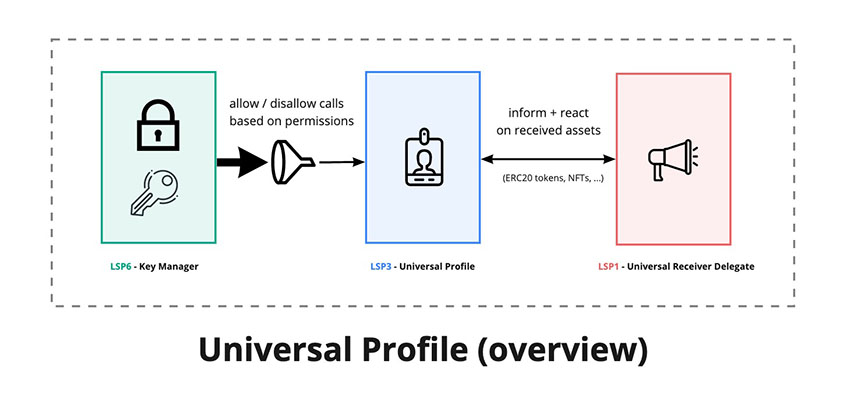

# Create a Universal Profile


:::tip

If you want to run the code as standalone JavaScript files within the terminal or the browser, you can open the [`lukso-playground`](https://github.com/lukso-network/lukso-playground) repository.

:::

## Setup

To easiest way to create a Universal Profile is through the Universal Profile Browser Extension:

- install the 🖥️ [Universal Profile Browser Extension](/install-up-browser-extension)
- and ✨ [create a Universal Profile](https://my.universalprofile.cloud)

## Introduction

### Owned Contracts

A Universal Profile is an **owned** smart contract. Ownership means that such a contract has a separate **owner**.

The Contract's owner is a blockchain `address` that can represent anything, such as:

- one or multiple Externally Owned Accounts (EOAs),
- a multi-sig wallet, or
- another smart contract that can represent anything (a DAO, a DEX, etc...).



> For more details, see [EIP-173: Contract Ownership Standard](https://eips.ethereum.org/EIPS/eip-173)

With the **Ownable** design pattern, a contract can be designed with _functionalities that only the owner can perform_. The design pattern gives the contract owner more control and privileges.

In the context of Universal Profile, _reading data from the contract storage can be done by anyone_, but **only the owner can**:

- `setData(...)` = add, edit or remove data from the [ERC725Y](../../../standards/universal-profile/lsp0-erc725account#erc725y---generic-key-value-store) storage.
- `execute(...)` = transfer LYX to addresses, call other contracts, or create and deploy new contracts (see [ERC725X](../../../standards/universal-profile/lsp0-erc725account#erc725x---generic-executor) executor)
- `transferOwnership(...)` = make an address be the new owner of the Universal Profile.

In this guide, your Universal Profile's owner will be a contract called a **Key Manager**. The [Key Manager](../../../contracts/contracts/LSP6KeyManager/LSP6KeyManager.md) is a smart contract that enables granting specific permissions to `addresses`, so that they can interact with the Universal Profile. For example, transferring LYX on behalf of the Universal Profile.

:::info Learn More
You can implement any complex ownership structure (and fine-grained control) on top of Universal Profiles. The structure includes having a UP owned and controlled by:

- one or multiple EOAs,
- one or multiple other smart contracts, or
- a mixture of both.

For more details, see [LSP6 - Key Manager Standard](../../../standards/universal-profile/lsp6-key-manager.md).
:::

### Contracts Overview


## Create an EOA

:::note Notice
You should do this step in a **temporary file**.
:::

As described in the introduction, your first need to create an EOA that will be used to control your Universal Profile.

You can easily create an EOA using the [`web3.eth.accounts.create()`](https://web3js.readthedocs.io/en/v1.5.2/web3-eth-accounts.html#create) method from web3.js.

**Instructions:** **create a temporary file** and add the code snippet below. It will generate an object that contains:

- a private key (32 bytes / 64 characters long),
- an address (20 bytes / 40 characters long), and
- some signing methods like `sign`

```javascript title="create-eoa.js (temporary file)"
import Web3 from 'web3';
const web3 = new Web3();

const myEOA = web3.eth.accounts.create();
console.log(myEOA);

/**
{
  address: "0x...",
  privateKey: "0x...",
  signTransaction: function(tx){...},
  sign: function(data){...},
  encrypt: function(password){...}
}
*/
```

> See the [Web3.js docs](https://web3js.readthedocs.io/en/v1.5.2/web3-eth-accounts.html#) for more infos on creating an EOA

## Get some LYXt

After creating an EOA that will control your Universal Profile, you will need to fund uour address with some test LYXt (the native cryptocurrency of the LUKSO Testnet blockchain). You can obtain some free test LYX via the **[Testnet Faucet](https://faucet.testnet.lukso.network)**.

**Instructions:** visit the faucet website, and **follow the instructions** to _request LYXt_.

:arrow_right: **[LUKSO Testnet Faucet Website](https://faucet.testnet.lukso.network)**


Look up your address balance in the **[LUKSO Testnet Block Explorer](https://explorer.execution.testnet.lukso.network)** to ensure you have received your test LYX.


## Create your Universal Profile

:::note Notice
You should do the rest of this tutorial in a **new file**.
:::

Now that you have created your EOA, you are ready to create your first Universal Profile.

### Load your EOA

Load your EOA in your main JS file so that you can use it to deploy your Universal Profile.

**Instructions:** import the private key that you created

```javascript title="main.js"
import Web3 from 'web3';
const web3 = new Web3();

const PRIVATE_KEY = '0x...'; // your EOA private key
const myEOA = web3.eth.accounts.privateKeyToAccount(PRIVATE_KEY);

/**
{
  address: "0x...",
  privateKey: "0x...",
  signTransaction: function(tx){...},
  sign: function(data){...},
  encrypt: function(password){...}
}
*/
```

:::danger Never expose your private key!

Your private key is what enables you to control your EOA. Therefore, it should **NEVER** be exposed.

For simplicity in this tutorial, we load the EOA using a hardcoded private key (as a literal string).<br/>
However, your private key should never be hardcoded in your code.

:warning: **ALWAYS ensure that your private key is stored securely** and never exposed.

:::

### Additional Resources

- [🎥 BuildUP #2 | Create a Universal Profile Programmatically and Read Profile Data (YouTube)](https://www.youtube.com/watch?v=K3y-wLEbyFw)
