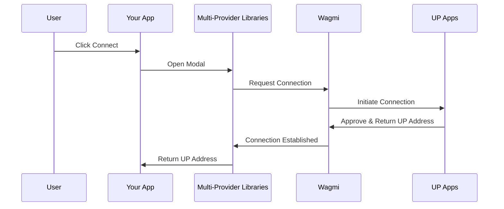

import Tabs from '@theme/Tabs';
import TabItem from '@theme/TabItem';

# Connect a Universal Profile

[Universal Profiles](../../../standards/accounts/introduction.md) can be accessed through **[UP Apps](/install-up-browser-extension)** on LUKSO. There are two primary UP Apps available:

- [Universal Profile Browser Extension](https://chromewebstore.google.com/detail/universal-profiles/abpickdkkbnbcoepogfhkhennhfhehfn) is designed for desktop users who want to interact with dApps through their web browser. It provides a seamless experience for managing Universal Profiles and connecting to decentralized applications. The extension is compatible with modern browsers and supports standard wallet connection protocols.
- [Universal Profile Mobile App](/install-up-browser-extension/#up-mobile-app) brings the power of Universal Profiles to mobile devices, allowing users to manage their profiles and interact with dApps on the go.

:::success Request Handling

The [Universal Profile Extension](/install-up-browser-extension) returns the address of the connected [Universal Profile](../../../standards/accounts/introduction.md). Making transactions is the same as with any wallet, you just use the profile address as a `from` in your transactions.

:::

Connecting to the [Universal Profile Browser Extension](https://chromewebstore.google.com/detail/universal-profiles/abpickdkkbnbcoepogfhkhennhfhehfn) will trigger the following connection screen:

<div style={{textAlign: 'center'}}>


</div>

## Connection Methods

There are multiple ways to connect a dApp to Universal Profiles, from high-level libraries to low-level provider access.

:::success Connect to UP

Choose the method that best fits your application's needs:

- **[Multi-Provider Libraries](#multi-provider-libraries)**: Best for most dApps. Provides a pre-built components and handles connection logic for multiple wallets (including Universal Profiles) automatically. Recommended for a seamless user experience.
- **[Provider Injection](#provider-injection)**: Direct access to the `window.lukso` object. Useful for simple integrations or when you want full control over the connection process without external UI libraries.
- **[EIP-6963: Provider Discovery](#eip-6963-provider-discovery)**: The modern standard for handling multiple installed wallet extensions. Solves conflicts when users have multiple wallets (e.g., MetaMask and Universal Profile Extension) installed simultaneously.

:::

### Multi-Provider Libraries

Libraries like **RainbowKit** and **ReOwn** (formerly WalletConnect) simplify dApp development by abstracting complex wallet connection logic.

The diagram below illustrates how these libraries mediate the connection flow between your application and the Universal Profile:



:::info 🛠️ Choose Your Library

Below, you can find the configuration steps for your preferred library. Both options fully support Universal Profiles and are built on top of **Wagmi**!

:::

<Tabs groupId="provider-lib" className="provider-tabs">

<TabItem value="rainbowkit" label="🌈 Wagmi + RainbowKit" default>

**Step 1: Install Dependencies**

```sh
npm install @rainbow-me/rainbowkit wagmi @tanstack/react-query
```

**Step 2: Configure Wagmi with LUKSO and RainbowKit Connectors**

Set up Wagmi configuration with LUKSO network and RainbowKit's Universal Profile wallet connector:

```js
import { WagmiProvider, createConfig, http } from 'wagmi';
import { lukso } from 'wagmi/chains';
import { connectorsForWallets } from '@rainbow-me/rainbowkit';
import { universalProfilesWallet } from '@rainbow-me/rainbowkit/wallets';
import { QueryClient, QueryClientProvider } from '@tanstack/react-query';

// Create a new QueryClient instance for React Query,
// which Wagmi uses under the hood to manage cache, background updates, and request deduplication.
// This is required to provide <QueryClientProvider> higher up in your component tree.
const queryClient = new QueryClient();

// Configure Wagmi with LUKSO network and RainbowKit connectors
const config = createConfig({
  chains: [lukso],
  transports: {
    [lukso.id]: http(),
  },
  connectors: connectorsForWallets(
    [
      {
        groupName: 'Login with Universal Profile',
        wallets: [universalProfilesWallet],
      },
    ],
    {
      appName: 'LUKSO dApp',
      projectId: 'YOUR_PROJECT_ID', // Get your project ID from WalletConnect Cloud
    },
  ),
});
```

**Step 3: Wrap Your App with Providers**

Import RainbowKit styles and wrap your application with the required providers in the correct order:

```jsx
import { RainbowKitProvider } from '@rainbow-me/rainbowkit';
import '@rainbow-me/rainbowkit/styles.css';

function App() {
  return (
    <WagmiProvider config={config}>
      <QueryClientProvider client={queryClient}>
        <RainbowKitProvider>
          {/* 
            Place your main application content here. 
            <YourAppContent />  

            This ensures that all components within <YourAppContent /> 
            have access to the connected wallet context provided by WagmiProvider,
            enabling features like reading connection state or sending transactions.
          */}
        </RainbowKitProvider>
      </QueryClientProvider>
    </WagmiProvider>
  );
}
```

**Step 4: Add the Connect Button**

Use RainbowKit's pre-built `ConnectButton` component to handle wallet connections:

```jsx
import { ConnectButton } from '@rainbow-me/rainbowkit';

function YourAppContent() {
  return (
    <div>
      <ConnectButton />
    </div>
  );
}
```

**Step 5: Access Connection State**

Use Wagmi hooks to read the connected Universal Profile details:

```js
import { useAccount, useChainId } from 'wagmi';

function YourAppContent() {
  const { address, isConnected, chain } = useAccount();
  const chainId = useChainId();

  return (
    <div>
      <ConnectButton />
      {isConnected && (
        <div>
          <p>Address: {address}</p>
          <p>Network: {chain?.name}</p>
          <p>Chain ID: {chainId}</p>
        </div>
      )}
    </div>
  );
}
```

</TabItem>

<TabItem value="reown" label="🔗 Wagmi + ReOwn (WalletConnect)">

**Step 1: Install Dependencies**

```sh
npm install @reown/appkit @reown/appkit-adapter-wagmi wagmi @tanstack/react-query
```

**Step 2: Configure the WagmiAdapter with LUKSO**

Set up the adapter with LUKSO network configuration:

```js
import { WagmiProvider } from 'wagmi';
import { createAppKit } from '@reown/appkit/react';
import { WagmiAdapter } from '@reown/appkit-adapter-wagmi';
import { lukso } from '@reown/appkit/networks';
import { QueryClient, QueryClientProvider } from '@tanstack/react-query';

// Create a new QueryClient instance for React Query,
// which Wagmi uses under the hood to manage cache, background updates, and request deduplication.
// This is required to provide <QueryClientProvider> higher up in your component tree.
const queryClient = new QueryClient();

const wagmiAdapter = new WagmiAdapter({
  projectId: 'YOUR_PROJECT_ID', // Get your project ID from ReOwn dashboard
  networks: [lukso],
  transports: {
    [lukso.id]: http('https://rpc.mainnet.lukso.network'),
  },
});
```

**Step 3: Create the AppKit Modal**

Initialize the modal with your dApp metadata and LUKSO-specific settings:

```js
const metadata = {
  name: 'LUKSO Wallet Connect',
  description: 'Connect your Universal Profile',
  url: 'https://universaleverything.io',
  icons: ['https://lukso.network/favicon.ico'],
};

createAppKit({
  adapters: [wagmiAdapter],
  projectId: 'YOUR_PROJECT_ID', // Get your project ID from ReOwn dashboard
  networks: [lukso],
  defaultNetwork: lukso,
  metadata,
  features: {
    analytics: false,
    email: false,
    socials: false,
  },
});
```

**Step 4: Wrap Your App with the Provider**

Wrap your application with the required providers in the correct order:

```jsx
function App() {
  return (
    <WagmiProvider config={wagmiAdapter.wagmiConfig}>
      <QueryClientProvider client={queryClient}>
        {/* 
        Place your main application content here. 
        <YourAppContent />  

        This ensures that all components within <YourAppContent /> 
        have access to the connected wallet context provided by WagmiProvider,
        enabling features like reading connection state or sending transactions.
      */}
      </QueryClientProvider>
    </WagmiProvider>
  );
}
```

**Step 5: Use the `Connect` button and access to connection state**

Use `Wagmi` hooks to read the connected Universal Profile details:

```js
import { useAccount, useChainId } from 'wagmi';

function YourAppContent() {
  const { address, isConnected, chain } = useAccount();
  const chainId = useChainId();

  return (
    <div>
      <appkit-button />
      {isConnected && (
        <div>
          <p>Address: {address}</p>
          <p>Network: {chain?.name}</p>
          <p>Chain ID: {chainId}</p>
        </div>
      )}
    </div>
  );
}
```

**Optional: Configure the DeepLink for UP Mobile**

DeepLink can be configured for QR login when using the UP Mobile app with _ReOwn (WalletConnect)_.

:::success Configuring DeepLink

Simply replace the `wc:` alias with `io.universaleverything.universalprofiles://wallet-connect/`:

```js
const exampleWcUri =
  'wc:8c4d7a9e5f2b3c1d@2?relay-protocol=irn&symKey=a1b2c3d4e5f6g7h8i9j0k1l2m3n4o5p6';
const exampleDeepLink = exampleWcUri.replace(
  'wc:',
  'io.universaleverything.universalprofiles://wallet-connect/',
);
```

:::

</TabItem>

</Tabs>

### Provider Injection

You can use the `window.lukso` object, tailored for a direct integration with the UP Browser Extension. This approach allows developers to engage directly with the UP Browser Extension without the need to consider compatibility with other extensions.

<Tabs groupId="provider-lib">
  <TabItem value="ethers" label="ethers"  attributes={{className: "tab_ethers"}}>

```sh
npm install ethers
```

  </TabItem>
  <TabItem value="web3" label="web3"  attributes={{className: "tab_web3"}}>

```sh
npm install web3
```

  </TabItem>
</Tabs>

<Tabs groupId="provider-lib">
  <TabItem value="ethers" label="ethers"  attributes={{className: "tab_ethers"}}>

```js
import { ethers } from 'ethers';
const provider = new ethers.BrowserProvider(window.lukso);

const accounts = await provider.send('eth_requestAccounts', []);
console.log('Connected with', accounts[0]);
```

  </TabItem>
  <TabItem value="web3" label="web3"  attributes={{className: "tab_web3"}}>

```js
import Web3 from 'web3';
const provider = new Web3(window.lukso);

const accounts = await provider.eth.requestAccounts();
console.log('Connected with', accounts[0]);
```

  </TabItem>
</Tabs>

:::info Wallet Compatibility

Alternatively to the `window.lukso`, the equivalent `window.ethereum` object can be called within [supported browsers](/install-up-browser-extension), just like other Ethereum wallets. Both follow the [EIP-1193 Ethereum Provider JavaScript API](https://eips.ethereum.org/EIPS/eip-1193). You can use a simple fallback to allow regular wallet connections, if the [Universal Profile Browser Extension](/install-up-browser-extension) is not installed:

:::

<Tabs groupId="provider-lib">
  <TabItem value="ethers" label="ethers"  attributes={{className: "tab_ethers"}}>

```js
const provider = new ethers.BrowserProvider(window.lukso || window.ethereum);
```

  </TabItem>
  <TabItem value="web3" label="web3"  attributes={{className: "tab_web3"}}>

```js
const provider = new Web3(window.lukso || window.ethereum);
```

  </TabItem>
</Tabs>

### EIP-6963: Provider Discovery

:::tip Example Implementation

If you want to implement _Injected Provider Discovery_ you can visit our [Example EIP-6963 Test dApp](https://github.com/lukso-network/example-eip-6963-test-dapp).

:::

:::info Wallet Compatibility

Using [EIP-6963 Provider Discovery](https://eips.ethereum.org/EIPS/eip-6963) is the latest industry standardization, solving previous connectivity issues when having multiple wallet extensions installed at the same time.

:::

You can listen to `eip6963:announceProvider` events following the [EIP-6963: Multi Injected Provider](https://eips.ethereum.org/EIPS/eip-6963) standardization to facilitate a more versatile connection to multiple wallet extensions. This method is beneficial for developers who require the ability to maintain low-level control over how different extensions are targeted and managed within their dApp.

**Step 1: Install Dependencies**

```sh
npm install viem
```

**Step 2: Implement Provider Discovery**

```js
import { createWalletClient, custom } from 'viem';
import { lukso } from 'viem/chains';

let providers = [];

window.addEventListener('eip6963:announceProvider', (event) => {
  providers.push(event.detail);
});

// Request installed providers
window.dispatchEvent(new Event('eip6963:requestProvider'));

// ... pick a provider to instantiate (providers[n].info)

// Create a wallet client using the selected provider
const walletClient = createWalletClient({
  chain: lukso,
  transport: custom(providers[0].provider),
});

const accounts = await walletClient.requestAddresses();
console.log('Connected with', accounts[0]);
```

## Helpful Resources

- Next Stop: [Read Universal Profile Data](/docs/learn/universal-profile/metadata/read-profile-data.md)
- [LUKSO Mainnet Parameters, RPC Providers](/docs/networks/mainnet/parameters.md#add-lukso-to-wallets)
