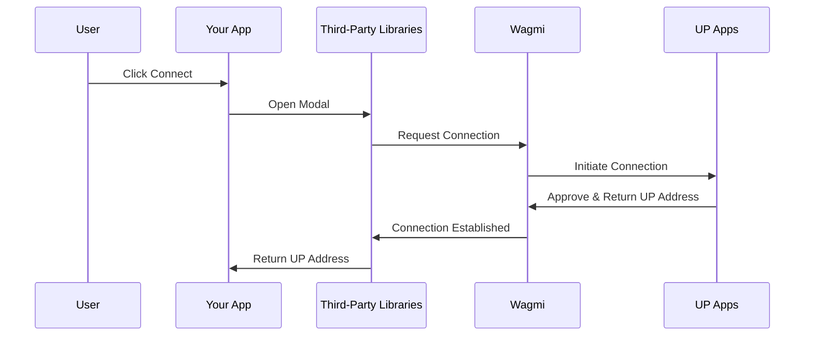

import Tabs from '@theme/Tabs';
import TabItem from '@theme/TabItem';
import LayersIcon from '@mui/icons-material/Layers';

# Connect a Universal Profile

[Universal Profiles](../../../standards/accounts/introduction.md) can connect to dApps on LUKSO using one of the two UP Apps available:

- [🧩 UP Browser Extension](/install-up-browser-extension/#up-browser-extension)
- [📱 UP Mobile App]

Connecting your Universal Profile will trigger one the following connection screen.

<div style={{ textAlign: 'center', display: 'flex', justifyContent: 'center', marginBottom: '1rem' }}>


</div>

:::success Request Handling

The [Universal Profile Extension](/install-up-browser-extension) returns the address of the connected [Universal Profile](../../../standards/accounts/introduction.md). Making transactions is the same as with any wallet, you just use the profile address as a `from` in your transactions.

:::

## Connection Methods

There are multiple ways to connect a dApp to Universal Profiles, from high-level libraries to low-level provider access. Choose the method that best fits your application's needs:

| Option                                              | Difficulty                                                                  | Recommended for                                                                                                                                                                                                                                   |
| --------------------------------------------------- | --------------------------------------------------------------------------- | ------------------------------------------------------------------------------------------------------------------------------------------------------------------------------------------------------------------------------------------------- |
| [**Third-Party Libraries**](#third-party-libraries) | **Easy** 🌶️ <br/> Plug in existing connectors and focus on UX.              | Most dApps. Provides pre-built components, ready-made modals, with multi-wallet support out of the box and connection logic handled automatically. <br/> **Recommended for quick and easy integration while keeping a seamless user experience.** |
| [**Provider Injection**](#provider-injection)       | **Medium** 🌶️🌶️ <br/> Require to manage the `window.lukso` object.          | Lightweight builds needing minimal dependencies and full control over wallet connection logic. <br/> **Recommended for full control over the connection logic (_e.g: only allow UPs to connect_) and to build custom connection modals.**         |
| [**Provider Discovery**](#provider-discovery)       | **Complex** 🌶️🌶️🌶️ <br/> Connect multiple wallet extensions simulatenously. | Advanced apps where users run several extensions (e.g., MetaMask + Universal Profile) simultaneously using EIP-6963. <br/> **Recommended for handling multiple connected wallets.**                                                               |

:::info

Currently, only the **third-party libraries** method can be used to connect the [📱 UP Mobile App] to a dApp.

:::

### Third-Party Libraries

You can connect to Universal Profile using the following third-party libraries. These libraries simplify dApp development by abstracting complex wallet connection logic:

- [**RainbowKit**](https://rainbowkit.com/docs/) (since [`v2.2.9`](https://github.com/rainbow-me/rainbowkit/releases/tag/%40rainbow-me%2Frainbowkit%402.2.9))
- [**Reown AppKit**](https://docs.reown.com/appkit/overview) (formerly WalletConnect)

<details>
  <summary>See flow diagram on how third party libraries handle the connection flow with EIP-6963</summary>



</details>

Choose your preferred library and follow the configuration steps below. Both options are built on top of **Wagmi**!

<Tabs groupId="provider-lib" className="provider-tabs">

<TabItem value="rainbowkit" label="🌈 RainbowKit" default>

**Step 1: Install Dependencies**

```sh
npm install @rainbow-me/rainbowkit wagmi @tanstack/react-query
```

**Step 2: Configure Wagmi with LUKSO and RainbowKit Connectors**

Set up Wagmi configuration with LUKSO network and RainbowKit's Universal Profile wallet connector:

```js
import { WagmiProvider, createConfig, http } from 'wagmi';
import { lukso } from 'wagmi/chains';
import { connectorsForWallets } from '@rainbow-me/rainbowkit';
import { QueryClient, QueryClientProvider } from '@tanstack/react-query';
// highlight-next-line
import { universalProfilesWallet } from '@rainbow-me/rainbowkit/wallets';

// Wagmi uses QueryClient to manage cache, background updates, and request deduplication.
// This is required to provide <QueryClientProvider> higher up in your component tree.
const queryClient = new QueryClient();

const config = createConfig({
  chains: [lukso],
  transports: {
    [lukso.id]: http(),
  },
  connectors: connectorsForWallets(
    [
      {
        groupName: 'Login with Universal Profile',
        // highlight-next-line
        wallets: [universalProfilesWallet],
      },
    ],
    {
      appName: 'LUKSO dApp',
      projectId: 'YOUR_PROJECT_ID', // Get your project ID from WalletConnect Cloud
    },
  ),
});
```

**Step 3: Wrap Your App with Providers**

Import RainbowKit styles and wrap your application with the required providers in the correct order:

```jsx
import { RainbowKitProvider } from '@rainbow-me/rainbowkit';
import '@rainbow-me/rainbowkit/styles.css';

function App() {
  return (
    <WagmiProvider config={config}>
      <QueryClientProvider client={queryClient}>
        <RainbowKitProvider>
          {/* 
            Place your main application content here. 
            <YourAppContent />  

            This ensures that all components within <YourAppContent /> 
            have access to the connected wallet context provided by WagmiProvider,
            enabling features like reading connection state or sending transactions.
          */}
        </RainbowKitProvider>
      </QueryClientProvider>
    </WagmiProvider>
  );
}
```

**Step 4: Add the Connect Button**

Use RainbowKit's pre-built `ConnectButton` component to handle wallet connections:

```jsx
import { ConnectButton } from '@rainbow-me/rainbowkit';

function YourAppContent() {
  return (
    <div>
      <ConnectButton />
    </div>
  );
}
```

**Step 5: Access Connection State**

Use Wagmi hooks to read the connected Universal Profile details:

```js
import { useAccount, useChainId } from 'wagmi';

function YourAppContent() {
  const { address, isConnected, chain } = useAccount();
  const chainId = useChainId();

  return (
    <div>
      <ConnectButton />
      {isConnected && (
        <div>
          <p>Address: {address}</p>
          <p>Network: {chain?.name}</p>
          <p>Chain ID: {chainId}</p>
        </div>
      )}
    </div>
  );
}
```

</TabItem>

<TabItem value="reown" label={<><LayersIcon color="success" style={{verticalAlign: 'middle', marginRight: 6}} />Reown AppKit</>}>

**Step 1: Install Dependencies**

```sh
npm install @reown/appkit @reown/appkit-adapter-wagmi wagmi @tanstack/react-query
```

**Step 2: Configure the WagmiAdapter with LUKSO**

Set up the adapter with LUKSO network configuration:

```js
import { WagmiProvider } from 'wagmi';
import { createAppKit } from '@reown/appkit/react';
import { WagmiAdapter } from '@reown/appkit-adapter-wagmi';
import { lukso } from '@reown/appkit/networks';
import { QueryClient, QueryClientProvider } from '@tanstack/react-query';

// Wagmi uses QueryClient to manage cache, background updates, and request deduplication.
// This is required to provide <QueryClientProvider> higher up in your component tree.
const queryClient = new QueryClient();

const wagmiAdapter = new WagmiAdapter({
  projectId: 'YOUR_PROJECT_ID', // Get your project ID from ReOwn dashboard
  networks: [lukso],
  transports: {
    [lukso.id]: http('https://rpc.mainnet.lukso.network'),
  },
});
```

**Step 3: Create the AppKit Modal**

Initialize the modal with your dApp metadata and LUKSO-specific settings:

```js
const metadata = {
  name: 'LUKSO Wallet Connect',
  description: 'Connect your Universal Profile',
  url: 'https://universaleverything.io',
  icons: ['https://lukso.network/favicon.ico'],
};

createAppKit({
  adapters: [wagmiAdapter],
  projectId: 'YOUR_PROJECT_ID', // Get your project ID from ReOwn dashboard
  networks: [lukso],
  defaultNetwork: lukso,
  metadata,
  features: {
    analytics: false,
    email: false,
    socials: false,
  },
});
```

**Step 4: Wrap Your App with the Provider**

Wrap your application with the required providers in the correct order:

```jsx
function App() {
  return (
    <WagmiProvider config={wagmiAdapter.wagmiConfig}>
      <QueryClientProvider client={queryClient}>
        {/* 
        Place your main application content here. 
        <YourAppContent />  

        This ensures that all components within <YourAppContent /> 
        have access to the connected wallet context provided by WagmiProvider,
        enabling features like reading connection state or sending transactions.
      */}
      </QueryClientProvider>
    </WagmiProvider>
  );
}
```

**Step 5: Use the `Connect` button and access to connection state**

Use `Wagmi` hooks to read the connected Universal Profile details:

```js
import { useAccount, useChainId } from 'wagmi';

function YourAppContent() {
  const { address, isConnected, chain } = useAccount();
  const chainId = useChainId();

  return (
    <div>
      <appkit-button />
      {isConnected && (
        <div>
          <p>Address: {address}</p>
          <p>Network: {chain?.name}</p>
          <p>Chain ID: {chainId}</p>
        </div>
      )}
    </div>
  );
}
```

**Optional: Configure the DeepLink for UP Mobile**

DeepLink can be configured for QR login when using the UP Mobile app with _ReOwn (WalletConnect)_.

:::success Configuring DeepLink

Simply replace the `wc:` alias with `io.universaleverything.universalprofiles://wallet-connect/`:

```js
const exampleWcUri =
  'wc:8c4d7a9e5f2b3c1d@2?relay-protocol=irn&symKey=a1b2c3d4e5f6g7h8i9j0k1l2m3n4o5p6';
const exampleDeepLink = exampleWcUri.replace(
  'wc:',
  'io.universaleverything.universalprofiles://wallet-connect/',
);
```

:::

</TabItem>

</Tabs>

### Provider Injection

You can use the `window.lukso` object, tailored for a direct integration with the UP Browser Extension. This approach allows developers to engage directly with the UP Browser Extension without the need to consider compatibility with other extensions.

<Tabs groupId="provider-lib">
  <TabItem value="ethers" label="ethers"  attributes={{className: "tab_ethers"}}>

```sh
npm install ethers
```

  </TabItem>
  <TabItem value="web3" label="web3"  attributes={{className: "tab_web3"}}>

```sh
npm install web3
```

  </TabItem>
</Tabs>

<Tabs groupId="provider-lib">
  <TabItem value="ethers" label="ethers"  attributes={{className: "tab_ethers"}}>

```js
import { ethers } from 'ethers';
const provider = new ethers.BrowserProvider(window.lukso);

const accounts = await provider.send('eth_requestAccounts', []);
console.log('Connected with', accounts[0]);
```

  </TabItem>
  <TabItem value="web3" label="web3"  attributes={{className: "tab_web3"}}>

```js
import Web3 from 'web3';
const provider = new Web3(window.lukso);

const accounts = await provider.eth.requestAccounts();
console.log('Connected with', accounts[0]);
```

  </TabItem>
</Tabs>

:::info Wallet Compatibility

Alternatively to the `window.lukso`, the equivalent `window.ethereum` object can be called within [supported browsers](/install-up-browser-extension), just like other Ethereum wallets. Both follow the [EIP-1193 Ethereum Provider JavaScript API](https://eips.ethereum.org/EIPS/eip-1193). You can use a simple fallback to allow regular wallet connections, if the [Universal Profile Browser Extension](/install-up-browser-extension) is not installed:

:::

<Tabs groupId="provider-lib">
  <TabItem value="ethers" label="ethers"  attributes={{className: "tab_ethers"}}>

```js
const provider = new ethers.BrowserProvider(window.lukso || window.ethereum);
```

  </TabItem>
  <TabItem value="web3" label="web3"  attributes={{className: "tab_web3"}}>

```js
const provider = new Web3(window.lukso || window.ethereum);
```

  </TabItem>
</Tabs>

### Provider Discovery

:::tip Example Implementation

If you want to implement _Injected Provider Discovery_ you can visit our [Example EIP-6963 Test dApp](https://github.com/lukso-network/example-eip-6963-test-dapp).

:::

:::info Wallet Compatibility

Using [EIP-6963 Provider Discovery](https://eips.ethereum.org/EIPS/eip-6963) is the latest industry standardization, solving previous connectivity issues when having multiple wallet extensions installed at the same time.

:::

You can listen to `eip6963:announceProvider` events following the [EIP-6963: Multi Injected Provider](https://eips.ethereum.org/EIPS/eip-6963) standardization to facilitate a more versatile connection to multiple wallet extensions. This method is beneficial for developers who require the ability to maintain low-level control over how different extensions are targeted and managed within their dApp.

**Step 1: Install Dependencies**

```sh
npm install viem
```

**Step 2: Implement Provider Discovery**

```js
import { createWalletClient, custom } from 'viem';
import { lukso } from 'viem/chains';

let providers = [];

window.addEventListener('eip6963:announceProvider', (event) => {
  providers.push(event.detail);
});

// Request installed providers
window.dispatchEvent(new Event('eip6963:requestProvider'));

// ... pick a provider to instantiate (providers[n].info)

// Create a wallet client using the selected provider
const walletClient = createWalletClient({
  chain: lukso,
  transport: custom(providers[0].provider),
});

const accounts = await walletClient.requestAddresses();
console.log('Connected with', accounts[0]);
```

## Helpful Resources

- Next Stop: [Read Universal Profile Data](/docs/learn/universal-profile/metadata/read-profile-data.md)
- [LUKSO Mainnet Parameters, RPC Providers](/docs/networks/mainnet/parameters.md#add-lukso-to-wallets)

[📱 UP Mobile App]: /install-up-browser-extension/#up-mobile-app
