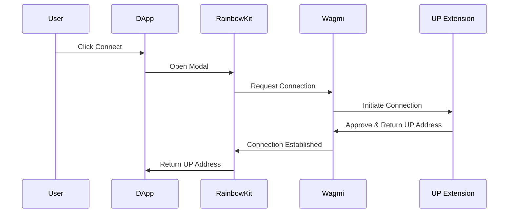
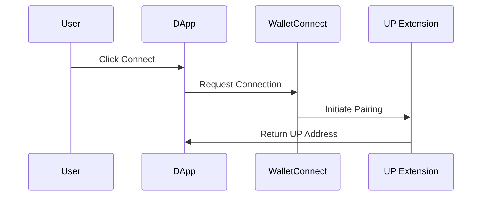

# Connect a Universal Profile

There are several methods to connect to a [Universal Profile](../../../standards/accounts/introduction.md), each catering to different developer requirements and scenarios. Below, we detail the most common approaches and explain why a developer might prefer one over the others.

## Universal Profiles Apps

Universal Profiles can be accessed through **UP Apps**, which serve as the bridge between users and decentralized applications on LUKSO. There are two primary UP Apps available:

### UP Browser Extension

The [Universal Profile Browser Extension](https://chromewebstore.google.com/detail/universal-profiles/abpickdkkbnbcoepogfhkhennhfhehfn) is designed for desktop users who want to interact with dApps through their web browser. It provides a seamless experience for managing Universal Profiles and connecting to decentralized applications. The extension is compatible with modern browsers and supports standard wallet connection protocols.

### UP Mobile App

The Universal Profile Mobile App brings the power of Universal Profiles to mobile devices, allowing users to manage their profiles and interact with dApps on the go. The mobile app supports QR code scanning for quick connections and provides a native mobile experience for LUKSO ecosystem interactions.

## Connection Methods

Connecting to the [Universal Profile Browser Extension](https://chromewebstore.google.com/detail/universal-profiles/abpickdkkbnbcoepogfhkhennhfhehfn) will trigger the following connection screen:

<div style={{textAlign: 'center'}}>


</div>

:::success Request Handling

The [Universal Profile Extension](/install-up-browser-extension) returns the address of the connected [Universal Profile](../../../standards/accounts/introduction.md). Making transactions is the same as with any wallet, you just use the profile address as a `from` in your transactions.

:::

### Wagmi + RainbowKit



**Step 1: Install Dependencies**

```sh
npm install @rainbow-me/rainbowkit wagmi @tanstack/react-query viem
```

**Step 2: Configure Wagmi with LUKSO and RainbowKit Connectors**

Set up Wagmi configuration with LUKSO network and RainbowKit's Universal Profile wallet connector:

```js
import { WagmiProvider, createConfig, http } from 'wagmi';
import { lukso } from 'wagmi/chains';
import { connectorsForWallets } from '@rainbow-me/rainbowkit';
import { universalProfilesWallet } from '@rainbow-me/rainbowkit/wallets';

// Configure Wagmi with LUKSO network and RainbowKit connectors
const config = createConfig({
  chains: [lukso],
  transports: {
    [lukso.id]: http(),
  },
  connectors: connectorsForWallets(
    [
      {
        groupName: 'Login with Universal Profile',
        wallets: [universalProfilesWallet],
      },
    ],
    { 
      appName: 'LUKSO dApp', 
      projectId: 'YOUR_PROJECT_ID' // Get your project ID from WalletConnect Cloud
    },
  ),
});
```

**Step 3: Create the QueryClient**

Create a QueryClient instance for React Query, which Wagmi uses under the hood to manage cache, background updates, and request deduplication:

```js
import { QueryClient, QueryClientProvider } from '@tanstack/react-query';

const queryClient = new QueryClient();
```

**Step 4: Wrap Your App with Providers**

Import RainbowKit styles and wrap your application with the required providers in the correct order:

```jsx
import { RainbowKitProvider } from '@rainbow-me/rainbowkit';
import '@rainbow-me/rainbowkit/styles.css';

function App() {
  return (
    <WagmiProvider config={config}>
      <QueryClientProvider client={queryClient}>
        <RainbowKitProvider>
          {/* 
            Place your main application content here. 
            <YourAppContent />  

            This ensures that all components within <YourAppContent /> 
            have access to the connected wallet context provided by WagmiProvider,
            enabling features like reading connection state or sending transactions.
          */}
        </RainbowKitProvider>
      </QueryClientProvider>
    </WagmiProvider>
  );
}
```

**Step 5: Add the Connect Button**

Use RainbowKit's pre-built `ConnectButton` component to handle wallet connections:

```jsx
import { ConnectButton } from '@rainbow-me/rainbowkit';

function YourAppContent() {
  return (
    <div>
      <ConnectButton />
    </div>
  );
}
```

**Step 6: Access Connection State**

Use Wagmi hooks to read the connected Universal Profile details and wallet balance:

```js
import { useAccount, useBalance } from 'wagmi';

function YourAppContent() {
  const { address, isConnected } = useAccount();
  const { data: balance } = useBalance({
    address: address,
  });

  return (
    <div>
      <ConnectButton />
      
      {!isConnected && (
        <p>Connect your Universal Profile wallet to get started</p>
      )}

      {isConnected && (
        <div>
          <h2>Wallet Information</h2>
          <p>
            Address: <code>{address}</code>
          </p>
          {balance && (
            <p>
              Balance: {balance.formatted} {balance.symbol}
            </p>
          )}
        </div>
      )}
    </div>
  );
}
```

### Wagmi + ReOwn (WalletConnect)



**Step 1: Install Dependencies**

```sh
npm install @reown/appkit @reown/appkit-adapter-wagmi wagmi @tanstack/react-query
```

**Step 2: Configure the WagmiAdapter with LUKSO**

Set up the adapter with LUKSO network configuration:

```js
import { WagmiProvider } from 'wagmi';
import { createAppKit } from '@reown/appkit/react';
import { WagmiAdapter } from '@reown/appkit-adapter-wagmi';
import { lukso } from '@reown/appkit/networks';
import { QueryClient, QueryClientProvider } from '@tanstack/react-query';

// Create a new QueryClient instance for React Query,
// which Wagmi uses under the hood to manage cache, background updates, and request deduplication.
// This is required to provide <QueryClientProvider> higher up in your component tree.
const queryClient = new QueryClient();

const wagmiAdapter = new WagmiAdapter({
  projectId: 'YOUR_PROJECT_ID', // Get your project ID from ReOwn dashboard
  networks: [lukso],
  transports: {
    [lukso.id]: http('https://rpc.mainnet.lukso.network'),
  },
});
```

**Step 3: Create the AppKit Modal**

Initialize the modal with your dApp metadata and LUKSO-specific settings:

```js
const metadata = {
  name: 'LUKSO Wallet Connect',
  description: 'Connect your Universal Profile',
  url: 'https://universaleverything.io',
  icons: ['https://lukso.network/favicon.ico'],
};

createAppKit({
  adapters: [wagmiAdapter],
  projectId: 'YOUR_PROJECT_ID', // Get your project ID from ReOwn dashboard
  networks: [lukso],
  defaultNetwork: lukso,
  metadata,
  features: {
    analytics: false,
    email: false,
    socials: false,
  },
});
```

**Step 4: Wrap Your App with the Provider**

```jsx
function App() {
  return (
    <WagmiProvider config={wagmiAdapter.wagmiConfig}>
      {/* 
        Place your main application content here. 
        <YourAppContent />  

        This ensures that all components within <YourAppContent /> 
        have access to the connected wallet context provided by WagmiProvider,
        enabling features like reading connection state or sending transactions.
      */}
    </WagmiProvider>
  );
}
```

**Step 5: Add the `Connect` button to your project**

```jsx
<appkit-button />
```

**Step 6: Access Connection State**

Use `Wagmi` hooks to read the connected Universal Profile details:

```js
import { useAccount, useChainId } from 'wagmi';

function YourAppContent() {
  const { address, isConnected, chain } = useAccount();
  const chainId = useChainId();

  return (
    <div>
      <appkit-button />
      {isConnected && (
        <div>
          <p>Address: {address}</p>
          <p>Network: {chain?.name}</p>
          <p>Chain ID: {chainId}</p>
        </div>
      )}
    </div>
  );
}
```

**Optional: Configure the DeepLink for UP Mobile**

DeepLink can be configured for QR login when using the UP Mobile app with _ReOwn (WalletConnect)_.

:::success Configuring DeepLink

Simply replace the `wc:` alias with `io.universaleverything.universalprofiles://wallet-connect/`:

```ts
const exampleWcUri =
  'wc:8c4d7a9e5f2b3c1d@2?relay-protocol=irn&symKey=a1b2c3d4e5f6g7h8i9j0k1l2m3n4o5p6';
const exampleDeepLink = exampleWcUri.replace(
  'wc:',
  'io.universaleverything.universalprofiles://wallet-connect/',
);
```

:::

## Helpful Resources

- Next Stop: [Read Universal Profile Data](/docs/learn/universal-profile/metadata/read-profile-data.md)
- [LUKSO Mainnet Parameters, RPC Providers](/docs/networks/mainnet/parameters.md#add-lukso-to-wallets)
