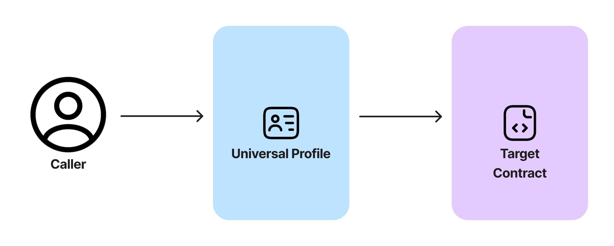

import Tabs from '@theme/Tabs';
import TabItem from '@theme/TabItem';

# Interact with other contracts

:::caution Disclaimer

This guide might contain outdated information and will be updated soon.

:::

In this guide, we will learn how to use our Universal Profile to interact with any other smart contract (like if we were using a regular Externally Owned Account).

**Interaction flow**:



## Introduction

We have seen in the previous example how to send LYX from our UP via the [`execute(...)`](../../contracts/contracts/LSP0ERC725Account#execute) function.

This function offers a fourth parameter: `_data`, that provides a lot of flexibility when interacting from our UP. The `_data` parameter is handy when the `_to` recipient is a smart contract.

If you want to call a specific smart contract that was deployed on the network by the Universal Profile, the parameters of the `execute(...)` function will be as follow:

- `_operation`: `0` (for `CALL`).
- `_to`: the `address` of the smart contract we want to interact with.
- `_value_`: empty (0).
- `_data`: the ABI-encoded function name and arguments, to be run at the `_to` contract address.

Suppose a smart contract `targetContract` was deployed on the network and we want our UP to call the function `myCoolFunction` on this contract. We will have to:

1. [ABI-encode](https://web3js.readthedocs.io/en/v1.2.11/web3-eth-contract.html#methods-mymethod-encodeabi) the function call with the parameters we want to pass.
2. Pass the encoded calldata as argument `_data` of the `execute(...)` function.

## Setup

To complete this guide, we will need:

- an EOA with some LYX for gas fees and the required [permissions](../../standards/universal-profile/lsp6-key-manager.md#permissions) for the interaction.
- the `UniversalProfile` and `KeyManager` contracts ABIs from the [`@lukso/lsp-smart-contracts`](../../tools/lsp-smart-contracts/getting-started.md) npm package.
- the address of our Universal Profile.
- the `targetContract` ABI.
- the address of the Target Contract.

:::info

The chosen EOA needs to have [**CALL Permission**](../../standards/universal-profile/lsp6-key-manager.md#permissions) together with [**Allowed Calls**](../../standards/universal-profile/lsp6-key-manager.md#allowed-calls) or [**SUPER_CALL Permission**](../../standards/universal-profile/lsp6-key-manager.md#super-permissions)

:::

Make sure you have the following dependencies installed before beginning this tutorial:

- Either [`web3.js`](https://github.com/web3/web3.js) or [`ethers.js`](https://github.com/ethers-io/ethers.js/)
- [`@lukso/lsp-smart-contracts`](https://github.com/lukso-network/lsp-smart-contracts/)

<Tabs>
  
  <TabItem value="web3js" label="web3.js">

```shell title="Install the dependencies"
npm install web3 @lukso/lsp-smart-contracts
```

  </TabItem>

  <TabItem value="ethersjs" label="ethers.js">

```shell title="Install the dependencies"
npm install ethers @lukso/lsp-smart-contracts
```

  </TabItem>

</Tabs>

## Step 1 - Create the contracts instances

The first step is to create instances of our Universal Profile, Key Manager contracts and the Target Contract.

- Create an Universal Profile contract instance from `universalProfileAddress`.
- Create a Target Contract instance from the `targetContractAddress`.

:::caution

Save the Target Contract ABI in a separate JSON and import it in the main file.  
You can quickly compile and get a contract's ABI in [Remix IDE](https://remix.ethereum.org/).

:::

<Tabs>
  
  <TabItem value="web3js" label="web3.js">

```typescript title="Imports & Constants"
import UniversalProfile from '@lukso/lsp-smart-contracts/artifacts/UniversalProfile.json';
import TargetContractABI from './TargetContractABI.json';
import Web3 from 'web3';

const web3 = new Web3('https://rpc.testnet.lukso.network');

const universalProfileAddress = '0x...';
const universalProfile = new web3.eth.Contract(
  UniversalProfile.abi,
  universalProfileAddress,
);

const targetContractAddress = '0x...';
const targetContract = new web3.eth.Contract(
  TargetContractABI,
  targetContractAddress,
);
```

  </TabItem>

  <TabItem value="ethersjs" label="ethers.js">

```typescript title="Imports & Constants"
import { ethers } from 'ethers';
import UniversalProfile from '@lukso/lsp-smart-contracts/artifacts/UniversalProfile.json';
import TargetContractABI from './TargetContractABI.json';

const provider = new ethers.JsonRpcProvider(
  'https://rpc.testnet.lukso.network',
);

const universalProfileAddress = '0x...';
const universalProfile = new ethers.Contract(
  universalProfileAddress,
  UniversalProfile.abi,
  provider,
);

const targetContractAddress = '0x...';
const targetContract = new ethers.Contract(
  targetContractAddress,
  TargetContractABI,
  provider,
);
```

  </TabItem>

</Tabs>

## Step 2 - Encode the calldatas

We need to create a calldata that will be executed on the Target Contract.

<Tabs>
  
  <TabItem value="web3js" label="web3.js">

```typescript title="Target calldata"
// 1. encode the calldata to be run at the targetContract
// assuming targetContract is a Contract instance
const targetCalldata = targetContract.methods
  .myCoolfunction('dummyParameter')
  .encodeABI();
```

  </TabItem>
  
  <TabItem value="ethersjs" label="ethers.js">

```typescript title="Target calldata"
// 1. encode the calldata to be run at the targetContract
// assuming targetContract is a Contract instance
const targetCalldata = targetContract.interface.encodeFunctionData(
  'myCoolfunction',
  ['dummyParameter'],
);
```

  </TabItem>

</Tabs>

## Step 3 - Execute the calldata

### Load the EOA

Like in other guides, an important step is to load our EOA that is a controller for our Universal Profile.

<Tabs>

  <TabItem value="web3js" label="web3.js">

```typescript title="Setup EOA"
const PRIVATE_KEY = '0x...'; // your EOA private key (controller address)
const EOA = web3.eth.accounts.wallet.add(PRIVATE_KEY);
```

  </TabItem>

  <TabItem value="ethersjs" label="ethers.js">

```typescript title="Setup EOA"
const PRIVATE_KEY = '0x...'; // your EOA private key (controller address)
const EOA = new ethers.Wallet(PRIVATE_KEY).connect(provider);
```

  </TabItem>

</Tabs>

### Send the execute calldata

The final step is to pass the encoded calldata to the Universal Profile. Since we are calling from an EOA that is a [controller](../../standards/universal-profile/lsp6-key-manager.md#introduction) on the UP, the Key Manager will authorize the transaction.

<Tabs>
  
  <TabItem value="web3js" label="web3.js">

<!-- prettier-ignore-start -->

```typescript title="Send transaction"
await universalProfile.methods
  .execute(OPERATION_CALL, targetContract.address, 0, targetCalldata)
  .send({
    from: EOA.address,
    gasLimit: 300_000,
  });
```

<!-- prettier-ignore-end -->

  </TabItem>
  
  <TabItem value="ethersjs" label="ethers.js">

<!-- prettier-ignore-start -->

```typescript title="Send transaction"
await universalProfile
  .connect(EOA)
  .execute(OPERATION_CALL, targetContract.address, 0, targetCalldata);
```

<!-- prettier-ignore-end -->

  </TabItem>

</Tabs>

## Final Code

<Tabs>
  
  <TabItem value="web3js" label="web3.js">

<!-- prettier-ignore-start -->

```typescript title="Final code"
import UniversalProfile from '@lukso/lsp-smart-contracts/artifacts/UniversalProfile.json';
import TargetContractABI from './TargetContractABI.json';
import Web3 from 'web3';

const web3 = new Web3('https://rpc.testnet.lukso.network');

const universalProfileAddress = '0x...';
const universalProfile = new web3.eth.Contract(
  UniversalProfile.abi,
  universalProfileAddress,
);

const targetContractAddress = '0x...';
const targetContract = new web3.eth.Contract(
  TargetContractABI,
  targetContractAddress,
);

// 1. encode the calldata to be run on the UP
const targetCalldata = targetContract.methods
  .myCoolfunction('dummyParameter')
  .encodeABI();

const OPERATION_CALL = 0;

const PRIVATE_KEY = '0x...'; // your EOA private key (controller address)
const EOA = web3.eth.accounts.wallet.add(PRIVATE_KEY);

// 2. execute the calldata through the UP
await universalProfile.methods
  .execute(OPERATION_CALL, targetContract.address, 0, targetCalldata)
  .send({
    from: EOA.address,
    gasLimit: 300_000,
  });
```

  </TabItem>
  
  <TabItem value="ethersjs" label="ethers.js">


```typescript title="Final code"
import { ethers } from 'ethers';
import UniversalProfile from '@lukso/lsp-smart-contracts/artifacts/UniversalProfile.json';
import TargetContractABI from './TargetContractABI.json';

const provider = new ethers.JsonRpcProvider(
  'https://rpc.testnet.lukso.network',
);

const universalProfileAddress = '0x...';
const universalProfile = new ethers.Contract(
  universalProfileAddress,
  UniversalProfile.abi,
  provider,
);

const targetContractAddress = '0x...';
const targetContract = new ethers.Contract(
  targetContractAddress,
  TargetContractABI,
  provider,
);

// 1. encode the calldata to be run on the UP,
const targetCalldata = targetContract.interface.encodeFunctionData(
  'myCoolfunction',
  ['dummyParameter'],
);

const OPERATION_CALL = 0;

const PRIVATE_KEY = '0x...'; // your EOA private key (controller address)
const EOA = new ethers.Wallet(PRIVATE_KEY).connect(provider);

// 2. execute the calldata through the UP
await universalProfile
  .connect(EOA)
  .execute(OPERATION_CALL, targetContract.address, 0, targetCalldata);
```

<!-- prettier-ignore-end -->

  </TabItem>

</Tabs>
