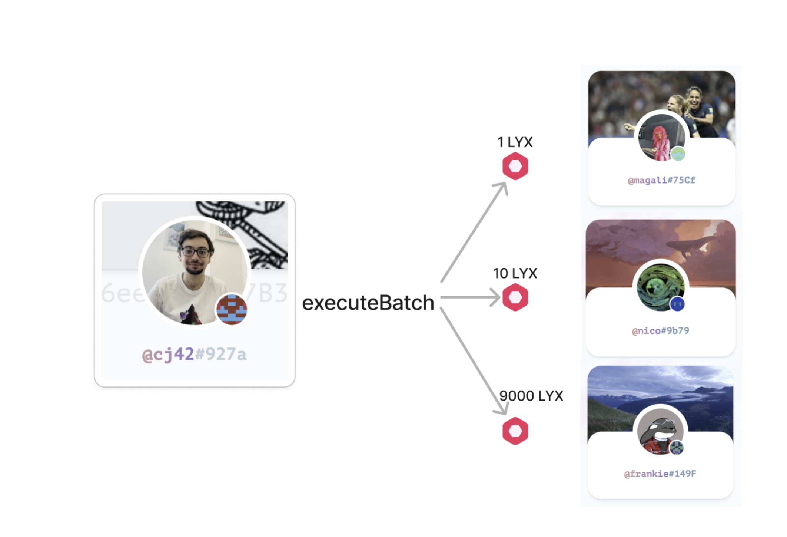
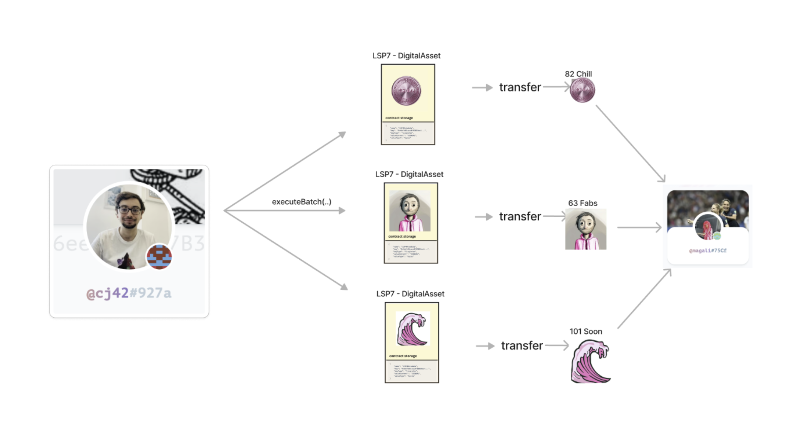
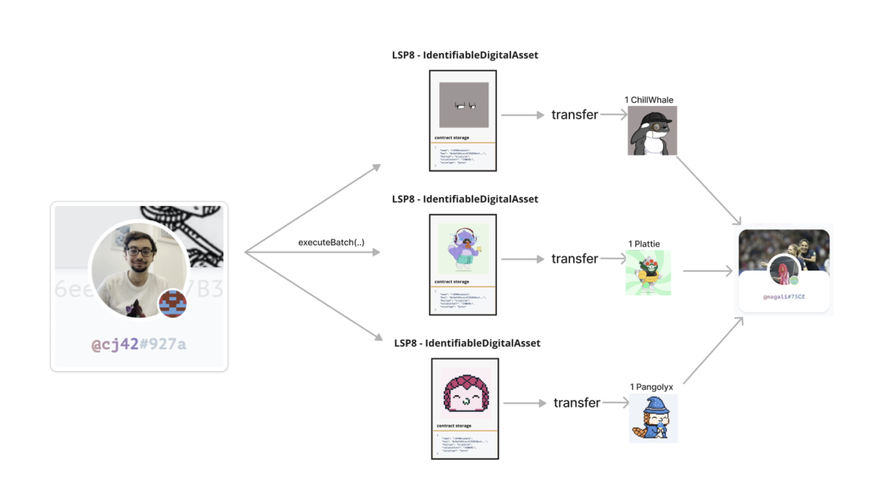
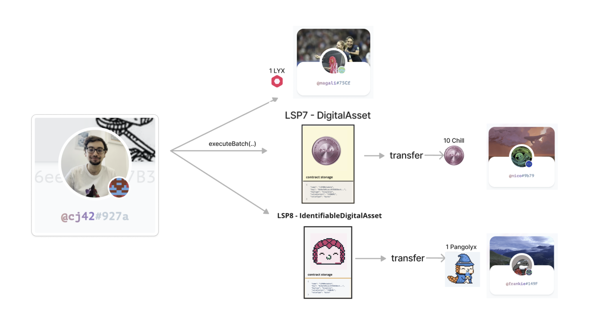

import Tabs from '@theme/Tabs';
import TabItem from '@theme/TabItem';

# Execute Batch Transactions

:::tip Code repository

All the contracts, sample metadata, and scripts of this guide are available in the [`lukso-playground`](https://github.com/lukso-network/lukso-playground/tree/main/smart-contracts-hardhat) repository.

:::

<div style={{textAlign: 'center', color: 'grey'}}>
  
<br/>
<i>Universal Profiles support natively batch transactions to perform complex transfer scenarios. Like transferring LYX or multiple tokens and NFTs to different recipient addresses.</i>
<br /><br />
</div>

A Universal Profile contains a function called [`executeBatch(...)`](../../../contracts/contracts/UniversalProfile.md#executebatch) to perform batch transaction. With some thinking, we will see that this function can enables a countless number of creative use cases. Below are some useful and simple example code snippets covered, around transferring LYX, tokens and NFTs to one or multiple different addresses.

## Transfer Examples

### Transfer LYX to different recipients



<Tabs>

<TabItem value="ethers" label="ethers" attributes={{className: "tab_ethers"}}>

```ts
import { ethers, hexlify, toUtf8Bytes } from 'ethers';
import { OPERATION_TYPES } from '@lukso/lsp-smart-contracts';

import UniversalProfileArtifacts from '@lukso/lsp-smart-contracts/artifacts/UniversalProfile.json';

const provider = new ethers.BrowserProvider(window.lukso);
const universalProfile = await provider.getSigner();
console.log('UP address: ', universalProfile);

const upContract = new Contract(
  universalProfile, // Universal Profile address
  UniversalProfileArtifacts.abi,
  universalProfile, // signer that will sign the transaction
);

const operationTypes = [
  OPERATION_TYPES.CALL, // 0
  OPERATION_TYPES.CALL, // 0
  OPERATION_TYPES.CALL, // 0
];

const lyxRecipients = ['0x...', '0x...', '0x...'];

const lyxAmounts = [parseEther('1'), parseEther('2'), parseEther('3')];

const data = [
  '0x', // transferring LYX without any data
  hexlify(toUtf8Bytes('Here is a tip, buy yourself a coffee!')), // you can also add any data as utf8-hex in the LYX transfer
  hexlify(toUtf8Bytes('Paying back my debt I owe you')),
];

await upContract.executeBatch(operationTypes, lyxRecipients, lyxAmounts, data);
```

</TabItem>

<TabItem value="web3" label="web3" attributes={{className: "tab_web3"}}>

```ts
import Web3 from 'web3';
import { OPERATION_TYPES } from '@lukso/lsp-smart-contracts';

import UniversalProfileArtifacts from '@lukso/lsp-smart-contracts/artifacts/UniversalProfile.json';

const web3 = new Web3(window.lukso);
const [universalProfile] = await web3.eth.personal.getAccounts();
console.log('UP address: ', universalProfile);

const upContract = new Contract(
  UniversalProfileArtifacts.abi,
  universalProfile, // Universal Profile address
);

const operationTypes = [
  OPERATION_TYPES.CALL, // 0
  OPERATION_TYPES.CALL, // 0
  OPERATION_TYPES.CALL, // 0
];

const lyxRecipients = ['0x...', '0x...', '0x...'];

const lyxAmounts = [
  web3.utils.toWei('1', 'ether'),
  web3.utils.toWei('2', 'ether'),
  web3.utils.toWei('3', 'ether'),
];

const data = [
  '0x', // transferring LYX without any data
  web3.utils.utf8ToHex('Here is a tip, buy yourself a coffee!'), // you can also add any data as utf8-hex in the LYX transfer
  web3.utils.utf8ToHex('Paying back my debt I owe you'),
];

await upContract.methods
  .executeBatch(operationTypes, lyxRecipients, lyxAmounts, data)
  .send({ from: universalProfile });
```

</TabItem>

</Tabs>

### Transfer 3 x tokens to the same recipient



<Tabs>

<TabItem value="ethers" label="ethers" attributes={{className: "tab_ethers"}}>

```ts
import { ethers } from 'ethers';
import { OPERATION_TYPES } from '@lukso/lsp-smart-contracts';

import UniversalProfileArtifacts from '@lukso/lsp-smart-contracts/artifacts/UniversalProfile.json';
import LSP7DigitalAssetArtifact from '@lukso/lsp-smart-contracts/artifacts/LSP7DigitalAsset.json';

const provider = new ethers.BrowserProvider(window.lukso);
const universalProfile = await provider.getSigner();

const upContract = new Contract(
  universalProfile,
  UniversalProfileArtifacts.abi,
  universalProfile,
);

// List of tokens addresses (including meme coins)
const FABS_TOKEN = '0x650e14f636295af421D9BB788636356aA7F5924c';
const CHILL_TOKEN = '0x5B8B0E44D4719F8A328470DcCD3746BFc73d6B14';
const SOON_TOKEN = '0x3B56718C2AcC074B6640b2fa90DbB755f20033eA';

// We do not need to create an instance for each contracts, they are all LSP7
const lsp7Token = new Contract(FABS_TOKEN, LSP7DigitalAssetArtifact.abi);

const recipient = '0x...'; // address that will receive the tokens

const transferFabsCalldata = await lsp7Token.transfer.populateTransaction(
  universalProfile, // from
  '0x...', // to
  parseEther('10'), // amount
  true, // force transfer
  '0x', // data
);

const transferChillCalldata = await lsp7Token.transfer.populateTransaction(
  universalProfile,
  recipient,
  parseEther('20'),
  true,
  '0x',
);

const transferSoonCalldata = await lsp7Token.transfer.populateTransaction(
  universalProfile,
  recipient,
  parseEther('30'),
  true,
  '0x',
);

const operationTypes = [
  OPERATION_TYPES.CALL,
  OPERATION_TYPES.CALL,
  OPERATION_TYPES.CALL,
];

const tokenContractsToCall = [FABS_TOKEN, CHILL_TOKEN, SOON_TOKEN];

const values = [parseEther('0'), parseEther('0'), parseEther('0')];

const calldatas = [
  transferFabsCalldata.data,
  transferChillCalldata.data,
  transferSoonCalldata.data,
];

await upContract.executeBatch(
  operationTypes,
  tokenContractsToCall,
  values,
  calldatas,
  {
    from: universalProfile,
  },
);
```

</TabItem>

<TabItem value="web3" label="web3" attributes={{className: "tab_web3"}}>

```ts
import Web3 from 'web3';
import { OPERATION_TYPES } from '@lukso/lsp-smart-contracts';

import UniversalProfileArtifacts from '@lukso/lsp-smart-contracts/artifacts/UniversalProfile.json';
import LSP7DigitalAssetArtifact from '@lukso/lsp-smart-contracts/artifacts/LSP7DigitalAsset.json';

const web3 = new Web3(window.lukso);
const [universalProfile] = await web3.eth.personal.getAccounts();

const upContract = new web3.eth.Contract(
  UniversalProfileArtifacts.abi,
  universalProfile,
);

// List of tokens addresses (including meme coins)
const FABS_TOKEN = '0x650e14f636295af421D9BB788636356aA7F5924c';
const CHILL_TOKEN = '0x5B8B0E44D4719F8A328470DcCD3746BFc73d6B14';
const SOON_TOKEN = '0x3B56718C2AcC074B6640b2fa90DbB755f20033eA';

// We do not need to create an instance for each contracts, they are all LSP7
const lsp7Token = new web3.eth.Contract(
  LSP7DigitalAssetArtifact.abi,
  FABS_TOKEN,
);

const recipient = '0x...'; // address that will receive the tokens

const transferFabsCalldata = await lsp7Token.methods
  .transfer(
    universalProfile, // from
    '0x...', // to
    web3.utils.toWei('10', 'ether'), // amount
    true, // force transfer
    '0x', // data
  )
  .encodeABI();

const transferChillCalldata = await lsp7Token.methods
  .transfer(
    universalProfile,
    recipient,
    web3.utils.toWei('20', 'ether'),
    true,
    '0x',
  )
  .encodeABI();

const transferSoonCalldata = await lsp7Token.methods
  .transfer(
    universalProfile,
    recipient,
    web3.utils.toWei('30', 'ether'),
    true,
    '0x',
  )
  .encodeABI();

const operationTypes = [
  OPERATION_TYPES.CALL, // 0
  OPERATION_TYPES.CALL, // 0
  OPERATION_TYPES.CALL, // 0
];

const tokenContractsToCall = [FABS_TOKEN, CHILL_TOKEN, SOON_TOKEN];

const values = [
  web3.utils.toWei('0', 'ether'),
  web3.utils.toWei('0', 'ether'),
  web3.utils.toWei('0', 'ether'),
];

const calldatas = [
  transferFabsCalldata,
  transferChillCalldata,
  transferSoonCalldata,
];

await upContract.methods
  .executeBatch(operationTypes, tokenContractsToCall, values, calldatas)
  .send({
    from: universalProfile,
  });
```

</TabItem>

</Tabs>

### Transfer different NFTs to the same recipient



<Tabs>

<TabItem value="ethers" label="ethers" attributes={{className: "tab_ethers"}}>

```ts
import { ethers } from 'ethers';
import { OPERATION_TYPES } from '@lukso/lsp-smart-contracts';

import UniversalProfileArtifacts from '@lukso/lsp-smart-contracts/artifacts/UniversalProfile.json';
import LSP7DigitalAssetArtifact from '@lukso/lsp-smart-contracts/artifacts/LSP7DigitalAsset.json';
import LSP8IdentifiableDigitalAssetArtifact from '@lukso/lsp-smart-contracts/artifacts/LSP8IdentifiableDigitalAsset.json';

const provider = new ethers.BrowserProvider(window.lukso);
const universalProfile = await provider.getSigner();

const recipient = '0x...'; // address that will receive the NFTs

const upContract = new Contract(
  universalProfile,
  UniversalProfileArtifacts.abi,
  universalProfile,
);

// List of NFT contracts
const CHILLWHALE_NFT = '0x86E817172b5c07f7036Bf8aA46e2db9063743A83';
const PLATTIES_NFT = '0x5021E9ED50D8C71E3D74c0de7964342AAA1A0F62';
const PANGOLYX_NFT = '0xCDD480a4d3a9961be62eF40b01bf86175b341fBB';

const chillwhaleTokenId =
  '0x000000000000000000000000000000000000000000000000000000000000013f';
const plattyTokenId =
  '0x00000000000000000000000000000000000000000000000000000000000002b7';
const pangolyxTokenId =
  '0x0000000000000000000000000000000000000000000000000000000000000164';

// We do not need to create an instance for each contracts, they are all LSP7
const lsp8Nft = new Contract(
  CHILLWHALE_NFT,
  LSP8IdentifiableDigitalAssetArtifact.abi,
);

const transferChillwhaleCalldata = await lsp8Nft.transfer.populateTransaction(
  universalProfile, // from
  recipient, // to
  chillwhaleTokenId, // bytes32 tokenId
  true, // force
  '0x', // data
);

const transferPlattyCalldata = await lsp8Nft.transfer.populateTransaction(
  universalProfile,
  recipient,
  plattyTokenId,
  true,
  '0x',
);

const transferPangolyxCalldata = await lsp8Nft.transfer.populateTransaction(
  universalProfile,
  recipient,
  pangolyxTokenId,
  true,
  '0x',
);

const operationTypes = [
  OPERATION_TYPES.CALL,
  OPERATION_TYPES.CALL,
  OPERATION_TYPES.CALL,
];

const tokenContractsToCall = [CHILLWHALE_NFT, PLATTIES_NFT, PANGOLYX_NFT];

const values = [parseEther('0'), parseEther('0'), parseEther('0')];

const calldatas = [
  transferChillwhaleCalldata.data,
  transferPlattyCalldata.data,
  transferPangolyxCalldata.data,
];

await upContract.executeBatch(
  operationTypes,
  tokenContractsToCall,
  values,
  calldatas,
  {
    from: universalProfile,
  },
);
```

</TabItem>

<TabItem value="web3" label="web3" attributes={{className: "tab_web3"}}>

```ts
import Web3 from 'web3';
import { OPERATION_TYPES } from '@lukso/lsp-smart-contracts';

import UniversalProfileArtifacts from '@lukso/lsp-smart-contracts/artifacts/UniversalProfile.json';
import LSP8IdentifiableDigitalAssetArtifact from '@lukso/lsp-smart-contracts/artifacts/LSP8IdentifiableDigitalAsset.json';

const web3 = new Web3(window.lukso);
const [universalProfile] = await web3.eth.personal.getAccounts();

const recipient = '0x...'; // address that will receive the NFTs

const upContract = new Contract(
  universalProfile,
  UniversalProfileArtifacts.abi,
  universalProfile,
);

// List of NFT contracts
const CHILLWHALE_NFT = '0x86E817172b5c07f7036Bf8aA46e2db9063743A83';
const PLATTIES_NFT = '0x5021E9ED50D8C71E3D74c0de7964342AAA1A0F62';
const PANGOLYX_NFT = '0xCDD480a4d3a9961be62eF40b01bf86175b341fBB';

const chillwhaleTokenId =
  '0x000000000000000000000000000000000000000000000000000000000000013f';
const plattyTokenId =
  '0x00000000000000000000000000000000000000000000000000000000000002b7';
const pangolyxTokenId =
  '0x0000000000000000000000000000000000000000000000000000000000000164';

// We do not need to create an instance for each contracts, they are all LSP7
const lsp8Nft = new web3.eth.Contract(
  LSP8IdentifiableDigitalAssetArtifact.abi,
  CHILLWHALE_NFT,
);

const transferChillwhaleCalldata = await lsp8Nft.methods
  .transfer(
    universalProfile, // from
    recipient, // to
    chillwhaleTokenId, // bytes32 tokenId
    true, // force
    '0x', // data
  )
  .encodeABI();

const transferPlattyCalldata = await lsp8Nft.methods
  .transfer(universalProfile, recipient, plattyTokenId, true, '0x')
  .encodeABI();

const transferPangolyxCalldata = await lsp8Nft.methods
  .transfer(universalProfile, recipient, pangolyxTokenId, true, '0x')
  .encodeABI();

const operationTypes = [
  OPERATION_TYPES.CALL, // 0
  OPERATION_TYPES.CALL, // 0
  OPERATION_TYPES.CALL, // 0
];

const tokenContractsToCall = [CHILLWHALE_NFT, PLATTIES_NFT, PANGOLYX_NFT];

const values = [
  web3.utils.toWei('0', 'ether'),
  web3.utils.toWei('0', 'ether'),
  web3.utils.toWei('0', 'ether'),
];

const calldatas = [
  transferChillwhaleCalldata.data,
  transferPlattyCalldata.data,
  transferPangolyxCalldata.data,
];

await upContract
  .executeBatch(operationTypes, tokenContractsToCall, values, calldatas)
  .send({
    from: universalProfile,
  });
```

</TabItem>

</Tabs>

### Mixing LYX, Tokens, NFT and recipient addresses



This example shows how to transfer three different assets to different addresses in a single transaction. For instance, from our 🆙, we can:

- send LYX to Alice.
- send some LSP7 tokens to Bob.
- send an LSP8 NFT to Carol.

<Tabs>

<TabItem value="ethers" label="ethers" attributes={{className: "tab_ethers"}}>

```ts
import { ethers } from 'ethers';
import { OPERATION_TYPES } from '@lukso/lsp-smart-contracts';

import UniversalProfileArtifacts from '@lukso/lsp-smart-contracts/artifacts/UniversalProfile.json';
import LSP7DigitalAssetArtifact from '@lukso/lsp-smart-contracts/artifacts/LSP7DigitalAsset.json';
import LSP8IdentifiableDigitalAssetArtifact from '@lukso/lsp-smart-contracts/artifacts/LSP8IdentifiableDigitalAsset.json';

const provider = new ethers.BrowserProvider(window.lukso);
const universalProfile = await provider.getSigner();

// Addresses that will receive some digital assets
const lyxRecipient = '0x...';
const tokenRecipient = '0x...';
const nftRecipient = '0x...';

const upContract = new Contract(
  universalProfile,
  UniversalProfileArtifacts.abi,
  universalProfile,
);

// List of Tokens and NFT contracts
const CHILL_TOKEN = '0x5B8B0E44D4719F8A328470DcCD3746BFc73d6B14';

const PANGOLYX_NFT = '0xCDD480a4d3a9961be62eF40b01bf86175b341fBB';
const pangolyxTokenId =
  '0x0000000000000000000000000000000000000000000000000000000000000164';

// Create instances of the Token and NFT contracts
const lsp7Token = new Contract(CHILL_TOKEN, LSP7DigitalAssetArtifact.abi);

const lsp8Nft = new Contract(
  PANGOLYX_NFT,
  LSP8IdentifiableDigitalAssetArtifact.abi,
);

// Create the calldatas that will be passed to the `data` field of `executeBatch`
const transferTokensCalldata = await lsp7Token.transfer.populateTransaction(
  universalProfile,
  tokenRecipient,
  parseEth('100'), // send 100 tokens
  true,
  '0x',
);

const transferNftCalldata = await lsp8Nft.transfer.populateTransaction(
  universalProfile, // from
  nftRecipient, // to
  pangolyxTokenId, // bytes32 tokenId
  true, // force
  '0x', // data
);

await upContract.executeBatch(
  [OPERATION_TYPES.CALL, OPERATION_TYPES.CALL, OPERATION_TYPES.CALL],
  [lyxRecipient, lsp7Token.address, lsp8Nft.address],
  [
    parseEther('10'), // send 10 LYX
    0,
    0,
  ],
  [
    '0x', // no data sent when transferring LYX
    transferTokensCalldata.data, // calldata of `LSP7.transfer(address,address,uint256,bool,bytes)
    transferNftCalldata.data, // calldata of `LSP7.transfer(address,address,bytes32,bool,bytes)
  ],
  {
    from: universalProfile,
  },
);
```

</TabItem>

<TabItem value="web3" label="web3" attributes={{className: "tab_web3"}}>

```ts
import Web3 from 'web3';
import { OPERATION_TYPES } from '@lukso/lsp-smart-contracts';

import UniversalProfileArtifacts from '@lukso/lsp-smart-contracts/artifacts/UniversalProfile.json';
import LSP7DigitalAssetArtifact from '@lukso/lsp-smart-contracts/artifacts/LSP7DigitalAsset.json';
import LSP8IdentifiableDigitalAssetArtifact from '@lukso/lsp-smart-contracts/artifacts/LSP8IdentifiableDigitalAsset.json';

const web3 = new Web3(window.lukso);
const universalProfile = await web3.eth.personal.getAccounts();

// Addresses that will receive some digital assets
const lyxRecipient = '0x...';
const tokenRecipient = '0x...';
const nftRecipient = '0x...';

const upContract = new web3.eth.Contract(
  UniversalProfileArtifacts.abi,
  universalProfile,
);

// List of Tokens and NFT contracts
const CHILL_TOKEN = '0x5B8B0E44D4719F8A328470DcCD3746BFc73d6B14';

const PANGOLYX_NFT = '0xCDD480a4d3a9961be62eF40b01bf86175b341fBB';
const pangolyxTokenId =
  '0x0000000000000000000000000000000000000000000000000000000000000164';

// Create instances of the Token and NFT contracts
const lsp7Token = new web3.eth.Contract(
  LSP7DigitalAssetArtifact.abi,
  CHILL_TOKEN,
);

const lsp8Nft = new web3.eth.Contract(
  LSP8IdentifiableDigitalAssetArtifact.abi,
  PANGOLYX_NFT,
);

// Create the calldatas that will be passed to the `data` field of `executeBatch`
const transferTokensCalldata = await lsp7Token.methods
  .transfer(
    universalProfile,
    tokenRecipient,
    parseEth('100'), // send 100 tokens
    true,
    '0x',
  )
  .encodeABI();

const transferNftCalldata = await lsp8Nft.methods
  .transfer(
    universalProfile, // from
    nftRecipient, // to
    pangolyxTokenId, // bytes32 tokenId
    true, // force
    '0x', // data
  )
  .encodeABI();

await upContract.methods
  .executeBatch(
    [OPERATION_TYPES.CALL, OPERATION_TYPES.CALL, OPERATION_TYPES.CALL],
    [lyxRecipient, lsp7Token.address, lsp8Nft.address],
    [
      web3.utils.toWei('10', 'ether'), // send 10 LYX
      0,
      0,
    ],
    [
      '0x', // no data sent when transferring LYX
      transferTokensCalldata.data, // calldata of `LSP7.transfer(address,address,uint256,bool,bytes)
      transferNftCalldata.data, // calldata of `LSP7.transfer(address,address,bytes32,bool,bytes)
    ],
  )
  .send({
    from: universalProfile,
  });
```

</TabItem>

</Tabs>

## Contract Deployment Examples

The [`executeBatch`](../../../contracts/contracts/LSP0ERC725Account/LSP0ERC725Account.md#executebatch) function is also useful to perform any action on a contract after deploying it from a 🆙.

### Deploy a Token + Set Metadata

:::info Info

For demonstration purpose, the code below deploys a `LSP7Mintable`, a preset token contract available in the `@lukso/lsp-smart-contracts` package.

Feel free to use the bytecode of any custom or extended token contract you have created. You can then adjust any extra constructor parameters as per your needs.

:::

This code shows how to set the [metadata](../../../standards/tokens/LSP4-Digital-Asset-Metadata.md) of a [LSP7 Digital Asset](../../../standards/tokens/LSP7-Digital-Asset.md) contract while deploying it. The batch will contain two actions that will run successively:

1. deploy the token contract with some deployment parameters (token name, symbol, etc...).

For this, we will encode the constructor parameters used when deploying the token contract. and then generate the bytecode for the contract deployment.

2. set the metadata on the token contract.

For this we will first encode the `LSP4Metadata` using the [`erc725.js`](../../../tools/erc725js/getting-started.md) library. We will then generate the payload to call `setData` on the token contract using this encoded parameter.

> _"How can we set the token metadata if we don't know the deployed token address yet?"_
>
> We have to mimic deploying the contract from the UP using `staticCall`. This will not dispatch the transaction return **the future token contract address**.
>
> The second call in the [`executeBatch()`](../../../contracts/contracts/ERC725/ERC725.md#executebatch) function will then use the [previously generated contract address](#prepare-the-transaction-payloads) from the `staticCall` in order to set the metadata.

```ts showLineNumbers
import { ethers } from 'ethers';

import { ERC725YDataKeys } from '@lukso/lsp-smart-contracts';
import UniversalProfileArtifact from '@lukso/lsp-smart-contracts/artifacts/UniversalProfile.json';
import LSP7Mintable from '@lukso/lsp-smart-contracts/artifacts/LSP7Mintable.json';

import { ERC725 } from '@erc725/erc725.js';
import LSP4DigitalAssetSchema from '@erc725/erc725.js/schemas/LSP4DigitalAsset.json';

// link to the JSON metadata file of the digital asset
import { lsp4SampleMetadata } from './LSP4SampleMetadata';

// UP controller used for deployment
// Connect to your Universal Profile from your dApp
const provider = new ethers.BrowserProvider(window.lukso);
const universalProfile = await ethers.getSigner();
console.log(
  'Deploying contract with Universal Profile: ',
  universalProfile.address,
);

// Create an instance of the Universal Profile
const universalProfile = new Contract(
  universalProfile.address, // address of the Universal Profile
  UniversalProfileArtifact.abi, // Smart Contract ABI
  universalProfile, // provider connected to that will run transactions
);

// highlight-start
// Create custom bytecode for the token deployment
const tokenBytecode = LSP7Mintable.bytecode;
const abiEncoder = new ethers.AbiCoder();

// Encode constructor parameters
const encodedConstructorParams = abiEncoder.encode(
  ['string', 'string', 'address', 'uint256', 'bool'],
  [
    'My Custom Token', // token name
    'MCT', // token symbol
    universalProfile.address, // token owner
    0, // token type = TOKEN
    false, // isNonDivisible?
  ],
);

// Add the constructor parameters to the token bytecode
const tokenBytecodeWithConstructor = ethers.concat([
  tokenBytecode,
  encodedConstructorParams,
]);

// Get the address of the custom token contract that will be created
// https://docs.lukso.tech/contracts/contracts/ERC725/#execute
const customTokenAddress = await universalProfile.execute.staticCall(
  1, // Operation type: CREATE
  ethers.ZeroAddress, // Target: 0x0 as contract will be initialized
  0, // Value is empty
  tokenBytecodeWithConstructor, // Payload of the contract
);

// Encode the metadata for deployment
// https://docs.lukso.tech/tools/erc725js/classes/ERC725#encodedata
const encodedLSP4Metadata = ERC725.encodeData(
  [
    {
      keyName: 'LSP4Metadata',
      value: {
        json: lsp4SampleMetadata,
        url: 'ipfs://...',
      },
    },
  ],
  LSP4DigitalAssetSchema,
);

// Set up the token contract
const token = new ethers.Interface(LSP7Mintable.abi);

// Get the ERC725Y data key of LSP4
const metadataKey = ERC725YDataKeys.LSP4['LSP4Metadata'];

// Create the transaction payload for setting storage data
// https://docs.lukso.tech/contracts/contracts/ERC725/#setdata
const setLSP4MetadataPayload = token.interface.encodeFunctionData('setData', [
  encodedLSP4Metadata.keys[0], // LSP4Metadata data key
  encodedLSP4Metadata.values[0], // value as an encoded VerifiableURI
]);

// Deploy the contract by the Universal Profile
// https://docs.lukso.tech/contracts/contracts/ERC725/#executebatch
const tx = await universalProfile.executeBatch(
  [
    // Array of Operation types
    1, // Operation type: CREATE (Contract deployment)
    0, // Operation type: CALL (Set storage key on contract)
  ],
  [
    ethers.ZeroAddress, // 0x0 as contract will be initialized
    customTokenAddress, // Contract address after deployment
  ],
  [0, 0], // Value is empty for both operations
  [
    tokenBytecodeWithConstructor, // Payload for contract deployment
    setLSP4MetadataPayload, // Payload for setting a data key on the deployed contract
  ],
);

// Wait for the transaction to be included in a block
await tx.wait();
console.log('Token deployed at: ', customTokenAddress);
```
