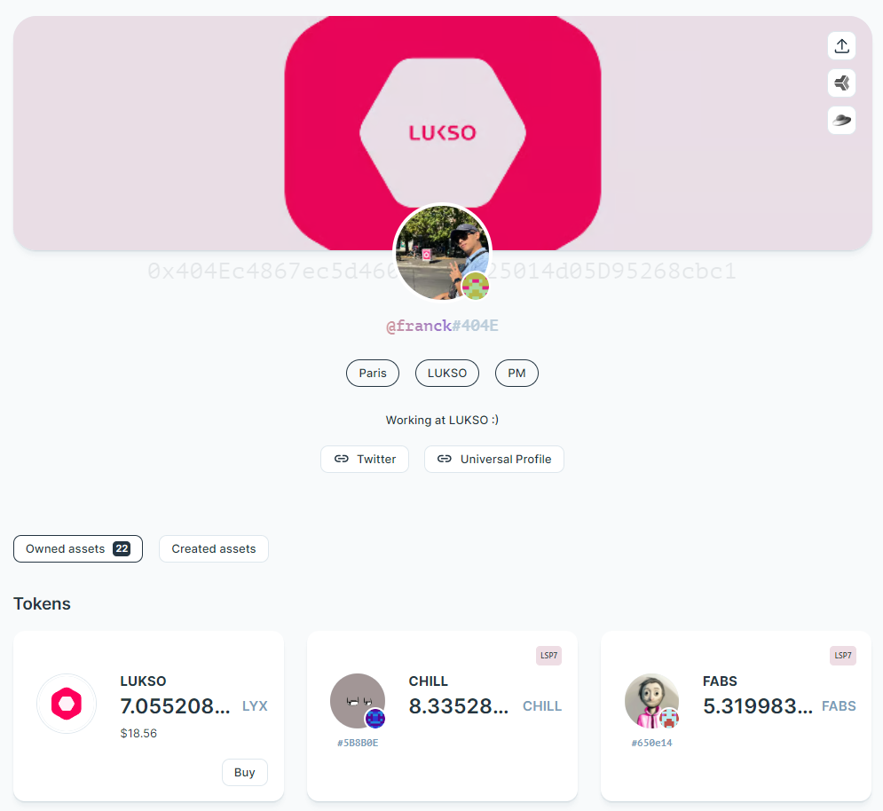
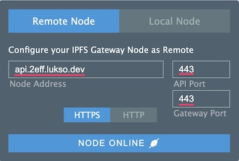

# Edit a Universal Profile

:::info Requirements

You will need a Universal Profile that you can control via its KeyManager to follow this guide. <br/>

:::

This guide will teach you how to **customize our Universal Profile** programmatically in JavaScript and includes:

- adding a profile and cover picture to our Universal Profile,
- editing our Universal Profile infos (e.g., description, badges, links),
- see the updated profile details and images of our Universal Profile on the [wallet.universalprofile.cloud](https://wallet.universalprofile.cloud/) website.

To achieve this goal, we will perform the following steps:

1. Create a JSON file that contains your profile details (`LSP3Profile` metadata).
2. Upload this JSON file to [IPFS] using our [tools-data-providers](https://github.com/lukso-network/tools-data-providers) library.
3. Set your new [profile metadata](https://github.com/lukso-network/LIPs/blob/main/LSPs/LSP-3-Profile-Metadata.md#lsp3profile) key to your Universal Profile with our [erc725.js](../../../tools/erc725js/getting-started.md) library and `web3.js`.



## Setup

Set up a new project with:

```shell
npm init
```

You can keep all the default values.

Then, install the dependencies, we will use a new tool in this guide: [erc725.js]:

```shell
npm install web3 @lukso/lsp-factory.js @lukso/lsp-smart-contracts @erc725/erc725.js
```

## Create a new LSP3Profile JSON file

:::success Recommendation
Complete "ready to use" JSON and JS files are available at the end in the [**Final Code**](#final-code) section.
:::

We will start by creating a **new JSON file** that will contain our [`LSP3Profile`](https://github.com/lukso-network/LIPs/blob/main/LSPs/LSP-3-Profile-Metadata.md#lsp3profile) metadata.

```json title="UniversalProfileMetadata.json"
{
  "LSP3Profile": {
    "name": "...", // a self chosen username
    "description": "...", // A description, describing the person, company, organisation or creator of the profile.
    "links": [
      // links related to the profile
      {
        "title": "...", // a title for the link.
        "url": "..." // the link itself
      }
      // add more links...
    ],
    "tags": ["...", "..."], // tags related to the profile
    "profileImage": [
      {
        "width": 640, // in pixels
        "height": 609, // in pixels
        "hashFunction": "keccak256(bytes)", // do not change!
        "hash": "0x...", // add the keccak256 hash of the image here
        "url": "ipfs://..." // IPFS image identifier (CID)
      }
    ],
    "backgroundImage": [
      {
        "width": 1024, // in pixels
        "height": 576, // in pixels
        "hashFunction": "keccak256(bytes)", // do not change!
        "hash": "0x...", // add the keccak256 hash of the image here
        "url": "ipfs://..." // IPFS image identifier (CID)
      }
    ]
  }
}
```

### Add more details to your profile

Add more details about the Universal Profile for the entity's name, description, links, and tags.

Be as creative as you want to make your Universal Profile as unique as possible! :art:

:::info Learn More
The properties `links` and `tags` accept an array of objects or strings, so you can add as many as you need!
:::

### Add a profile and background image

:::info
The JSON file for LSP3Profile accepts an array of images so that you have pictures of different sizes and dimensions.<br/>
This way, client interfaces can know which files to pick based on the container size in their interface.
:::

For the properties `profileImage` and `backgroundImage`, we will need to add the following information:

- `hash`: use this **[keccak256 image hash generator](https://emn178.github.io/online-tools/keccak_256_checksum.html)**.
- `url`: upload your images to the LUKSO IPFS Gateway.

Use this [IPFS file uploader tool](https://anarkrypto.github.io/upload-files-to-ipfs-from-browser-panel/public/#) with the settings shown below in green.

- IPFS Gateway: `api.2eff.lukso.dev`
- API Port / Gateway Port: `443`

:::caution Availability

This gateway is a deprecated IPFS cluster and will be shut down soon. We do not guarantee any SLA and highly recommend developers to use **their own IPFS gateway** solutions like [Pinata](https://docs.pinata.cloud/docs/welcome-to-pinata) or [Infura](https://docs.infura.io/networks/ipfs).

:::



Drag & Drop your images (you can upload multiple images at once) and _upload_ them. Once the process is completed:

1. Copy the IPFS file identifier (`CID`) shown in the `hash` field marked with green below.
2. Paste the `CID` into the `url` field in our JSON file, beginning with `ipfs://` at the start.


Make sure to save your JSON file after you have added all your details and images.

:::caution
Image sizes should be written as numbers, not as strings.

The **max image width** supported by [universalprofile.cloud](https://universalprofile.cloud) is: `profileImage <= 800px`, `backgroundImage <= 1800px`
:::

We are now ready to apply these changes to our Universal Profile. We will see how in the next section :arrow_down:

## Upload the JSON file to IPFS

:::note Notice
You should do the rest of this tutorial should be done in a **new file** (`main.js`).
:::

We will now start writing the main code of the tutorial.
Create a new file, `main.js`.

<!-- TODO: don't use lsp-factory anymore-->

```javascript title="main.js"
import { LSPFactory } from '@lukso/lsp-factory.js';
// reference to the previously created JSON file (LSP3Profile metadata)
import jsonFile from './UniversalProfileMetadata.json';

const provider = 'https://4201.rpc.thirdweb.com'; // RPC provider url

const lspFactory = new LSPFactory(provider, {
  deployKey: PRIVATE_KEY,
  chainId: 2828, // Chain Id of the network you want to deploy to
});

async function editProfileInfo() {
  // Step 2 - Upload our JSON file to IPFS
  const uploadResult = await lspFactory.UniversalProfile.uploadProfileData(
    jsonFile.LSP3Profile,
  );
  const lsp3ProfileIPFSUrl = uploadResult.url;
  // ipfs://Qm...
}
```

## Setup erc725.js and encode the LSP3Profile data

The next step is to **prepare the data** used to edit our Universal Profile. _Preparing the data_ means **encoding it** to write in on our Universal Profile ERC725Y smart contract.

To do so, we will use our [erc725.js] library, which helps us encode the data easily.

To set up the erc725.js library, we will need the following:

- The address of our Universal Profile contract: this is the address of our profile mentioned in the URL on the [profile explorer](https://universalprofile.cloud/).
- An ERC725Y JSON Schema: a set of ERC725Y key-value pairs ([LSP2 - ERC725Y JSON Schema](https://github.com/lukso-network/LIPs/blob/main/LSPs/LSP-2-ERC725YJSONSchema.md))
- A RPC provider: `https://4201.rpc.thirdweb.com`

Once our erc725.js is initialized, we can encode the `LSP3Profile` data to generate a key and a value.

To do so, we use the [`encodeData()`](../../../tools/erc725js/methods.md#encodeData) function. We call it with an object containing the `keyName` and the `value`:

- `keyName`: `LSP3Profile`, the name of the key we want to encode.
- `value`: an object with:
  - `hashFunction`: we use `keccak256` (standard hash function). Since we are hashing a JSON file that contains strings, we also specify the data type as `utf8`.
  - `hash:` obtained after hashing the JSON file with `keccak256`.
  - `url` of the file: this is the IPFS URL of the file, obtained in **step 2.**

In the **same file**, `main.js`, set up the erc725.js library.

```javascript title="main.js"
import Web3 from 'web3';
// import ERC725
import { ERC725 } from '@erc725/erc725.js';
// ...

const web3 = new Web3('https://4201.rpc.thirdweb.com');

// Step 1 - Create a new LSP3Profile JSON file
// ...

async function editProfileInfo() {
  // Step 2 - Upload our JSON file to IPFS
  // ...

  // Step 3.1 - Setup erc725.js
  const schema = [
    {
      name: 'LSP3Profile',
      key: '0x5ef83ad9559033e6e941db7d7c495acdce616347d28e90c7ce47cbfcfcad3bc5',
      keyType: 'Singleton',
      valueType: 'bytes',
      valueContent: 'VerifiableURI',
    },
  ];

  const erc725 = new ERC725(schema, profileAddress, web3.currentProvider, {
    ipfsGateway: 'https://api.universalprofile.cloud/ipfs',
  });

  // Step 3.2 - Encode the LSP3Profile data
  const encodedData = erc725.encodeData({
    keyName: 'LSP3Profile',
    value: {
      hashFunction: 'keccak256(utf8)',
      // hash our LSP3 metadata JSON file
      hash: web3.utils.keccak256(JSON.stringify(uploadResult.json)),
      url: lsp3ProfileIPFSUrl,
    },
  });
  /**
  { example keys & values
    keys: ['0x5ef83ad9559033e6e941db7d7c495acdce616347d28e90c7ce47cbfcfcad3bc5'],
    values: ['0x6f357c6aabbbf0d07b125d2c53c1ca19672e31ad768d8fd2ca55fbf0a6e94a39488a52c5697066733a2f2f516d59435154653572355a6556546274705a4d5a58535150324e785864674a46565a623631446b33674650355658']
  }
  */
}
```

## Edit the Universal Profile

Now that our updated data is encoded, we are ready to set it in our Universal Profile smart contract. To do so, we will interact with our Universal Profile smart contract via Web3.js.

### Load an EOA

We will need to interact with the smart contracts from an externally owned account (EOA).

The first step is to load our EOA using our private key from [the deployment step](../advanced-guides/deploy-up-with-lsp23.md).

```javascript title="Load account from a private key"
import Web3 from 'web3';
const web3 = new Web3('https://4201.rpc.thirdweb.com');

const PRIVATE_KEY = '0x...'; // your EOA private key (previously created)

const myEOA = web3.eth.accounts.wallet.add(PRIVATE_KEY);
```

### Create instance of UP

The first step is to create an instance of the Universal Profile smart contract. We will need:

- the contract ABI (from our npm package [`@lukso/lsp-smart-contracts`](https://www.npmjs.com/package/@lukso/lsp-smart-contracts)).
- the address of the Universal Profile contract.

```javascript title="Create contracts instances and get the Key Manager address"
import Web3 from 'web3';
import UniversalProfile from '@lukso/lsp-smart-contracts/artifacts/UniversalProfile.json';

const web3 = new Web3('https://4201.rpc.thirdweb.com');

// Step 4.2 - Create instance of our UP
const universalProfileContract = new web3.eth.Contract(
  UniversalProfile.abi,
  profileAddress,
);
```

### Set data on the Universal Profile

The final step is to edit our `LSP3Profile` key on our Universal Profile with the new value obtained in **Step 3**. We can easily access the key-value pair from the encoded data obtained with erc725.js.

<!-- prettier-ignore-start -->

```javascript title="Preparing and executing the setData transaction"
// Step 4.3 - Update LSP3Profile metadata on our Universal Profile
await universalProfileContract.methods.setData(
  encodedData.keys[0],
  encodedData.values[0],
).send({ from: myEOA.address, gasLimit: 300_000 });
```

<!-- prettier-ignore-end -->

## Final Code

Below is the complete code snippet of this guide, with all the steps compiled together.

<details>
    <summary><code>UniversalProfileMetadata.json</code> (example) - click to expand</summary>

```json
{
  "LSP3Profile": {
    "name": "LUKSO Profile - Getting Started",
    "description": "Congratulation! You have successfully edited your profile, and completed step 2 of the Getting Started guide 😃",
    "links": [
      {
        "title": "Website",
        "url": "https://mywebsite.me"
      }
    ],
    "tags": ["Public Profile"],
    "profileImage": [
      {
        "width": 640,
        "height": 609,
        "hashFunction": "keccak256(bytes)",
        "hash": "0xe459e5769af85b09fb43bb8eaac561e196d58c0f5da3c5e150b6695898089402",
        "url": "ipfs://QmPCz896rcZmq8F3FuUkJinRUmPgnZGjPvZL71nAaL7Fsx"
      }
    ],
    "backgroundImage": [
      {
        "width": 1024,
        "height": 576,
        "hashFunction": "keccak256(bytes)",
        "hash": "0x1c19780d377a7b01f7dcf16e0ebffd225e29d2235625009f67cf9d86a32a79e1",
        "url": "ipfs://QmPMmEpKnmgACsWjhDUheF8TEKpspzQhAkjbY4EBbR4jgP"
      }
    ]
  }
}
```

</details>

```javascript title="main.js"
import Web3 from 'web3';
import { ERC725 } from '@erc725/erc725.js';
import { LSPFactory } from '@lukso/lsp-factory.js';

import UniversalProfile from '@lukso/lsp-smart-contracts/artifacts/UniversalProfile.json';

import jsonFile from './UniversalProfileMetadata.json';

const web3 = new Web3('https://4201.rpc.thirdweb.com');

// constants
const PRIVATE_KEY = '0x...';
const profileAddress = '0x...';

// Step 1 - Create a new LSP3Profile JSON file

const provider = 'https://4201.rpc.thirdweb.com'; // RPC provider url

const lspFactory = new LSPFactory(provider, {
  deployKey: PRIVATE_KEY,
  chainId: 2828, // Chain Id of the network you want to deploy to
});

async function editProfileInfo() {
  // Step 2 - Upload our JSON file to IPFS
  const uploadResult = await lspFactory.UniversalProfile.uploadProfileData(
    jsonFile.LSP3Profile,
  );
  const lsp3ProfileIPFSUrl = uploadResult.url;
  // 'ipfs://QmYCQTe5r5ZeVTbtpZMZXSQP2NxXdgJFVZb61Dk3gFP5VX'

  // Step 3.1 - Setup erc725.js
  const schema = [
    {
      name: 'LSP3Profile',
      key: '0x5ef83ad9559033e6e941db7d7c495acdce616347d28e90c7ce47cbfcfcad3bc5',
      keyType: 'Singleton',
      valueType: 'bytes',
      valueContent: 'VerifiableURI',
    },
  ];

  const erc725 = new ERC725(schema, profileAddress, web3.currentProvider, {
    ipfsGateway: 'https://api.universalprofile.cloud/ipfs',
  });

  // Step 3.2 - Encode the LSP3Profile data (to be written on our UP)
  const encodedData = erc725.encodeData({
    keyName: 'LSP3Profile',
    value: {
      hashFunction: 'keccak256(utf8)',
      // hash our LSP3 metadata JSON file
      hash: web3.utils.keccak256(JSON.stringify(uploadResult.json)),
      url: lsp3ProfileIPFSUrl,
    },
  });

  // Step 4.1 - Load our EOA
  const myEOA = web3.eth.accounts.wallet.add(PRIVATE_KEY);
  console.log('EOA:', myEOA.address);

  // Step 4.2 - Create instance of our UP
  const universalProfileContract = new web3.eth.Contract(
    UniversalProfile.abi,
    profileAddress,
  );

  // Step 4.3 - Set data (updated LSP3Profile metadata) on our Universal Profile
  await universalProfileContract.methods
    .setData(encodedData.keys, encodedData.values)
    .send({ from: myEOA.address, gasLimit: 300_000 });
}
editProfileInfo();
```

## Visualize our updated Universal Profile

You can now check your UP on the [profile explorer](https://universalprofile.cloud/) website (make sure you are on the correct network - there is a network switch in the footer):

`https://wallet.universalprofile.cloud/[UP ADDRESS]?network=testnet`

<!-- add up to date picture of wallet.universalprofile.cloud -->

[erc725.js]: ../../../tools/erc725js/getting-started
[ipfs]: https://ipfs.io/
