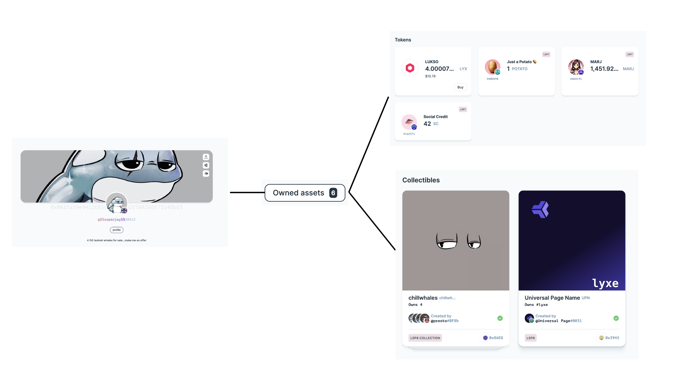
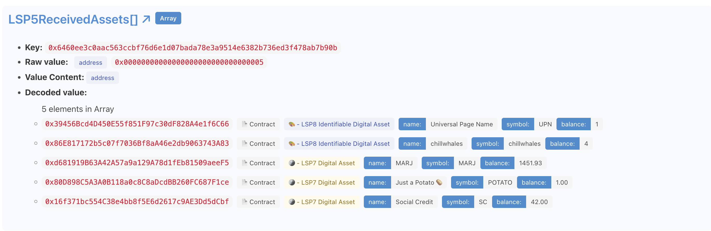

# Get Profile's Owned Assets



:::success Tip

To see the list of assets a Universal Profile owns (Tokens and NFTs), go to [🔗 UniversalProfile.cloud](https://universalprofile.cloud/). This will list the UP's owned tokens and NFTs with their images.

Simply type the name of the Universal Profile or paste its address in the search field, or use the following link, pasting its address at the end: `https://universalprofile.cloud/0x<universal-profile-address>`.

:::

Every Universal Profile deployed with the [**🧩 Universal Profile Browser Extension**](/install-up-browser-extension) comes with a 📢 [Universal Receiver delegate](../../../standards/accounts/lsp1-universal-receiver-delegate.md) that register automatically the list of assets it owns.

This guide shows you how to easily retrieve the list of owned asset, by fetching the values stored under the [`LSP5ReceivedAssets[]`](../../../standards/metadata/lsp5-received-assets.md#lsp5receivedassets) data key.

## Using erc725.js

The [erc725.js](../../../tools/libraries/erc725js/getting-started.md) enable us to do that easily.

```bash
npm i @erc725/erc725.js
```

We can then simply import the JSON schema of the [LSP5ReceivedAssets](../../../standards/metadata/lsp5-received-assets.md), create an instance of the library connected to our Universal Profile and fetch the `LSP5ReceivedAssets[]` data key to retrieve all the asset addresses.

```ts
import { ERC725 } from '@erc725/erc725.js';
import LSP5Schema from '@erc725/erc725.js/schemas/LSP5ReceivedAssets.json';

const erc725js = new ERC725(
  LSP5Schema,
  '0xBA1fa59e9412EB5cDB554252f5BA26Df7514Dbf5', // Address of the Universal Profile
  'https://42.rpc.thirdweb.com', // LUKSO Testnet RPC
);

const result = await erc725js.getData('LSP5ReceivedAssets[]');
/**
  {
    name: 'LSP5ReceivedAssets[]',
    key: '0x6460ee3c0aac563ccbf76d6e1d07bada78e3a9514e6382b736ed3f478ab7b90b',
    value: [
      '0x39456Bcd4D450E55f851F97c30dF828A4e1f6C66',
      '0x86E817172b5c07f7036Bf8aA46e2db9063743A83',
      '0xd681919B63A42A57a9a129A78d1fEb81509aeeF5',
      '0x80D898C5A3A0B118a0c8C8aDcdBB260FC687F1ce',
      '0x16f371bc554C38e4bb8f5E6d2617c9AE3Dd5dCbf',
    ],
  },
*/
```

## Using ERC725-Inspect

Alternatively, our convenience UI tool ERC725-Inspect enables you to retrieve the list of **LSP5 Received Assets** easily. Simply:

1. Go to [https://erc725-inspect.lukso.tech/](https://erc725-inspect.lukso.tech/)
2. Select the network at the top right.
3. Paste the address of the Universal Profile on the search field
4. Scroll down until you reach the data key **`LSP5ReceivedAssets[]`**

You should see an array of addresses similar to above. Additionally, the tool can display if the asset is an LSP7 or LSP8 contract, its name, symbol and the UP's balance for this asset.

[**➡️ Demo Example**](https://erc725-inspect.lukso.tech/inspector?address=0xBA1fa59e9412EB5cDB554252f5BA26Df7514Dbf5&network=mainnet)


