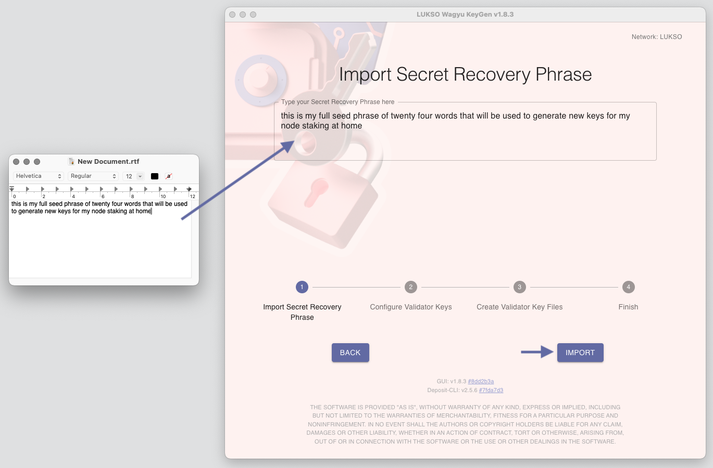

# Create Deposit Keys

You can generate Validator Deposit Keys using the following tools:

- [LUKSO Wagyu](https://github.com/lukso-network/tools-wagyu-key-gen)
- [LUKSO CLI Keygen](https://github.com/lukso-network/tools-key-gen-cli)

Please **read through their documentation** before downloading any of the tools. Upon first use, it will generate a fresh _Validator Seed Phrase_ that you have to store safely. The _Validator Seed Phrase_ is then used to generate a fixed number of Validator Deposit Keys.

:::tip

For security reasons, please generate your deposit keys on an offline device, ideally on a fresh install.

:::

If you want to add deposit keys to an existing Validator Seed Phrase, you can use the above tools and choose: _Generate keys using an existing recovery seed_. You then have to define the number of already existing deposit keys and new ones you would like to create.

## How to input a Validator Seed into the Wagyu Client?

:::caution Issue

There is currently an issue when trying to use an **existing Validator Seed Phrase** within the [LUKSO Wagyu Keygen](https://github.com/lukso-network/tools-wagyu-key-gen) tool, permitting you from typing spaces.

:::

If you are experiencing this issue, please write your _Validator Seed Phrase_ in a blank document, separated by spaces. Then **copy the full content** into the import screen of the [LUKSO Wagyu Keygen](https://github.com/lukso-network/tools-wagyu-key-gen) tool:

:::tip

Before continuing with the import, ensure all words are written correctly and in order.

:::
