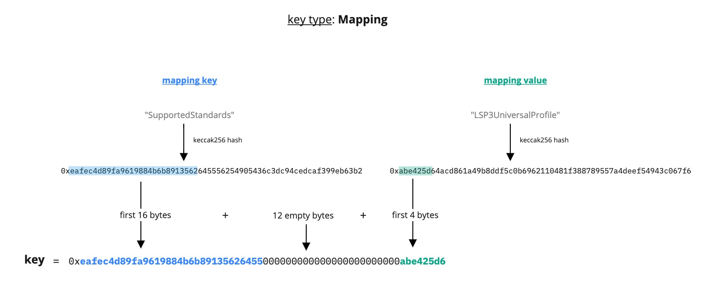
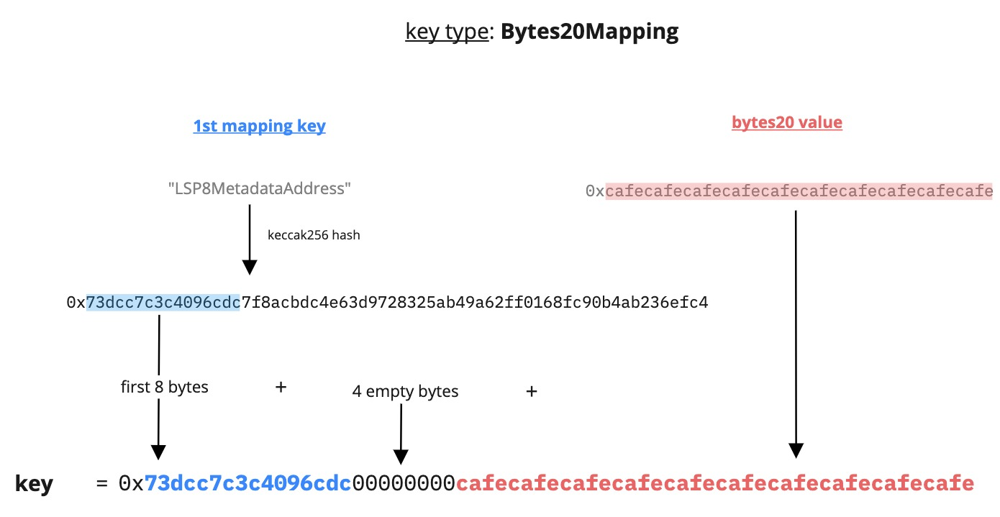
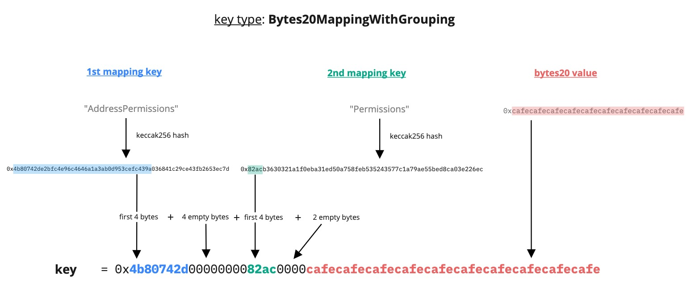

# LSP2 - ERC725Y JSON Schema

:::info Standard Document

[LSP2 - ERC725Y JSON Schema](https://github.com/lukso-network/LIPs/blob/main/LSPs/LSP-2-ERC725YJSONSchema.md)

:::

:::success Recommendation

Our [JavaScript library `erc725.js`](../../tools/erc725js/getting-started.md) makes it easy to read + write data encoded according to the LSP2 Schema, without going through all the encoding complexity manually.

:::

## Introduction

Data in the storage of a smart contract is organised in **slots**. Each piece of data is stored at a specific storage slot. These slots are numbered (as a `uint256`), starting from slot 0.

> Therefore, smart contracts understand only 2 languages: `bytes` and `uint256`.

Take the following key-value pair for instance. It is not easy to infer the meaning of these keys by reading them as **bytes**.

```
(key)                                                              => (value)
0xdeba1e292f8ba88238e10ab3c7f88bd4be4fac56cad5194b6ecceaf653468af1 => 0x4d7920546f6b656e20322e30
```

Using **slots numbers** and **raw bytes** makes the contract storage very hard to work with. [ERC725Y](../universal-profile/01-lsp0-erc725account#erc725y---generic-key-value-store) solves part of the problem through a more flexible storage layout, where data is addressed via `bytes32` keys. However with such low-level languages, this makes it difficult for humans to understand the data in the storage.

Finally, everyone can store information differently on contracts like [ERC725Account](../universal-profile/01-lsp0-erc725account), depending on individual use cases and needs. There is no standard schema that defines what is the data and what the data looks like. This makes it very hard for ERC725Account to interact with each other, and for external services to interact with ERC725Accounts.

## What does this standard represent?

### Specification

LSP2 aims to offer a better abstraction on top of a smart contract storage.

This standard introduces a JSON schema that enables to represent the storage of a smart contract through more understandable keys. Data in a smart contract can be stored in a more organised way.


By introducing a schema, contract storage can be represented in the same way across contracts in the network. Everyone has a unified view of the data stored between smart contracts. Data can then be easily parsed, and contracts or interfaces can read or write data from/to the contract storage in the same manner. This makes smart contracts **more interoperable with each other**.

### How does LSP2 work?

LSP2 introduces new ways to encode data, depending on its type. From a single entry, to multiple entires (like arrays or maps).

A key in the contract storage can be defined as a JSON object, with properties that describes the key.

```json
{
  "name": "LSP4TokenName",
  "key": "0xdeba1e292f8ba88238e10ab3c7f88bd4be4fac56cad5194b6ecceaf653468af1",
  "keyType": "Singleton",
  "valueType": "string",
  "valueContent": "String"
}
```

## Key Types

There are several **key types** defined in LSP2.

- Singleton
- Array
- [Mapping](#mapping)
- [Bytes20Mapping](#bytes20mapping)
- [Bytes20MappingWithGrouping](#bytes20mappingwithgrouping)

### Mapping

Below is an example of a **Mapping** key type.

```json
{
  "name": "SupportedStandards:LSP3UniversalProfile",
  "key": "0xeafec4d89fa9619884b6b89135626455000000000000000000000000abe425d6",
  "keyType": "Mapping",
  "valueType": "bytes4",
  "valueContent": "0xabe425d6"
}
```



### Bytes20Mapping

Below is an example of **Bytes20Mapping** key type.

```json
{
  "name": "LSP8MetadataAddress:0x20BytesTokenIdHash",
  "key": "0x73dcc7c3c4096cdc00000000cafecafecafecafecafecafecafecafecafecafe",
  "keyType": "Bytes20Mapping",
  "valueType": "Mixed",
  "valueContent": "Mixed"
}
```



### Bytes20MappingWithGrouping

Below is an example of a **Bytes20MappingWithGrouping** key type.

```json
{
  "name": "AddressPermissions:Permissions:<address>",
  "key": "0x4b80742d0000000082ac0000<address>",
  "keyType": "Bytes20MappingWithGrouping",
  "valueType": "bytes32",
  "valueContent": "BitArray"
}
```


