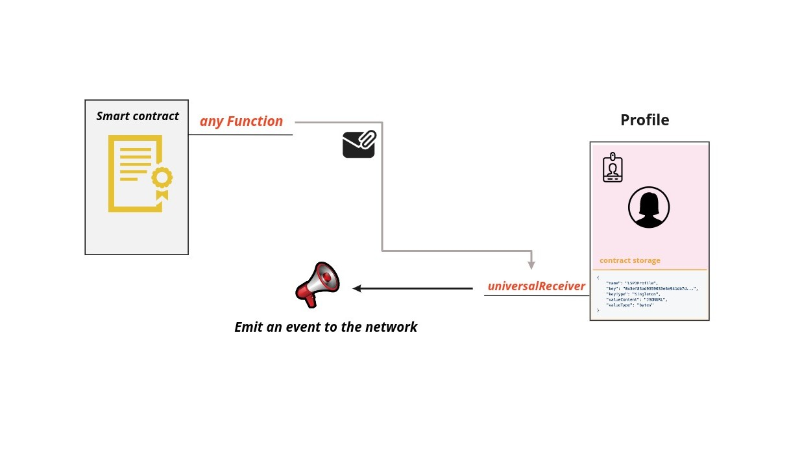

# LSP1 - Universal Receiver

:::info Standard Document

[LSP1 - Universal Receiver](https://github.com/lukso-network/LIPs/blob/main/LSPs/LSP-1-UniversalReceiver.md)

:::

## Introduction

There is often the need for smart contracts to **be aware of incoming transactions**, especially when it comes to value transfers.

A good example is ERC20 token transfers. When a smart contract receives a token, it has no generic way to be notified about it. One solution to this problem could be to monitor the receiving contract, by listening for ERC20 token transfer events.

However, this requires using a trusted third party to monitor the contract. Such method limits the autonomy of smart contracts, and introduces a single point of failure.

One way to solve this problem is by creating a standard **universal function**, that any smart contract can implement. Wallets or profiles could use this function to notify the user about an incoming asset, information, followers, etc ...

## What does this standard represent ?

### Specification

This standard defines a single function named `universalReceiver(...)` that could receive **any arbitrary information**. It takes two parameters:

- bytes32 `typeId` : Hash or Hook of a specific standard.
- bytes `data` : Any arbitrary data.

The **universalReceiver** function emits an event with the data passed to it along with some additional data. It could be customized to **revert on calls**, this way the smart contract implementing it won't be able to receive **assets, information**, etc ..

> Receiving contracts should take the `typeId` into consideration to properly **decode the data**.



Smart contracts that are willing to implement this function are well advised **to register** the **[LSP1UniversalReceiver InterfaceId](../smart-contracts/interface-ids.md)** **using ERC165** to let other contracts know that they support this standard.

## Extension

An **optional extension** to this standard is proposed to let contracts not just be notified on the incoming and outcoming transactions but to delegate their response to an external upgradeable contract that could **handle and react to certain calls** with custom logic.

This is possible through setting the address of the **external contract** as value for the **LSP1UniversalReceiver key** below, in the **[ERC725Y key value store](https://github.com/ERC725Alliance/erc725/blob/main/docs/ERC-725.md#erc725y)** of the contract implementing the **universalReceiver** function.

```json
{
  "name": "LSP1UniversalReceiverDelegate",
  "key": "0x0cfc51aec37c55a4d0b1a65c6255c4bf2fbdf6277f3cc0730c45b828b6db8b47",
  "keyType": "Singleton",
  "valueType": "address",
  "valueContent": "Address"
}
```

Check **[LSP1-UniversalReceiverDelegate](../universal-profile/02-lsp1-universal-receiver-delegate.md)** standard for more info.

## References

- [LUKSO Standards Proposals: LSP1 - Universal Receiver (Standard Specification, GitHub)](https://github.com/lukso-network/LIPs/blob/main/LSPs/LSP-1-UniversalReceiver.md)
