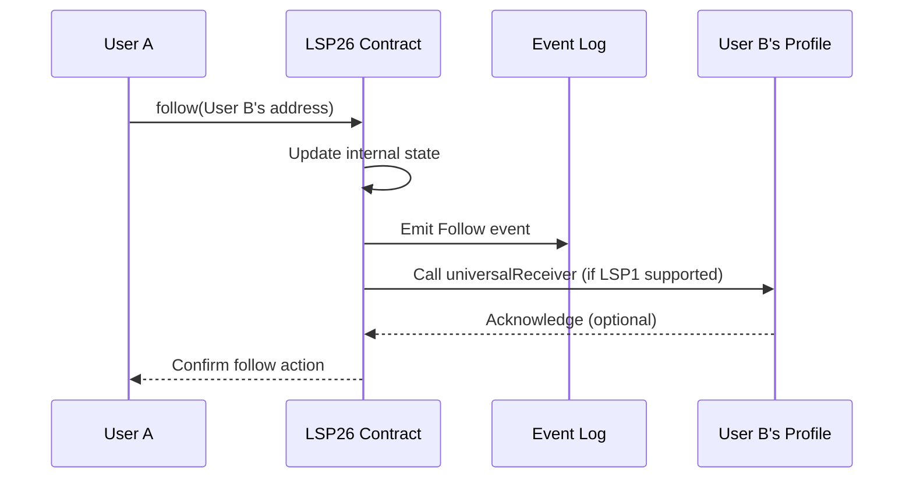

# LSP26 - Follower System

:::info Standard Document

[LSP26 - Follower System](https://github.com/lukso-network/LIPs/blob/main/LSPs/LSP-26-FollowerSystem.md)

:::

## Introduction

LSP26 introduces a Follower System that allows any address — whether it's a smart contract account like an [ERC725Account](../universal-profile/lsp0-erc725account.md), or even an Externally Owned Account (EOA) — to participate in a decentralized social graph.

## What does this standard represent?

LSP26 defines a smart contract registry that maintains two crucial lists for each participating address:

1. **Follows**: A list of addresses that an address is following.
2. **Followers**: A list of addresses that follow an address.

This system provides a foundation for social features in blockchain applications, enabling developers to create more engaging and interconnected user experiences.

## Specification

The LSP26 Follower System is implemented as a smart contract with the following key functions:

### Core Functions

- `follow(address addr)`: Allows an address to follow another address.
- `unfollow(address addr)`: Allows an address to unfollow another address.
- `followBatch(address[] memory addresses)`: Enables following multiple addresses in a single transaction.
- `unfollowBatch(address[] memory addresses)`: Enables unfollowing multiple addresses in a single transaction.

### Query Functions

- `isFollowing(address follower, address addr)`: Checks if one address is following another.
- `followerCount(address addr)`: Returns the number of followers for an address.
- `followingCount(address addr)`: Returns the number of addresses an address is following.
- `getFollowsByIndex(address addr, uint256 startIndex, uint256 endIndex)`: Retrieves a paginated list of addresses that an address is following.
- `getFollowersByIndex(address addr, uint256 startIndex, uint256 endIndex)`: Retrieves a paginated list of followers for an address.

### Events

- `Follow(address follower, address addr)`: Emitted when an address starts following another.
- `Unfollow(address unfollower, address addr)`: Emitted when an address unfollows another.

## LSP1 Integration

LSP26 integrates with [LSP1-UniversalReceiver](../generic-standards/lsp1-universal-receiver.md) to notify addresses when they are followed or unfollowed:

- When following: Calls `universalReceiver` with `typeId`: `keccak256('LSP26FollowerSystem_FollowNotification')`
- When unfollowing: Calls `universalReceiver` with `typeId`: `keccak256('LSP26FollowerSystem_UnfollowNotification')`

This integration allows for real-time reactions to follower changes, enhancing the interactive capabilities of LSP26-compatible addresses.

## Deployment

The official LSP26 Follower System contract is deployed at `0xf01103E5a9909Fc0DBe8166dA7085e0285daDDcA` on the LUKSO mainnet. This address is consistent across different EVM-compatible networks when deployed using the [Nick Factory contract](https://github.com/Arachnid/deterministic-deployment-proxy/tree/master).

:::tip
The deployed [implementation code can be found here](https://github.com/lukso-network/lsp-smart-contracts/tree/bdd0f74dc88a8165f3d27aaa86d27faa3f81cff9/packages/lsp26-contracts/contracts).
:::

## Example Use-Cases

> **Goals:**
>
> - Establish an on-chain follower system for addresses
> - Enable decentralized curation of social connections
> - Provide a foundation for social features in blockchain applications

1. **Social Media Dapps**: Build decentralized social platforms with follower/following functionality.
2. **Content Curation**: Create personalized content feeds based on followed addresses.
3. **Reputation Systems**: Develop trust or influence metrics based on follower counts and relationships.
4. **Decentralized Identity**: Enhance digital identities with social graph information.

LSP26 Follower System provides a robust foundation for building social features into blockchain applications. By standardizing how following relationships are managed on-chain, it opens up new possibilities for decentralized social interactions and user-centric experiences in the Web3 ecosystem.
