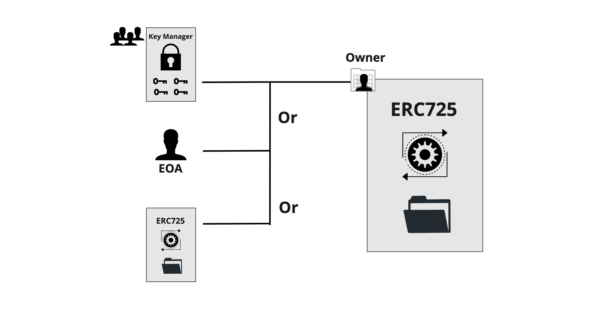
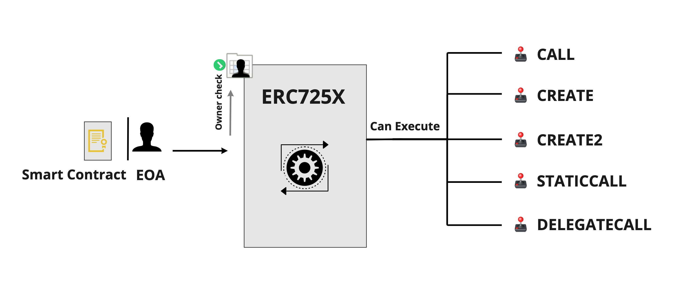
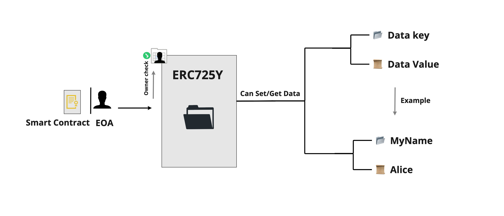
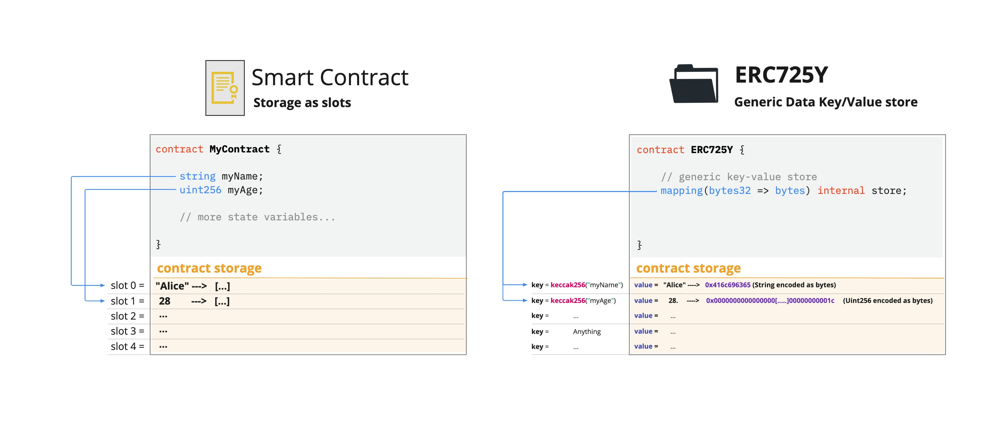

# ERC725

:::info Standard Document

[ERC725 - General Executor and Data Key/Value Store](https://github.com/ERC725Alliance/ERC725/blob/develop/docs/ERC-725.md)

:::

## Introduction

Using Extenrally Owned Accounts is limiting and risky as if the private key of the account gets leaked, anyone can execute any transaction from it, transferring all assets owned by the account. Also, data cannot be attached to it and it's limited to performing the CALL and CREATE opcode.

In order to have a more secure account, more flexible execution on the blockchain, and the ability to attach endless data, a smart contract should be used to ensure a safe ownership process, more operations to execute, and endless data store availability.

## What does this standard represent?

This standard is formed from 2 sub-standards that could be implemented stand-alone or together.   
**[ERC173](https://eips.ethereum.org/EIPS/eip-173)** is used in both standards to provide ownership on the smart contract functions, where the owner could be an Externally Owned Account (EOA) or a smart contract (Another ERC725 contract, Key Manager contract, etc).

### ERC725X - Generic Executor

This sub-standard enables the owner to execute generic calls on any other account, including calling contract functions and transferring native tokens along with the call. These actions are possible via the [`execute(...)`](../smart-contracts/lsp0-erc725-account.md#execute) function in the smart contract.

The ERC725X standard also enables deploying new smart contracts by providing the bytecode of the new contract to deploy as an argument to the `execute(...)` function. Contracts can be deployed using either CREATE or [CREATE2](https://eips.ethereum.org/EIPS/eip-1014).

The following types of calls (= operation types) are available:

:::warning

The DELEGATECALL operation is very dangrous as it can alter the state of the contract and also change owner variables at will. Additionally it can destroy the contract by calling selfdestruct on other contracts.

:::

| Operation number |                     Operation type                     | Description                                                                                                                             |
| :--------------: | :----------------------------------------------------: | :-------------------------------------------------------------------------------------------------------------------------------------- |
|        0         |          [`CALL`](https://www.evm.codes/#f1)           | call another smart contract or EOA                                                                                                            |
|        1         |         [`CREATE`](https://www.evm.codes/#f0)          | create a new smart contract with the associated bytecode passed as `data`                                                              |
|        2         |  [`CREATE2`](https://eips.ethereum.org/EIPS/eip-1014)  | create a new smart contract with the passed bytecode and the **salt** (for pre-computed contract addresses)                                                       |
|        3         | [`STATICCALL`](https://eips.ethereum.org/EIPS/eip-214) | call another smart contract while disallowing any modification to the state during the call                                             |
|        4         | [`DELEGATECALL`](https://eips.ethereum.org/EIPS/eip-7) | run the function from another contract, but use and update the storage of the current contract (= persist `msg.sender` and `msg.value`) |

### ERC725Y - Generic Data Key/Value Store

:::note

See the section **["Layout of State Variables in Storage"](https://docs.soliditylang.org/en/v0.8.11/internals/layout_in_storage.html)** in the Solidity documentation for more information about the structure of smart contract storage.

:::

This sub-standard enables the account to hold arbitrary data through a generic data key/value store. It gives flexibility to the contract storage. Developers can access the data stored in the contract via data keys instead of referencing the storage slot where the data resides.

As defined below, the data keys are represented as **bytes32** and the data values are represented as **bytes**. This allows more flexibility and support for complex variable types.
  
Difference between Standard Smart Contract Storage and ERC725Y - Generic Data Key/Value Storage:

Once deployed on the network, the contract representing the Standard Smart Contract Storage cannot add more variables to the storage whereas ERC725Y contract can always do.

Thanks to ERC725Y, contracts become more interoperable, as their storage is represented in the same way. Contracts and interfaces can then read and write data from or to the storage in the same manner via the functions [`getData(...)`](../smart-contracts/lsp0-erc725-account.md#getdata) and [`setData(...)`](../smart-contracts/lsp0-erc725-account.md#setdata).

### ERC725Y Data Representation

Since the data key/value pair is set in the storage as **bytes32**/**bytes**, a representation of this data should be standardized to avoid having each user writing the data in a different way and to have the ability to getData from other people contract storage in a unified way.

**[LSP2 - ERC725YJSONSchema](../generic-standards/lsp2-json-schema.md)** is the standard used by the LSPs to organize how the data should be represented as **bytes32**/**bytes** pairs.