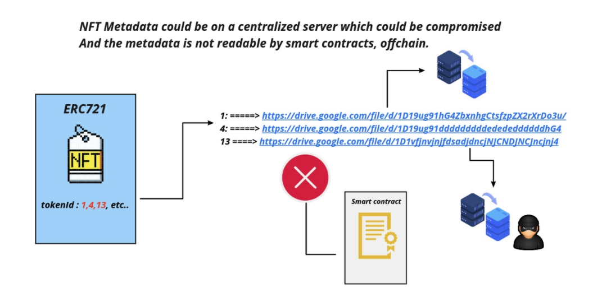
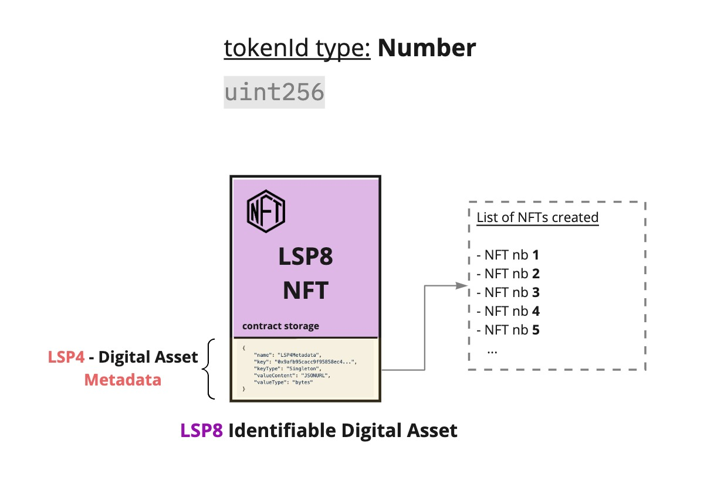
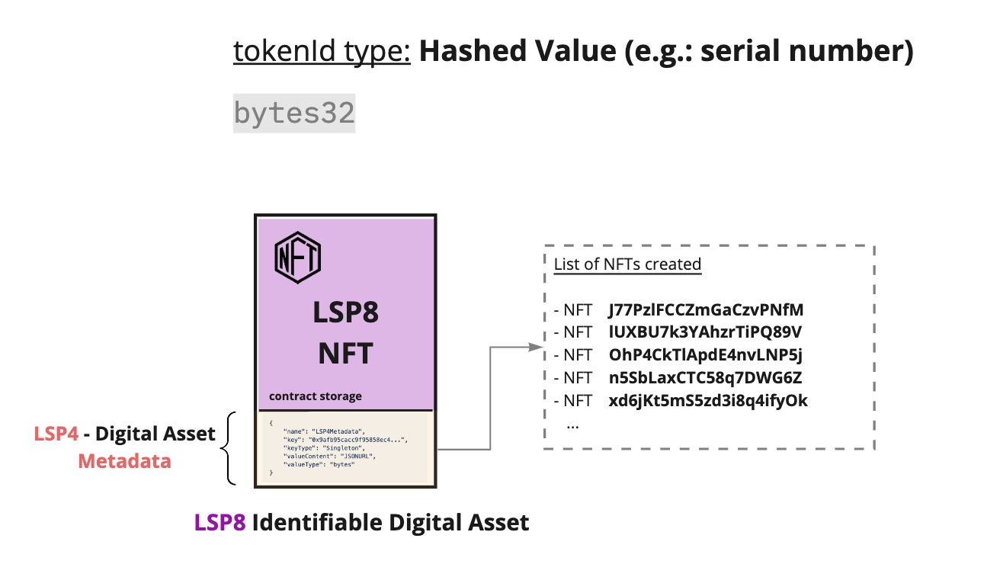
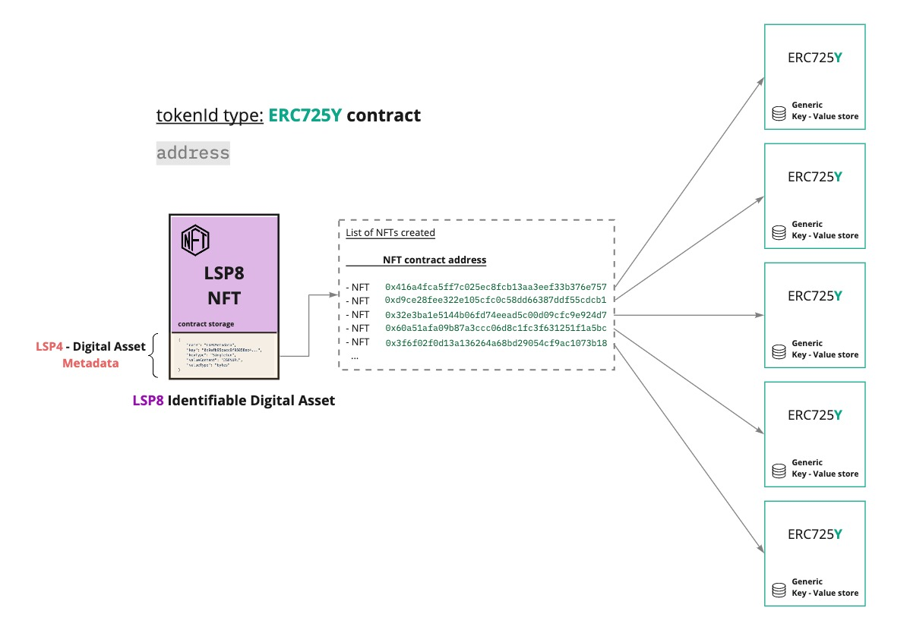

# LSP8 - Identifiable Digital Asset

:::info Standard Document

[LSP8 - Identifiable Digital Asset](https://github.com/lukso-network/LIPs/blob/main/LSPs/LSP-8-IdentifiableDigitalAsset.md)

:::

## Introduction

When it comes to Non Fungible Tokens (NFTs), one of the key characteristics that make such assets uniques is their **metadata.**

In their current state, such assets are created as ERC721 tokens. However, they present certain limitations:

- _the Metadata attached to the NFT (represented with `tokenURI`) is a **reference** to a file._

This raises several questions around the location of where the token metadata is stored. Is a central service used to store the metadata? What about if such service goes down?

- _the only data that can be attached to an NFT is a `name` and `symbol`._

Each NFT has its own characteristics and specific details. This is what makes each NFT unique. But how can we attach more informations-specific to an NFT? Or **how can we query one singular information** specific to an NFT, without having to retrieve and search through the entire metadata?

- _Metadata can be altered_

If the Metadata for an NFT is a link to a JSON file, how do we know if it has been altered? This presents a large problem. If the rules and logic of an application would be based on the metadata related to an NFT, any unexpected change to the data could affect the whole application as a whole.

- _the NFT Metadata is set in stone._

How about if we want to represent NFTs as more than just a set of information in a JSON file? How about if we want NFTs to act as _"digital liveable things"_ that can **change**, **evolve** or **be upgraded over time**?

A good example where all these problems could have effects is a video game. An NFT could be used to represent a unique item like a weapon. We might want the player to have the ability to upgrade the weapon features over time, so that it becomes more powerful.

## What does this Standard represent?

LSP8 Identifiable Digital Asset is a standard that aims to describe _non-fungible_ assets. _Non-fungible_ means that each asset is unique and different. They are distinguishable from each other, and therefore not interchangeable.

Since every single asset is unique on its own, they are differentiated by a unique identifier: a `tokenId`. The identifier can be anything from a unique serial number to another [ERC725Y](https://github.com/ERC725Alliance/ERC725/blob/main/docs/ERC-725.md#erc725y) smart contract that contains information and metadata specific to this `tokenId`.

LSP8 solves the current problems of NFTs by using the ERC725Y standard as its base. By using a generic key-value store, an LSP8 contract comes now with the following features:

- attach an unlimited amount of information (= metadata), making the asset more customisable and more unique.
- know when the metadata has been altered, as a `DataChanged` event will be emitted in ERC725Y.
- Metadata is now **hash reference** (= data reference), instead of URL reference.

LSP8 assets are similar to [ERC721](https://eips.ethereum.org/EIPS/eip-721) tokens (NFTs). What makes them different is their underlying base, making them more customisable and their metadata more upgradable over time. This is what makes them a new generation of unique assets known as **NFT 2.0**.

### NFT Metadata

One of the key differences of LSP8 is that it allows representing each NFT as more than just a unique `tokenId` number. Each newly created `tokenId` (NFT) has its own metadata, that describes its uniqueness. Such metadata can be a reference either:

- _off-chain_ (a **JSON file URL** stored on IPFS, a public/private registry, etc...)
- _on-chain_ (another **ERC725Y smart contract**)

It is possible to know where the metadata for a specific `tokenId` is located by simply querying the LSP8 contract, giving the `tokenId` as an argument.

One benefit of using an ERC725Y metadata contract per singular `tokenId` / NFT is that the metadata related to this NFT can then be edited. This makes the metadata flexible and upgradable. It enables the representation of very unique NFTs, that can be altered over time.

## Types of `tokenId`

:::caution

It is recommended that the `tokenId` should not change over the lifecycle of the LSP8 contract.

:::

An LSP8 NFT can be represented in multiple ways, depending on the type of `tokenId` used.

- a **number** (`uint256`), that increments on each newly minted NFT.
- a unique `bytes32` value (representing a _serial number_ for instance).
- an ERC725Y contract.

---

### NFTs as ERC725Y contracts

If each NFT is represented by its own ERC725Y contract (= metadata contract), this contract contains informations like:

- the `address` of the contract that minted this NFT.
- the `tokenId` of this NFT.

## References

- [LUKSO Standards Proposals: LSP8 - Identifiable Digital Asset (Standard Specification, GitHub)](https://github.com/lukso-network/LIPs/blob/main/LSPs/LSP-8-IdentifiableDigitalAsset.md)
