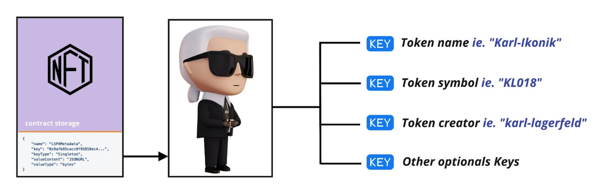

# LSP4 - Digital Asset Metadata

:::info Standard Document

[LSP4 - Digital Asset Metadata](https://github.com/lukso-network/LIPs/blob/main/LSPs/LSP-4-DigitalAsset-Metadata.md)

:::

## Introduction

**LSP4-DigitalAsset-Metadata** is a Metadata standard that defines a set of data keys to describe a **Digital Asset**.

In ERC20 and ERC721, the token `name` and `symbol` are stored as `public` state variables.
In **LSP4 - Digital Asset Metadata**, such information is held under the data keys `LSP4TokenName` and `LSP4TokenSymbol` under the (ERC725Y) storage of the token / NFT contract.

Both [LSP7](./LSP7-Digital-Asset.md) and [LSP8](./LSP8-Identifiable-Digital-Asset.md) standards are derived from the [LSP4 - Digital Asset Metadata](https://github.com/lukso-network/LIPs/blob/main/LSPs/LSP-4-DigitalAsset-Metadata.md), which defines the default metadata keys representing a digital asset on the blockchain.



## ERC725Y Data Keys

### `SupportedStandards:LSP4DigitalAsset`

```json
{
  "name": "SupportedStandards:LSP4DigitalAsset",
  "key": "0xeafec4d89fa9619884b60000a4d96624a38f7ac2d8d9a604ecf07c12c77e480c",
  "keyType": "Mapping",
  "valueType": "bytes4",
  "valueContent": "0xa4d96624"
}
```

This key is used to know if the contract represents a **Digital Asset**.

### `LSP4TokenName`

```json
{
  "name": "LSP4TokenName",
  "key": "0xdeba1e292f8ba88238e10ab3c7f88bd4be4fac56cad5194b6ecceaf653468af1",
  "keyType": "Singleton",
  "valueType": "string",
  "valueContent": "String"
}
```

The value attached to this data key represents the name of the digital asset.

### `LSP4TokenSymbol`

```json
{
  "name": "LSP4TokenSymbol",
  "key": "0x2f0a68ab07768e01943a599e73362a0e17a63a72e94dd2e384d2c1d4db932756",
  "keyType": "Singleton",
  "valueType": "string",
  "valueContent": "String"
}
```

The value attached to this data key represents the symbol of the digital asset.

### `LSP4Metadata`

```json
{
  "name": "LSP4Metadata",
  "key": "0x9afb95cacc9f95858ec44aa8c3b685511002e30ae54415823f406128b85b238e",
  "keyType": "Singleton",
  "valueType": "bytes",
  "valueContent": "JSONURL"
}
```

The value attached to this data key is a [`JSONURL`](https://github.com/lukso-network/LIPs/blob/main/LSPs/LSP-2-ERC725YJSONSchema.md#jsonurl). It represents a reference to a [JSON file describing the **Digital Asset**](https://github.com/lukso-network/LIPs/blob/main/LSPs/LSP-4-DigitalAsset-Metadata.md#lsp4metadata). The file can be stored on centralized or decentralized storage.

### LSP4Creators

This data key refers to the `address`(es) of the creator(s) for the digital asset.

```json
{
  "name": "LSP4Creators[]",
  "key": "0x114bd03b3a46d48759680d81ebb2b414fda7d030a7105a851867accf1c2352e7",
  "keyType": "Array",
  "valueType": "address",
  "valueContent": "Address"
}
```

```json
{
  "name": "LSP4CreatorsMap:<address>",
  "key": "0x6de85eaf5d982b4e5da00000<address>",
  "keyType": "Mapping",
  "valueType": "bytes",
  "valueContent": "Mixed"
}
```

## References

- [LUKSO Standards Proposals: LSP4 - Digital Asset Metadata (Standard Specification, GitHub)](https://github.com/lukso-network/LIPs/blob/main/LSPs/LSP-4-DigitalAsset-Metadata.md)
