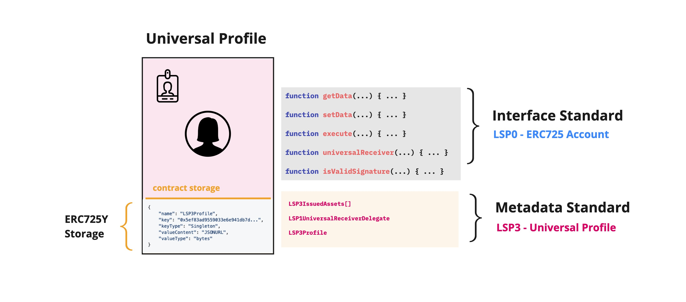

# Standard Detection

:::caution

The **InterfaceId** and the **SupportedStandards:XYZ** key is not the best secure way to check for a standard, as they could be set manually.

:::

There are 2 types of standards at **LUKSO**:

- **Interface Standards**: Where we standardize a set of functions. i.e: [LSP0-ERC725Account](./universal-profile/01-lsp0-erc725account.md), [LSP6-KeyManager](./universal-profile/04-lsp6-key-manager.md), [LSP7-DigitalAsset](./nft-2.0/02-LSP7-Digital-Asset.md), etc ..

- **Metadata Standards**: Where we standardize a set of ERC725Y keys. i.e: [LSP3-UniversalProfile-Metadata](./universal-profile/03-lsp3-universal-profile-metadata.md), [LSP4-DigitalAsset-Metadata](https://github.com/lukso-network/LIPs/blob/main/LSPs/LSP-4-DigitalAsset-Metadata.md), [LSP10ReceivedVaults](https://github.com/lukso-network/LIPs/blob/main/LSPs/LSP-10-ReceivedVaults.md), etc ..

## Difference between InterfaceId Vs SupportedStandard Key

Checking the **InterfaceId** for a contract using [ERC165 standard](https://eips.ethereum.org/EIPS/eip-165) is equal for checking if the contract is implementing a set of functions. As for checking for the **SupportedStandards:XYZ** ERC725Y key, it's equal for checking if the contract is implementing **XYZ** related ERC725Y Keys.

### Example

**UniversalProfile** contract supports **[ERC725Account InterfaceId](./smart-contracts/interface-ids)**, this means that the contract **SHOULD** implement functions like `getData`, `setData`, `execute`, `universalReceiver`, `isValidSignature` .    
Also it implements the **[SupportedStandards:LSP3UniversalProfile](./universal-profile/lsp3-universal-profile-metadata#supportedstandardslsp3universalprofile)** key, this means that the contract **SHOULD** implement ERC725Y keys like `LSP1UniversalReceiver`, `LSP3IssuedAssets`, `LSP5ReceivedAssets`, etc ..
