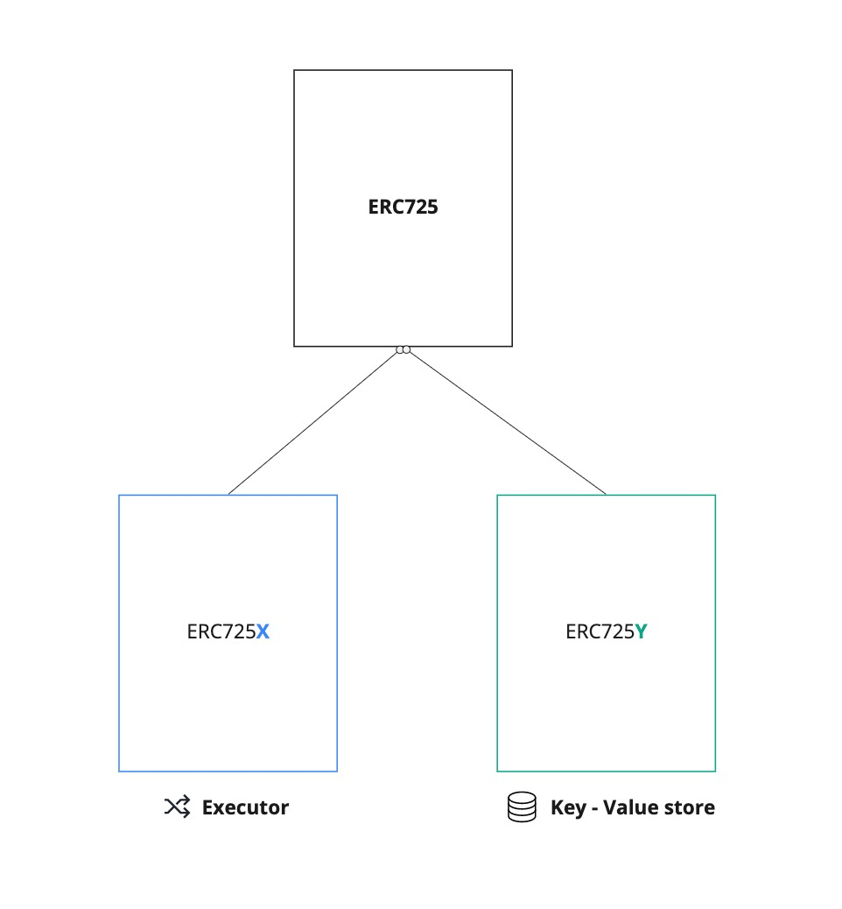

# The Foundation - LSP0 (ERC725Account)

Once deployed, smart contracts cannot be changed. Meaning that setting state variables make them set in stone in the contract. You cannot add or remove variables inside your contract.

Same as the functions. Once written and embedded in the Solidity code, these functionality and behaviours cannot be changed.

An ERC725Account aims to make a smart that acts as a generic account. It is composed of two main components.

## ERC725X - Generic Executor

This component the contract to execute any arbitrary function of another smart contract, transfer tokens, or deploy new contracts.

## ERC725Y - Generic Key-Value Store

This component gives flexibility to the contract storage, by enabling to attach any type of information to the contract, and update it easily.

The data can then easily be changed, linked or unlinked again.

## Additional features

ERC725Account are owned account, meaning they can be controlled only by their account owner.

This makes it possible to transferOwnership of an ERC725Account from one partie to another.

This creates room for user-friendly backup schemes on the blockchain, without the need to write down backup phrases.

Finally, an account can be managed by multiple private keys, including multi-signature wallets.
