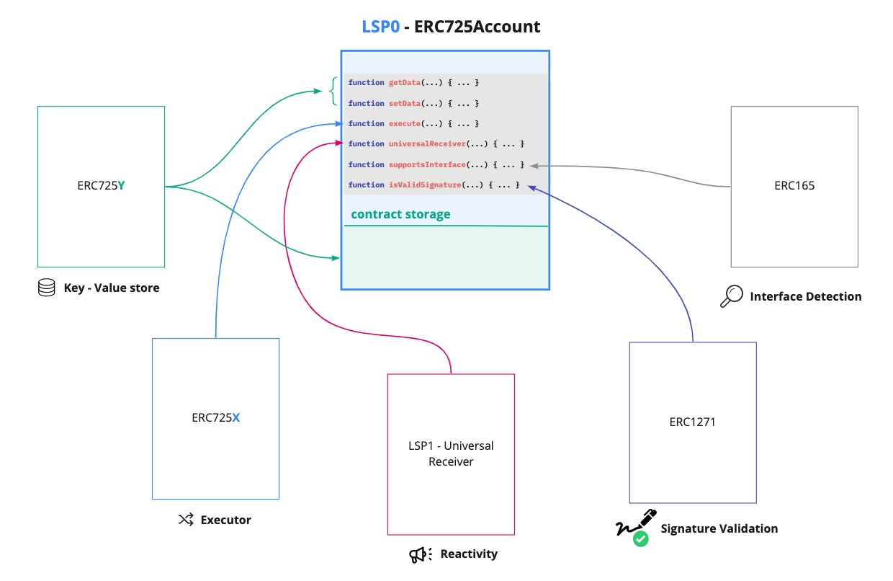

# LSP0 - ERC725Account

:::info Standard Document

[LSP0 - ERC725Account](https://github.com/lukso-network/LIPs/blob/main/LSPs/LSP-0-ERC725Account.md)

:::

## Introduction

Once deployed on a network, smart contracts cannot be changed, **they are set in stone**. If a smart contract is deployed with a specific amount of state variables, a specific behavior and functionalities then it is there forever and cannot be altered.

The **[ERC725 Standard](https://github.com/ERC725Alliance/erc725/blob/main/docs/ERC-725.md)** proposed in 2017 descibes a generic key value store and generic execution function that could be the basis to an account. Combining the interactivity and signature verification mechanism represented by **[LSP1-UniversalReceiver](../generic-standards/02-lsp1-universal-receiver.md)** and **[ERC1271](https://eips.ethereum.org/EIPS/eip-1271)** standards, a blockchain based account can be created.

## What does this standard represent ?

An **ERC725Account** defines a blockchain account system that could be used by humans, machines, or other smart contracts. It is composed of multiple standards, as shown in the figure below.

- **[ERC725X](https://github.com/ERC725Alliance/erc725/blob/main/docs/ERC-725.md)**: a generic executor that enables to call external contracts, deploy new contracts or transfer value to any address (EOA or smart contracts).
- **[ERC725Y](https://github.com/ERC725Alliance/erc725/blob/main/docs/ERC-725.md)**: a generic key-value store that enables it to attach any information to the smart contract.
- **[LSP1-UniversalReceiver](../generic-standards/02-lsp1-universal-receiver.md)**: enables to be notified of incoming transactions, and add custom handling and behaviour, based on these incoming transactions.
- **[ERC1271](https://eips.ethereum.org/EIPS/eip-1271)**: enables to verify that a signed message has a valid signature.
- **[ERC165](https://eips.ethereum.org/EIPS/eip-165)**: enables to register + detect the standard interfaces the contract implements.

This standard also uses the **[ERC173](https://eips.ethereum.org/EIPS/eip-173)** standard to provide ownership functions for owning and controlling the implementation contract.

### ERC725X - Generic Executor

:::note Documentation

See the section **["Members of address types"](https://docs.soliditylang.org/en/v0.8.11/units-and-global-variables.html?highlight=staticcall#members-of-address-types)** in the Solidity documentation for more informations about the different types of calls available.

:::

This substandard enables the account to execute a call on any other smart contracts, transfers the blockchains native token, or deploys a new smart contract. Only the owner can execute these operations below.

The operation types available are:

- `CALL`
- `CREATE`
- [`CREATE2`](https://eips.ethereum.org/EIPS/eip-1014)
- [`DELEGATECALL`](https://eips.ethereum.org/EIPS/eip-7)
- [`STATICCALL`](https://eips.ethereum.org/EIPS/eip-214)

### ERC725Y - Generic Key-Value Store

:::info

See the section **["Layout of State Variables in Storage"](https://docs.soliditylang.org/en/v0.8.11/internals/layout_in_storage.html)** in the Solidity documentation for more informations about the structure of a smart contract storage.

:::

This substandard enables the account to hold arbitrary data through a generic key-value store. It gives flexibility to the contract storage. With ERC725Y, data stored in the contract can be accessed via keys, instead of referencing to the storage slot where the data resides.

- **keys** are represented as `bytes32` values.
- **values** under these keys are stored as `bytes`.

As a result, this substandard enables to attach any type of information to the contract and update or remove it easily.

Thanks to ERC725Y, contracts become more interoperable between each other, as their storage is represented in the same way. Contracts and interfaces can then read and write data from/to the storage in the same manner, via the functions [`getData(...)`](../smart-contracts/lsp0-erc725-account#getdata) and [`setData(...)`](../smart-contracts/lsp0-erc725-account#setdata).

### LSP1 - UniversalReceiver

This standard enables the account to be notified of any incoming transactions either it's a token transfer, vault transfer, information transfer, etc ..
This is very useful for accounts where anyone could customize the way his account react to certain tokens by rejecting them or operate a specific call on each token receive.

Check **[LSP1-UniversalReceiver](../generic-standards/02-lsp1-universal-receiver.md)** standard for more information.

### ERC1271

Externally Owned Accounts (EOAs) can sign messages with their associated private keys, but contracts cannot. This standard defines a way for contracts to verify if a provided signature is valid when the account is a smart contract.  
There are and will be many contracts that want to utilize signed messages for validation of rights-to-move assets or other purposes.

Check **[ERC1271](https://eips.ethereum.org/EIPS/eip-1271)** standard for more information.

## Extension

### Ownership

The ownership of the account can be extended by setting a smart contract as an owner with different permissions granted to users in the smart contract. This allows multiple interaction through your account based on the permissions set for the calling address.

**[LSP6-KeyManager](./04-lsp6-key-manager.md)** is a standard that defines a controller smart contract for this account.

### Interactivity

The account can be notified of incoming assets, information, etc via the **universalReceiver** function. An extension could be added to increase the autonomy of the contract by handling and reacting to transactions that the account receives.

This can happen by setting a **[LSP1-UniversalReceiverDelegate](./02-lsp1-universal-receiver-delegate.md)** to your account.
