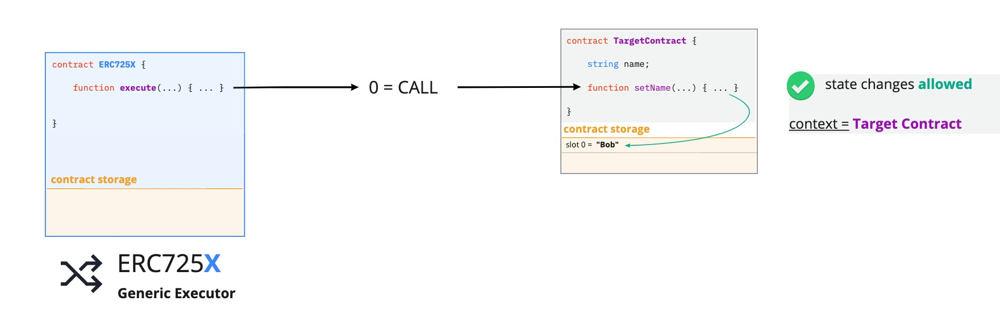
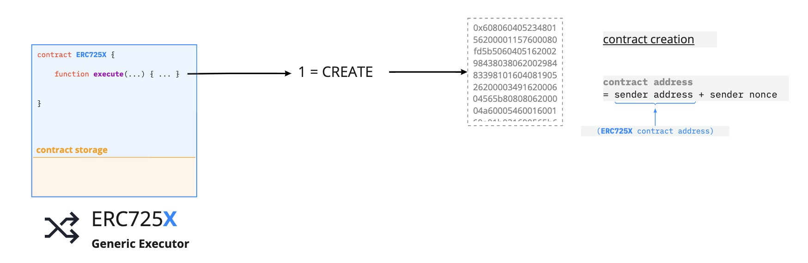
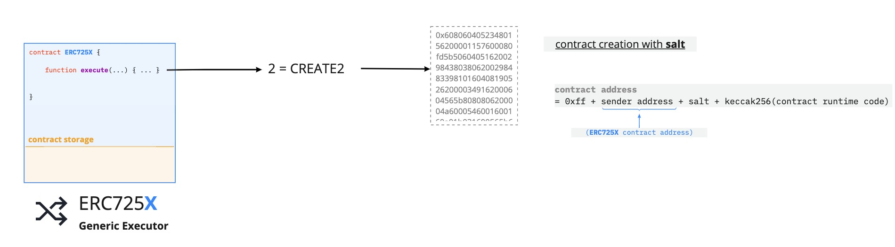
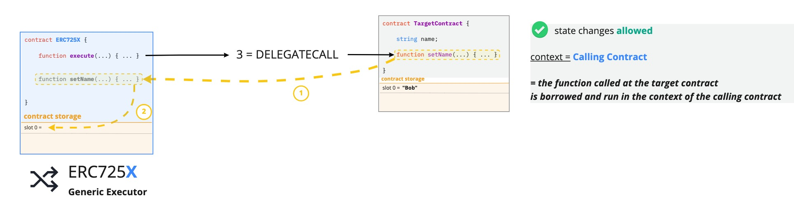
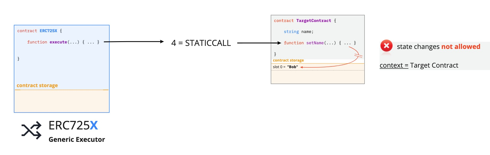

# LSP0 - ERC725Account

:::info Standard Document

[LSP0 - ERC725Account](https://github.com/lukso-network/LIPs/blob/main/LSPs/LSP-0-ERC725Account.md)

:::

## Introduction

Once deployed on a network, smart contracts cannot be changed. Their storage and logic **are set in stone**. If a smart contract is deployed with some specific state variables and functions, then these data and functionalities are there forever and cannot be altered.

The **[ERC725 Standard](https://github.com/ERC725Alliance/erc725/blob/main/docs/ERC-725.md)** proposed in 2017 describes a generic key-value store and generic execution function that could be used as the basis for an account. A blockchain-based account can then be created by combining ERC725 with the interactivity and signature verification mechanism from the **[LSP1-UniversalReceiver](../generic-standards/02-lsp1-universal-receiver.md)** and **[ERC1271](https://eips.ethereum.org/EIPS/eip-1271)** standards.

## What does this standard represent ?

An **ERC725Account** defines a blockchain account system that could be used by humans, machines, or other smart contracts. It is composed of multiple standards, as shown in the figure below.

- **[ERC725X](https://github.com/ERC725Alliance/erc725/blob/main/docs/ERC-725.md#erc725x)**: a generic executor that enables calling external contracts, deploying new contracts or transferring value to any `address` (EOA or smart contracts).
- **[ERC725Y](https://github.com/ERC725Alliance/erc725/blob/main/docs/ERC-725.md#erc725y)**: a generic key-value store that enables it to attach any information to the smart contract.
- **[LSP1-UniversalReceiver](../generic-standards/02-lsp1-universal-receiver.md)**: enables to be notified about incoming or outgoing transactions and add custom handling and behaviour based on these transactions.
- **[ERC1271](https://eips.ethereum.org/EIPS/eip-1271)**: enables to verify that a signed message has a valid signature.
- **[ERC165](https://eips.ethereum.org/EIPS/eip-165)**: enables to register and detect the standard interfaces the contract implements.

This standard also uses the **[ERC173](https://eips.ethereum.org/EIPS/eip-173)** standard to provide ownership functions for owning and controlling the implementation contract.

### ERC725X - Generic Executor

:::note

See the section **["Members of address types"](https://docs.soliditylang.org/en/v0.8.11/units-and-global-variables.html?highlight=staticcall#members-of-address-types)** in the Solidity documentation for more information about the different types of calls available.

:::

This substandard enables the account to execute generic calls on any other smart contracts, including transferring native tokens along with the call. This is made possible via a generic [`execute(...)`](../smart-contracts/lsp0-erc725-account.md#execute) function in the smart contract. **Only the owner can execute** the operations below.

The ERC725X standard also enables deploying new smart contracts by providing the bytecode of the new contract to deploy as an argument to the `execute(...)` function. Contracts can be deployed using either CREATE or [CREATE2](https://eips.ethereum.org/EIPS/eip-1014).

The following types of calls (= operation types) are available:

| Operation number |                     Operation type                     | Description                                                                                                                             |
| :--------------: | :----------------------------------------------------: | :-------------------------------------------------------------------------------------------------------------------------------------- |
|        0         |                         `CALL`                         | call another smart contract                                                                                                             |
|        1         |                        `CREATE`                        | create a new smart contract with the associated bytecode passed as `_data`                                                              |
|        2         |  [`CREATE2`](https://eips.ethereum.org/EIPS/eip-1014)  | create a new smart contract with a **salt **(for pre-computed contract addresses)                                                       |
|        3         | [`DELEGATECALL`](https://eips.ethereum.org/EIPS/eip-7) | run the function from another contract, but use and update the storage of the current contract (= persist `msg.sender` and `msg.value`) |
|        4         | [`STATICCALL`](https://eips.ethereum.org/EIPS/eip-214) | call another smart contract while disallowing any modification to the state during the call                                             |

# 

# 

# 

# 

# 

### ERC725Y - Generic Key-Value Store

:::note

See the section **["Layout of State Variables in Storage"](https://docs.soliditylang.org/en/v0.8.11/internals/layout_in_storage.html)** in the Solidity documentation for more information about the structure of smart contract storage.

:::

This substandard enables the account to hold arbitrary data through a generic key-value store. It gives flexibility to the contract storage. With ERC725Y, data stored in the contract can be accessed via keys instead of referencing to the storage slot where the data resides.

- **Keys** are represented as `bytes32` values.
- **Values** under these keys are stored as `bytes`.

As a result, this substandard enables to attach any type of information to the contract and update or remove it easily.

Thanks to ERC725Y, contracts become more interoperable between each other, as their storage is represented in the same way. Contracts and interfaces can then read and write data from/to the storage in the same manner, via the functions [`getData(...)`](../smart-contracts/lsp0-erc725-account#getdata) and [`setData(...)`](../smart-contracts/lsp0-erc725-account#setdata).

### LSP1 - UniversalReceiver

:::info

See the **[LSP1-UniversalReceiver](../generic-standards/02-lsp1-universal-receiver.md)** standard for more information.

:::

This standard enables the account to be notified of any incoming transactions such as token transfer, vault transfer, information transfer, etc. This is very useful for situations where one wants to customise how his account contract reacts to certain tokens by either rejecting them or operating a specific call on each token received.

### ERC1271

:::info

See the **[ERC1271](https://eips.ethereum.org/EIPS/eip-1271)** standard for more information.

:::

Unlike Externally Owned Accounts (EOAs), smart contracts cannot sign messages since they do not have private keys. This standard defines a way for contracts to verify if a signature provided by an EOA is valid.
There are and will be many contracts that want to utilize signed messages to validate rights-to-move assets or other purposes.

## Extension

### Ownership

The ownership of the account can be extended by setting a smart contract as an owner with different permissions granted to users in the smart contract. This allows multiple interactions through your account based on the permissions set for the calling address.

**[LSP6-KeyManager](./04-lsp6-key-manager.md)** is a standard that defines a smart contract that acts as a controller for this account.

### Interactivity

The account can be notified of incoming assets or information via the [`universalReceiver(...)`](../smart-contracts/lsp0-erc725-account.md#universalreceiver) function. An extension could be added to increase the autonomy of the contract by handling and reacting to transactions that the account receives.

This can happen by linking an external contract to your account that would handle these functionalities: a **[LSP1-UniversalReceiverDelegate](./02-lsp1-universal-receiver-delegate.md)**.
