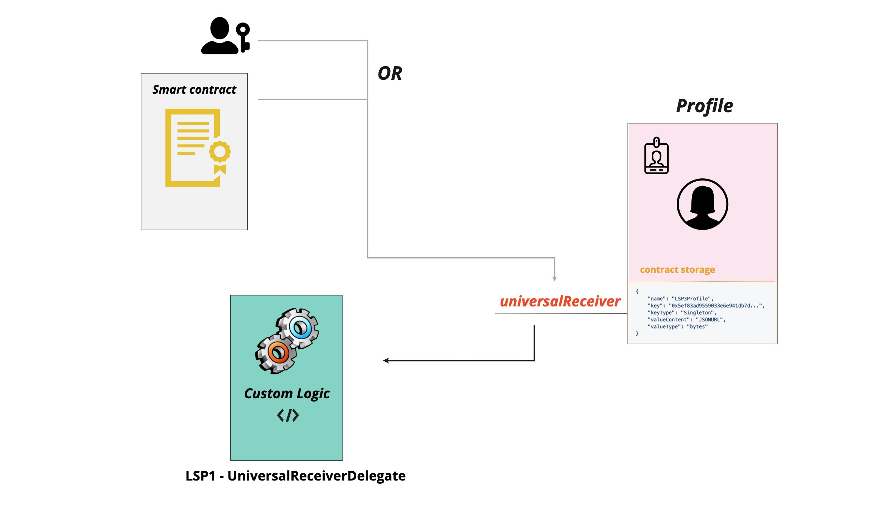
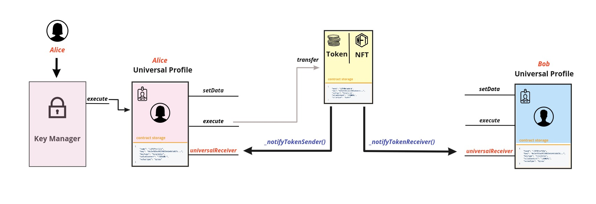

# LSP1 - Universal Receiver Delegate

:::info Standard Document

[LSP1 - Universal Receiver Delegate](https://github.com/lukso-network/LIPs/blob/main/LSPs/LSP-1-UniversalReceiver.md#specification-of-the-universalreceiverdelegate)

:::

:::success Recommendation

For a better understanding of this standard, it is **well-advised** to check first the origin standard **[LSP1-UniversalReceiver](../generic-standards/02-lsp1-universal-receiver.md)**.

:::

## Introduction

Once deployed, the code of a smart contract **can not be changed**. However, the way a smart contract implements the [`universalReceiver(...)`](../smart-contracts/lsp0-erc725-account.md#universalreceiver) function and how it reacts could change and evolve in the future.

Therefore, it is advised not to hardcode how the smart contract should handle and react to certain calls inside the `universalReceiver(...)` function, but instead to delegate this functionality to another external contract. Such contract could then be customized to implement a specific logic that could be changed anytime **via an upgrade**.

## What does this standard represent ?

### Specification

This standard represents a smart contract that is delegated the initial `universalReceiver(...)` function.

It contains a single function named `universalReceiverDelegate(...)` that takes the same parameters as the `universalReceiver(...)` function with an additional parameter:

- address `sender`: the address that initially called the `universalReceiver(...)` function.

### How Delegation works

In order to let the `universalReceiver(...)` function forward the call to the `universalReceiverDelegate(...)` function, the address of the **UniversalReceiverDelegate** contract should be set as a value for the key `LSP1UniversalReceiver`, inside the [ERC725Y key-value store](https://github.com/ERC725Alliance/erc725/blob/main/docs/ERC-725.md#erc725y) of the implementation contract (contract implementing the `universalReceiver(...)` function).

This external contract will then implement the `universalReceiverDelegate(...)` function. It is also recommended that this contract registers the **[LSP1UniversalReceiverDelegate interfaceId](../smart-contracts/interface-ids.md)** using ERC165.

## Implementations

There are several implementations of the standard. The **[LSP1UniversalReceiverDelegateUP](../smart-contracts/lsp1-universal-receiver-delegate-up.md)** contract is one of them and is used as a delegate to the `universalReceiver(...)` function of **UniversalProfile** contract.

At the moment, this contract allows to:

- receive and send tokens & vaults
- register the keys representing them according to **[LSP5-ReceivedAssets](https://github.com/lukso-network/LIPs/blob/main/LSPs/LSP-5-ReceivedAssets.md)** and **[LSP10-ReceivedVaults](https://github.com/lukso-network/LIPs/blob/main/LSPs/LSP-10-ReceivedVaults.md)** Standards.

### Token transfer scenario

One of the possible scenarios is a token transfer between Alice and Bob. Alice wants to transfer a token owned by her Universal Profile to the Universal Profile of her friend Bob.

**1.** It calls the **`transfer(...)`** function on the token contract through the KeyManager.

**2.** The `transfer(...)` function on the token contract will directly **trigger a hook** that will call the `universalReceiver(...)` function on both sender and recipient Universal Profiles.

**3.** 3. If the **UniversalReceiverDelegate** contract is set, it will be called by the `universalReceiver(...)` function and will execute its custom logic.

**4.** The **UniversalReceiverDelegate** of **Universal Profile** allows the transfer and set **[LSP5-ReceivedAssets](https://github.com/lukso-network/LIPs/blob/main/LSPs/LSP-5-ReceivedAssets.md)** keys on both Profiles through the KeyManager.

## References

- [LUKSO Standards Proposals: LSP1 - Universal Receiver (Standard Specification, GitHub)](https://github.com/lukso-network/LIPs/blob/main/LSPs/LSP-1-UniversalReceiver.md)
- [LSP1 Universal Receiver: Solidity implementations (GitHub)](https://github.com/lukso-network/lsp-universalprofile-smart-contracts/tree/develop/contracts/LSP1UniversalReceiver)
