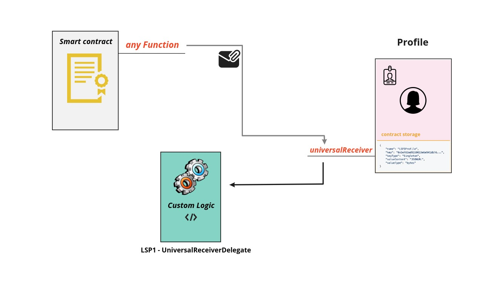

# LSP1 - Universal Receiver Delegate

## Introduction

As the code of the smart contract **can't be changed**, and the reaction of a smart contract implementing the **universalReceiver** function could change and evolve in the future, it's advised to not hardcode how the smart contract should handle and react to certain calls inside of the universalReceiver function but to delegate the response to another contract that could be customized to implement a specific logic and could be changed anytime.

People wishing to understand this standard, will be **well-advised** to check the **[LSP1-UniversalReceiver Standard](../generic-standards/02-lsp1-universal-receiver.md)** as its the origin of this standard.

## What does this standard represent ?

### Specification

This standard represents a delegate contract to the initial **universalReceiver** function, when an address wants to delegate its universalReceiver functionality to another smart contract. It contains a single function named **universalReceiverDelegate** that takes the same parameters as the universalReceiver function with an additional parameter:

- address **sender**: Representing the address calling the initial universalReceiver function.

### How Delegation works

In order to let the **universalReceiver** function forward the call to the **universalReceiverDelegate** function, the **UniversalReceiverDelegate** contract address should be set in the **[ERC725Y Key value store](https://github.com/ERC725Alliance/erc725/blob/main/docs/ERC-725.md#erc725y)** of the calling smart contract (contract implementing the universalReceiver function) as value to the pre-defined **[LSP1UniversalReceiver](../generic-standards/02-lsp1-universal-receiver.md#extension)** Key, and the UniversalReceiverDelegate contract should implement the **[LSP1UniversalReceiverDelegate InterfaceId](../smart-contracts/interface-ids.md)** using ERC165.

## Implementations

There is several implementations of the standard, **[LSP1UniversalReceiverDelegateUP](../smart-contracts/lsp1-universal-receiver-delegate-up.md)** contract is one of them that is used as a delegate to the **universalReceiver** function of **UniversalProfile** contract. 

At the moment this contract allows to:

- receive and send tokens & vaults
- register the keys representing them according to **[LSP5-ReceivedAssets](https://github.com/lukso-network/LIPs/blob/main/LSPs/LSP-5-ReceivedAssets.md)** and **[LSP10-ReceivedVaults](https://github.com/lukso-network/LIPs/blob/main/LSPs/LSP-10-ReceivedVaults.md)** Standards.

### Token transfer scenario

One of the possible scenarios is a token transfer between Alice and Bob. Alice wants to transfer a token owned by her UniversalProfile to the UniversalProfile of her friend Bob. 

**1.** It call the **transfer** function on the token contract through the KeyManager.

**2.** The transfer function on the token contract will directly **trigger a hook** that will call the universalReceiver function on both sender and recipient UniversalProfiles.

**3.** If the **UniversalReceiverDelegate** contract is set then it will be called by the **universalReceiver** function and will execute the logic customized in it.

**4.** The **UniversalReceiverDelegate** of **the UniversalProfile** allows the transfer and set **[LSP5-ReceivedAssets](https://github.com/lukso-network/LIPs/blob/main/LSPs/LSP-5-ReceivedAssets.md)** keys on both Profiles through the KeyManager.

## References

- [LUKSO Standards Proposals: LSP1 - Universal Receiver (Standard Specification, GitHub)](https://github.com/lukso-network/LIPs/blob/main/LSPs/LSP-1-UniversalReceiver.md)
- [LSP1 Universal Receiver: Solidity implementations (GitHub)](https://github.com/lukso-network/lsp-universalprofile-smart-contracts/tree/develop/contracts/LSP1UniversalReceiver)
