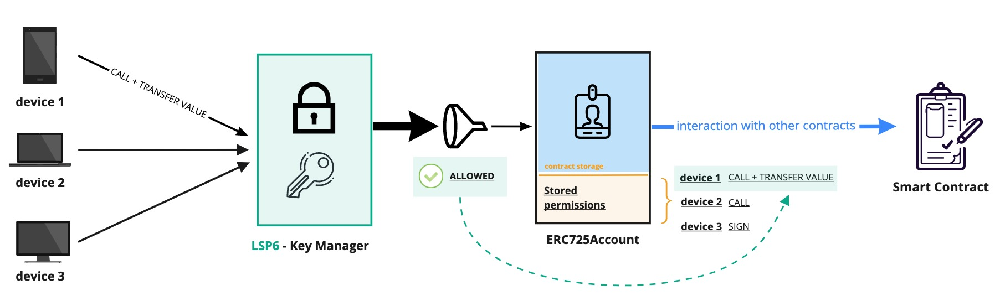
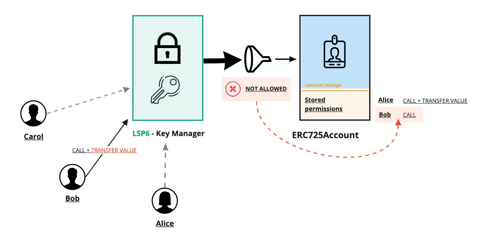
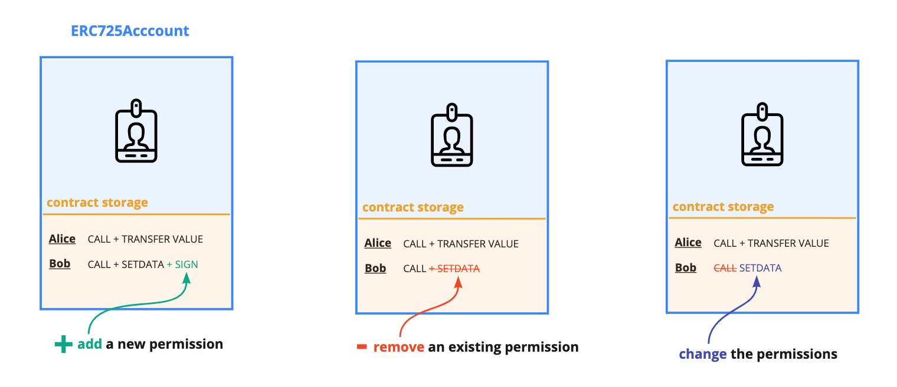

# LSP6 - Key Manager

:::info Standard Document

[LSP6 - Key Manager](https://github.com/lukso-network/LIPs/blob/main/LSPs/LSP-6-KeyManager.md)

:::

## Introduction

An [ERC725Account](https://github.com/lukso-network/LIPs/blob/main/LSPs/LSP-0-ERC725Account.md) on its own comes with limited usability. Since it is an **owned contract**, only the Account's owner can write data into it, or use it to interact with other smart contracts.

Here comes the Key Manager. It is a smart contract that controls an ERC725Account, acting as its new owner. It then functions as a gateway for an ERC725Account.

The idea is to give [permissions](#types-of-permissions) to any `address`, like Externally Owned Accounts (EOA) or smart contracts. These can then interact with an **ERC725Account** through the Key Manager. On each interaction, the Key Manager will allow or restrict access, based on the permissions set for the calling `address`.

:x: &nbsp; **Without a Key Manager**, only the ERC725Account's owner can use its Account.

:white_check_mark: &nbsp; **With a Key Manager** attached to an ERC725Account, other addresses (EOAs or contracts) can use an Account on behalf of its owner.





Permissions for an `address` are stored inside the key-value store of the ERC725Account contract, under specific keys listed in the [**Permission Keys**](#permissions-keys) section.

Since permissions are stored under the ERC725Account contract, they are not attached to the Key Manager itself. The Key Manager can then easily be upgraded without the need to set all the permissions again.

---

## Types of permissions

There are 3 main types of permissions that can be set for addresses interacting with a Universal Profile.

- [**Address Permissions**](#address-permissions): defines a set of [**permission values**](#permissions-value) for an `address`.

- [**Allowed Addresses:**](#allowed-addresses) defines which EOA or contract addresses an `address` is allowed to interact with.

- [**Allowed Functions:**](#allowed-functions) defines which function selectors an `address` is allowed to run on a specific contract.

<br/>

### Address Permissions

An address can hold one (or more) permissions, enabling it to perform multiple set of actions on an ERC725Account. Such actions include **setting data**, **calling other contracts**, **transferring native tokens** and more.

To grant permission(s) to an `<address>`, set the following key-value pair below in the [ERC725Y](https://github.com/ethereum/EIPs/blob/master/EIPS/eip-725.md#erc725y) contract storage.

- **key:** `0x4b80742d0000000082ac0000<address>`
- **value:** one of the available options below.

| Permission Name   | Value                                                                |
| ----------------- | :------------------------------------------------------------------- |
| CHANGEOWNER       | `0x0000000000000000000000000000000000000000000000000000000000000001` |
| CHANGEPERMISSIONS | `0x0000000000000000000000000000000000000000000000000000000000000002` |
| ADDPERMISSIONS    | `0x0000000000000000000000000000000000000000000000000000000000000004` |
| SETDATA           | `0x0000000000000000000000000000000000000000000000000000000000000008` |
| CALL              | `0x0000000000000000000000000000000000000000000000000000000000000010` |
| STATICCALL        | `0x0000000000000000000000000000000000000000000000000000000000000020` |
| DELEGATECALL      | `0x0000000000000000000000000000000000000000000000000000000000000040` |
| DEPLOY            | `0x0000000000000000000000000000000000000000000000000000000000000080` |
| TRANSFERVALUE     | `0x0000000000000000000000000000000000000000000000000000000000000100` |
| SIGN              | `0x0000000000000000000000000000000000000000000000000000000000000200` |

> See section [**_Permissions Values_**](#permission-values) for more infos about what each permission enables

:::caution

Each permission MUST be:

- **exactly 32 bytes long**
- zero left-padded
  - `0x0000000000000000000000000000000000000000000000000000000000000008` ✅
  - `0x0800000000000000000000000000000000000000000000000000000000000000` ❌

For instance, if you try to set the permission SETDATA for an address as `0x08`, this will be stored internally as `0x0800000000000000000000000000000000000000000000000000000000000000`, and will cause incorrect behaviour with odd revert messages.

:::

<br/>

### Allowed addresses

You can restrict an address to interact only with specific contracts or EOAs.

To restrict an `<address>` to only talk to a specific contract at address `<target-contract-address>`, the key-value pair below can be set in the ERC725Y contract storage.

- **key:** `0x4b80742d00000000c6dd0000<address>`
- **value(s):** `[ <target-contract-address> ]`

The list (= array) of allowed `addresses` **MUST be abi-encoded** (See the section [_Contract ABI Specification > Strict Encoding Mode_](https://docs.soliditylang.org/en/v0.8.11/abi-spec.html#strict-encoding-mode)) in the [Solidity documentation](https://docs.soliditylang.org/en/v0.8.11/abi-spec.html#).

:::info Infos

**If no addresses are set, interacting with any address is allowed (= all addresses are whitelisted).**

:::

<br/>

### Allowed functions

You can also restrict which functions a specific address can run, by providing a list of `bytes4` function selector.

To restrict an `<address>` to only execute the function `transfer(address,uint256)` (selector: `a9059cbb`), the following key-value pair can be set in the ERC725Y contract storage.

- **key:** `0x4b80742d000000008efe0000<address>`
- **value(s):** `[ 0xa9059cbb ]`

The list (= array) of allowed `bytes4` function selectors **MUST be abi-encoded** (See the section [_Contract ABI Specification > Strict Encoding Mode_](https://docs.soliditylang.org/en/v0.8.11/abi-spec.html#strict-encoding-mode)) in the [Solidity documentation](https://docs.soliditylang.org/en/v0.8.11/abi-spec.html#).

:::info Infos

**If no bytes4 selectors are set, the caller address can execute any functions.**

:::

### Allowed standards

It is possible to restrict which "type of contract" an address can interact with. A type of contract here refers to a contract implementing a specific interface registered and checked via the [ERC165 standard](https://eips.ethereum.org/EIPS/eip-165).

As an example, to restrict an `<address>` to only be allowed to interact with ERC725Account contracts (interface ID = `0x63cb749b`), the following key-value pair can be set in the ERC725Y contract storage.

- **key:** `0x4b80742d000000003efa0000<address>`
- **value(s):** `[ 0x63cb749b ]`

The list (= array) of allowed `bytes4` interface IDs **MUST be abi-encoded** (See the section [_Contract ABI Specification > Strict Encoding Mode_](https://docs.soliditylang.org/en/v0.8.11/abi-spec.html#strict-encoding-mode)) in the [Solidity documentation](https://docs.soliditylang.org/en/v0.8.11/abi-spec.html#).

:::info

**If no bytes4 values are set, the caller address can interact with any contract implementing any interface.**

:::


:::caution

This type of permission does not offer security over the inner workings of a contract. It should be used more as a "mistake prevention" mechanism rather than as a security measure.

:::

### Allowed ERC725Y Keys

If an address is allowed to `SETDATA` on an ERC725Account, it is possible to restrict which keys this address can update.

To restrict an `<address>` to only be allowed to set the key `LSP3Profile` (`0x5ef83ad9559033e6e941db7d7c495acdce616347d28e90c7ce47cbfcfcad3bc5`), the following key-value pair can be set in the ERC725Y contract storage.

- **key:** `0x4b80742d0000000090b80000<address>`
- **value(s):** `[ 0x5ef83ad9559033e6e941db7d7c495acdce616347d28e90c7ce47cbfcfcad3bc5 ]`

The list (= array) of allowed `bytes32` keys **MUST be abi-encoded** (See the section [_Contract ABI Specification > Strict Encoding Mode_](https://docs.soliditylang.org/en/v0.8.11/abi-spec.html#strict-encoding-mode)) in the [Solidity documentation](https://docs.soliditylang.org/en/v0.8.11/abi-spec.html#).

:::info

**If no bytes32 values are set, the caller address can set values for any keys.**

:::

---

## Permission Keys

The following keys are available to set the different types of permissions.

| Permission Type                                                                                                                             | Key                                   |
| ------------------------------------------------------------------------------------------------------------------------------------------- | :------------------------------------ |
| [Address Permissions](https://github.com/lukso-network/LIPs/blob/main/LSPs/LSP-6-KeyManager.md#addresspermissionspermissionsaddress)        | `0x4b80742d0000000082ac0000<address>` |
| [Allowed Addresses](https://github.com/lukso-network/LIPs/blob/main/LSPs/LSP-6-KeyManager.md#addresspermissionsallowedaddressesaddress)     | `0x4b80742d00000000c6dd0000<address>` |
| [Allowed Functions](https://github.com/lukso-network/LIPs/blob/main/LSPs/LSP-6-KeyManager.md#addresspermissionsallowedfunctionsaddress)     | `0x4b80742d000000008efe0000<address>` |
| [Allowed Standards](https://github.com/lukso-network/LIPs/blob/main/LSPs/LSP-6-KeyManager.md#addresspermissionsallowedstandardsaddress)     | `0x4b80742d000000003efa0000<address>` |
| [Allowed ERC725YKeys](https://github.com/lukso-network/LIPs/blob/main/LSPs/LSP-6-KeyManager.md#addresspermissionsallowederc725ykeysaddress) | `0x4b80742d0000000090b80000<address>` |

> [See LSP6 for more details](https://github.com/lukso-network/LIPs/blob/main/LSPs/LSP-6-KeyManager.md#erc725y-keys)

---

## Permission Values

The following default permissions can be set for any address. They are listed below, according to their order of importance.

You can find **more details about each permissions by clicking on the toggles below**.

<details>
    <summary><code>CHANGEOWNER</code> - Allows changing the owner of the controlled contract</summary>
        <p style={{marginBottom: '3%', marginTop: '2%', textAlign: 'center'}}>
            <b>value = </b><code>0x0000000000000000000000000000000000000000000000000000000000000001</code>
        </p>
        <p>Enables to change the owner of the linked ERC725Account.</p>
        <p>Using this permission, you can easily upgrade the <code>KeyManager</code> attached to the Account by transferring ownership to a new <code>KeyManagerV2</code>.</p>
</details>

<details>
    <summary><code>CHANGEPERMISSIONS</code> - Allows changing existing permissions of addresses</summary>
    <p style={{marginBottom: '3%', marginTop: '2%', textAlign: 'center'}}>
        <b>value = </b><code>0x0000000000000000000000000000000000000000000000000000000000000002</code>
    </p>
    <p>This permission allows to <b>edit permissions</b> of any address that has already some permissions set on the ERC725Account (including itself).</p>


<p>Bear in mind that the behaviour of <code>CHANGEPERMISSIONS</code> slightly varies, depending on the new permissions value being set (see figure below).</p>



</details>

<details>
    <summary><code>ADDPERMISSIONS</code> - Allows giving permissions to new addresses.</summary>
    <p style={{marginBottom: '3%', marginTop: '2%', textAlign: 'center'}}>
        <b>value = </b><code>0x0000000000000000000000000000000000000000000000000000000000000004</code>
    </p>
    <p>This permission allows to give permissions to new addresses. Or in other words, it enables to <b>authorize new addresses</b> to interact with the ERC725Account.</p>


</details>

<details>
    <summary><code>SETDATA</code> - Allows setting data on the controlled contract</summary>
    <p style={{marginBottom: '3%', marginTop: '2%', textAlign: 'center'}}>
        <b>value = </b><code>0x0000000000000000000000000000000000000000000000000000000000000008</code>
    </p>
    Allows an address to write any form of data in the <a href="https://**github**.com/ethereum/EIPs/blob/master/EIPS/eip-725.md#erc725y">ERC725Y</a> key-value store of the linked <code>ERC725Account</code> (except permissions, that requires the permissions <code>CHANGEPERMISSIONS</code> described above).

</details>

<details>
    <summary><code>CALL</code> - Allows calling other contracts through the controlled contract</summary>
    <p style={{marginBottom: '3%', marginTop: '2%', textAlign: 'center'}}>
        <b>value = </b><code>0x0000000000000000000000000000000000000000000000000000000000000010</code><br/>
    </p>
    <p>This permission enables anyone to use the ERC725Account linked to Key Manager to make external calls (to contracts or Externally Owned Accounts). Allowing state changes at the address being called.</p>
</details>

<details>
    <summary><code>STATICCALL</code> - Allows calling other contracts through the controlled contract</summary>
    <p style={{marginBottom: '3%', marginTop: '2%', textAlign: 'center'}}>
        <b>value = </b><code>0x0000000000000000000000000000000000000000000000000000000000000020</code><br/>
    </p>
    <p>This permission enables to use the ERC725Account linked to Key Manager to make external calls to contracts while disallowing state changes at the address being called.</p>
    <p>It uses the <a href="https://eips.ethereum.org/EIPS/eip-214"><code>STATICCALL</code></a> opcode when performing the external call.</p>
    <blockquote>If any state is changed at a target contract through a <code>STATICCALL</code>, the call will revert.</blockquote>
</details>

<details>
    <summary><code>DELEGATECALL</code> - Allows delegate calling other contracts through the controlled contract</summary>
    <p style={{marginBottom: '3%', marginTop: '2%', textAlign: 'center'}}>
        <b>value = </b><code>0x0000000000000000000000000000000000000000000000000000000000000040</code>
    </p>

This permission to execute code and functions from other contracts in the context of the UP.

:::danger

**`DELEGATECALL`** is currently disallowed (even if set on the KeyManager) because of its dangerous nature, as some malicious code can be executed in the context of the linked Account contract.

:::

</details>

<details>
    <summary><code>DEPLOY</code> - Allows deploying other contracts through the controlled contract</summary>
    <p style={{marginBottom: '3%', marginTop: '2%', textAlign: 'center'}}>
        <b>value = </b><code>0x0000000000000000000000000000000000000000000000000000000000000080</code>
    </p>
    <p>Enables the caller to deploy a smart contract, using the linked ERC725Account as a deployer. The bytecode of the contract to be deployed should be provided in the payload (abi-encoded) passed to the Key Manager.</p>
    <blockquote>Both the <code>CREATE</code> or <a href="https://eips.ethereum.org/EIPS/eip-1014"><code>CREATE2</code></a> opcode can be used to deploy the contract.</blockquote>
</details>

<details>
    <summary><code>TRANSFERVALUE</code> - Allows transfering value to other contracts from the controlled contract</summary>
    <p style={{marginBottom: '3%', marginTop: '2%', textAlign: 'center'}}>
        <b>value = </b><code>0x0000000000000000000000000000000000000000000000000000000000000100</code>
    </p>
    Enables to send native currency from the linked ERC725Account to any address.<br/><br/>
    <blockquote>
        NB: for a simple native token transfer, no data (<code>""</code>) should be passed to the fourth parameter of the <code>execute</code> function of the Account contract.<br/>
        For instance: <code>account.execute(operationCall, recipient, amount, "")</code>
    </blockquote>
</details>

<details>
    <summary><code>SIGN</code>: Allows signing on behalf of the controlled account, for example for login purposes</summary>
    <p style={{marginBottom: '3%', marginTop: '2%', textAlign: 'center'}}>
        <b>value = </b><code>0x0000000000000000000000000000000000000000000000000000000000000200</code>
    </p>
    The <code>SIGN</code> permission can be used for keys to sign login messages. It is mostly for web2.0 apps to know which key SHOULD sign.
</details>

**Permissions can be combined together**, if an address needs to hold more than one permission.

Simply calculate the sum of their decimal value, and convert the result back into hexadecimal. For instance:

> [See LSP6 Specs for more details](https://github.com/lukso-network/LIPs/blob/main/LSPs/LSP-6-KeyManager.md#permission-values-in-addresspermissionspermissionsaddress)

<Tabs>
<TabItem value="example1" label="Example 1" default>

```solidity
permissions: CALL + TRANSFERVALUE

  0x0000000000000000000000000000000000000000000000000000000000000010 (16 in decimal)
+ 0x0000000000000000000000000000000000000000000000000000000000000100 (256)
---------------------------------------------------------------------
= 0x0000000000000000000000000000000000000000000000000000000000000110 (= 272)
```

</TabItem>
<TabItem value="example2" label="Example 2">

```solidity
permissions: CHANGEPERMISSIONS + SETDATA

  0x0000000000000000000000000000000000000000000000000000000000000002 (2 in decimal)
+ 0x0000000000000000000000000000000000000000000000000000000000000008 (8)
---------------------------------------------------------------------
= 0x000000000000000000000000000000000000000000000000000000000000000a (= 10)
```

</TabItem>

</Tabs>

:::tip

You can easily [`encodePermissions`](../../../../tools/erc725js/classes/ERC725#encodepermissions) and [`decodePermissions`](../../../../tools/erc725js/classes/ERC725#decodepermissions) with [**erc725.js**](../../../../tools/erc725js/getting-started).

:::

:::note

When deployed with our [**lsp-factory.js** tool](https://docs.lukso.tech/tools/lsp-factoryjs/introduction/getting-started/), the Universal Profile owner will have all the permissions above set by default.

:::

---

## References

- [LUKSO Standards Proposals: LSP6 - Key Manager (Standard Specification, GitHub)](https://github.com/lukso-network/LIPs/blob/main/LSPs/LSP-6-KeyManager.md)
- [LSP6 KeyManager: Solidity implementations (GitHub)](https://github.com/lukso-network/lsp-universalprofile-smart-contracts/tree/develop/contracts/LSP6KeyManager)
