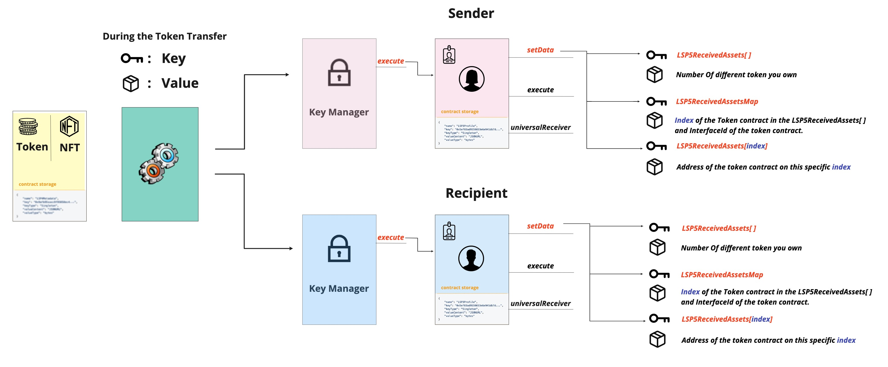

# LSP5 - Received Assets

:::info Standard Document

[LSP5 - Received Assets](https://github.com/lukso-network/LIPs/blob/main/LSPs/LSP-5-ReceivedAssets.md)

:::

## Introduction

Keeping track of all the tokens that an address owns is currently unfeasible. If you want to know from which tokens you own, you need to manually import the token contract address and query the balance of your key in it each time for each token. This brings to light a problem which is owning tokens without knowing because there is no way of being notified about the tokens you own.

One way to solve this problem is to create generic metadata keys that should be registered in the smart contract storage, representing how many different tokens you own and the address of the transferred token contract.

## What does this standard represent ?

:::success Useful Tip

To check if a smart contract supports the **LSP5 - ReceivedAsset** standard, it's advised to check the **LSP5ReceivedAssets[ ]** key.

:::

This Metadata standard describes a set of keys that can be added to an [ERC725Y](https://github.com/ethereum/EIPs/blob/master/EIPS/eip-725.md) smart contract.
Two keys are proposed to reference received asset smart contracts.

### LSP5ReceivedAssets[ ]

```json
{
    "name": "LSP5ReceivedAssets[]",
    "key": "0x6460ee3c0aac563ccbf76d6e1d07bada78e3a9514e6382b736ed3f478ab7b90b",
    "keyType": "Array",
    "valueType": "address",
    "valueContent": "Address"
}
```

This key represents an array key listing all tokens and NFTs you currently own.

### LSP5ReceivedAssetsMap

```json
{
    "name": "LSP5ReceivedAssetsMap:<address>",
    "key": "0x812c4334633eb81600000000<address>",
    "keyType": "Mapping",
    "valueType": "bytes",
    "valueContent": "Mixed"
}
```
This key represents a map key holding:
  - the index in the former array where the received asset address is stored.
  - an [ERC165 interface ID](https://eips.ethereum.org/EIPS/eip-165) to easily identify the standard used by each asset smart contract, without the need to query the contracts directly. 

The `LSP5ReceivedAssetsMap` key also helps to prevent adding duplications to the array, when automatically added via smart contract (e.g. a [LSP1-UniversalReceiverDelegate](./02-lsp1-universal-receiver-delegate.md)).

### Flow 

:::info Note

The keys are also set on the **sender UniversalProfile** to remove the token contract address if all the balance is sent.   

:::

These keys are automatically updated in the UniversalProfile storage via the [LSP1UniversalReceiverDelegateUP](../smart-contracts/lsp1-universal-receiver-delegate-up.md) contract if set, when transferring tokens.
Check [Token transfer scenario](./lsp1-universal-receiver-delegate#token-transfer-scenario).

 



