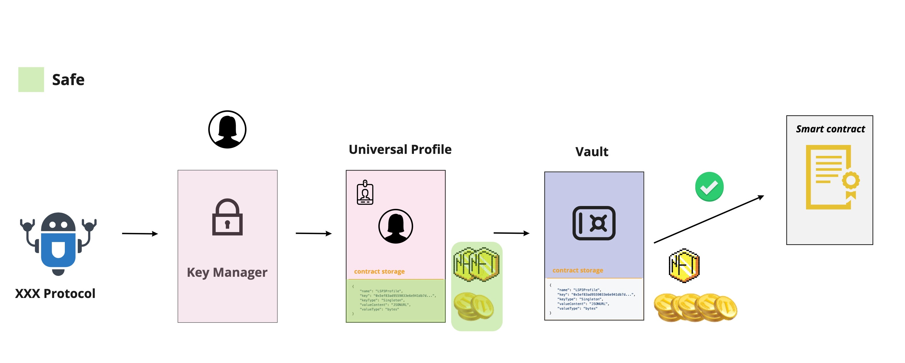

# LSP9 - Vault

:::info Standard Document

[LSP9 - Vault](https://github.com/lukso-network/LIPs/blob/main/LSPs/LSP-9-Vault.md)

:::

## Introduction

Using the Key Manager with the Universal Profile will enable third parties to execute through your profile given specific permissions, but this will not eliminate the risk of operating maliciously with your data and belongings.

To avoid this risk, third parties should be restricted to talking to a specific smart contract through the Universal Profile, that has almost the same functionalities and is controlled by the Universal Profile.

## What does this standard represent ?

This standard defines a vault that can hold assets and interact with other contracts. It has the ability to **attach information** via [ERC725Y](https://github.com/ethereum/EIPs/blob/master/EIPS/eip-725.md#erc725y) to itself, **execute, deploy or transfer value** to any other smart contract or EOA via [ERC725X](https://github.com/ethereum/EIPs/blob/master/EIPS/eip-725.md#erc725x). It can be **notified of incoming assets** via the [LSP1-UniversalReceiver](https://github.com/lukso-network/LIPs/blob/master/LSPs/LSP-1-UniversalReceiver.md) function.

This standard uses the **[ERC173](https://eips.ethereum.org/EIPS/eip-173)** standard to provide ownership functions for owning and controlling the implementation contract.

### ERC725X - Generic Executor

This substandard enables the vault to execute a call on any other smart contracts, transfers the blockchains native token, or deploys a new smart contract. Only the owner can execute these operations below.

The operation types available are:

- `CALL`
- `CREATE`
- `CREATE2`
- `DELEGATECALL`
- `STATICCALL`

### ERC725Y - Generic Key-Value Store

This substandard enables the vault to hold arbitrary data through a generic key/value store. It gives flexibility to the contract storage, by enabling to attach any type of information to the contract, and update it easily.

The keys and values are constructed according to the **[LSP2-ERC725YJSONSchema](../generic-standards/01-lsp2-json-schema.md)** standard.

### LSP1 - UniversalReceiver

This standard enables the vault to be notified of any incoming transactions either it's a token transfer, vault transfer, information transfer, etc.
This is very useful for vaults where anyone could customize the way her/his account reacts to certain tokens by rejecting them or operating a specific call on token receive.

Check **[LSP1-UniversalReceiver](../generic-standards/02-lsp1-universal-receiver.md)** standard for more information.

## Extension

### Interactivity

:::caution

The implementation of the **UniversalReceiverDelegate** used by the Universal Profile is different from the one used by the vault. Check [LSP1UniversalReceiverDelegateVault](../smart-contracts/lsp1-universal-receiver-delegate-vault.md)

:::

The vault can be notified of incoming assets, information, etc via the **universalReceiver** function. An extension could be added to increase the autonomy of the contract by handling and reacting to transactions that the vault receives.

This can happen by setting a **[LSP1-UniversalReceiverDelegate](./02-lsp1-universal-receiver-delegate.md)** to your account.

### Flow

The vault could be used to hold assets but also as mentioned before, could be used to restrict third parties to only operate on the assets and metadata of the vault and not the UniversalProfile. This way the metadata and the assets owned by the UniversalProfile are completely safe if the third party tried to act maliciously.

