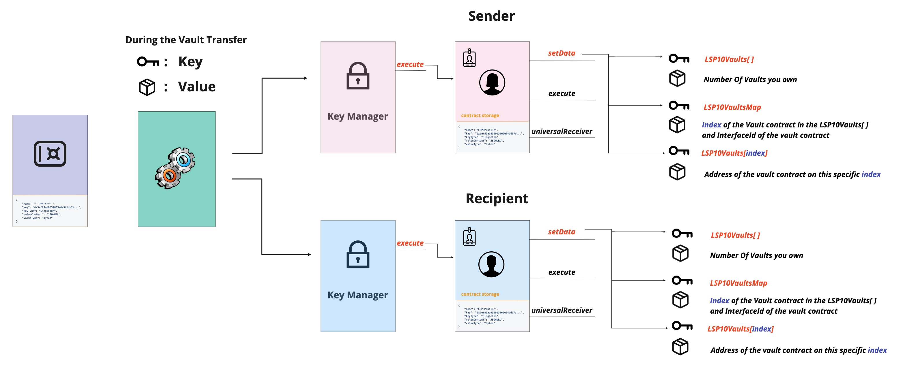

# LSP10 - Received Vaults

:::info Standard Document

[LSP10 - Received Vaults](https://github.com/lukso-network/LIPs/blob/main/LSPs/LSP-10-ReceivedVaults.md)

:::

## Introduction

To keep track of all the vaults that an address owns, we should avoid the same problem mentioned in [LSP5-ReceivedAssets](./06-lsp5-received-assets.md), which is not informing recipients and senders about ownership transfer of [LSP9-Vaults](07-lsp9-vault.md).

One way to avoid this problem is to create generic metadata keys that should be registered in the smart contract storage, representing how many different vaults you own, their type, and the address of the transferred vault contract.

## What does this standard represent ?

:::success Recommendation

It is recommended to query the **LSP10Vaults[]** key to check if a smart contract supports the **LSP10 - ReceivedVaults** standard.

:::

This Metadata standard describes two keys that can be added to an [ERC725Y](https://github.com/ethereum/EIPs/blob/master/EIPS/eip-725.md) smart contract to keep track of received and owned [LSP9-Vaults](07-lsp9-vault.md).

### `LSP10Vaults[]`

This key represents a list of all the vaults owned by the contract.

```json
{
  "name": "LSP10Vaults[]",
  "key": "0x55482936e01da86729a45d2b87a6b1d3bc582bea0ec00e38bdb340e3af6f9f06",
  "keyType": "Array",
  "valueType": "address",
  "valueContent": "Address"
}
```

### `LSP10VaultsMap`

This key represents a map key holding:

- the index in the [`LSP10Vaults[]`](#lsp10vaults-) Array where the received vaults addresses are stored.
- an [ERC165 interface ID](https://eips.ethereum.org/EIPS/eip-165) to easily identify the standard used by each vault smart contract (without the need to query the assets contracts directly).

The key `LSP10VaultsMap` also helps to prevent adding duplications to the Array, when automatically added via smart contract (_e.g.:_ a [LSP1-UniversalReceiverDelegate](./02-lsp1-universal-receiver-delegate.md)).

```json
{
  "name": "LSP10VaultsMap:<address>",
  "key": "0x192448c3c0f88c7f00000000<address>",
  "keyType": "Mapping",
  "valueType": "bytes",
  "valueContent": "Mixed"
}
```

### Flow

:::info Note

The keys are also set on the **sender Universal Profile** to remove the vault contract address when it is sent to the recipient.

:::

These keys are automatically updated in the UniversalProfile storage via the [LSP1UniversalReceiverDelegateUP](../smart-contracts/lsp1-universal-receiver-delegate-up.md) contract if set, when transferring vaults.



