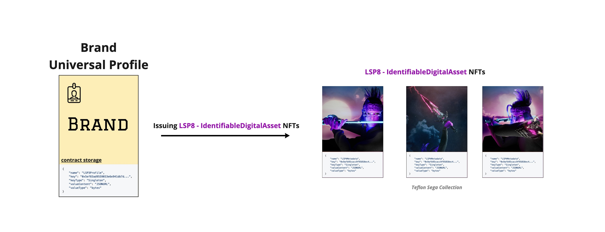
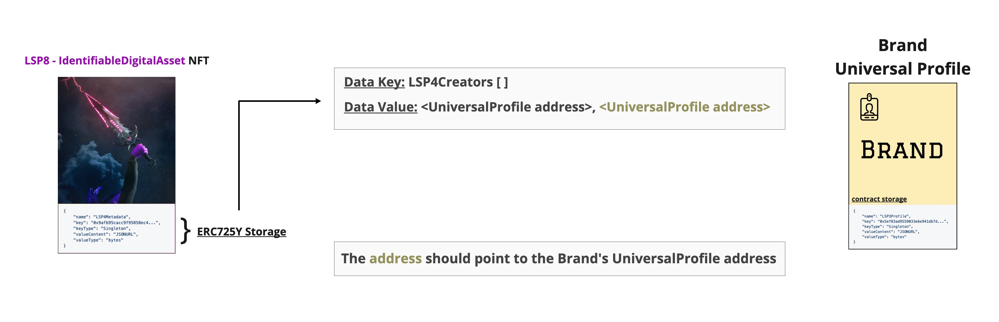

# LSP12 - Issued Assets

:::info Standard Document

[LSP12 - Issued Assets](https://github.com/lukso-network/LIPs/blob/main/LSPs/LSP-12-IssuedAssets.md)

:::

## Introduction

Keeping track of all the assets that addresses create is currently unfeasible where listing the issued assets is being done by centralized services. This inconvenience brings light to the following problem: the absence of a standard way to read the issued assets on/off-chain which allow users to create fake assets claiming that they are the original ones.

One way to solve this problem is to create generic metadata keys that would register in the smart contract storage how many different assets a smart contract has issued and their addresses. These keys will be a reference for users to check the authenticity of assets.

## What does this standard represent ?

:::tip Recommendation

Make sure to understand the **[ERC725Y Generic Key/Value Store](../lsp-background/erc725.md#erc725y---generic-data-keyvalue-store)** and **[LSP2 - ERC725YJSONSchema](../generic-standards/lsp2-json-schema.md)** Standards before going through the ERC725Y Data Keys.

:::

This Metadata standard describes two data keys that can be added to an [ERC725Y](https://github.com/ethereum/EIPs/blob/master/EIPS/eip-725.md) smart contract to keep track of issued assets.

### `LSP12IssuedAssets[]`

This data key represents a list of all issued assets by the contract.

```json
{
  "name": "LSP12IssuedAssets[]",
  "key": "0x7c8c3416d6cda87cd42c71ea1843df28ac4850354f988d55ee2eaa47b6dc05cd",
  "keyType": "Array",
  "valueType": "address",
  "valueContent": "Address"
}
```

### `LSP12IssuedAssetsMap`

This data key represents a map key holding both:

- an [ERC165 interface ID](https://eips.ethereum.org/EIPS/eip-165) to quickly identify the standard used by the issued assets. (Could be LSP7 or LSP8 asset)
- the index in the [`LSP12IssuedAssets[]`](#lsp12issuedassets) array where the issued assets addresses are stored.

```json
{
  "name": "LSP12IssuedAssetsMap:<address>",
  "key": "0x74ac2555c10b9349e78f0000<address>",
  "keyType": "Mapping",
  "valueType": "(bytes4,bytes8)",
  "valueContent": "(Bytes4,Number)"
}
```

### Asset Verification Flow



The full **verification flow** for an asset should contain a check on the **asset** and the **issuer** smart contract.

- **Step 1:** Should check on the asset smart contract, the **owner** or the **[LSP4Creators Array](../nft-2.0/LSP4-Digital-Asset-Metadata.md#lsp4creators)** data key and retrieve the address of the creator from the array.



- **Step 2:** Should check on the address retrieved in **Step 1** that the address of the asset being checked, matches one of the assets addresses stored in the **[LSP12IssuedAssets Array](#lsp12issuedassets)** of the UniversalProfile.


