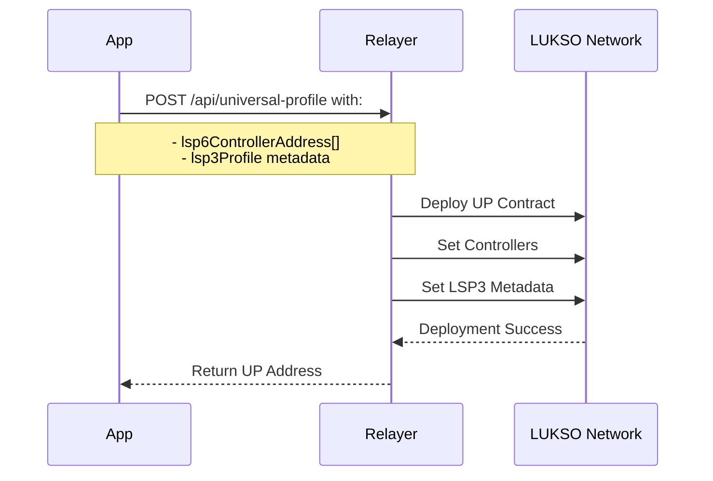
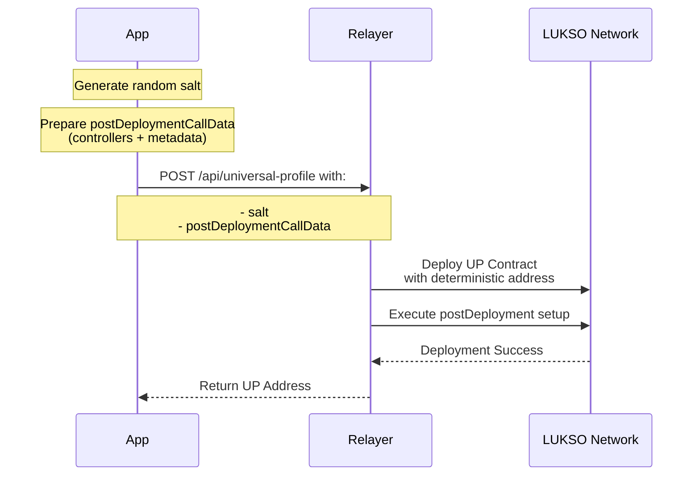

# Relayer API

:::info 🔓 Private Beta access

This feature is currently in private beta. If you are interested, please [contact us](https://forms.gle/rhWA25m3jjuPNPva9).

:::

The LUKSO Relayer API allows developer to create and manage Universal Profiles, as well as facilitate gasless transactions for users by registering.

## Key Features

Developers can use the LUKSO Relayer API to:

- Deploy Universal Profiles
- Register existing Universal Profiles

Organizations and applications can use the Relayer API to deploy Universal Profiles and register on behalf of their users. By leveraging the LUKSO Relayer API, you can create seamless, user-friendly experiences for your decentralized applications on the LUKSO network.

### 1. Deploy Universal Profiles

The Relayer API allows you to deploy Universal Profiles for your users using two different ways:

#### Option 1: Using `lsp6ControllerAddress` and [`lsp3Profile`](../../learn/universal-profile/metadata/edit-profile#create-a-new-lsp3profile-json-file) as arguments:



Provide a list of permissioned addresses `lsp6ControllerAddress` and set the Universal Profile's metadata with `lsp3Profile`.

```javascript
async function deployUniversalProfile() {
  const apiKey = 'your-api-key';
  const url = 'https://relayer-api.testnet.lukso.network/api/universal-profile';

  const data = {
    // list of permissioned addresses
    lsp6ControllerAddress: ['0x9d9b6B38049263d3bCE80fcA3314d9CbF00C9E9D'],
    // encoded LSP3 Profile
    lsp3Profile: '0x6f357c6a3e2e3b435dd1ee4b8a2435722ee5533ea3f6cf6cb44c7f...',
  };

  try {
    const response = await fetch(url, {
      method: 'POST',
      headers: {
        Authorization: `Bearer ${apiKey}`,
        'Content-Type': 'application/json',
      },
      body: JSON.stringify(data),
    });

    if (!response.ok) {
      throw new Error(`HTTP error! status: ${response.status}`);
    }

    const result = await response.json();
    console.log('Universal Profile deployed:', result);
  } catch (error) {
    console.error('Error deploying Universal Profile:', error.message);
  }
}

deployUniversalProfile();
```

#### Option 2: Using `salt` and [`postDeploymentCallData`](../../learn/universal-profile/advanced-guides/deploy-up-with-lsp23#create-the-universal-profile-initialization-calldata) as arguments:



This method allows for deterministic deployment across different chains.

```javascript
async function deployUniversalProfileWithSalt() {
  const apiKey = 'your-api-key';
  const url = 'https://relayer-api.testnet.lukso.network/api/universal-profile';
  // generate random salt
  const salt = ethers.utils.randomBytes(32);
  // list of permissioned addresses
  const lsp6Controllers = ['0x9d9b6B38049263d3bCE80fcA3314d9CbF00C9E9D'];
  // Encoded LSP3 Profile Data
  const lsp3Profile = '0x6f357c6a...';

  // generate postDeploymentCallData with controllers and metadata
  const postDeploymentCallData = generatePostDeploymentCallData(
    lsp6Controllers,
    lsp3Profile,
  );

  const data = {
    salt,
    postDeploymentCallData,
  };

  try {
    const response = await fetch(url, {
      method: 'POST',
      headers: {
        Authorization: `Bearer ${apiKey}`,
        'Content-Type': 'application/json',
      },
      body: JSON.stringify(data),
    });

    if (!response.ok) {
      throw new Error(`HTTP error! status: ${response.status}`);
    }

    const result = await response.json();
    console.log('Universal Profile deployed:', result);
  } catch (error) {
    console.error('Error deploying Universal Profile:', error.message);
  }
}

deployUniversalProfileWithSalt();
```

### 2. Register Existing Universal Profiles

You can register existing Universal Profiles with the Relayer to enable gasless transactions for your users. Currently, registered Universal Profiles to the LUKSO Relayer API gets a certain quota amount of gas(20 millions) per month.

```javascript
async function registerUniversalProfile() {
  const apiKey = 'your-api-key';
  const url = 'https://relayer-api.testnet.lukso.network/api/users';

  const data = {
    universalProfileAddress: '0x1234567890123456789012345678901234567890',
    // userId: 'optional-user-id-for-existing-users',
  };

  try {
    const response = await fetch(url, {
      method: 'POST',
      headers: {
        Authorization: `Bearer ${apiKey}`,
        'Content-Type': 'application/json',
      },
      body: JSON.stringify(data),
    });

    const result = await response.json();
    console.log('Universal Profile registered:', result);
  } catch (error) {
    console.error('Error registering Universal Profile:', error.message);
  }
}

registerUniversalProfile();
```

## Integration Guide

1. Obtain API credentials by filling out the [access request form](https://forms.gle/rhWA25m3jjuPNPva9).
2. Use the provided API key in the `Authorization` header for all requests.
3. Implement error handling for various HTTP status codes (400, 401, 403, 404, 429, 500).

## API Documentation

- Testnet: [https://relayer-api.testnet.lukso.network/](https://relayer-api.testnet.lukso.network/docs#/)
- Mainnet: [https://relayer-api.mainnet.lukso.network/](https://relayer-api.mainnet.lukso.network/docs#/)

## Support and Resources

- For technical issues or questions, contact our support team at [support@lukso.network](mailto:support@lukso.network).
- Join our [Discord community](https://discord.com/invite/lukso) for discussions and updates.
- Explore the [LUKSO documentation](https://docs.lukso.tech/) for more information on building with Universal Profiles.
