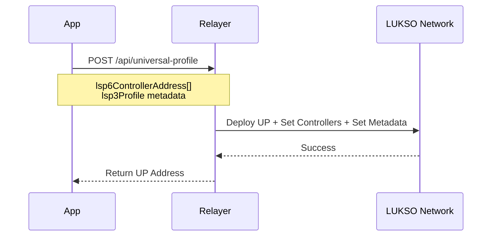
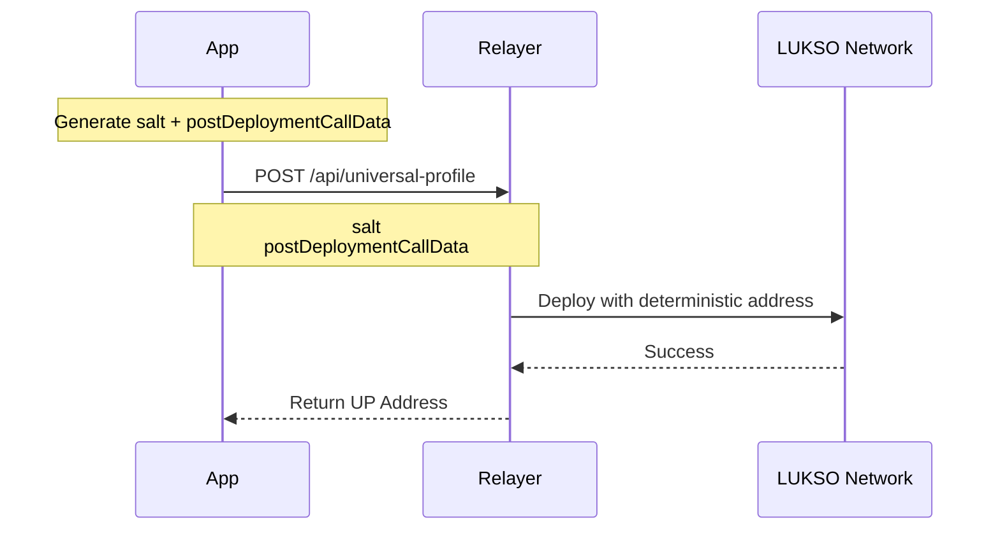

# Relayer API

:::info 🔓 Private Beta access

This feature is currently in private beta. If you are interested, please [contact us](https://forms.gle/rhWA25m3jjuPNPva9).

:::

The LUKSO Relayer services enable gasless transactions and Universal Profile deployment. Registered Universal Profiles receive a **free monthly gas quota of 20 million gas**.

## API Endpoints

There are two separate services:

### Relayer API (Deploy & Register)

Requires an API key (`Authorization: Bearer <key>`).

|                 | Mainnet                                                     | Testnet                                                     |
| --------------- | ----------------------------------------------------------- | ----------------------------------------------------------- |
| **Base URL**    | `https://relayer-api.mainnet.lukso.network`                 | `https://relayer-api.testnet.lukso.network`                 |
| **Deploy UP**   | `POST /api/universal-profile`                               | `POST /api/universal-profile`                               |
| **Register UP** | `POST /api/universal-profile/register`                      | `POST /api/universal-profile/register`                      |
| **API Docs**    | [Mainnet](https://relayer-api.mainnet.lukso.network/docs#/) | [Testnet](https://relayer-api.testnet.lukso.network/docs#/) |

### Transaction Relay Service (Execute Transactions)

No API key required — uses LSP25 signatures for authorization.

|                         | Mainnet                                 | Testnet                                 |
| ----------------------- | --------------------------------------- | --------------------------------------- |
| **Base URL**            | `https://relayer.mainnet.lukso.network` | `https://relayer.testnet.lukso.network` |
| **Execute Transaction** | `POST /api/execute`                     | `POST /api/execute`                     |
| **Check Quota**         | `POST /api/quota`                       | `POST /api/quota`                       |

## Execute Transactions (Gasless)

Execute transactions through the relay service using [LSP25 relay calls](../../standards/access-control/lsp6-key-manager.md). The relayer pays for gas; the controller signs authorization via LSP25.

### How It Works

1. **Encode the payload** — what you want the UP to do (e.g., `execute()`, `setData()`, `setDataBatch()`)
2. **Get the nonce** from the Key Manager
3. **Sign the message** using LSP25 format (EIP-191 v0)
4. **Send to the relay service's** `/api/execute` endpoint

### Request Body

```json
{
  "address": "0x<UP_ADDRESS>",
  "transaction": {
    "abi": "0x<ENCODED_PAYLOAD>",
    "signature": "0x<LSP25_SIGNATURE>",
    "nonce": 0,
    "validityTimestamps": "0x0"
  }
}
```

### LSP25 Signature Format

```
hash = keccak256(0x19 || 0x00 || keyManagerAddress || encodedMessage)

encodedMessage = abi.encodePacked(
  LSP25_VERSION,      // 25
  chainId,            // 42 for mainnet, 4201 for testnet
  nonce,
  validityTimestamps,
  msgValue,           // 0 for non-payable calls
  payload
)
```

:::warning EIP-191 Version 0

Sign with `SigningKey.sign(hash)` — **NOT** `wallet.signMessage()`. This is EIP-191 version 0 (`0x00`), not version 0x45 (Ethereum Signed Message).

:::

### Example (ethers.js v6)

```javascript
import { ethers } from 'ethers';

const provider = new ethers.JsonRpcProvider('https://42.rpc.thirdweb.com');
const controllerPrivateKey = '0x...';
const controllerAddress = '0x...'; // Address derived from controllerPrivateKey
const upAddress = '0x...';

// 1. Get Key Manager address
const up = new ethers.Contract(
  upAddress,
  ['function owner() view returns (address)'],
  provider,
);
const keyManagerAddress = await up.owner();

// 2. Encode the payload (example: setData)
const dataKey = '0x...'; // Your data key
const dataValue = '0x...'; // Your data value
const iface = new ethers.Interface(['function setData(bytes32,bytes)']);
const payload = iface.encodeFunctionData('setData', [dataKey, dataValue]);

// 3. Get nonce from Key Manager
const km = new ethers.Contract(
  keyManagerAddress,
  ['function getNonce(address,uint128) view returns (uint256)'],
  provider,
);
const nonce = await km.getNonce(controllerAddress, 0);

// 4. Build LSP25 message and sign (EIP-191 v0)
const chainId = 42; // 4201 for testnet
const encodedMessage = ethers.solidityPacked(
  ['uint256', 'uint256', 'uint256', 'uint256', 'uint256', 'bytes'],
  [25, chainId, nonce, 0, 0, payload], // LSP25_VERSION=25, validityTimestamps=0, msgValue=0
);
const hash = ethers.keccak256(
  ethers.concat(['0x19', '0x00', keyManagerAddress, encodedMessage]),
);
const signingKey = new ethers.SigningKey(controllerPrivateKey);
const sig = signingKey.sign(hash);
const signature = ethers.Signature.from(sig).serialized;

// 5. Send to relay service (no API key needed)
const response = await fetch(
  'https://relayer.mainnet.lukso.network/api/execute',
  {
    method: 'POST',
    headers: { 'Content-Type': 'application/json' },
    body: JSON.stringify({
      address: upAddress,
      transaction: {
        abi: payload,
        signature,
        nonce: Number(nonce),
        validityTimestamps: '0x0',
      },
    }),
  },
);
const result = await response.json();
console.log('TX Hash:', result.transactionHash);
```

### Required Permissions

The controller signing the relay call must have the **`EXECUTE_RELAY_CALL`** permission (`0x0000000000000000000000000000000000000000000000000000000000400000`).

### Validity Timestamps

- `0x0` — No time restriction (valid immediately, no expiry)
- Custom: `(startTime << 128) | endTime` — Restrict when the signature is valid

## Deploy Universal Profiles

Deploy Universal Profiles using the Relayer API. Requires an API key.

### Option 1: Controller Address + LSP3 Profile

Provide controller addresses and LSP3 metadata directly.



```javascript
const response = await fetch(
  'https://relayer-api.mainnet.lukso.network/api/universal-profile',
  {
    method: 'POST',
    headers: {
      Authorization: 'Bearer YOUR_API_KEY',
      'Content-Type': 'application/json',
    },
    body: JSON.stringify({
      lsp6ControllerAddress: ['0x9d9b6B38049263d3bCE80fcA3314d9CbF00C9E9D'],
      lsp3Profile: '0x6f357c6a...', // Encoded LSP3 Profile
    }),
  },
);
const result = await response.json();
console.log('UP Address:', result.universalProfileAddress);
```

### Option 2: Salt + Post-Deployment Calldata

Use a salt for deterministic deployment across chains.



```javascript
import { ethers } from 'ethers';

const salt = ethers.hexlify(ethers.randomBytes(32));
const postDeploymentCallData = '0x...'; // See LSP23 deployment guide

const response = await fetch(
  'https://relayer-api.mainnet.lukso.network/api/universal-profile',
  {
    method: 'POST',
    headers: {
      Authorization: 'Bearer YOUR_API_KEY',
      'Content-Type': 'application/json',
    },
    body: JSON.stringify({ salt, postDeploymentCallData }),
  },
);
const result = await response.json();
console.log('UP Address:', result.universalProfileAddress);
```

See [Deploy UP with LSP23](/learn/universal-profile/advanced-guides/deploy-up-with-lsp23#create-the-universal-profile-initialization-calldata) for generating `postDeploymentCallData`.

## Register Universal Profiles

Register existing Universal Profiles with the Relayer API to enable the monthly gas quota. Requires an API key.

```javascript
const response = await fetch(
  'https://relayer-api.mainnet.lukso.network/api/universal-profile/register',
  {
    method: 'POST',
    headers: {
      Authorization: 'Bearer YOUR_API_KEY',
      'Content-Type': 'application/json',
    },
    body: JSON.stringify({
      universalProfileAddress: '0x1234567890123456789012345678901234567890',
    }),
  },
);
const result = await response.json();
console.log('Registered:', result);
```

## Check Quota

Check remaining gas quota for a registered UP using the relay service. Requires a signed timestamp for authentication (no API key).

```javascript
const timestamp = Math.floor(Date.now() / 1000);
const message = `${upAddress}:${timestamp}`;
const signature = await wallet.signMessage(message);

const response = await fetch(
  'https://relayer.mainnet.lukso.network/api/quota',
  {
    method: 'POST',
    headers: { 'Content-Type': 'application/json' },
    body: JSON.stringify({
      address: upAddress,
      timestamp,
      signature,
    }),
  },
);
const quota = await response.json();
console.log('Remaining quota:', quota);
```

## Integration Guide

1. **Request access** — Fill out the [access request form](https://forms.gle/rhWA25m3jjuPNPva9) to get an API key
2. **Deploy or register UPs** — Use the Relayer API (`relayer-api.{network}.lukso.network`) with your API key
3. **Execute gasless transactions** — Use the Transaction Relay Service (`relayer.{network}.lukso.network`) with LSP25 signatures
4. **Handle errors** — Implement handling for 400, 401, 403, 404, 429, 500 status codes

## Support

- **Email**: [support@lukso.network](mailto:support@lukso.network)
- **Discord**: [discord.com/invite/lukso](https://discord.com/invite/lukso)
- **Documentation**: [docs.lukso.tech](https://docs.lukso.tech/)
