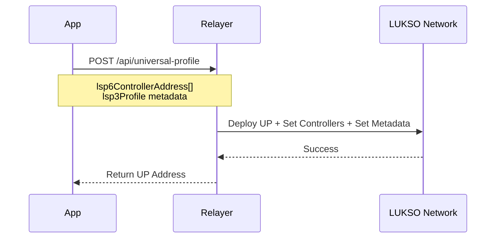
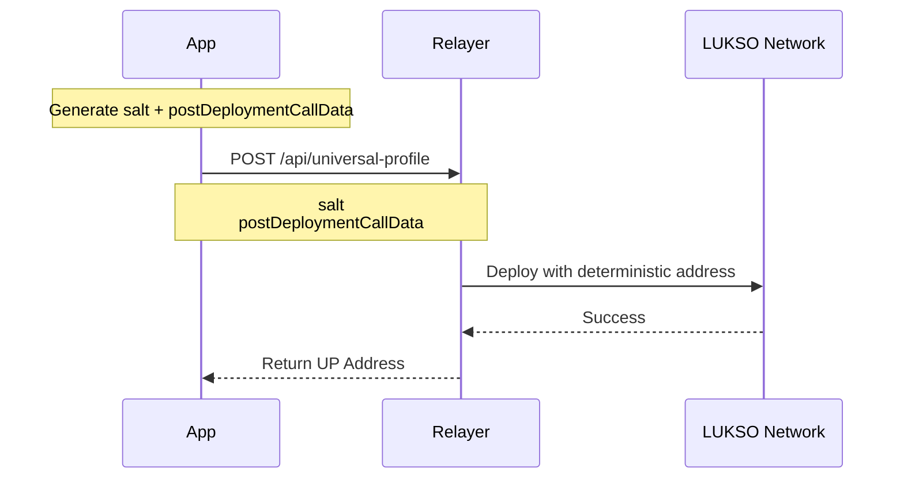

# Relayer User API

:::info 🔓 Private Beta access

This feature is currently in private beta. If you are interested, please [contact us](https://forms.gle/rhWA25m3jjuPNPva9).

:::

The LUKSO Relayer User API enables deploying and registering Universal Profiles. Register your Universal Profiles to receive a **free monthly gas quota of 20 million gas** for gasless transactions.

Looking to execute gasless transactions? See the [Transaction Relay API](./relayer-api.md).

## API Endpoints

Requires an API key (`Authorization: Bearer <key>`).

|                 | Mainnet                                                     | Testnet                                                     |
| --------------- | ----------------------------------------------------------- | ----------------------------------------------------------- |
| **Base URL**    | `https://relayer-api.mainnet.lukso.network`                 | `https://relayer-api.testnet.lukso.network`                 |
| **Deploy UP**   | `POST /api/universal-profile`                               | `POST /api/universal-profile`                               |
| **Register UP** | `POST /api/users`                                           | `POST /api/users`                                           |
| **API Docs**    | [Mainnet](https://relayer-api.mainnet.lukso.network/docs#/) | [Testnet](https://relayer-api.testnet.lukso.network/docs#/) |

## Integration Guide

1. **Request access** — Fill out the [access request form](https://forms.gle/rhWA25m3jjuPNPva9) to get an API key
2. **Deploy or register UPs** — Use the endpoints below with your API key
3. **Execute gasless transactions** — Use the [Transaction Relay API](./relayer-api.md) with LSP25 signatures
4. **Handle errors** — Implement handling for 400, 401, 403, 404, 429, 500 status codes

## Deploy Universal Profiles

Deploy Universal Profiles using the Relayer API. Requires an API key.

### Option 1: Controller Address + LSP3 Profile

Provide controller addresses and LSP3 metadata directly.



```javascript
const response = await fetch(
  'https://relayer-api.mainnet.lukso.network/api/universal-profile',
  {
    method: 'POST',
    headers: {
      Authorization: 'Bearer YOUR_API_KEY',
      'Content-Type': 'application/json',
    },
    body: JSON.stringify({
      lsp6ControllerAddress: ['0x9d9b6B38049263d3bCE80fcA3314d9CbF00C9E9D'],
      lsp3Profile: '0x6f357c6a...', // Encoded LSP3 Profile
    }),
  },
);
const result = await response.json();
console.log('UP Address:', result.universalProfileAddress);
```

### Option 2: Salt + Post-Deployment Calldata

Use a salt for deterministic deployment across chains.



```javascript
import { ethers } from 'ethers';

const salt = ethers.hexlify(ethers.randomBytes(32));
const postDeploymentCallData = '0x...'; // See LSP23 deployment guide

const response = await fetch(
  'https://relayer-api.mainnet.lukso.network/api/universal-profile',
  {
    method: 'POST',
    headers: {
      Authorization: 'Bearer YOUR_API_KEY',
      'Content-Type': 'application/json',
    },
    body: JSON.stringify({ salt, postDeploymentCallData }),
  },
);
const result = await response.json();
console.log('UP Address:', result.universalProfileAddress);
```

See [Deploy UP with LSP23](/learn/universal-profile/advanced-guides/deploy-up-with-lsp23#create-the-universal-profile-initialization-calldata) for generating `postDeploymentCallData`.

## Register Universal Profiles

Register existing Universal Profiles with the Relayer API to enable the monthly gas quota. Requires an API key.

```javascript
const response = await fetch(
  'https://relayer-api.mainnet.lukso.network/api/users',
  {
    method: 'POST',
    headers: {
      Authorization: 'Bearer YOUR_API_KEY',
      'Content-Type': 'application/json',
    },
    body: JSON.stringify({
      universalProfileAddress: '0x1234567890123456789012345678901234567890',
    }),
  },
);
const result = await response.json();
console.log('Registered:', result);
```

## Support

- **Email**: [support@lukso.network](mailto:support@lukso.network)
- **Discord**: [discord.com/invite/lukso](https://discord.com/invite/lukso)
- **Documentation**: [docs.lukso.tech](https://docs.lukso.tech/)
