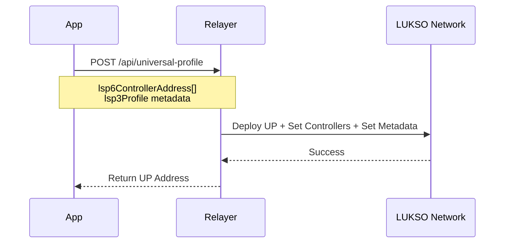
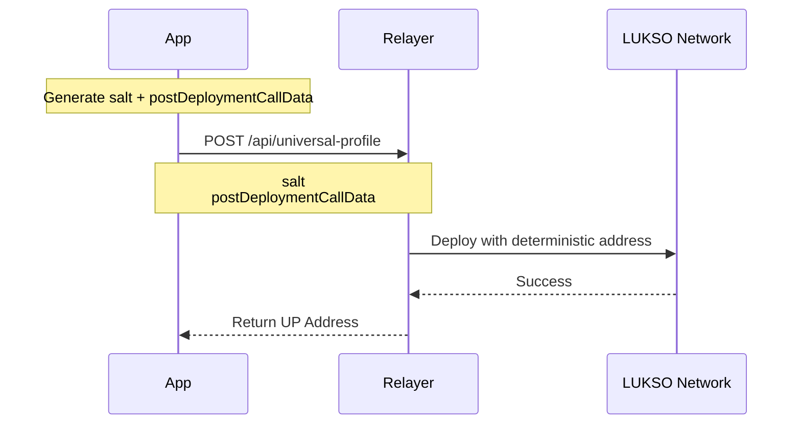

# Relayer User API

:::info 🔓 Private Beta access

This feature is currently in private beta. If you are interested, please [contact us](https://forms.gle/rhWA25m3jjuPNPva9).

:::

The LUKSO Relayer User API enables deploying and registering Universal Profiles. Register your Universal Profiles to receive a **free monthly gas quota of 20 million gas** for gasless transactions.

Looking to execute gasless transactions? See the [Transaction Relay API](./relayer-api.md).

## API Endpoints

Requires an API key (`Authorization: Bearer <key>`).

|                 | Mainnet                                                     | Testnet                                                     |
| --------------- | ----------------------------------------------------------- | ----------------------------------------------------------- |
| **Base URL**    | `https://relayer-api.mainnet.lukso.network`                 | `https://relayer-api.testnet.lukso.network`                 |
| **Deploy UP**   | `POST /api/universal-profile`                               | `POST /api/universal-profile`                               |
| **Register UP** | `POST /api/universal-profile/register`                      | `POST /api/universal-profile/register`                      |
| **API Docs**    | [Mainnet](https://relayer-api.mainnet.lukso.network/docs#/) | [Testnet](https://relayer-api.testnet.lukso.network/docs#/) |

## Integration Guide

1. **Request access** — Fill out the [access request form](https://forms.gle/rhWA25m3jjuPNPva9) to get an API key
2. **Deploy or register UPs** — Use the endpoints below with your API key
3. **Execute gasless transactions** — Use the [Transaction Relay API](./relayer-api.md) with LSP25 signatures
4. **Handle errors** — Implement handling for 400, 401, 403, 404, 429, 500 status codes

## Deploy Universal Profiles

Deploy Universal Profiles using the Relayer API. Requires an API key.

### Option 1: Controller Address + LSP3 Profile

Provide controller addresses and LSP3 metadata directly.



```javascript
import { ERC725 } from '@erc725/erc725.js';
import LSP3ProfileMetadataSchemas from '@erc725/erc725.js/schemas/LSP3ProfileMetadata.json';

// Encode the LSP3Profile metadata
const erc725 = new ERC725(LSP3ProfileMetadataSchemas);

const encodedLSP3Profile = erc725.encodeData([
  {
    keyName: 'LSP3Profile',
    value: {
      verification: {
        method: 'keccak256(utf8)',
        data: '0x6d6d08aafb0ee059e3e4b6b3528a5be37308a5d4f4d19657d26dd8a5ae799de0',
      },
      url: 'ipfs://QmPRoJsaYcNqQiUrQxE7ajTRaXwHyAU29tHqYNctBmK64w',
    },
  },
]);

const response = await fetch(
  'https://relayer-api.mainnet.lukso.network/api/universal-profile',
  {
    method: 'POST',
    headers: {
      Authorization: 'Bearer YOUR_API_KEY',
      'Content-Type': 'application/json',
    },
    body: JSON.stringify({
      lsp6ControllerAddress: ['0x9d9b6B38049263d3bCE80fcA3314d9CbF00C9E9D'],
      lsp3Profile: encodedLSP3Profile.values[0], // Encoded VerifiableURI
    }),
  },
);
const result = await response.json();
console.log('UP Address:', result.universalProfileAddress);
```

### Option 2: Salt + Post-Deployment Calldata

Use a salt for deterministic deployment across chains.



```javascript
import { keccak256, encodeAbiParameters, getCreate2Address, randomBytes } from 'viem';
import { ERC725 } from '@erc725/erc725.js';
import LSP3ProfileMetadataSchemas from '@erc725/erc725.js/schemas/LSP3ProfileMetadata.json';

// 1. Generate salt for deterministic deployment
const salt = `0x${Buffer.from(randomBytes(32)).toString('hex')}`;

// 2. Prepare LSP3Profile metadata (same as Option 1)
const erc725 = new ERC725(LSP3ProfileMetadataSchemas);
const encodedData = erc725.encodeData([
  {
    keyName: 'LSP3Profile',
    value: {
      verification: {
        method: 'keccak256(utf8)',
        data: '0x6d6d08aafb0ee059e3e4b6b3528a5be37308a5d4f4d19657d26dd8a5ae799de0',
      },
      url: 'ipfs://QmPRoJsaYcNqQiUrQxE7ajTRaXwHyAU29tHqYNctBmK64w',
    },
  },
]);

// Extract the data keys and values
const dataKeys = encodedData.keys;
const dataValues = encodedData.values;

// 3. Encode post-deployment calldata (ERC725Y data to set on the UP)
const postDeploymentCalldata = encodeAbiParameters(
  [{ type: 'bytes32[]' }, { type: 'bytes[]' }],
  [dataKeys, dataValues]
);

// 4. (Optional) Calculate the deterministic UP address
const linkedContractsFactoryAddress = '0x2300000A84D25dF63081feAa37ba6b62C4c89a30';
const primaryImplementationContractAddress = '0x3024D38EA2434BA6635003Dc1BDC0daB5882ED4F'; // UP implementation
const secondaryImplementationContractAddress = '0x2Fe3AeD98684E7351aD2D408A43cE09a738BF8a4'; // KM implementation
const upPostDeploymentModuleAddress = '0x000000000066093407b6704B89793beFfD0D8F00';

const secondaryContractInitializationCalldata = '0xc4d66de8'; // initialize() selector
const secondaryContractAddControlledContractAddress = true;
const secondaryContractExtraInitializationParams = '0x';

const generatedSalt = keccak256(
  encodeAbiParameters(
    [
      { type: 'bytes32' },
      { type: 'address' },
      { type: 'bytes' },
      { type: 'bool' },
      { type: 'bytes' },
      { type: 'address' },
      { type: 'bytes' },
    ],
    [
      salt,
      secondaryImplementationContractAddress,
      secondaryContractInitializationCalldata,
      secondaryContractAddControlledContractAddress,
      secondaryContractExtraInitializationParams,
      upPostDeploymentModuleAddress,
      postDeploymentCalldata,
    ]
  )
);

const upAddress = getCreate2Address({
  from: linkedContractsFactoryAddress,
  salt: generatedSalt,
  bytecodeHash: keccak256(
    `0x3d602d80600a3d3981f3363d3d373d3d3d363d73${primaryImplementationContractAddress.slice(2)}5af43d82803e903d91602b57fd5bf3`
  ),
});

console.log('Predicted UP Address:', upAddress);

// 5. Deploy the Universal Profile
const response = await fetch(
  'https://relayer-api.mainnet.lukso.network/api/universal-profile',
  {
    method: 'POST',
    headers: {
      Authorization: 'Bearer YOUR_API_KEY',
      'Content-Type': 'application/json',
    },
    body: JSON.stringify({ salt, postDeploymentCallData: postDeploymentCalldata }),
  },
);
const result = await response.json();
console.log('Deployed UP Address:', result.universalProfileAddress);
console.log('Matches prediction:', result.universalProfileAddress === upAddress);
```

See [Deploy UP with LSP23](/learn/universal-profile/advanced-guides/deploy-up-with-lsp23#create-the-universal-profile-initialization-calldata) for more details on LSP23 deployments.

## Register Universal Profiles

Register existing Universal Profiles with the Relayer API to enable the monthly gas quota. Requires an API key.

```javascript
const response = await fetch(
  'https://relayer-api.mainnet.lukso.network/api/universal-profile/register',
  {
    method: 'POST',
    headers: {
      Authorization: 'Bearer YOUR_API_KEY',
      'Content-Type': 'application/json',
    },
    body: JSON.stringify({
      universalProfileAddress: '0x1234567890123456789012345678901234567890',
    }),
  },
);
const result = await response.json();
console.log('Registered:', result);
```

## Support

- **Email**: [support@lukso.network](mailto:support@lukso.network)
- **Discord**: [discord.com/invite/lukso](https://discord.com/invite/lukso)
- **Documentation**: [docs.lukso.tech](https://docs.lukso.tech/)
