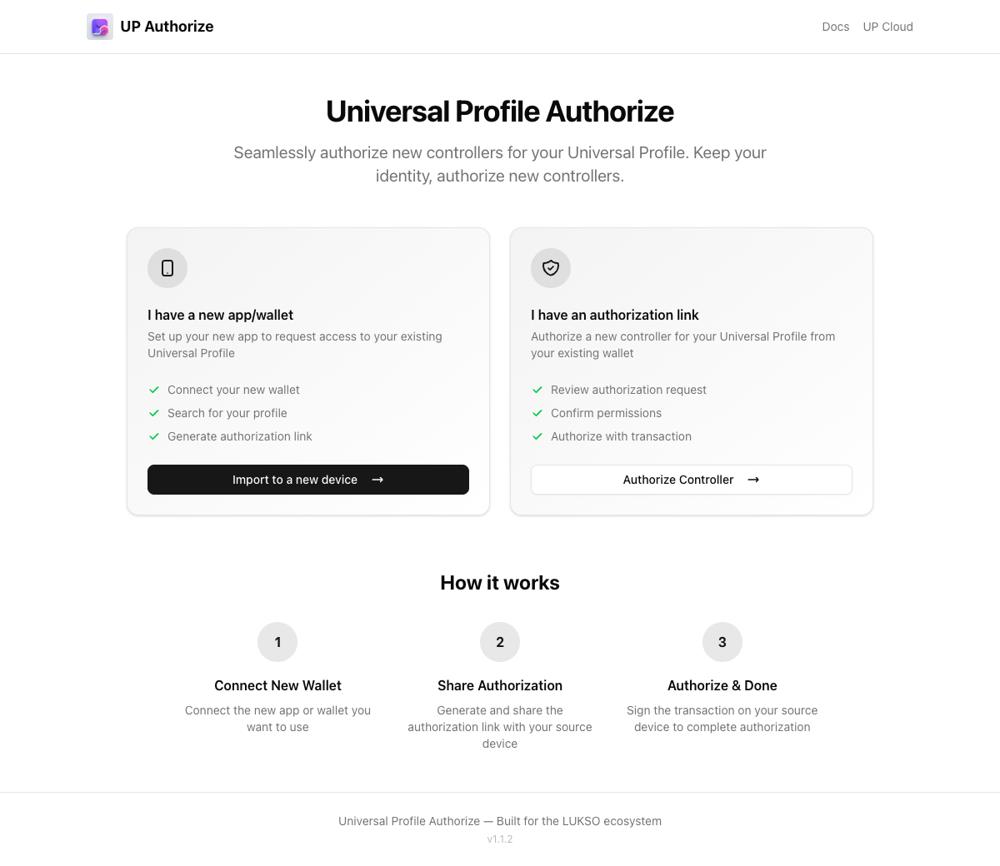

# Authorize Controller

The [Authorize Controller](https://authorize.universalprofile.cloud/) tool lets you manage controller keys on your Universal Profile. Use it to grant permissions to new controllers, migrate your profile to a new device, or import your profile into a new browser extension.

🔗 **[authorize.universalprofile.cloud](https://authorize.universalprofile.cloud/)**

:::info Keep Your Initial Controller Key Safe

The controller key your Universal Profile was originally created with is important — it's required if you ever want to deploy your profile across multiple networks. This key lives in the device where you first created your profile (the mobile app or the browser extension).

**Back it up** using the backup feature in your app:
- **UP Browser Extension** — use the built-in backup feature to export your key
- **UP Mobile App** — backup feature coming soon

:::

## Use Cases

### Migrate to a New Device

If you're setting up a new computer or phone and want to access your existing Universal Profile:

1. Install the [Universal Profile Browser Extension](https://chromewebstore.google.com/detail/universal-profiles/abpickdkkbnbcoepogfhkhennhfhehfn) on the new device
2. Open the Authorize tool on your **old device** (where you still have access)
3. Connect your Universal Profile
4. Enter the new extension's controller address and select the permissions you want to grant
5. Confirm the transaction — your profile is now accessible from both devices

### Import into Browser Extension

When you have a Universal Profile that was created outside the browser extension (e.g., via a dApp or programmatically), you can import it:

1. Open the Authorize tool and connect via **WalletConnect** or the **UP Browser Extension**
2. Enter the controller address from your browser extension
3. Grant the necessary permissions
4. Your profile will now appear in the extension

### Manually Authorize a Controller

For advanced users who need to grant specific permissions to any address:

1. Connect your Universal Profile
2. Enter the controller address
3. Select individual permissions (e.g., `CALL`, `SETDATA`, `TRANSFERVALUE`)
4. Optionally configure **Allowed Calls** to restrict which contracts the controller can interact with
5. Optionally configure **Allowed Data Keys** to restrict which ERC725Y data keys the controller can modify
6. Confirm the transaction

## Features

- **Connect via UP Browser Extension or WalletConnect** — use whichever wallet has access to your profile
- **Permission selector** — pick exactly which [LSP6 permissions](../../standards/access-control/lsp6-key-manager.md) to grant
- **Allowed Calls** — restrict a controller to specific contracts, interfaces, or functions
- **Allowed Data Keys** — restrict which data keys a controller can read or write
- **Smart array management** — reuses empty slots in the controller array to save gas

## How It Works

The tool writes data to your Universal Profile's [ERC725Y](../../standards/erc725.md) storage using `setDataBatch` on the [LSP0 ERC725Account](../../standards/accounts/lsp0-erc725account.md). It sets:

- The controller's address in the `AddressPermissions[]` array
- The controller's permissions under `AddressPermissions:Permissions:<address>`
- Optionally, `AddressPermissions:AllowedCalls:<address>` and `AddressPermissions:AllowedERC725YDataKeys:<address>`

All of this is managed by the profile's [LSP6 Key Manager](../../standards/access-control/lsp6-key-manager.md), which enforces the permissions on every transaction.
